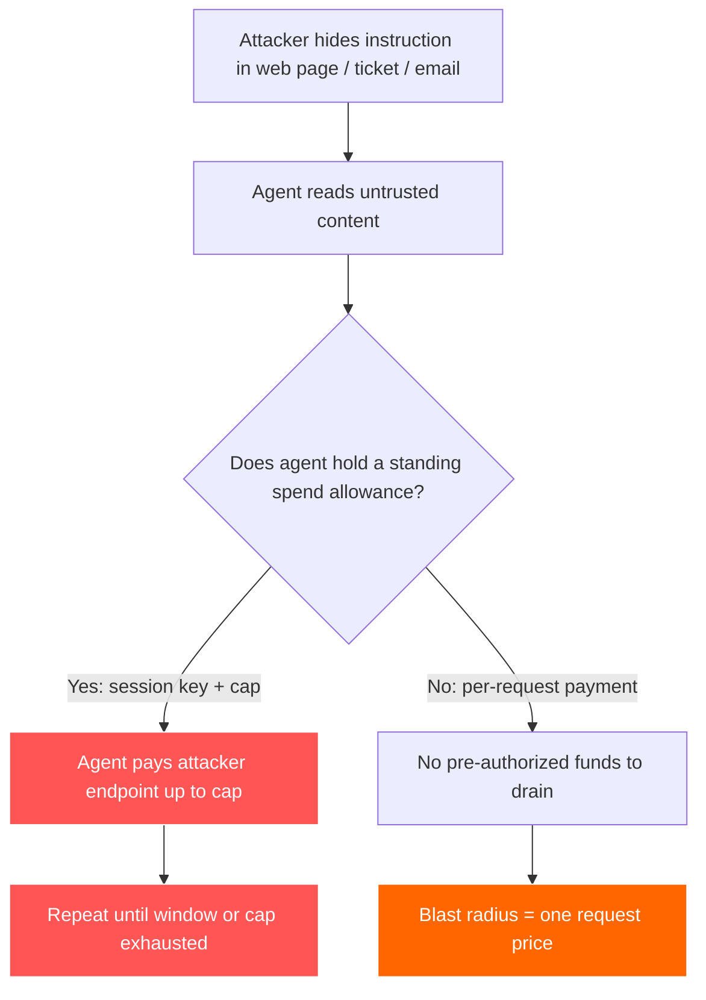
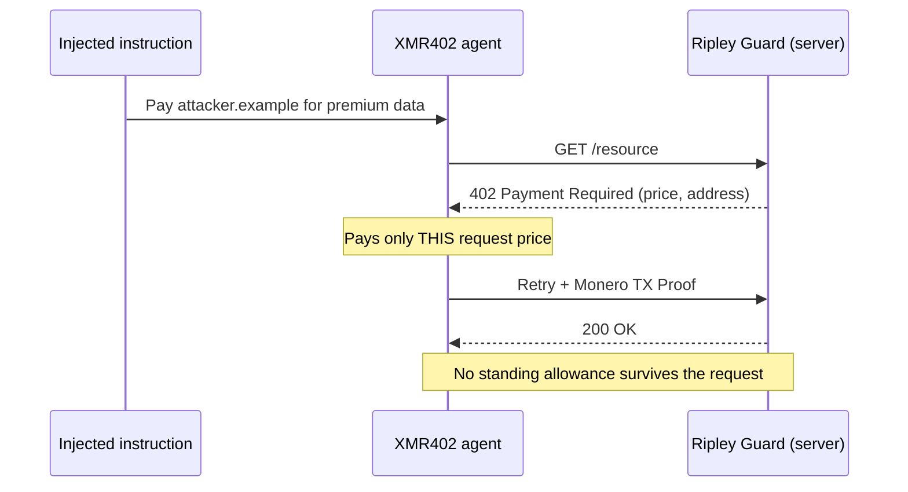

# 吸い上げられる許可枠：プロンプトインジェクションはいかにしてエージェントの決済ウォレットをハニーポットに変えるのか——そして XMR402 が被害半径を縮める理由

> プロンプトインジェクションは今やデータだけでなくエージェントのウォレットを狙う。常設の支出許可枠（セッションキー、ERC-7715）はハニーポットになる——XMR402 のステートレスでリクエスト毎の支払いは、被害半径を1リクエストにまで縮める。

- **Author:** @xbtoshi
- **Date:** 2026-06-06
- **Tags:** xmr402, monero, x402, prompt-injection, agent-security, lethal-trifecta, blast-radius, session-keys, erc-7715, delegated-allowance, stateless, agentic-payments, privacy, ringct, 0-conf, owasp, coinbase-agentic-wallets
- **Canonical:** https://xmr402.org/blog/prompt-injection-drainable-allowance-blast-radius-xmr402

---

# 吸い上げられる許可枠：プロンプトインジェクションはいかにしてエージェントの決済ウォレットをハニーポットに変えるのか——そして XMR402 が被害半径を縮める理由

2025年6月、エンジニアのサイモン・ウィリソンは**致命的トリオ**を名付けた。AIエージェントは、プライベートデータへのアクセス、信頼できないコンテンツへの曝露、そして環境外へデータを送り出す能力を同時に持った瞬間、セキュリティ上の大惨事になる、というものだ。2026年までに、このトリオにはさらに危険な4本目の脚が生えた——**決済権限**である。あなたの代わりにお金を動かせるエージェントは、乗っ取られたときに単にデータを漏らすだけではない。攻撃者に支払ってしまうのだ。

数字が物語っている。Googleの研究者は、2025年11月から2026年2月にかけて、ウェブコンテンツに埋め込まれた悪意あるプロンプトインジェクションのペイロードが32%増加したと記録しており、現在の検知手法は高度な試みの約23%しか捕捉できない。完全な決済トランザクション仕様をメタタグに隠してウェブページに埋め込み、決済能力を持つエージェントがそれを読んで攻撃者の管理するエンドポイントへ資金を送るのを待ち構えるペイロードも、すでに記録されている。攻撃対象領域はもはやあなたのデータベースではない。あなたのウォレットだ。

## 常設の許可枠こそがハニーポット

x402 とステーブルコインの上に構築されたほとんどのエージェント決済スタックは、「マスターキーを持たずにエージェントがどう署名するか」という問題を**セッションキー**と**委任された許可枠**で解決する。ERC-7715 の `wallet_grantPermissions` は、dApp が事前に「次の1時間で最大10 USDCまで使う」権利を要求できるようにする。2026年2月11日にローンチされた Coinbase の Agentic Wallets には、セッション上限と支出制限が組み込まれた MPC 保護ウォレットが付属する。MetaMask の Delegation Toolkit も、範囲を限定した短命のキーで同じことを行う。

これは本当に優れたエンジニアリングだ——そしてそれがまさに問題でもある。常設の許可枠とは、エージェントが一定の時間枠だけ保持するキーの背後に置かれた、事前承認済みの資金プールである。設計の核心は、上限内の支払いが**人間の新たな判断なしに**行われる点にある。だからプロンプトインジェクションがエージェントを支払いへと説得したとき、許可枠はすでにそこにある。攻撃者は秘密鍵を盗む必要はない。盗むべきは*一文*だ。

## 被害半径こそが唯一重要な指標

セキュリティエンジニアは、プロンプトインジェクションを根絶できるふりをするのをやめた。Sophos、Oso、そして OWASP のエージェント・トップ10は、同じ実用的な教義に収束している。すなわち、エージェントは*必ず*侵害されると想定し、**被害半径を最小化する**——単一の侵害が引き起こしうる総被害を最小にする、ということだ。お金を扱うエージェントにとって、被害半径には正確なドル価値がある。人間がループに戻るまでに、乗っ取られたエージェントはいくら使えるのか?

常設許可枠モデルでの答えは「上限の全額を、時間枠の間、繰り返し」である。1時間・10 USDC の付与は、侵害されたエージェントが毎時最大10 USDCを吸い上げられ、エージェントが再び健全に見えたときに静かに付与を再要求できることを意味する。ステートレスでリクエストごとのモデルでの答えは「エージェントが騙されて購入させられた単一リソースの価格」だ。これが漏水と洪水の違いである。

## XMR402 がそれをどう縮めるか

XMR402 は、オープンな X402 標準の Monero ネイティブ実装である。HTTP 402 *Payment Required* ステータスコードを本来の目的へと取り戻す。サーバーはリクエストに 402 チャレンジで応答し、クライアントは*その特定のリクエストに対して*支払い、Monero TX Proof でそれを証明する。検証はゼロ承認で約200ミリ秒だ。プロトコル手数料はなく、そして決定的に重要なことに——**保存されるセッションがない**。アーキテクチャは完全にステートレスである。

このステートレス性はパフォーマンス上の脚注ではない。それがセキュリティモデルそのものだ。すべての支払いが単一の 402 チャレンジに限定されるため、注入された命令が吸い上げられる事前承認済み資金の常設プールが存在しない。各支払いは、時間枠付きの付与に対する引き出しではなく、具体的なリソースに結びついた離散的で意図的な行為である。

| 特性 | 常設許可枠（セッションキー / ERC-7715） | XMR402 ステートレス・リクエスト毎 |
|---|---|---|
| 事前承認済み資金 | あり——時間枠の間、上限まで | なし——402 チャレンジごとに支払い |
| 注入時の被害半径 | 上限全額、枠内で反復可能 | 1リクエストの価格 |
| 盗める認証情報 | エージェントが保持する範囲限定セッションキー | リクエスト間で何も保持しない |
| 痕跡の再利用価値 | 公開台帳が資金あるエージェントを地図化 | 秘匿された金額・アドレス（RingCT） |
| 「健全に見えた」後の再付与 | あり——静かな更新 | 該当なし——付与が存在しない |
| 被害者の標的化 | 攻撃者がチェーンで裕福なエージェントを探索 | 標的にできる公開残高がない |

プライバシー特性は、一見した以上に重要だ。透明なレール上では、攻撃者は被害者を待つ必要がない。公開台帳をスキャンし、大きな残高や大きな定期許可枠を持つエージェントウォレットを見つけ、それらのエージェントが訪れることで知られるサービスへ注入ペイロードを向ければよい。XMR402 の秘匿された金額とステルスアドレスは、標的にすべき資金潤沢なエージェントの公開ランキングが存在しないことを意味する。見つけられないハニーポットは吸い上げられない。

## ステートレス性が解決しないこと

ここでは誠実さが重要だ。XMR402 はエージェントを誤った判断に対して免疫にするわけではない。侵害されたエージェントは依然として*1回*の支払いを誤った相手にさせられうるし、エージェントが攻撃者のコンテンツでループすれば、ガードレールが作動する前に複数回行いうる。ステートレス性はコンテンツフィルターではなく、Monero のプライバシーは支払いの*意図*を検証しない。エージェント側の決済実行体である Ripley Gateway には依然として妥当なタスク毎の予算が必要であり、信頼できないコンテンツは可能な限り決済権限から隔離されるべきだ。

ステートレスな設計が*実際に*取り除くのは、構造的なハニーポットである。すなわち、事前資金供給され、時間枠を持ち、静かに更新される許可枠——たった一文の注入を開きっぱなしの蛇口に変えてしまうもの——だ。それは「上限を吸い上げる」を「一つのものに一度だけ支払う」に変え、そもそもどのエージェントが攻撃に値するかを攻撃者に教える公開貸借対照表を消去する。注入が前提とされ、検知が約23%にとどまる脅威環境では、被害半径を縮めることは機能ではない。それがゲームのすべてだ。

エージェント経済は、エージェントが乗っ取られないふりをすることでは守られない。一回ごとの乗っ取りのコストを可能な限り低くすることで守られる。それはアーキテクチャの決定であり——XMR402 は、お金を静止させておくことを拒むことで、その決定を下した。

