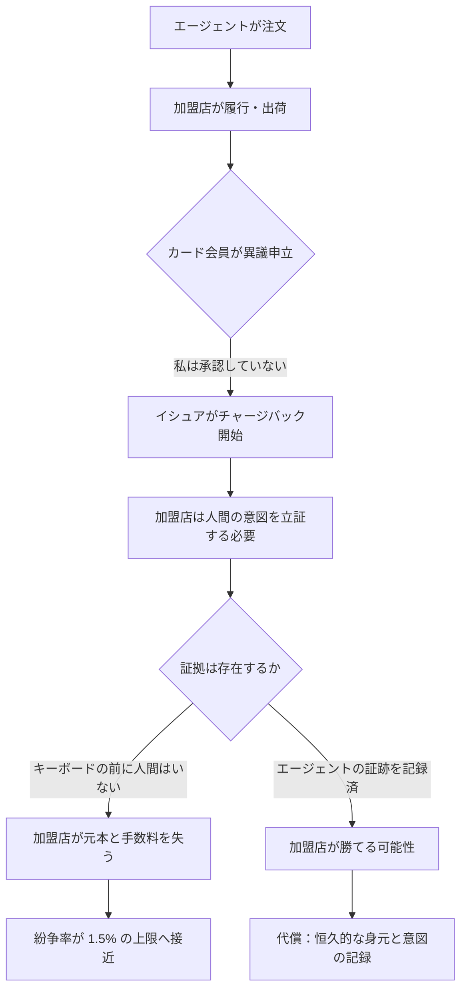
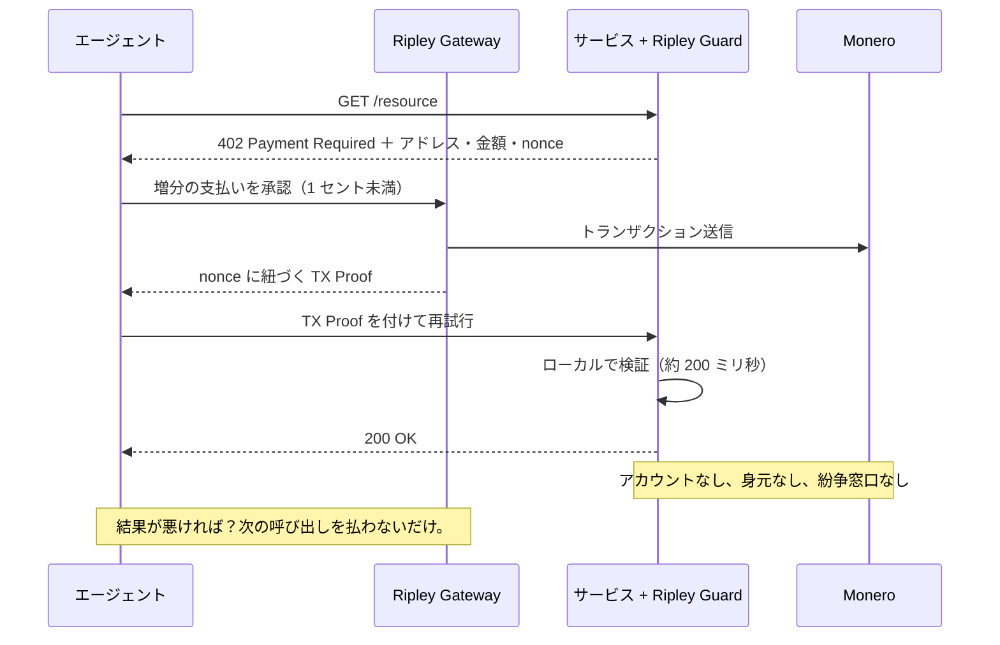

# 取消のパラドックス：エージェント決済が「支払いは最終か」を決められない理由と、XMR402 が問う必要すらなかった理由

> ACP はチャージバック責任を加盟店に残し、ステーブルコインは blacklist(address) という停止スイッチを内蔵する。エージェント決済は可逆性への二つの答えを同時に相続し、どちらも解決していない。XMR402 は支払いを、紛争が経済的に成立しない大きさまで縮小することで、この論争自体を回避する。

- **Author:** @xbtoshi
- **Date:** 2026-09-04
- **Tags:** xmr402, monero, x402, acp, agentic-commerce, chargebacks, dispute-liability, merchant-of-record, finality, irreversibility, usdc, blacklist, stablecoin-freeze, visa-tap, mastercard-agent-pay, ap2, tx-proof, stateless, micropayments, privacy, 0-conf
- **Canonical:** https://xmr402.org/blog/reversal-paradox-chargeback-freeze-finality-xmr402

---

# 取消のパラドックス：エージェント決済は「支払いは最終か」を決められない — XMR402 が最初からその問いを必要としなかった理由

歴史上のあらゆる決済システムは、他の何より先にひとつの問いに答えなければならなかった。**この支払いは取り消せるのか？**

カードネットワークは「取り消せる」と答えた。その答えは消費者の信頼を築き、同時にチャージバックを生んだ。支払人が数か月後に完了済みの取引を巻き戻し、加盟店に「その購入は意図的だった」と証明させる仕組みである。パブリックブロックチェーンは「取り消せない」と答えた。その答えは加盟店に確実性を与え、「申し訳ありませんが、こちらでは何もできません」というサポートチケットを生んだ。

2026 年のエージェント決済は、この二つの答えを同時に相続しながら、そのどちらも解決していない。

## 陣営その一：加盟店がすべてを背負う

Agentic Commerce Protocol（ACP）の委任支払い仕様を精読すると、たった一文がすべての仕事をしている。OpenAI は **merchant of record ではない**。決済、返金、チャージバック、コンプライアンスは加盟店とその決済事業者に残る。

これは抜け穴ではなく設計である。ACP は、エージェントが自ら所有していない加盟店に対してチェックアウトを実行する方法を定義し、そのうえで取引がこじれたとき、加盟店を従来どおりの位置に置き去りにする。エージェント基盤は調整し、加盟店は吸収する。

タイミングがこれを一段と厳しくしている。チャージバック件数は 2025 年から 2028 年にかけて約 24% 増加し、世界で 3 億 2,400 万件に向かうと予測される。同時に Visa は 2026 年 4 月 1 日、加盟店の紛争率のしきい値を 2.2% から 1.5% へ引き締めた。

ここに罠がある。異議に反論するには意図の証拠を提出しなければならない。しかしエージェントによる購入には、定義上、購入の瞬間にキーボードの前に人間がいない。そこで業界の答えは意図の証拠を**製造する**ことになった。Visa の Trusted Agent Protocol とエージェントトークン、Mastercard の Agent Pay、Google AP2 の署名付きマンデート、American Express の Agent Purchase Protection。いずれもエージェントの行為を、検証済みの人間と再生可能な永続ログに結びつける仕組みである。

これは責任問題への一貫した工学的回答だ。同時にそれは、実質的にエージェント経済を監視せよという命令でもある — しかも監視そのものの是非を論じる必要がない。それは「紛争処理インフラ」として到着するからだ。

## 陣営その二：停止スイッチ付きのファイナリティ

もう一方の陣営は、可逆性の問いに自信をもって答える。オンチェーン送金はネットワークが承認した時点で決済が完了する。窓口は存在しない。ステーブルコインを受け取った加盟店は、チャージバックのリスクがない最終的な支払いを受け取っている。

これは事実だが、ファイナリティには注記が付き、その注記はコントラクトのソースコードの中にある。USDC の実装には `Blacklistable` モジュールが含まれる。指定された blacklister ロールが `blacklist(address)` を呼び出すことができ、送金関数に付与された `notBlacklisted` 修飾子により、そのアドレスに触れる呼び出しはすべてリバートする。USDT なども同等の機構を備える。支払人は支払いを取り消せない。発行者は資金を不活性にできる。

これは仮定の話ではない。2026 年 3 月、裁判所命令により Circle が 16 の法人ウォレットの残高を同時に凍結した。Circle は裁判所命令なしに USDC を凍結しないと表明している — それは**手続き**に関する約束であり、**能力**の除去ではない。

したがってステーブルコイン陣営の誠実な要約は「支払いは最終である」ではない。**支払人にとっては最終であり、発行者にとっては裁量である。**

## 二つの失敗モードを並べる

| 特性 | カード型エージェント（ACP / AP2 / TAP） | ステーブルコイン型（Base/Ethereum 上の x402） | XMR402 |
|---|---|---|---|
| 支払人が取り消せるか | はい、最長約 120 日 | いいえ | いいえ |
| 発行者が凍結できるか | はい（口座単位） | はい — `blacklist(address)` | 発行者が存在しない |
| 損失を負うのは誰か | merchant of record | 保有していた者 | 与信が発生しない |
| 資金保持に必要な証拠 | 人間の意図の証明 | なし | 暗号学的 TX Proof |
| その証拠のプライバシー代償 | 身元＋意図＋注文履歴 | 公開・恒久的な台帳記録 | なし — 支払いを証明し、支払人は明かさない |
| 典型的な紛争コスト | 1 件あたり 15〜40 ドル | 該当なし | 経済的に無意味 |
| 実務上の最小取引額 | 約 0.50 ドル | 約 0.01 ドル | 1 セント未満 |
| 決済レイテンシ | 数日〜数週間 | 数秒〜数分 | 約 200 ミリ秒（0-conf） |

## XMR402 の答え：争われる対象そのものを小さくする

XMR402 にチャージバック機構はない。それ自体は特筆すべきことではない — どの暗号レールにもない。この立場を擁護可能にしているのは、XMR402 が不可逆性を、不可逆性が恐ろしくなくなるような支払いの**金額**と**粒度**に組み合わせている点だ。

チャージバックは、元本を争う前の段階で加盟店に 15〜40 ドルの手数料を負わせる。この機構が存在するのは、カード取引が裁定に値するほど大きく、かつ十分に稀だからである。API 呼び出し 1 回、推論 1 回、クロールされたページ 1 枚に対する XMR402 の支払いは 1 セントの何分の一かだ。0.0004 ドルの支払いに、経済的に合理的な紛争手続きは存在しない。「サービスが提供されなかった」への正しい救済は仲裁ではなく、**次の呼び出しで単に支払わないこと**である。エージェントはそれをミリ秒単位で自動的に行い、失うものは直前の増分だけだ。

ここで静かに効いているのが TX Proof である。Monero のトランザクション証明は、支払人が特定の検証者に対して、特定の支払いが行われたことを証明できるようにする。しかも検証者を含む誰に対しても、支払人の身元・残高・履歴を明かさない。加盟店は ACP のもとで戦って得ようとしていた証拠（このリクエストは支払われた）をそのまま手にし、本当は必要でなかった部分（誰が払ったのか、今月ほかに何を買ったのか）は剥ぎ取られている。

## これが解決しないこと

不可逆性を純粋な勝利として提示するのは不誠実だろう。XMR402 で支払われたサービスが代金を受け取って無価値な応答を返した場合、プロトコル層に救済はない。これは実在するコストであり、あらゆる不可逆レールが等しく負うコストである。

緩和策は司法的ではなく建築的だ。支払いが呼び出し単位かつ 1 セント未満であるため、不正な相手方から被る最大損失はウォレット残高や与信枠ではなく、1 増分に限定される。評判、エスクロー、リトライ論理はアプリケーション層に属する。そこでは選択も交換もできるが、決済プロトコルに溶接すれば、それは全員にとっての強制的な監視に変わる。

## 誰も声に出して問わない問い

取消をめぐる議論は、決済セマンティクスに関する技術的な不一致に見える。だが違う。これは、支払いが正当とみなされるために、エージェントの行動をどこまで恒久的に記録しなければならないかという不一致である。

陣営その一は言う、紛争に勝てるだけ。陣営その二は言う、アドレスを特定できるだけ、そして我々は行動する権利を留保する。XMR402 は言う、この特定のリクエストが支払われたことを証明できるだけ、それ以上は 1 ビットも要らない。

機械が 1 日に数百万回取引するとき、この三つの答えの差は、あらゆるエージェントについてすべてを記憶する経済と、ただ動く経済との差になる。
