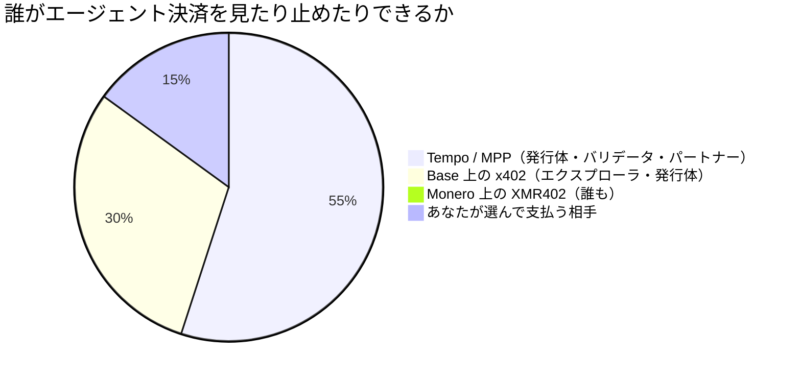
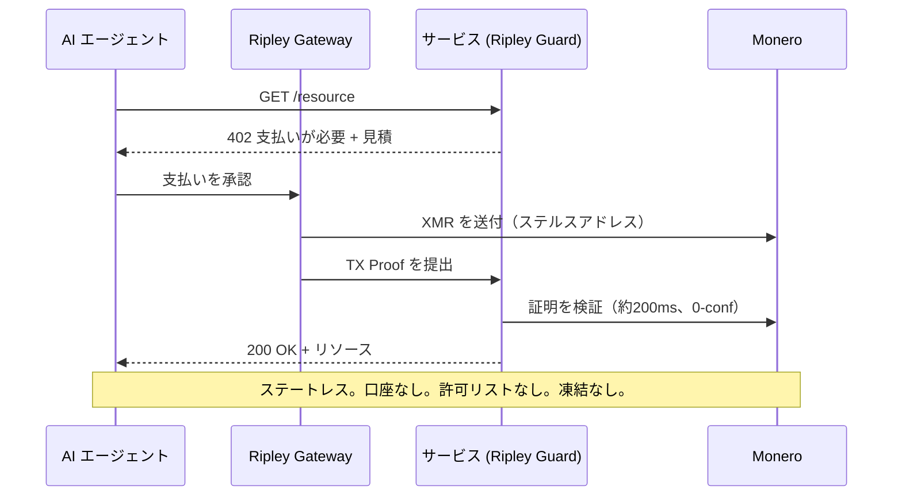

# カンパニー・チェーン：なぜ Stripe の Tempo は機械経済を許可制台帳の上に築くのか、そして XMR402 はなぜ許可を求めないのか

> Stripe と Paradigm の Tempo は、許可制かつ企業統制の台帳上で Machine Payments Protocol を公開した。カンパニー・チェーンがエージェント決済を観測可能・凍結可能にする理由と、XMR402 の無許可 Monero 決済が許可を求めない理由を解説する。

- **Author:** @xbtoshi
- **Date:** 2026-06-03
- **Tags:** xmr402, monero, x402, tempo, stripe, paradigm, mpp, machine-payments-protocol, permissioned, permissionless, stablecoin, agentic-payments, privacy, ap2, fido-alliance, censorship-resistance, stateless, 0-conf
- **Canonical:** https://xmr402.org/blog/stripe-tempo-permissioned-chain-machine-economy-xmr402

---

# カンパニー・チェーン：なぜ Stripe の Tempo は機械経済を許可制台帳の上に築くのか——そして XMR402 はなぜ許可を求めることを拒むのか

2026年3月18日、機械経済は旗艦となる決済レールを手にした。Stripe と Paradigm が支援する決済ブロックチェーン Tempo がメインネットを稼働させ、同時に Machine Payments Protocol（MPP）を公開した。ローンチパートナーの一覧は、商業インターネット全体の点呼のようだ——Anthropic、OpenAI、DoorDash、Mastercard、Nubank、Revolut、Shopify、Standard Chartered。Tempo は主要なステーブルコインで決済し、ネイティブのガストークンを取らず、ソフトウェアが毎秒数千回ソフトウェアに支払えるよう専用設計されている。

あらゆる工学的指標で見れば、これは印象的なマシンだ。だがそれは同時にカンパニー・チェーンでもある——そしてこの区別こそ、いまエージェント決済で起きている最も重要なことである。

## 資本政策表を持つブロックチェーン

ほとんどのブロックチェーンはインセンティブの産物だ。匿名のバリデータが報酬ゆえにネットワークを守り、いかなる単一の主体もあなたの取引能力を取り消せない。Tempo はこれを反転させる。既知の出資者、既知のパートナー群、そして検閲耐性ではなく企業向けの予測可能性に最適化されたバリデータ設計を持つ、目的特化型の台帳だ。Tempo にはマイニングで参加するのではない——オンボーディングされるのだ。

ステーブルコインは発行体のバランスシート上の負債であり、発行体はアドレスを凍結できるし、実際にする。許可制のバリデータ集合は名前のある企業のリストであり、名前のある企業のリストは召喚状の対象面となる。そして MPP の目玉機能——「人間不在」の事前承認による自律購入——は、エージェントの支出パターン全体が、既知で・入金可能で・凍結可能な口座に紐づいて記録されることを意味する。

## 設計上の許可制 対 既定の無許可

| 特性 | Tempo + MPP | Base 上の x402 | Monero 上の XMR402 |
|---|---|---|---|
| 台帳の運営者 | Stripe / Paradigm 系のバリデータ | Coinbase 寄りの L2 シーケンサ | 約10,000の独立 Monero ノード |
| 取引の許可 | オンボーディング／許可リスト | 入口でのウォレット＋KYC | なし——既定で開放 |
| 決済資産 | 主要なステーブルコイン | USDC | XMR（発行体なし） |
| アドレス凍結 | 可能 | 可能 | 不可 |
| 決済の可視性 | 運営者から観測可能 | 永久にオンチェーン公開 | 秘匿（ステルスアドレス、RingCT） |
| プロトコル手数料 | 運営者が設定 | ファシリテータ次第 | ゼロ |
| 確認モデル | バリデータのファイナリティ | L2 ファイナリティ | TX Proof で 200ms・0-conf |

エージェント経済は企業が企業に支払うだけのものではない。何百万もの自律エージェント——その支出パターン*こそ*が戦略であるもの——の経済だ。カンパニー・チェーン上では、その戦略はチェーンを運営する者にとって読み取り可能である。

## 監視はバグではない——ビジネスモデルだ

すべての機械決済が、凍結可能な資産建ての許可制台帳に着地するとき、誰の意図によらず三つのことが帰結する。価格インテリジェンスが漏れる：決済フローを観察する競合が、あなたがどの API をどれだけ呼び何を支払うかを再構成できる。戦略的タイミングが漏れる：MPP の事前承認購入は、エージェントがいつ動くかを正確にさらす。そしてレバレッジは運営者に蓄積する：決済資産を凍結できる主体が、あなたのエージェントの経済的生命に対する拒否権を握る。

## なぜ XMR402 は許可を求めることを拒むのか

XMR402 はオープンな X402 標準の Monero ネイティブ実装だ。x402 や MPP が基づくのと同じ HTTP 402「支払いが必要」のハンドシェイクを用いる——だからエージェント経済の母語を話す——が、誰も所有せず、何も明かさないチェーン上で決済する。

このフローは意図的に口座を持たない。オンボーディングも、パートナーリストも、運営者が停止できる残高も存在しない。検証は Monero の TX Proof に対してゼロ確認で約200ミリ秒で完了するため、レイテンシは Tempo のサブ秒ファイナリティと競合する一方、プライバシーは根本的に異なる。プロトコルは手数料ゼロで、HTTP と WebSocket をまたいでトランスポート非依存であり、Ripley スタックが今日それを実用にする：サーバーミドルウェアの Ripley Guard、エージェントの支払い実行体 Ripley Gateway、人間向けデスクトップアプリの Ripley Terminal。

これらはいずれも許可を必要としない。Monero の匿名性集合——いまや FCMP++ アップグレードに支えられている——が、すべての XMR402 決済を暗号資産で最大の群衆の中に隠すからだ。

## 機械経済がまだ下していない選択

Tempo、AP2 の FIDO Alliance への移管、そして AWS Bedrock AgentCore Payments は、いずれも同じアーキテクチャ——高速・統治済み・観測可能・許可制——へ収束している。それは企業ボリュームの巨大なシェアを獲得するだろうし、その価値はある。だがそれが*唯一*のレールであってはならない。XMR402 は初日から標準に組み込まれた無許可の代替だ。違いは、誰が「はい」と言わねばならないかにある。カンパニー・チェーンでは、誰かが言わねばならない。XMR402 では、誰も要らない——そしてそれこそが核心である。

