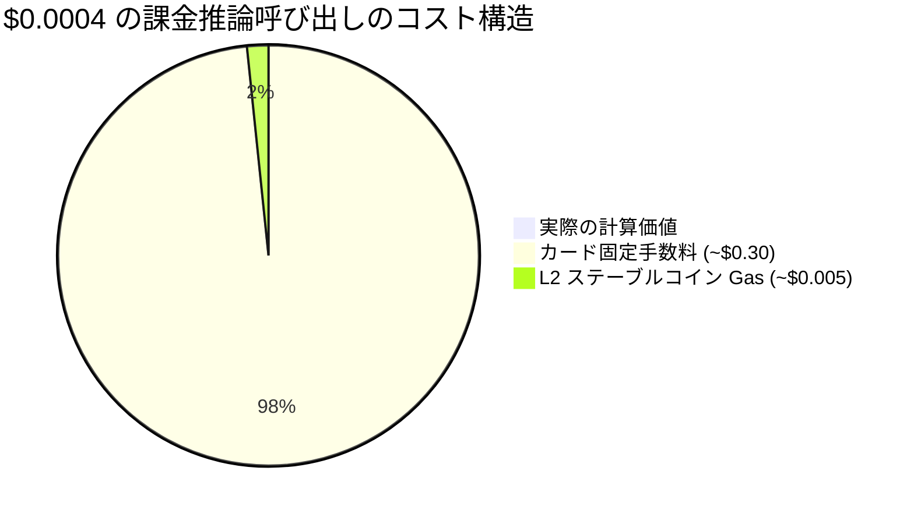
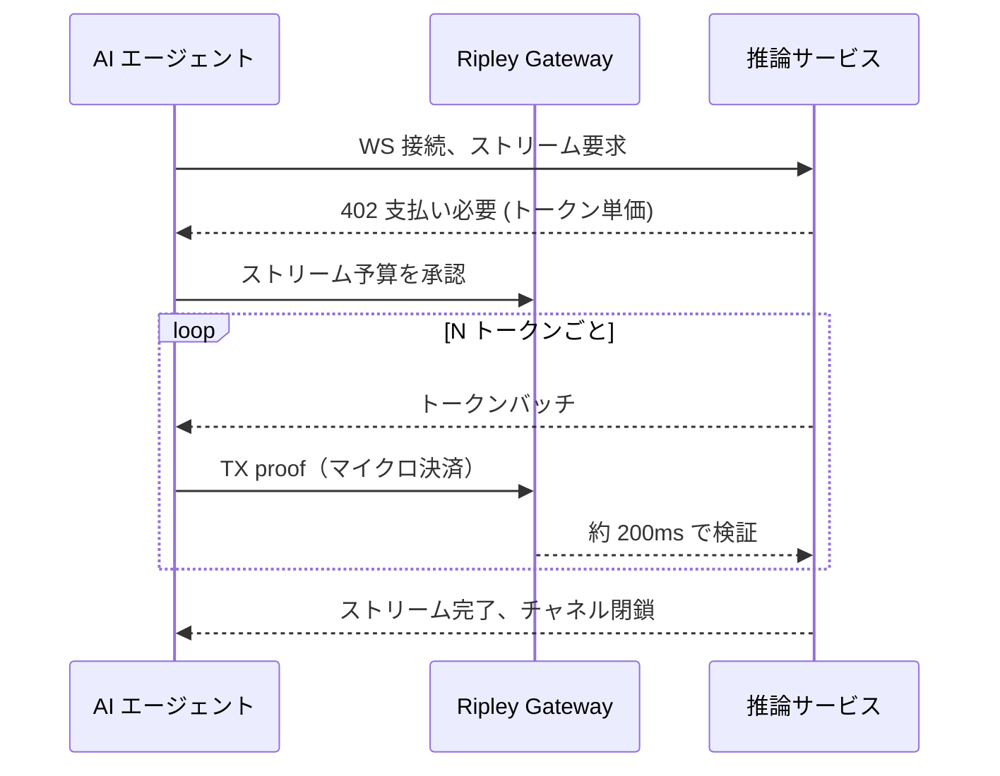

# サブセント決済問題：なぜトークン単位の AI 課金は XMR402 以外のあらゆる決済レールを破綻させるのか

> トークン単位の AI 課金は決済を 1 セント以下に押し下げ、カード手数料や L2 ガスが支払い自体を圧倒する。XMR402 のゼロ手数料、200ms の 0-conf、ネイティブ WebSocket ストリーミングだけが算術を成立させる理由。

- **Author:** @xbtoshi
- **Date:** 2026-05-31
- **Tags:** xmr402, monero, x402, per-token-billing, micropayments, llm-inference, metering, sub-cent, websocket, streaming-payments, agentic-payments, gas-fees, stablecoins, privacy, 0-conf
- **Canonical:** https://xmr402.org/blog/sub-cent-settlement-per-token-ai-billing-xmr402

---

# サブセント決済問題：なぜトークン単位の AI 課金は XMR402 以外のあらゆる決済レールを破綻させるのか

2026 年 5 月、エージェント経済は誰も計画していなかった閾値を静かに越えた。AWS は Bedrock AgentCore Payments を出荷し、Fireblocks は Agentic Payments Suite を発表して x402 Foundation に加盟し、Cryptorefills は x402 決済を接続した。配管は整いつつある。だがすべての発表の下には、ユニットエコノミクスの問題が横たわる——**AI 課金は個々のトークン単位まで下りており、トークン 1 個は 1 セントの何分の一かしかない。**

現代のエージェントは 1 回の購入では済まない。1 つの対話で何百もの微小な判断を下す——検索、取得、モデル呼び出し、ツール起動、再ランク付け。トークンの限界費用がゼロに近づくにつれ、そのトークンに支払う**決済コスト**が支配的な費用になる。そこで既存のレールはことごとく崩れる。

## 30 セントの底値とガス代税

カードネットワークはこのために設計されていない。典型的なカード取引は約 $0.30 の固定部分に加えて手数料率がかかる。1 回の推論に $0.0004 を課金しようとすると、手数料は販売物の価値の **750 倍**になる。トークンをカードで課金することはできない。

暗号レールがこれを解決するはずだった。2026 年の Base 上の USDC 送金はしばしば 1 セント未満で決済される。しかし「1 セント未満」は「無料」ではない。ペイロードが $0.0004 でネットワーク手数料が $0.005 のとき、手数料はなお支払い額の**10 倍超**であり、混雑時にはさらに悪化する。

プロトコル手数料そのものが製品になる。これが x402 のドル建て取引高が 2025 年 11 月のピークから約 77% 下落した構造的理由だ——技術的には機能するが、支払いが真の機械規模まで縮むと経済性が破綻する。

## なぜ XMR402 はサブセント領域のために作られたのか

XMR402 は開放型 X402 標準の Monero ネイティブ実装である。HTTP 402 コードでインラインに支払いを交渉し、ステーブルコイン版 x402 と 3 つの重要な点で異なる。

第一に、**ゼロのプロトコル手数料**。XMR402 は支払いの上に手数料率や固定料金を乗せない。唯一のコストは基盤の Monero ネットワーク手数料で、典型的なマイクロ決済では 1 セントの数千分の一だ。

第二に、**Monero TX Proof による 200ms の 0-conf 検証**。トークン単位のメーターはブロック確認を待てない。次のトークンを今すぐ解放する必要がある。

第三に、**トランスポート非依存**。同じプロトコルが HTTP と WebSocket の両方で動き、支払いイベントとトークンイベントが同じソケット上で交互に流れる。

## トークン単位課金の比較

| 項目 | カードレール | x402 + USDC (L2) | XMR402 (Monero) |
|---|---|---|---|
| 1 呼び出しあたり固定費 | ~$0.30 | ~$0.005 gas | ~$0.00001 正味 |
| $0.0004/トークンで成立 | 不可 | ぎりぎり | 可能 |
| 決済遅延 | 秒〜日 | ブロック時間 | ~200ms 0-conf |
| WebSocket ストリーミング | 不可 | アドオン | ネイティブ |
| トークン別支払い痕跡の露出 | 発行者 | 公開チェーン | 非公開 |
| プロトコル取り分 | % + 固定 | 0% プロトコル、gas 底値 | 0% プロトコル |

プライバシーの行は強調に値する。トークン単位課金は単なる支払いではなく、**行動テレメトリのストリーム**を生む。公開チェーン上の課金呼び出しは、エージェントがどのモデルをどの頻度でいくらで照会したかを漏らす——ブロックエクスプローラーを持つ競合にとって推論ワークロードのほぼ完全な再構築だ。Monero のステルスアドレスと秘匿金額は、エージェントの認知的指紋を世界に公開せずにメーターを動かす。

## 静かな反転

2026 年 5 月の教訓は、エージェント決済の難問が承認やウォレット UX ではなく**算術**だったということだ。知性の価格が金銭移動の価格より速く下落するとき、決済レールがボトルネックになる。ゼロのプロトコル手数料、相対的にサブミリ秒の決済、ネイティブなストリーミング、構造的なプライバシー——それこそ XMR402 が設計された領域だ。$50 のスワップではなく、$0.0004 の一つの思考のために。
