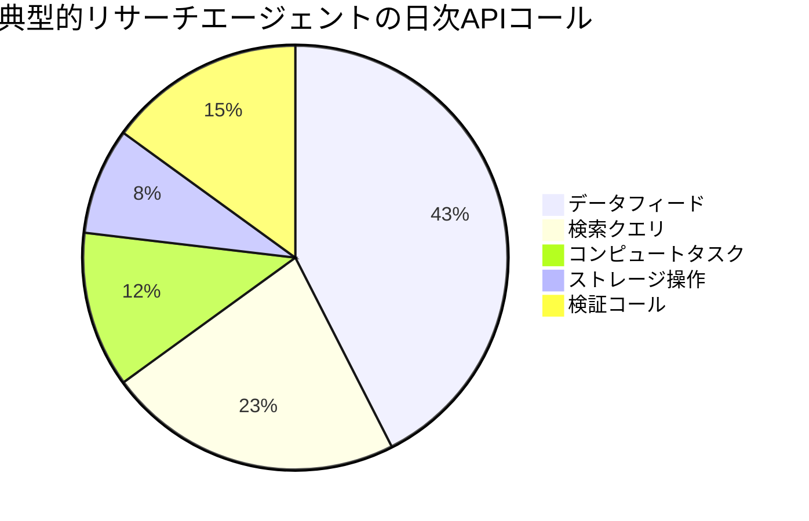
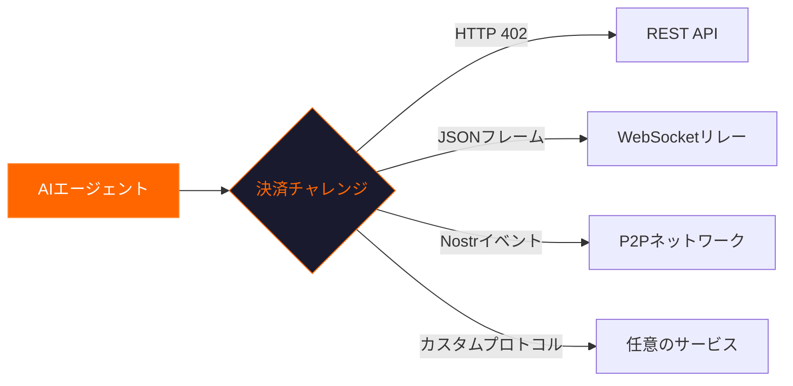

# なぜ XMR402 は毎日重要なのか：マシン経済を支える見えないエンジン

> 朝のニュースフィードから深夜のバッチジョブまで、XMR402 は毎日何千ものエージェント対サービスのトランザクションを静かに支えています。このステートレスな Monero 決済プリミティブが自律型インターネットの基盤になりつつある理由を解説します。

- **Author:** @xbtoshi
- **Date:** 2026-03-17
- **Tags:** XMR402, agentic-economy, daily-use, micropayments, Monero, machine-payments, privacy
- **Canonical:** https://xmr402.org/blog/why-xmr402-matters-every-day

---

## マシン決済の一日

朝6時。あなたが眠っている間に、リサーチエージェントが起動します。47のデータソースに問い合わせるリストがあります——市場フィード、学術データベース、天気API、衛星画像エンドポイント。各リクエストの料金は$0.0001から$0.05です。

エージェントにはクレジットカードもAPIキーダッシュボードもありません。あるのはMoneroウォレットとXMR402プロトコルだけです。6時14分までに全47件のクエリを完了し、各支払いは200ミリ秒以内に処理され、ブリーフィング文書が受信トレイに届いています。

これはSFではありません。XMR402が今日可能にしていることです。

## 誰も語らないスケール

AI決済の議論は通常、大規模取引に焦点が当たります。しかし本当の革命はマイクロスケールで起きています。

1エージェントあたり1日約800回のAPIコール。2026年3月時点で世界中の推定420万のアクティブAIエージェントを掛け合わせると、毎日**30億以上のマシン対サービスインタラクション**になります。

従来の決済レールではこの粒度のボリュームを処理できません。XMR402は単一のHTTPヘッダー交換ですべてを解決します。

## XMR402が毎日重要な5つの理由

### 1. ゼロフリクションのオンボーディング

XMR402は登録不要です。Moneroウォレットを持つエージェントは、デプロイされた瞬間からXMR402ゲートサービスに支払いできます。サインアップフォームなし、承認プロセスなし、待機期間なし。

### 2. プライバシーは運用セキュリティ

透明なブロックチェーンでの支払いは、ウォレットアドレス、取引履歴、残高を公開します。Moneroの環署名とステルスアドレスにより、XMR402決済は有効な支払いが行われた事実以外何も明かしません。

### 3. 思考の速度

XMR402の0-conf検証は約200ミリ秒で完了します：

```mermaid
gantt
    title XMR402 決済検証タイムライン
    dateFormat X
    axisFormat %L ms
    section 決済フロー
    エージェントTX送信       :a1, 0, 50
    メモリプール伝播         :a2, 50, 100
    サーバー check_tx_proof  :a3, 100, 180
    アクセス許可             :a4, 180, 200
```

### 4. ステートレスアーキテクチャは無限にスケール

XMR402のGuardミドルウェアは完全にステートレスです。データベース書き込みなし、セッション保存なし。APIはノード間の調整なしに水平スケールできます。

### 5. トランスポート非依存はどこでも

XMR402 v2.0は任意の双方向チャネルで動作します：

## 競争環境

| 機能 | XMR402 | x402 (Coinbase) | ACP (OpenAI/Stripe) |
|------|--------|-----------------|---------------------|
| プライバシー | 完全 | なし | なし |
| 身元証明 | 不要 | ウォレットのみ | 完全KYC |
| 検証速度 | ~200ms | ~200ms | 秒単位 |
| プロトコル手数料 | ゼロ | ゼロ | Stripe手数料 |
| 検閲耐性 | 高 | 低 | なし |
| トランスポート | HTTP + WS + 任意 | HTTPのみ | HTTPのみ |

## リアルな日次パターン

**夜明け (05:00–08:00)** — バッチ処理エージェントが起動。リサーチボットが夜間のデータ蓄積を照会。

**午前 (08:00–12:00)** — インタラクティブエージェントが活性化。コードレビューボットが静的解析APIコールを購入。

**午後 (12:00–18:00)** — エージェント活動のピーク。コンテンツ生成エージェントが画像生成APIとファクトチェックサービスに支払い。

**夜 (18:00–00:00)** — モニタリングエージェントが引き継ぎ。インフラボットがヘルスチェックエンドポイントを購入。

**深夜 (00:00–05:00)** — メンテナンスと最適化。エージェントがモデルファインチューニング用のコンピュートを購入。

すべての取引がXMR402決済です：即時、プライベート、人間の介入ゼロ。

## より大きな絵

XMR402が毎日重要なのは、マシン経済が毎日稼働しているからです。眠らず、休日を取りません。自律型エージェントは24時間365日稼働し、その運用テンポに合致する決済プリミティブが必要です。

インターネットはその基盤に決済コード——HTTP 402——を組み込んで設計されました。25年間、そのコードは未使用でした。XMR402はマシンのために作られた唯一の通貨でそれを活性化します：プライベート、高速、パーミッションレス。

毎日、より多くのエージェントがオンラインに。毎日、より多くのサービスがAPIにゲートを設置。毎日、見えない経済が成長。そして毎日、XMR402がそこにあります——200ミリ秒でトランザクションを決済し、誰にも何も求めず、マシン経済を動かし続けています。
