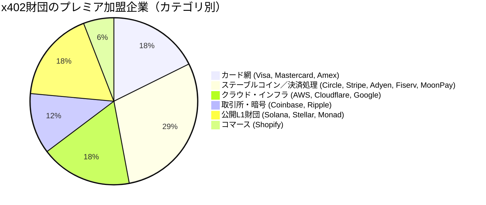
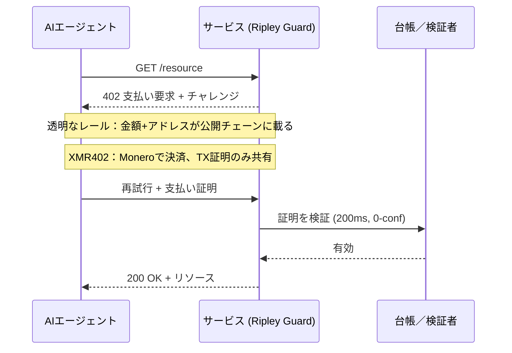

# 40の加盟企業、1つの台帳：x402財団の中立なガバナンスが中立なプライバシーを届けられない理由

> x402財団は7月14日、Linux Foundationのもと40加盟で発足した。だが中立なガバナンスは中立なプライバシーではない——XMR402だけが、誰も見ていない場所でエージェントの支払いを決済する。

- **Author:** @xbtoshi
- **Date:** 2026-07-20
- **Tags:** xmr402, monero, x402, x402-foundation, linux-foundation, agentic-payments, governance, privacy, stablecoin, visa, mastercard, stripe, coinbase, transparent-ledger, fcmp, anonymity-set, tx-proof, stateless, machine-payments, ripley-guard
- **Canonical:** https://xmr402.org/blog/x402-foundation-neutral-governance-transparent-ledger-xmr402

---

# 40の加盟企業、1つの台帳：x402財団の中立なガバナンスが中立なプライバシーを届けられない理由

2026年7月14日、x402プロトコルは成熟を迎えた。Linux Foundationは **x402財団** の運用開始を発表した。これは40の加盟組織からなる、ベンダー中立でオープンなガバナンス機構で、AIエージェントがHTTP経由で支払える標準を管理する。プレミア加盟企業の顔ぶれは圧巻だ。Adyen、AWS、American Express、Circle、Cloudflare、Coinbase、Fiserv、Google、Mastercard、Monad Foundation、MoonPay、Ripple、Shopify、Solana Foundation、Stellar Development Foundation、Stripe、そしてVisa。

2025年5月にCoinbaseのサイドプロジェクトとして始まったプロトコルにとって、これは規模を伴った正統性だ。Linux Foundationのもとでの中立なガバナンスは、相互運用性にとって確かに朗報である。だが報道の中で静かなすり替えが起きており、それが重要だ。**ガバナンスの中立性が、支払いの中立性であるかのように提示されている。** 両者は同じではない。標準化団体は「誰が」プロトコルを形づくるかについて完全に公平でありながら、プロトコル自体はエージェントの支払いを秘匿できない構造のままでありうる。

この隔たりこそが、物語のすべてだ。

## 「中立」が実際に統治するもの

オープンなガバナンスとは、どの一社も仕様を所有しないことを意味する。Coinbaseがx402を寄贈したが、今後その進化は公開の場で決められ、各プレミア加盟企業が議席を得る。これは実在する価値ある性質であり、政治的な問題を解決する。すなわち、機械経済が走るレールを一つのベンダーが独占するという恐れだ。

だがそれが解決しないのはデータの問題だ。x402のコアは輸送規約である。HTTP 402チャレンジ、支払いペイロード、検証ステップ。任意の支払いのプライバシー特性は、上位のガバナンス憲章ではなく、下層の *決済レイヤー* からほぼ完全に決まる。そしてプレミア加盟企業が持ち込む決済レイヤーは、例外なくデフォルトで透明か、身元に紐づいている。あなたの実名に結びついたカードネットワーク、あらゆる送金が永久記録となる公開台帳上のステーブルコイン、資金の流れを把握することを事業モデルとするクラウド事業者。

世界で最も均衡のとれた委員会で透明な台帳を統治することはできる。それでも透明な台帳のままだ。

構成を見てほしい。17のプレミア加盟企業のうち14は、本質的に取引を *見る* ことに価値が依存する存在だ。取引にリスク価格をつけ、清算し、索引化し、あるいは誰もが読めるチェーン上で決済する。これはどの加盟企業への批判でもなく、インセンティブについての観察だ。取引の可視性で収益を得る機関から構成されたガバナンス機構が、デフォルトを取引の不可視性へ導くことはない。その理由がないのだ。

## デフォルトの透明性は設計上の選択であり、自然法則ではない

エージェントが公開ステーブルコインで決済される主流のx402レール経由でサービスに支払うとき、実際に何が起きるかを考えてほしい。金額、時刻、支払元アドレス、受取アドレスがすべて、決して忘れない台帳に書き込まれる。チェーン分析企業はすでに、まさにこのデータから行動を再構築している。支払い主が1日に数千件の少額購入を行う自律エージェントであるとき、その痕跡は単なる1取引の記録ではない。高解像度の戦略地図だ。エージェントがどのAPIに依存し、どれほど頻繁に呼び出し、ワークロードにいくらかかり、需要がいつ急増するか。

x402の仕組みはレールを問わず洗練されている。違いは何が漏れるかだ。透明な決済レイヤーでは、検証者は——そして世界は——「このエージェントが支払った」という以上のことを遥かに多く知る。プライバシー保護レイヤーでは、検証者が知るのはただ一つ、支払いが有効であることだけだ。

## XMR402の位置づけ

XMR402は、同じオープンなx402の発想をMoneroネイティブで実装したものだ。同一のHTTP 402文法を話すため、財団が今管理する標準と互換性がある。変わるのは基盤だ。決済はMonero上で行われ、サーバーは公開台帳を監視することではなく、**Monero取引証明** によって確信する。これは特定の支払いが特定のアドレスへ行われたことを証明する暗号学的レシートで、ゼロ承認・約200ミリ秒で検証でき、金額や使用履歴を第三者に晒さない。

これは後付けのプライバシー機能ではない。デフォルトであり、2026年7月時点のMoneroの姿勢を継承する。FCMP++アップグレード後、すべての支出は16のリングではなく1億5千万を超える出力の匿名集合に対して証明される。このプライバシーは委員会が来四半期に弱めると投票できる方針ではなく、暗号学の性質だ。

| 観点 | x402財団スタック（典型的なレール） | XMR402 |
|---|---|---|
| ガバナンス | 40加盟のLinux Foundation機構 | オープンプロトコル、Moneroネイティブ |
| デフォルト決済 | 公開チェーン／カード網 | Monero（デフォルトで秘匿） |
| 検証者が見るもの | 金額、アドレス、時刻 | 「支払い有効」のみ（TX証明） |
| 匿名集合 | アドレス単位で透明 | 1.5億+の出力 (FCMP++) |
| プロトコル手数料 | レール／処理業者による | ゼロ |
| 承認モデル | チェーン依存 | TX証明で200ms、0承認 |
| データ排出 | 永久の公開痕跡 | 証明以外なし |

## 中立性は必要だが十分ではない

以上のどれも、x402財団の成し遂げたことを損なうものではない。中立な標準は健全な機械経済の前提条件であり、決済分野で最も重要な40社が公開の場で構築することに合意したのは真のマイルストーンだ。論点はより狭く、より鋭い。ガバナンスの中立性と *観察* の中立性は別々の保証であり、7月14日に立ち上がったのはそのうち一つだけだった。

1日に千回支払うエージェントは、公平に扱うと約束する委員会を必要としない。必要なのは、その支払いがデータセットにならないレールだ。財団はエコシステムに前者を与える。XMR402は後者を与えるために存在する——同じ402ハンドシェイクを、誰も見ていない場所で決済する。インターネットはこの教訓を一度学んでいる。私たちはトラフィックを誰が読めるかを統治する委員会を作ることでウェブを信頼できるものにしたのではなく、トラフィックを暗号化してその問いを無意味にしたのだ。エージェントの支払いプライバシーは、一層下での同じ一手だ。ガバナンスは誰が舵を取るかを決める。暗号学は誰が見るかを決める。1日に数百万件の支払いを処理する機械経済にとって、あなたを自由に保つのは二つ目の問いだ。
