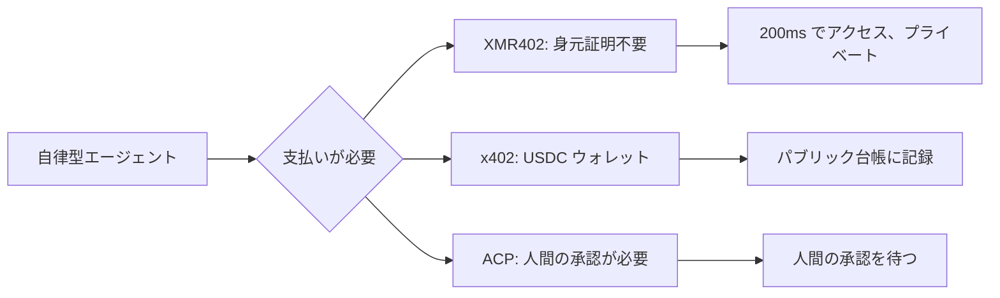
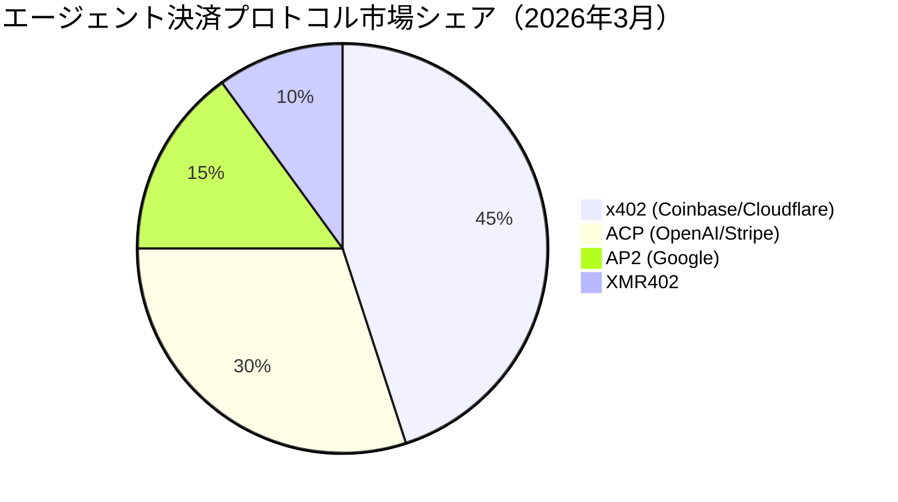

# XMR402 対エージェント決済スタック：プロトコル別徹底比較

> エージェント決済覇権争いが始まった。x402（Coinbase）、ACP（OpenAI/Stripe）、AP2（Google）が AI ネイティブ決済を巡って競い合っている。XMR402 との比較、そしてプライバシーとステートレス設計がなぜすべてを変えるのかを解説する。

- **Author:** @xbtoshi
- **Date:** 2026-03-18
- **Tags:** protocol-comparison, x402, ACP, agentic-payments, Monero, XMR402, privacy, stablecoins
- **Canonical:** https://xmr402.org/blog/xmr402-vs-agentic-payment-protocols

---

## プロトコル戦争が始まった

2026 年初頭、テクノロジー界で注目すべき出来事が起きた。最も影響力のある 3 社が、ほぼ同時にエージェント決済の競合標準を発表したのだ。Coinbase と Cloudflare が x402 Foundation を立ち上げ、OpenAI と Stripe が ACP（Agentic Commerce Protocol）を共同リリースして ChatGPT のインスタントチェックアウトを実現し、Google が独自の AP2（Agentic Payments Protocol）を導入した。

メッセージは明確だ：AI エージェント決済がインターネットインフラの次のフロンティアであり、あらゆる主要プラットフォームがそのレイヤーを握ろうとしている。

## 4 つのプロトコルの概要

### x402（Coinbase + Cloudflare）

HTTP 402 を転送メカニズムとして使用し、Ethereum 互換チェーン上の USDC で決済する。Coinbase エコシステムと Cloudflare グローバル CDN による強力な配布優位性を持つ。

**解決するもの：** ステーブルコインを使ったエージェントとサービス間のマイクロペイメント。

**解決しないもの：** USDC には KYC が組み込まれており、パブリックチェーンでは全トランザクションが永久に可視化される。真のステートレス設計ではない。

### ACP — Agentic Commerce Protocol（OpenAI + Stripe）

人間が AI エージェントを通じて*開始する*コマースのために設計されている。人間が Stripe で支払いを承認した後、Shared Payment Token（SPT）を発行する仕組み。

**解決するもの：** AI インターフェース内のコンシューマーチェックアウト。

**解決しないもの：** 完全に人間の承認に依存しており、真の自律型機械間取引には対応していない。

### AP2（Google）

複雑なエージェントワークフロー向けのオーケストレーションレイヤーで、x402 をステーブルコイン決済レイヤーとして統合する。x402 の制約を引き継ぐ。

### XMR402（Monero ネイティブ）

同じ HTTP 402 メカニズムだが、Monero で決済する。プロトコルレベルで必須プライバシーを持つ唯一の主要暗号通貨。TX Proof による約 200ms の 0-conf 検証、完全ステートレス、身元証明不要。

## プロトコル比較表

| 機能 | XMR402 | x402 (Coinbase) | ACP (OpenAI/Stripe) | AP2 (Google) |
|---|---|---|---|---|
| **プライバシー** | 完全（RingCT）| なし（公開チェーン）| なし（Stripe KYC）| なし（公開チェーン）|
| **KYC 必要** | 不要 | USDC ウォレット KYC | クレジットカード必須 | ウォレット KYC |
| **人間が必要** | 不要 | 不要 | 必要 | 部分的に必要 |
| **検証速度** | 約 200ms | ブロック確認 | API 往復 | API 往復 |
| **プロトコル手数料** | 0 | Gas 代 | Stripe 手数料 | Gas 代 |
| **検閲耐性** | あり | なし | なし | なし |

## 根本的な設計上の問い

XMR402 は、エージェントが **KYC 管理されたアイデンティティを一切介在させず** に動作できる唯一のプロトコルだ。他のすべてのプロトコルは、USDC ウォレット、Stripe アカウント、またはクレジットカードという少なくとも 1 つの KYC エンティティに依存している。

## プライバシーの議論は消えない

金融取引データを蓄積した主要なインターネットプラットフォームは、最終的にそれを競争優位性または規制上の影響力のために利用してきた。パブリックブロックチェーンの支払い記録はさらに露出が大きい：永久的で、不変で、誰でも照会できる。

XMR402 は、このデータをデフォルトで不可視にする唯一のプロトコルだ。ポリシーによってではなく、利用規約によってではなく、数学によって。

## 未来：一強独占ではなく相互運用性

エージェント決済のランドスケープは、メッセージングのランドスケープに似た形になる可能性が高い：複数のプロトコルが橋渡しで共存する形だ。x402 と XMR402 は同じ HTTP 402 メカニズムを共有しているため、両者の橋渡しはアーキテクチャ的に自然だ。

真の問いは、どのプロトコルがプレスサイクルに勝つかではない。どのプロトコルを、人間が見ていないとき、アイデンティティが利用できないとき、プライバシーが選択肢ではないときに、自律型エージェントが使えるか、だ。そのユースケースに対する答えは、すでに明らかだ。
