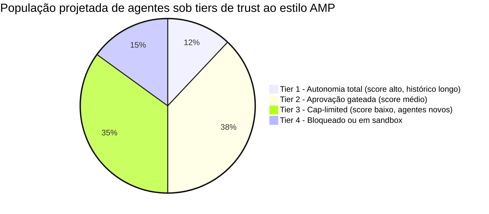
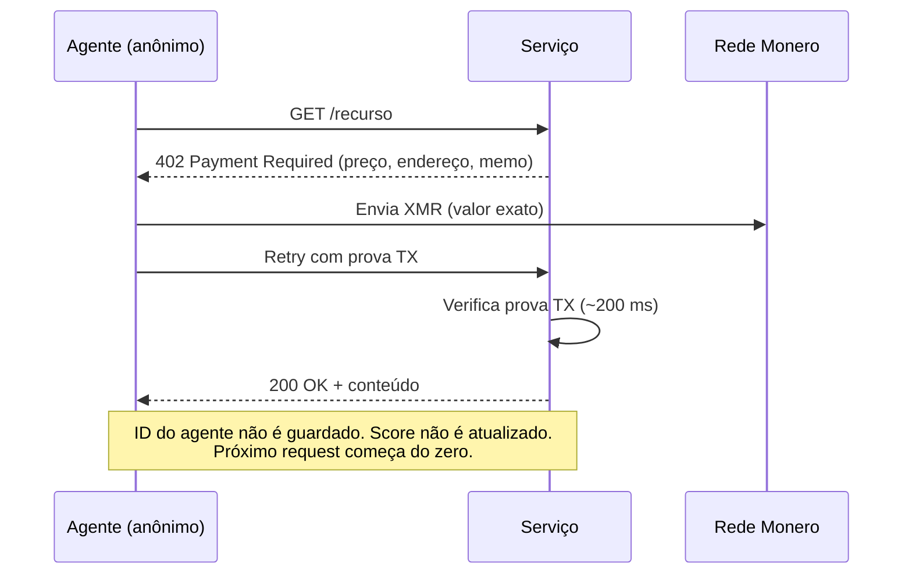
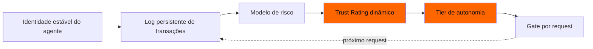

# O score de crédito do agente: como o AMP da Ant classifica cada agente de IA — e por que o XMR402 se recusa a ranquear

> O novo Agentic Mobile Protocol (AMP) da Ant International traz um Agent Trust Rating — um score dinâmico que decide quanta autonomia cada agente de IA recebe. Mostramos por que é, na prática, um score de crédito para máquinas, e por que o design stateless do XMR402 é estruturalmente incapaz de produzir um.

- **Author:** @xbtoshi
- **Date:** 2026-05-29
- **Tags:** xmr402, monero, amp, ant-international, agent-trust-rating, kya, credit-score, stateless, agentic-payments, reputation, x402, alipay
- **Canonical:** https://xmr402.org/blog/agent-trust-rating-credit-score-xmr402

---

## O score de crédito do agente: como o AMP da Ant classifica cada agente de IA — e por que o XMR402 se recusa a ranquear

Em 27 de abril de 2026, a Ant International anunciou o Agentic Mobile Protocol (AMP) no fórum MoMents 2026 em Kuala Lumpur — apresentado como o primeiro framework de pagamentos para agentes pensado para wallets móveis, super-apps e wearables. O número de manchete impressiona: o AMP entra na rede Alipay+, que já cobre **1,8 bilhão de contas de usuários e 150 milhões de comerciantes** via 40+ parceiros de wallet. O discurso é open-source, mobile-first e globalmente conectado.

O discurso é, ao mesmo tempo, o maior sistema de vinculação reputacional já proposto para software autônomo.

O AMP traz dois componentes interligados. O primeiro é o **Know Your Agent (KYA)**: uma camada de identidade digital que certifica as capacidades autorizadas de cada agente. O segundo — e o que merece exame próprio — é o proprietário **Agent Trust Rating**: um score dinâmico de gestão de risco que decide se um agente é "confiável" e, crucialmente, *quanta autonomia ele recebe*. A cobertura descreveu isso como recurso de segurança. Defendemos que é um score de crédito para máquinas, e herda todas as patologias que o credit scoring trouxe para pessoas: opacidade, monopólio, deriva e gatekeeping disfarçado de gestão de risco.

O XMR402 — implementação Monero-nativa do padrão aberto X402 — foi projetado antes de qualquer sistema desse tipo existir, e sua arquitetura stateless é estruturalmente incapaz de produzir um trust rating. Isso é a feature, não uma limitação.

### O que um Trust Rating dinâmico realmente faz

Um trust rating não é uma checagem única. É uma pontuação móvel recalculada a cada transação, cada vinculação de dispositivo, cada interação com contraparte, cada disputa. Para produzir um score estável, o sistema precisa:

1. **Identificar o agente de forma persistente** entre sessões, dispositivos e comerciantes.
2. **Logar cada transação** com entradas atribuíveis (ID do agente, principal, comerciante, valor, hora, resultado).
3. **Reavaliar o score** contra um modelo que nem o agente nem seu principal podem ver.
4. **Gatear a próxima transação** pelo tier — agentes de alto trust agem com autonomia, agentes de baixo trust precisam de aprovação humana ou são bloqueados.

Cada item, isoladamente, é razoável. Empilhados, formam uma autoridade permanente, opaca e centralmente administrada que decide a cada manhã quais dos seus agentes podem atuar na economia. Os materiais do AMP destacam redução de 50% nos passos de vinculação e garantia de devolução em caso de account takeover — ambas exigem exatamente esse livro-razão persistente de identidade de agente para funcionar.

### A analogia com credit score não é retórica

A estrutura é idêntica. A tabela abaixo mapeia patologias do crédito ao consumidor sobre o Agent Trust Rating.

| Score de crédito ao consumidor | Agent Trust Rating | Efeito sobre a economia de agentes |
|---|---|---|
| FICO ou equivalente é um modelo privado único | O modelo do AMP é proprietário | Agentes não podem auditar por que estão sendo limitados |
| O score persiste entre instituições | KYA fixa identidade do agente entre wallets, comerciantes, dispositivos | Uma interação ruim com um comerciante segue o agente em todo lugar |
| Score melhora com comportamento que o bureau prefere | Score melhora com comportamento que o modelo prefere | Agentes convergem para o que o modelo recompensa |
| Novatos têm arquivo fino e pagam mais | Agentes novos começam sem confiança e precisam de aprovação humana | Custo de capital alto para iniciar um agente autônomo |
| Bureaus monetizam o dataset | Emissor do rating monetiza o dataset | Dados comportamentais de agentes viram commodity |
| Disputas são lentas e opacas | Disputas de rating serão lentas e opacas | Dano reputacional se acumula antes de poder ser apelado |

Nada disso é especulativo. São externalidades bem documentadas de qualquer sistema de reputação que humanos construíram — agora aplicadas a software que opera milhões de micro-decisões por dia.

### O problema de distribuição

Existindo um gate de autonomia, a própria autonomia vira recurso estratificado. Os thresholds exatos não são publicados, mas a forma é previsível: uma pequena fração de agentes consolidados poderá agir com autonomia plena, uma faixa intermediária ampla enfrentará prompts de aprovação em ações não triviais, e uma cauda de agentes novos ou marginais ficará funcionalmente bloqueada de qualquer coisa relevante.

As fatias são ilustrativas, o princípio não. Qualquer sistema de risco dinâmico que ajuste autonomia por score produz essa estratificação por construção. As plataformas que emitem o score sentam no topo da pilha; seus agentes preferidos — feitos com seus SDKs, pagando suas taxas, observados por sua telemetria — sobem de tier mais rápido. Agentes independentes e frameworks open-source começam embaixo e pagam aluguel para subir.

### O que "stateless" realmente significa nesse contexto

O XMR402 não tem, e estruturalmente não pode ter, um Agent Trust Rating. Cada request segue o mesmo fluxo: o servidor responde HTTP 402, o agente paga o valor exato em Monero, o servidor verifica a prova da transação em ~200 ms, e o request é atendido. Não há identidade persistente de agente, não há ligação entre sessões, não há log comportamental reportado por comerciantes, e não há modelo de scoring para atualizar.

Não há tier a perder, não há reputação a reparar, e não há emissor de rating acumulando dataset comportamental. Privacidade não é colada por cima — é a ausência da camada de armazenamento na qual outros protocolos se apoiam.

Há uma consequência de segunda ordem raramente dita em voz alta: **liquidação stateless é o único design que dá a um agente novo o mesmo status econômico de um agente estabelecido**. No AMP, um agente open-source recém-criado precisa acumular histórico antes de transacionar autonomamente em caps significativos. No XMR402, ele paga o mesmo valor que um agente de um ano, na mesma janela, com a mesma probabilidade de sucesso. O protocolo não sabe quantos anos ele tem e não precisa saber.

### O que o AMP acerta e onde vira armadilha

Vale ser preciso. O AMP resolve problemas reais nos quais o x402 visivelmente tropeçou. A redução de 50% nos passos de vinculação é significativa. Garantia de devolução em account takeover é feature legítima para wallets com principal humano. Form factors mobile-first — smartwatches, óculos AR, sistemas embarcados — são onde muita atividade de agentes vai de fato nascer.

A armadilha é que essas três features foram alcançadas adicionando estado, o estado teve que ser amarrado a uma identidade estável do agente e, existindo essa identidade, alguém a pontua. Agent Trust Rating não é uma escolha à parte da Ant; é o que o restante do design força a existir.

Dentro desse loop, cada transação também é entrada do score que gateia a próxima transação. A única saída é não entrar.

### A leitura prática

Se você está construindo agentes autônomos em 2026, o protocolo que você escolhe também é o modelo de governança que você aceita. AMP dá alcance mobile e recurso, ao custo de um score reputacional que você não controla. x402 dá trilhos stablecoin e suporte de ecossistema, ao custo de identidade pública on-chain. XMR402 dá micropagamentos stateless e privados, ao custo de mecanismos de recurso que não cabem dentro do protocolo — vivem na camada de aplicação, onde você os desenha.

A versão honesta do debate não é "qual protocolo é melhor". É "que tipo de economia de agentes você quer estar habitando daqui a cinco anos". Uma em que um punhado de emissores de rating decide quais agentes podem agir, ou uma em que qualquer agente que possa pagar a taxa transaciona em condições iguais, sem deixar registro permanente. O XMR402 foi construído para a segunda.

