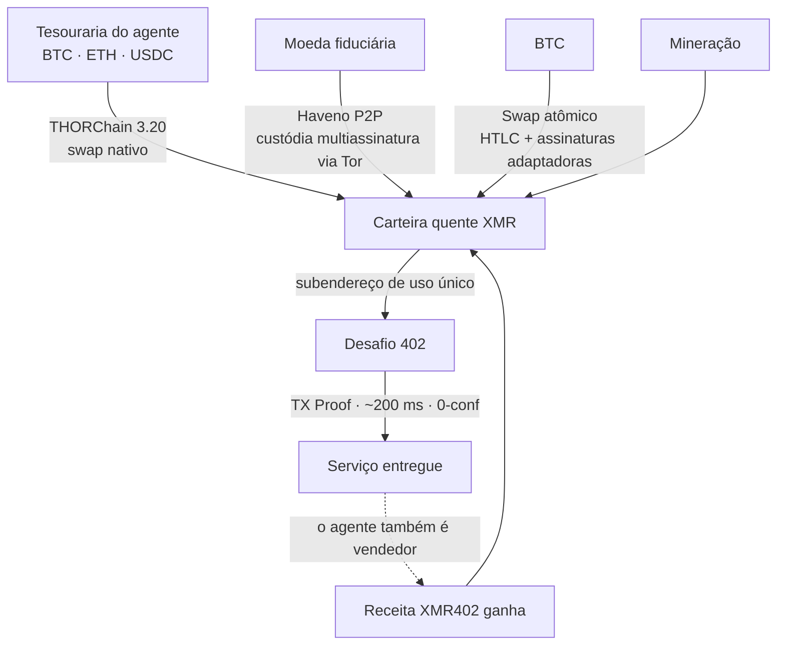
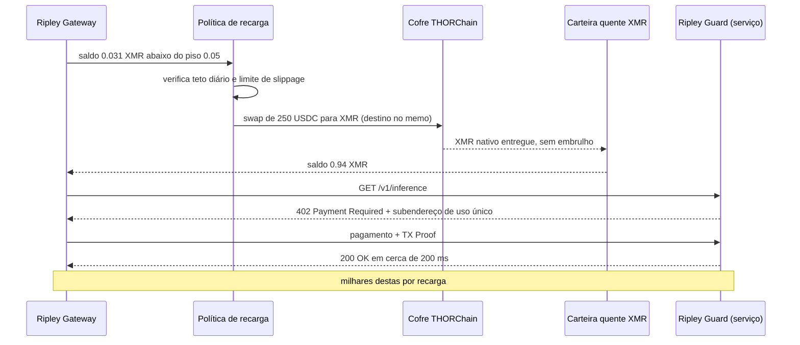

# O problema da recarga: como agentes XMR402 se financiam quando nenhuma corretora quer listar o dinheiro deles

> A objeção mais forte ao XMR402 nunca foi criptográfica: era «de onde o agente tira o XMR». As deslistagens atingem a corretora, mas a corretora não está no laço de pagamento. Os swaps nativos de XMR do THORChain 3.20, de 25 de agosto de 2026, transformaram o último passo em formato humano em uma chamada programável.

- **Author:** @xbtoshi
- **Date:** 2026-09-08
- **Tags:** xmr402, monero, x402, thorchain, thorchain-3-20, native-swaps, delisting, mica, amlr, fatf-travel-rule, kraken, agent-treasury, wallet-funding, refill-policy, atomic-swaps, haveno, no-kyc, non-custodial, ripley-gateway, ripley-guard, tx-proof, fcmp, stateless, agentic-payments, 0-conf, circular-economy
- **Canonical:** https://xmr402.org/blog/agent-wallet-refill-thorchain-delistings-xmr402

---

# O problema da recarga: como agentes XMR402 se financiam quando nenhuma corretora quer listar o dinheiro deles

Toda objeção técnica ao XMR402 acaba desabando na mesma. Não é a criptografia — o RingCT e os endereços furtivos do Monero seguram há uma década. Não é a latência — a verificação por TX Proof fecha um pagamento com 0 confirmações em cerca de 200 milissegundos, mais rápido que o bloco da Base que um agente com stablecoins precisa esperar. Nem são as taxas, que na camada de protocolo são zero.

A objeção é logística: **de onde o agente tira o XMR?**

É uma pergunta justa, e em 2026 ela ficou mais afiada. A Kraken tirou o Monero do Espaço Econômico Europeu sob pressão de MiCA e AMLR e, em abril de 2026, o removeu no Canadá e na Índia. OKX, Binance e Exodus já haviam saído. Em meados de 2026, a lista de praças relevantes ainda cotando XMR havia afinado para KuCoin, MEXC, Gate.io, Kraken fora do EEE e um punhado de corretoras sem KYC. O Regulamento antilavagem da UE (AMLR) torna ativos de anonimato reforçado estruturalmente incompatíveis com as obrigações de um CASP licenciado, e a Travel Rule do GAFI encerra o argumento.

A crítica então se escreve sozinha: você construiu um trilho de pagamento sobre um ativo do qual as corretoras reguladas estão se desfazendo ativamente. Protocolo elegante, nenhuma rampa de entrada.

Essa crítica contém um erro de categoria — e em **25 de agosto de 2026** a parte que restava dela deixou de ser verdade.

## O erro de categoria: uma corretora não é um trilho de pagamento

Repare no que uma corretora centralizada de fato faz dentro de um fluxo de pagamento agêntico.

Nada.

Ela não está no laço. Quando um agente autônomo paga US$ 0,004 a um serviço por uma chamada de inferência, nenhuma corretora é consultada, nenhum livro de ofertas é tocado, nenhuma listagem é necessária. O único papel da corretora — para o XMR402 ou para qualquer outro trilho — é a **aquisição**: converter outro ativo naquele em que o trilho liquida. Ela fica a montante do protocolo, acontece uma vez, no momento de abastecer a tesouraria. Não faz parte da transação.

É fácil não perceber isso porque importamos a suposição do varejo cripto humano, onde a corretora é a interface e a deslistagem equivale ao ativo sumir de vista. Para uma máquina que já mantém saldo denominado em cripto, «está listado na Kraken?» é mais ou menos tão relevante quanto «tem na casa de câmbio do aeroporto?».

A versão honesta da objeção é, portanto, mais estreita e melhor: *um agente consegue, de forma autônoma e sem um humano abrindo conta com KYC, converter o que tem naquilo que precisa gastar?*

Até pouco tempo atrás, a resposta era «sim, mas de forma desajeitada». Agora é simplesmente sim.

## O que o THORChain 3.20 mudou

O THORChain 3.20 foi lançado em 25 de agosto de 2026 com suporte nativo a Monero e Zcash. A palavra que carrega o peso é **nativo**. Não há XMR embrulhado, nem token de ponte, nem custodiante segurando a moeda real contra uma promissória. O agente envia BTC, ETH ou uma stablecoin para um cofre do THORChain e recebe Monero de verdade em um endereço que ele controla. Sem conta. Sem cadastro. Sem transferência de custódia. O swap é uma transação, não um relacionamento.

O XMR subiu cerca de 9% com a notícia e cravou seu melhor mês em mais de cinco anos — a maneira do mercado de notar que a tese da deslistagem tinha um furo. O interessante não é o preço. É que o último passo em formato humano no ciclo de vida de um agente XMR402 — ir a uma corretora, provar quem você é, comprar o ativo — virou uma chamada programável.

## As rotas de recarga, comparadas

Um operador de agentes escolhe rota de financiamento como escolhe região de hospedagem: por propriedades operacionais, não por ideologia.

| Rota | Custódia | Conta / KYC | Automatizável pelo agente | Latência típica | Superfície de censura |
|---|---|---|---|---|---|
| Corretora centralizada | Custodial até o saque | Sim, ligada a um humano | Parcialmente (chaves de API) | Minutos a dias | Alta: listagem, jurisdição, congelamento |
| Swap nativo THORChain 3.20 | Não custodial | Nenhuma | Sim | Minutos | Baixa: cofres sem permissão |
| Swap atômico BTC↔XMR | Não custodial | Nenhuma | Sim, com um formador de mercado | Minutos a uma hora | Muito baixa: não há praça comum |
| Haveno P2P (fiduciário) | Depósito multiassinatura | Nenhuma | Não: contraparte humana | Horas | Baixa, porém lenta |
| Mineração | Autocustódia por construção | Nenhuma | Sim | Contínua | Praticamente nula |
| Receita XMR402 ganha | Autocustódia | Nenhuma | Sim | Instantânea | Nenhuma: não há evento de aquisição |

Releia a última linha, porque é ela que de fato encerra a discussão.

## A melhor recarga não é uma recarga

Numa economia de máquinas de verdade, o mesmo agente está dos dois lados do 402. Um agente de pesquisa paga a um provedor de dados por um corpus; esse provedor é ele próprio um agente que paga a um endpoint de inferência; esse endpoint paga por tempo de GPU e pelo orçamento de rastreamento que mantém seu índice fresco. O valor circula **dentro** da denominação. Um agente que venda qualquer coisa se recarrega continuamente, no ativo de liquidação, sem nenhum evento de aquisição para censurar, deslistar ou vigiar.

A pressão de aquisição é, portanto, um custo de **partida**, não um custo corrente. É máxima para um agente novo puramente consumidor e tende a zero para qualquer agente com receita. A política de deslistagem ataca um passo único. Ela não ataca o laço.

## As objeções honestas

**O swap é visível.** O THORChain liquida em cadeias transparentes. Uma recarga deixa registro público: este endereço converteu 250 USDC em XMR neste horário. Isso é real, e vale dizer com clareza em vez de contornar.

Mas observe o que ela revela e o que não revela. Ela revela a **aquisição**. Não revela absolutamente nada do que o agente comprou depois: de quem, a que preço, com que frequência, em que padrão — que é justamente o dossiê que um trilho transparente de stablecoins publica de graça a cada pagamento. Um evento visível se amortiza entre milhares de invisíveis. Num trilho USDC a proporção é de um evento visível por pagamento, para sempre. A assimetria não é nem perto.

**Correlação temporal.** Uma recarga de 250 USDC seguida de gastos somando um equivalente próximo de 250 em XMR é um vínculo heurístico. As mitigações são higiene operacional comum: financiar com folga e deixar o saldo envelhecer, recarregar por calendário em vez de sob demanda, dividir entre subendereços e deixar o conjunto de anonimato muito maior do FCMP++ absorver o resto quando chegar.

**Profundidade de liquidez.** Os pools de XMR no THORChain têm semanas. Uma tesouraria movimentando seis dígitos sentirá um slippage que uma de quatro dígitos não sentirá. Hoje é uma restrição real e decrescente, mas quem dimensiona recargas deveria limitar o slippage por política em vez de presumir profundidade.

**O fiduciário ainda é a borda dura.** Converter dinheiro bancário em XMR sem um humano continua genuinamente difícil; o Haveno é excelente e irredutivelmente lento por depender de gente. Note, porém, que este é um problema do dinheiro fiduciário, não do XMR402 — um agente que paga em USDC também precisa que algum humano a montante tenha cunhado ou comprado esse USDC. Ninguém desconta isso do x402 da Coinbase.

## O que isso significa para a stack

O Ripley Gateway trata recarga como política, não como emergência. Um piso de saldo, um teto diário de conversão, um limite de slippage e uma ordem preferencial de rotas são configuração, do mesmo jeito que um orçamento de retentativas. Carteiras quentes de gasto ficam pequenas e descartáveis; a tesouraria fica fria e quase intocada. A contabilidade por chave de visualização deixa o operador auditar o próprio gasto sem expô-lo a mais ninguém.

E o ponto estratégico para quem compara trilhos: a economia agêntica é o primeiro caso de uso sério de uma criptomoeda que não precisa de uma corretora dentro do laço. O varejo humano precisa de descoberta de preço, custódia e trilhos fiduciários. Uma máquina comprando 40.000 chamadas de inferência por dia precisa de um saldo e de um endereço de destino. A deslistagem tira o XMR da vitrine. Não o tira do fio — e desde 25 de agosto de 2026, também não tira a loja.

A pergunta nunca foi se as corretoras continuariam listando Monero. Foi se um agente autônomo conseguiria obtê-lo sem pedir permissão. Essa pergunta agora tem uma resposta entediante e mecânica, que é o melhor tipo de resposta.
