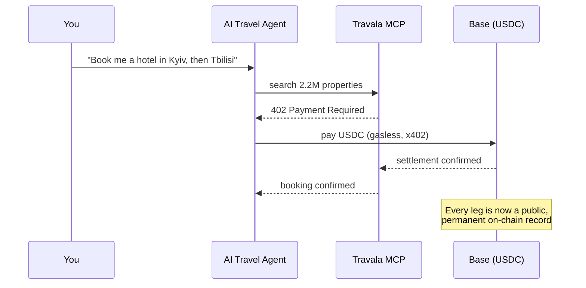
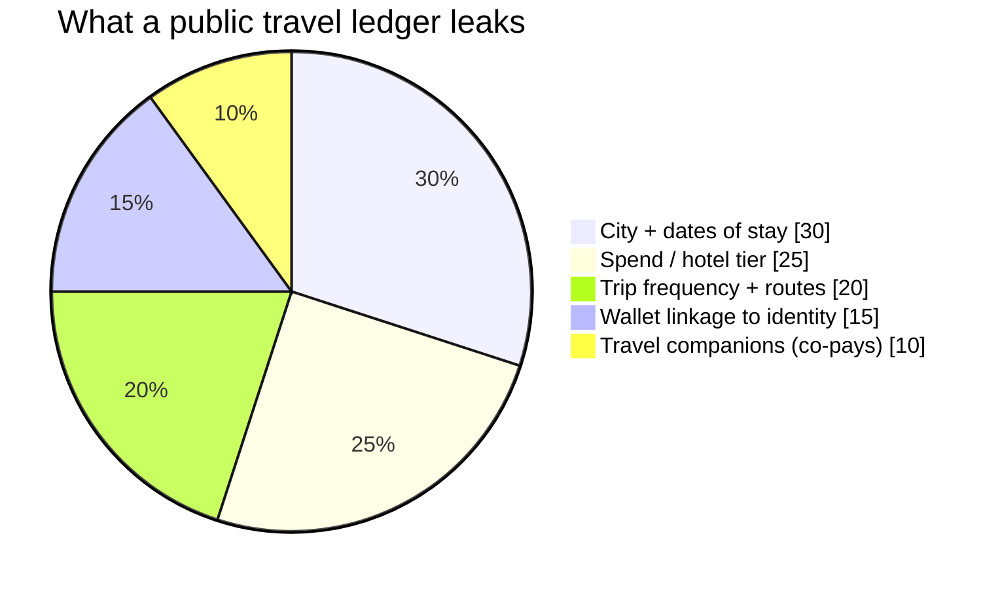
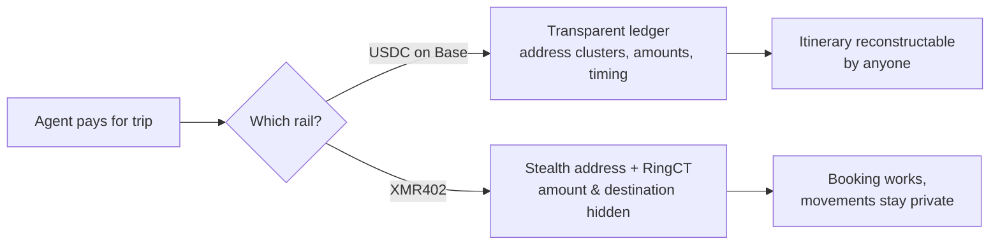

# O itinerário no livro-razão: por que o rastro do seu agente de viagens com IA mapeia cada lugar onde você dorme — e como o XMR402 reserva com privacidade

> O novo protocolo de viagens agêntico da Travala deixa uma IA reservar 2,2M de hotéis e pagar em USDC na Base. Mas um agente em cadeia pública escreve seus movimentos num livro permanente. Veja como o XMR402 reserva a mesma viagem sem deixar rastro.

- **Author:** @xbtoshi
- **Date:** 2026-06-05
- **Tags:** xmr402, monero, x402, travala, agentic-travel, travel-mcp, location-privacy, usdc, base, erc-7715, session-keys, stealth-address, ringct, agentic-payments, privacy, 0-conf
- **Canonical:** https://xmr402.org/blog/agentic-travel-booking-location-trail-xmr402

---

# O itinerário no livro-razão: por que o rastro em stablecoin do seu agente de viagens com IA mapeia cada lugar onde você dorme — e como o XMR402 reserva com privacidade

Em 4 de junho de 2026, a Travala revelou o **Travala Travel MCP**, um protocolo agêntico de ponta a ponta que permite a um concierge de IA buscar, reservar e pagar mais de 2,2 milhões de hotéis dentro de um único fio de chat. Roda na Base, liquida em USDC sem gas pelo padrão **x402** e usa chaves de sessão ERC-7715: o agente propõe o pagamento e a assinatura final fica na sua carteira. É engenharia bonita. É também um desastre de privacidade esperando para ser indexado.

O que não entrou no slide do lançamento: quando seu agente reserva um hotel com USDC na Base, ele escreve o seu dado mais íntimo — *onde seu corpo estará, e quando* — em um livro-razão público e permanente que qualquer um pode ler para sempre.

## A viagem que se reserva sozinha — e conta para todo mundo

Você diz «planeje uma viagem de duas semanas pelo Cáucaso» e o agente cuida de buscas, reservas, pagamentos e cancelamentos. A fricção da viagem encolhe para uma frase. Mas cada liquidação é uma transação numa cadeia transparente.

As redes de cartão são privadas por padrão: a Visa não publica seu histórico de hotéis. Um agente em cadeia pública inverte isso. Junte alguns pagamentos e você não tem pagamentos, tem um **itinerário**.

## Um livro-razão é um histórico de localização

Empresas de análise já agrupam endereços, rotulam comerciantes e desanonimizam carteiras. As liquidações da Travala identificam o comerciante por design — é assim que o hotel recebe. O registro diz: *esta carteira se hospedou neste tipo de hotel, nesta cidade, nestas noites, e agora paga um hotel na próxima cidade a 600 km.*

Para um jornalista encontrando uma fonte ou um dissidente cruzando uma fronteira, é uma ameaça direta à segurança física. Um livro-razão público não pode ser revogado nem apagado. O rastro é permanente.

## Por que as «chaves de sessão» não consertam o vazamento

As chaves ERC-7715 resolvem *autorização*, não *confidencialidade*. Controlam quem pode gastar, não quem pode *observar*. O pagamento assinado ainda cai num livro transparente com o valor e a contraparte à vista. Em viagens, a localização *é* o payload.

## A mesma viagem, com privacidade

XMR402 é a implementação nativa em Monero do padrão x402. O mesmo HTTP 402, a mesma verificação 0-conf de 200 ms via Monero TX Proof, zero taxas de protocolo — mas liquida numa cadeia onde a privacidade é a camada base. Endereços furtivos tornam o destino não vinculável; o RingCT oculta o valor.

| Propriedade | USDC na Base (Travala MCP) | XMR402 (Monero) |
| --- | --- | --- |
| Reserva agêntica | Sim | Sim |
| Valor visível na cadeia | Sim | Não (RingCT) |
| Destino/comerciante vinculável | Sim | Não (endereço furtivo) |
| Itinerário reconstruível | Trivialmente | Não |
| Registro permanente e público | Sim | Criptografado por padrão |
| Taxas de protocolo | Sem gas, mas há taxas da Base | Zero |
| Latência de liquidação | Quase instantânea | ~200 ms 0-conf |

A experiência do agente é idêntica. A diferença é o que fica para trás.

## Privacidade não é uma categoria premium de viagem

A corrida das viagens agênticas já começou. A conveniência é real e vai chegar respondida ou não a questão da privacidade. Por isso ela importa agora. O XMR402 existe para que publicar seus movimentos não seja o padrão. Seu agente deveria reservar a viagem inteira em uma frase. Mais ninguém deveria poder ler para onde você foi.

*XMR402 — a camada de privacidade para a economia agêntica. O mesmo 402, a mesma UX, sem o rastro.*

