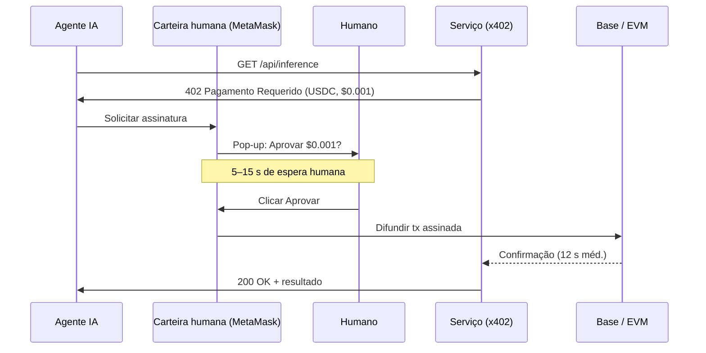
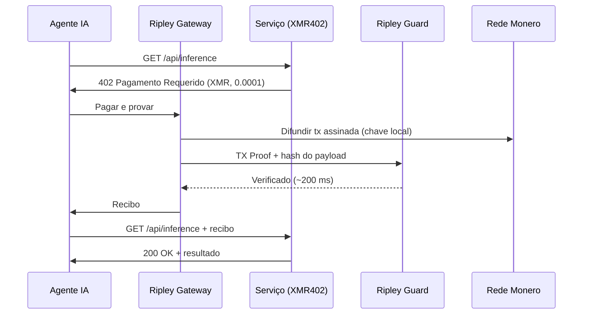
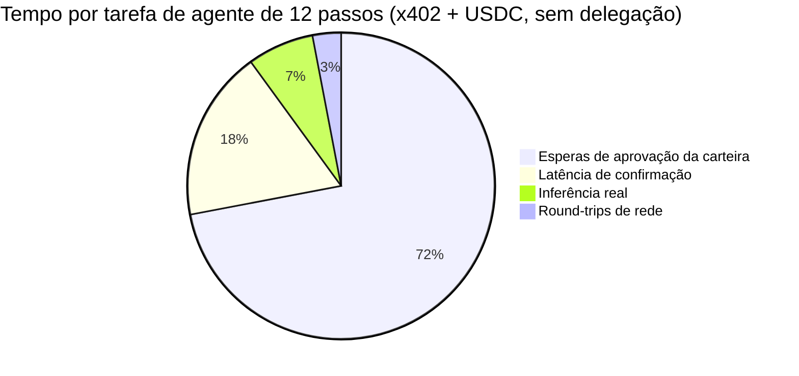
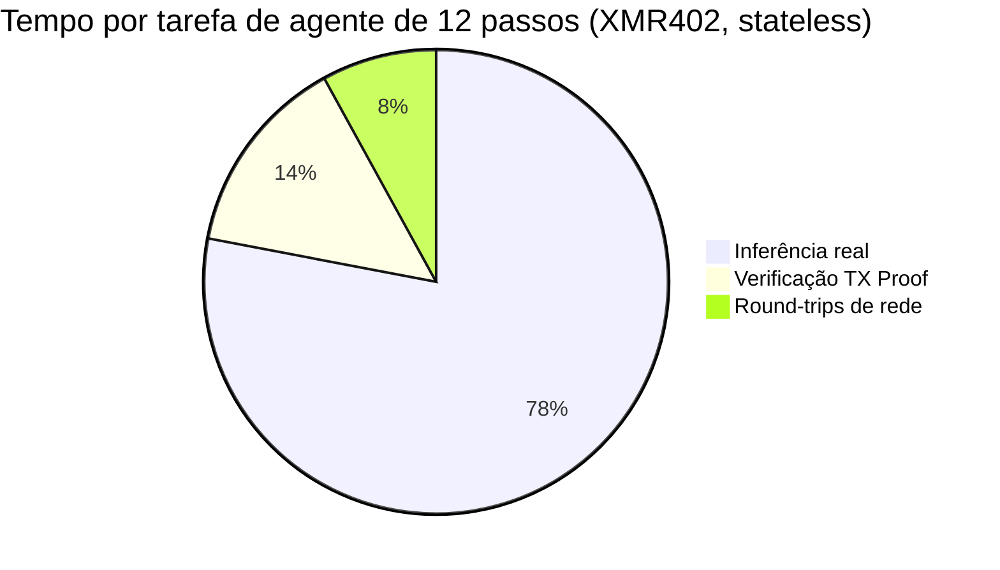

# O muro da fricção de aprovação: por que o volume do x402 caiu 77% — e por que o design stateless do XMR402 o contorna

> Dados da Artemis mostram que o volume ajustado do x402 colapsou 77% desde seu pico em novembro de 2025. O culpado não é a demanda — são os pop-ups da carteira. Cada micropagamento de agente abaixo do centavo agora carrega $0,03–$0,10 em custo de tempo humano de aprovação. Detalhamos o problema da fricção de aprovação e explicamos por que a verificação stateless do XMR402 via TX-Proof faz o gargalo desaparecer por completo.

- **Author:** @xbtoshi
- **Date:** 2026-05-28
- **Tags:** xmr402, x402, monero, approval-friction, wallet-confirmation, micropayments, stateless, agentic-payments, delegation, ap2, agentcore, fireblocks
- **Canonical:** https://xmr402.org/blog/approval-friction-wall-stateless-xmr402

---

# O muro da fricção de aprovação: por que o volume do x402 caiu 77% — e por que o design stateless do XMR402 foi construído para evitá-lo

Maio de 2026 trouxe à indústria de pagamentos de agentes seu primeiro dado genuinamente preocupante. Segundo a análise on-chain da Artemis, o volume ajustado do x402 caiu aproximadamente **77% do pico de novembro de 2025 de US$ 5,15M para apenas US$ 1,19M**, mesmo com a contagem mensal de transações se recuperando para 2,89M com tamanho médio de US$ 0,52. O volume em dólares não está encolhendo porque os agentes pararam de pagar. Está encolhendo porque cada pagamento agora exige que um humano clique em *aprovar*.

A indústria já tem um nome para isso: **fricção de aprovação**. E está expondo uma falha que nenhuma quantidade de polimento de UX de carteira pode consertar.

## Os números que ninguém quer imprimir

Uma cadência conservadora de confirmação de 5 a 15 segundos por pop-up de carteira — sobre os milhões de chamadas x402 que acontecem mensalmente — gera entre **4.000 e 12.000 horas-usuário de trabalho de aprovação por mês**. A um valor misto de tempo humano de US$ 25/hora, cada pop-up custa efetivamente US$ 0,03 a US$ 0,10 em imposto de atenção. Para uma chamada de inferência subcêntima ou uma requisição de API medida de US$ 0,001, o imposto de tempo humano é **10 a 100 vezes o valor do pagamento real**.

Isso não é um bug. É a *consequência direta* de aparafusar um protocolo de stablecoin em um modelo de carteira projetado para operações iniciadas por humanos, não para micropagamentos iniciados por máquinas.

## Por que o x402-USDC não consegue escapar do pop-up

Cada fluxo x402 com stablecoin hoje herda a mesma suposição de autorização: uma carteira (MetaMask, Trust Wallet, Coinbase Wallet, Phantom) guarda uma chave, e essa chave assina uma transação EVM. Seja a carteira vivendo em uma extensão de navegador, um dispositivo de hardware ou um serviço custodial como Fireblocks, o evento de assinatura é **uma ação explícita atribuível ao usuário**. Reguladores querem assim. Times de compliance querem assim. Fornecedores de carteira construíram toda sua UX em torno dessa suposição.

Isso é aceitável para trading. É *catastrófico* para um agente autônomo que precisa fazer 40 chamadas de API subcêntimas durante um único fluxo de pesquisa.

A solução proposta pela indústria são os **frameworks de delegação**: os mandates AP2 do Google doados à FIDO Alliance, os controles de gastos baseados em política do AWS Bedrock AgentCore Payments (lançado em 7 de maio de 2026), o novo Agentic Payments Suite da Fireblocks (20 de maio de 2026) e os vouchers de sessão pré-financiados do Solana Pay.sh (5 de maio de 2026). Cada um tenta *pré-aprovar* um orçamento para que a carteira pare de perguntar. Nenhum elimina a carteira — apenas a escondem atrás de um mandate assinado, um motor de política ou um custodiante.

## O que os frameworks de delegação não resolvem

O pop-up desaparece. A vigilância não. O custodiante não. A vinculação de identidade não. E criticamente, **os modos de falha também não desaparecem**: um mandate pode ser revogado, uma política pode ser mal configurada, um custodiante pode congelar fundos, e cada pagamento ainda aparece como um evento on-chain rastreável amarrado a uma carteira com permissão.

Esta é a ironia arquitetural da corrida de pagamentos de agentes de 2026. Protocolos apoiados por big tech agora constroem andaimes elaborados para *simular* o que protocolos stateless entregam nativamente.

## Por que o XMR402 não tem fricção de aprovação para resolver

O XMR402 foi projetado antes de a fricção de aprovação ter nome. A implementação nativa Monero do X402 trata o subsistema de pagamento do agente — o **Ripley Gateway** — como um ator autônomo de primeira classe. O Gateway guarda sua própria carteira Monero, assina localmente e emite uma **TX Proof** (uma declaração criptográfica que prova que um pagamento específico foi feito para um subendereço específico sem revelar o saldo ou histórico da carteira).

O serviço receptor executa o **Ripley Guard**, que verifica a TX Proof em aproximadamente **200 ms** — sem precisar de um bloco confirmado, sem consultar um custodiante e sem consultar um motor de política externo. A verificação é stateless: sem sessão, sem conta, sem inscrição, sem callback ao UI da carteira.

Não há pop-up porque não há humano no loop. Não há mandate porque a autoridade do agente é limitada pelo saldo da carteira, não por um documento de autorização externo. Não há rastro de vigilância porque as assinaturas em anel do Monero, os stealth addresses e o RingCT obscurecem tanto o conjunto de remetentes quanto o valor.

## Comparação direta: a auditoria da fricção de aprovação

| Protocolo | Modelo de aprovação | Tempo humano por pagamento | Verificação 0-conf | Privacidade do pagador | Dependência custodial |
|---|---|---|---|---|---|
| x402 (USDC em Base) | Assinatura da carteira por tx | 5–15 s ($0,03–$0,10) | Não (~12 s) | Pública em Base | Opc. (Fireblocks, Coinbase) |
| AWS AgentCore Payments | Mandates de política pré-assinados | ~0 dentro do orçamento | Depende da rede | Pública + log AWS | Sim (AWS) |
| Solana Pay.sh | Sessão pré-financiada | ~0 dentro da sessão | Sim (Solana 400 ms) | Pública em Solana | Opc. |
| Google AP2 mandates | Mandate vinculado ao FIDO | ~0 dentro do mandate | Depende da rede | Pública + atestação Google | Sim (identidade Google) |
| **XMR402** | **Nenhum — nativo de agente** | **0** | **Sim (~200 ms TX Proof)** | **Privada (RingCT)** | **Nenhuma** |

A tabela parece uma folha de especificações, mas a implicação é estrutural. Cada framework de delegação acima aceita o pop-up da carteira como custo fixo e tenta amortizá-lo. O XMR402 o elimina.

## Onde o imposto de tempo humano realmente cai

Para um fluxo de agente de 12 passos que faz 12 chamadas pagas de API, a decomposição do tempo é brutal em trilhos de stablecoin e trivial no XMR402.

É por isso que o volume em dólares do x402 está colapsando enquanto a contagem de transações cresce: os agentes estão agrupando, tentando novamente e desistindo de chamadas subcêntimas porque a matemática do tempo humano não fecha mais. O protocolo que *deveria* ser usado para um milhão de chamadas minúsculas por dia está sendo sufocado pelo protocolo que *exige* um humano em cada uma.

## A escolha arquitetural que a indústria continua evitando

O muro da fricção de aprovação não é um problema de UX. É uma **escolha de design de protocolo** assada no momento em que um padrão de pagamento assumiu que o assinante é humano. Cada framework de delegação sendo construído em 2026 — mandates AP2, políticas AgentCore, orquestração Fireblocks, vouchers Pay.sh — é uma camada projetada para simular autonomia em cima de uma primitiva fundamentalmente não autônoma.

O XMR402 tomou o outro caminho. Assumiu que o assinante é o agente, o verificador é o serviço e a rede é privada por padrão. Essa decisão é o que torna possível a verificação em 200 ms, o que torna possíveis as taxas de protocolo zero, e o que faz com que o muro em torno dos pagamentos subcêntimos simplesmente não exista.

Os dados de maio de 2026 são uma previsão. Os protocolos que sobreviverão à década dos agentes serão aqueles que nunca pediram a um humano para clicar em *aprovar*.
