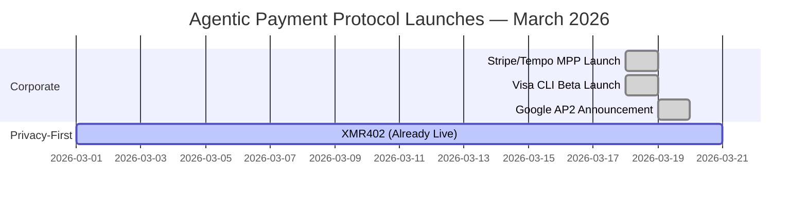
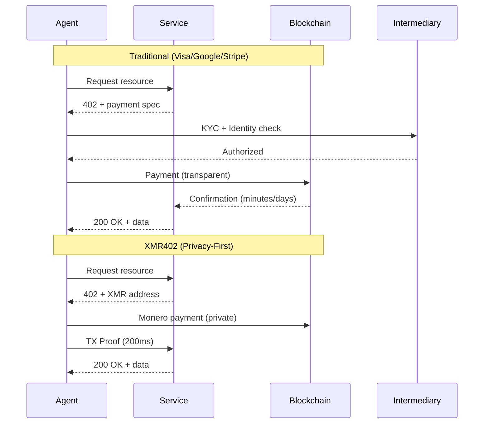

# A Semana em Que Big Tech Apostou em Pagos de Agentes — E Por Que Todos Erraram na Privacidade

> Em março de 2026, Visa, Google e Stripe lançaram soluções de pagamento de agentes competitivas em questão de dias. No entanto, todos os três sacrificam a privacidade pela conveniência. Apenas o XMR402 oferece uma alternativa verdadeiramente preservadora de privacidade, sem estado e sem permissões.

- **Author:** @xbtoshi
- **Date:** 2026-03-20
- **Tags:** agentic-payments, privacy, xmr402, monero, payment-protocols, fintech, cryptocurrency, agent-economy, x402, visa, google, stripe
- **Canonical:** https://xmr402.org/blog/big-tech-agentic-payment-land-grab

---

# A Semana em Que Big Tech Apostou em Pagos de Agentes — E Por Que Todos Erraram na Privacidade

18-19 de março de 2026 será lembrado como o momento em que a economia de agentes se tornou mainstream. Em uma convergência sem precedentes de impulso corporativo, três dos maiores player de pagamentos e tecnologia do mundo anunciaram soluções concorrentes de pagamentos máquina-a-máquina (M2M) em 24 horas:

- **Visa CLI** (18 de março) — ferramenta CLI experimental para pagamentos de cartão programados do Visa Crypto Labs de Cuy Sheffield
- **Google AP2** (março de 2026) — anunciado com 60+ parceiros incluindo Adyen, American Express, Mastercard e PayPal, com extensão de criptografia x402
- **Stripe/Tempo Machine Payments Protocol** (18 de março) — padrão aberto coautorizado por Stripe e Tempo apoiado por Paradigm

Esta convergência corporativa sem precedentes valida uma tese que parecia marginal há apenas 18 meses: o mercado de comércio de agentes de $3-5 trilhões da McKinsey até 2030 não é hype — é inevitável. Mas em sua pressa para capturar este mercado emergente, cada uma destas soluções cometeu o mesmo erro fundamental.

## Todos Escolheram Conveniência Sobre Privacidade

Cada protocolo requer alguma forma de verificação de identidade, cria rastros de vigilância ou depende de intermediários centralizados que se tornam alvos para dados de transações.

**Visa CLI** requer verificação de identidade tradicional e conformidade KYC. É fundamentalmente um sistema de pagamento por cartão, o que significa que a Visa vê cada transação, cada comerciante, cada interação de agente. O rótulo "experimental" mal disfarça o que isto realmente é: um movimento para capturar pagamentos de agente para serviço antes que alguém construa uma alternativa que priorize privacidade.

**Google AP2** opera entre 60+ parceiros mas permanece fundamentalmente centralizado. Google sabe quem paga a quem e para quê. A extensão de criptografia x402, alimentada por Coinbase e MetaMask, adiciona um véu de privacidade, mas apenas para a porção de blockchain — e mesmo assim apenas em cadeias transparentes como Base e Ethereum. O histórico de pagamentos do seu agente é legível para qualquer um com paciência.

**O MPP do Stripe/Tempo** segue o mesmo script: padrão aberto, mas com Stripe como camada de liquidação padrão. Stripe recebe os dados. O protocolo em si é agnóstico de transporte, que é boa arquitetura, mas a estrutura de incentivos aponta para pagamentos através de um intermediário centralizado que lucra com o volume de transações.

Os três resolvem um problema real — como habilitamos pagamentos rápidos e confiáveis entre agentes de IA e serviços? — mas nenhum responde a pergunta mais difícil: *a qual custo para a privacidade?*

## A Diferença do XMR402: Privacidade por Protocolo, Não por Política

XMR402 é a implementação nativa de Monero do padrão de pagamento aberto X402. Ele permite pagamentos microfinanciados sem estado, sem permissão e que preservam privacidade entre agentes de IA e serviços usando HTTP 402 Pagamento Necessário.

Aqui está o que o torna fundamentalmente diferente:

**Nenhuma Identidade Necessária.** Um agente pode iniciar pagamento sem KYC, sem criação de conta, sem inscrição em qualquer sistema. O protocolo em si é a camada de permissão.

**Zero Taxas no Nível do Protocolo.** Visa, Google e Stripe todos extraem valor. XMR402 tem zero taxas de protocolo — apenas taxas de rede Monero (~0.0001 XMR), ordens de magnitude menores do que os cortes de redes de pagamento tradicionais.

**Verificação 0-Conf em 200ms.** Usando a tecnologia TX Proof do Monero, provedores de serviço podem verificar criptograficamente o recebimento de pagamento em 200 milissegundos — rápido o suficiente para interações de agente em tempo real sem esperar confirmação de blockchain.

**Completamente Sem Estado.** O protocolo não requer banco de dados, estado de API ou contas de usuário. Cada transação é auto-contida e criptograficamente verificável. Escale sem débito de infraestrutura.

**Agnóstico de Transporte.** Funciona sobre HTTP, WebSocket ou qualquer protocolo baseado em TCP. O padrão não prescreve a camada de rede.

## Tabela de Comparação: Como Se Comparam

| Recurso | Visa CLI | Google AP2 | Stripe MPP | x402 | XMR402 |
|---------|----------|-----------|-----------|------|--------|
| **Privacidade** | Baixa (KYC necessário) | Baixa (livro-razão centralizado) | Baixa (intermediário Stripe) | Média (cadeias transparentes) | Alta (privacidade Monero) |
| **Identidade Necessária** | Sim | Sim (cripto opcional) | Sim | Opcional | Não |
| **Taxas de Protocolo** | 2-3% | 0.5-1.5% | 0.5% + liquidação | Variável | 0 |
| **Velocidade de Liquidação** | 1-3 dias | 1-2 dias | Minutos | 10-15 minutos | 200ms (0-conf) |
| **Sem Permissão** | Não | Não | Não (integração necessária) | Sim (para x402) | Sim |
| **Arquitetura Sem Estado** | Não | Não | Parcial | Não | Sim |
| **Nativo de Criptografia** | Não | Parcial (extensão x402) | Não | Sim | Sim |
| **Centralização** | Alta | Alta (60+ parceiros, hub Google) | Alta (Stripe padrão) | Média | Nenhuma |

## Contexto de Mercado: Quem Está Vencendo e Por Quê

x402, o padrão liderado pela Coinbase, já processou mais de 100 milhões de pagamentos, mas opera com margens finas — apenas ~$28K de volume diário de acordo com CoinDesk, apesar de uma avaliação de ecossistema de $7B. É tecnicamente elegante e sem permissão, mas opera em blockchains transparentes (Base, Ethereum) que derrotam a privacidade.

Os movimentos da Visa e Google sinalizam algo importante: os incumbentes veem este mercado e estão se movendo para possuí-lo antes que as pistas alternativas amadureçam. Não estão lançando estes produtos porque acreditam em descentralização ou privacidade — estão lançando porque temem ser desintermediados.

A parceria do Stripe com o Tempo é mais interessante. Tempo é apoiado pela Paradigm, o que sinaliza capitalização séria atrás da infraestrutura de pagamentos M2M. Mas o alinhamento de incentivos ainda aponta para liquidação centralizada.

## O Paradoxo da Privacidade

Aqui está a verdade desconfortável: cada protocolo que vimos ser lançado esta semana enfrentará a mesma pressão regulatória para coletar dados, sinalizar padrões suspeitos e permitir congelamento de contas. Identidade cria responsabilidade legal. Vigilância se torna teatro de conformidade.

XMR402, construído sobre garantias de privacidade do Monero, não resolve a incerteza regulatória — mas estruturalmente previne teatro de conformidade. Se você não pode ver a transação, não pode ser processado por habilitá-la. O protocolo em si se torna a camada de permissão: se a criptografia verifica, o pagamento foi válido. Sem julgamento humano. Sem apelo à autoridade.

## O Que Acontece em Seguida

Três futuros possíveis:

1. **Consolidação.** Um dos três grandes (provavelmente Google ou Visa) compra ou integra com os outros, criando um monopólio de fato em pagamentos de agentes.

2. **Fragmentação.** Todos os quatro coexistem, com especialização de caso de uso. Visa para pagamentos de agentes corporativos legados, Google para agentes voltados ao consumidor, Stripe para startups, x402 para fluxos de trabalho nativos de cripto.

3. **Domínio Prioritário de Privacidade.** XMR402 e protocolos similares nativos de privacidade capturam casos de uso onde agentes lidam com dados sensíveis — agentes de saúde, agentes de análise financeira, agentes de inteligência. O custo da vigilância se torna muito alto.

O terceiro futuro não é inevitável, mas está se tornando cada vez mais claro por que importa. Quando agentes superam humanos por ordens de magnitude e cada pagamento cria um ponto de dados no banco de dados de alguém, privacidade deixa de ser uma preferência. Torna-se infraestrutura.

## A Conclusão

A economia de agentes é real. Março de 2026 provou. Mas os protocolos lançados esta semana — Visa CLI, Google AP2, Stripe MPP — estão otimizados para a coisa errada. Estão otimizados para a capacidade do incumbente de extrair dados, não para a capacidade da economia de agentes de escalar sem confiança.

XMR402 oferece uma alternativa: pagamentos rápidos, sem permissão, que preservam privacidade com zero taxas de protocolo. Não é perfeito — a privacidade do Monero vem com alguns compromissos de UX, e incerteza regulatória é real. Mas é o único protocolo nesta coorte que não aposta contra o futuro da privacidade.

Como a economia de agentes escala de milhões de transações diárias para bilhões, a pergunta não será *se* privacidade importa. Será se a camada de infraestrutura será projetada para preservá-la.
