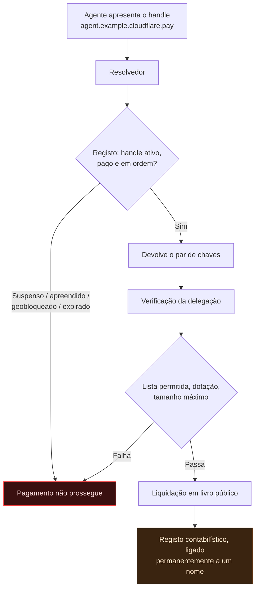
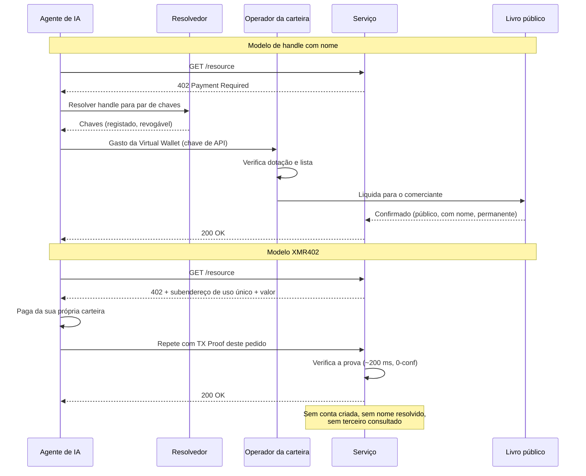

# O nome é o gargalo: por que o cloudflare.pay dá a cada agente um endereço de pagamento permanente — e por que os agentes XMR402 continuam sem nome

> O Wallets e o cloudflare.pay deram aos agentes de IA limites de gasto — e algo mais consequente: nomes. Um handle de pagamento resolúvel é a chave de ligação que transforma um livro transparente num registo comportamental nomeado. O XMR402 cunha um endereço de uso único: nada a resolver, nada a revogar.

- **Author:** @xbtoshi
- **Date:** 2026-09-05
- **Tags:** xmr402, monero, x402, cloudflare, cloudflare-wallets, cloudflare-pay, agent-identity, naming-layer, dns, handles, virtual-wallets, delegated-spend, stateless, tx-proof, fcmp, anonymity-set, agentic-payments, privacy, 0-conf, ripley-guard, censorship-resistance
- **Canonical:** https://xmr402.org/blog/cloudflare-pay-handles-agent-naming-layer-xmr402

---

# O nome é o gargalo: por que o cloudflare.pay dá a cada agente um endereço de pagamento permanente — e por que os agentes XMR402 continuam sem nome

Em 4 de agosto de 2026, durante a sua Agents Week, a Cloudflare anunciou o Wallets e o `cloudflare.pay`. A maior parte da cobertura destacou a metade óbvia: agentes de IA agora podem guardar dinheiro e gastá-lo dentro de limites. Essa é a metade menos interessante.

A metade mais consequente é que os agentes ganharam **nomes**.

Uma carteira é um recipiente. Um nome é um índice. E em todo sistema em rede que os humanos já construíram, o controlo acumula-se não na camada de armazenamento nem na de transporte, mas na **camada de nomes**. A Cloudflare sabe disso melhor do que quase ninguém — por isso a sua própria analogia para o `cloudflare.pay` é o DNS: identificadores legíveis por humanos que resolvem para pares de chaves criptográficas, tal como domínios resolvem para endereços IP.

A analogia está exatamente certa. E é justamente esse o problema.

## O que foi de facto lançado

Retirada a retórica, três coisas são reais, uma é proposta e várias ficam notoriamente por nomear.

Real: uma **Account Wallet**, que pertence a um humano e guarda os fundos. Ela delega gasto limitado a **Virtual Wallets**, operadas pelos agentes através de chaves de API. A delegação traz uma dotação, uma lista de comerciantes permitidos e um tamanho máximo de transação.

Proposto: os handles `cloudflare.pay` — uma camada de identidade legível para agentes, apresentada como solução de transição enquanto os padrões de identidade não assentam.

Por nomear: o custodiante dos saldos, as stablecoins suportadas e as redes de liquidação. A reserva de handles abriu no dia do anúncio; financiamento, gasto e suporte a comerciantes aparecem no futuro nos próprios textos da Cloudflare.

Sejamos justos: delegação limitada é uma melhoria real face ao que substitui — uma única carteira quente com saldo ilimitado e uma chave de API colada às variáveis de ambiente do agente. Limites reduzem mesmo o estrago que um agente confuso ou sequestrado consegue fazer. Nada do que segue nega isso.

A objeção é mais estreita e, penso eu, mais duradoura: os controlos de gasto são a parte que entra no comunicado de imprensa; a camada de nomes é a parte que muda a internet.

## O DNS nunca foi uma camada neutra

Leve a analogia da Cloudflare a sério e siga-a até ao fim.

O DNS deu usabilidade à internet. Deu-lhe também um registo, um registrar, um resolvedor, um ciclo de renovação, um TTL, uma política de abuso, um procedimento de suspensão e — com o tempo — apreensões judiciais e listas de bloqueio por jurisdição. Nada disso constava do documento de desenho. Tudo decorreu inevitavelmente de uma única propriedade: algures existe uma parte que responde «para onde aponta este nome?» — e que, portanto, pode responder «para lado nenhum».

Uma camada de nomes para pagamentos herda toda a estrutura. Se `agent.example.cloudflare.pay` resolve para um par de chaves, algo o resolve. Esse algo tem uma política. Essa política tem exceções. Essas exceções trazem um processo legal, e o processo legal traz uma jurisdição.

Cada caixa do diagrama é um ponto onde o pagamento pode ser travado por alguém que não é nem o pagador nem o recebedor. Não é uma crítica às intenções da Cloudflare — é uma descrição do que um espaço de nomes resolúvel **é**.

## O que um nome acrescenta a um livro transparente

O pseudonimato numa cadeia pública já era frágil. Agrupamento de endereços, correlação temporal, valores redondos e contrapartes repetidas permitem aos analistas colapsar endereços «anónimos» em entidades com fiabilidade desconfortável. O que costuma faltar é a **chave de ligação**: o identificador durável que amarra um grupo de endereços a um registante real.

Um handle de pagamento é exatamente essa chave, entregue voluntariamente e por desenho.

Funciona nos dois sentidos. Para a frente, todo pagamento futuro sob o handle é atribuível a quem o registou. Para trás, uma vez conhecida a correspondência, o histórico antes ambíguo também se resolve. Rodar chaves atrás de um handle estável não resolve: o resolvedor guarda a correspondência por construção. É essa a sua função inteira.

| Camada | O que sabe | Persiste após o pagamento? |
|---|---|---|
| Livro público | Valores, horários, contrapartes, grafo de endereços | Para sempre e publicamente |
| Registo de handles | Handle → chaves, registante, renovações | Sim, com o operador |
| Account Wallet | Que humano financia que agente e quanto | Sim, com o operador |
| Lista de permitidos | Todos os comerciantes que o agente pôde pagar | Sim, com o operador |
| Proxy reverso do comerciante | O pedido, cabeçalhos, hora, origem | Conforme política de retenção |

Leia a tabela como um sistema único e não como cinco: o que aparece é o registo comportamental completo de um agente autónomo — quem o financiou, o que podia comprar, o que comprou, quando, por quanto e a quem — com um nome humano na raiz.

## A pilha de gargalos

O desconfortável é a concentração, não a intenção.

Boa parte da web já está atrás de um mesmo proxy reverso. Junte-se a tarifação por pedido para rastreadores de IA. Junte-se uma camada de identidade de agentes. Junte-se uma carteira e um caminho de liquidação. Agora um único operador pode, em princípio, observar o pedido, resolver a identidade e liquidar o pagamento — três camadas historicamente nas mãos de três partes sem relação, dobradas numa só.

O segundo fluxo tem menos participantes porque tem menos perguntas a fazer. Não há handle a consultar, logo não há registo a interrogar, logo não há ninguém em posição de dizer não.

## XMR402: nada a resolver, nada a revogar

O XMR402 implementa HTTP 402 sobre Monero, e as suas decisões de desenho encaixam quase ponto por ponto contra o problema do nome.

**O identificador é descartável.** O destino do pagamento é um endereço de uso único cunhado para um único desafio. Não é reservado, nem renovado, nem registado, nem reutilizado. Não há espaço de nomes porque não há nome.

**A autorização é por pedido, não por conta.** O agente apresenta uma TX Proof do Monero de que aquele pagamento concreto foi feito para aquele pedido concreto. Não existe chave de API ao portador que um ambiente comprometido vaze e um atacante reproduza.

**O servidor é stateless.** Nenhuma conta é criada, logo não há conta para nomear, suspender ou intimar. O Ripley Guard verifica uma prova em cerca de 200 ms com zero confirmações e esquece o pagador de imediato.

**O livro não contém chave de ligação.** A atualização FCMP++ do Monero permite provar a propriedade contra um conjunto de anonimato de mais de 150 milhões de saídas, e aplica-se retroativamente. As técnicas de agrupamento que tornam os handles tão valiosos para analistas não têm onde se agarrar.

| Propriedade | cloudflare.pay + trilhos de stablecoin | XMR402 |
|---|---|---|
| Identificador de pagamento | Handle legível, persistente | Endereço de uso único |
| Quem pode revogar | Registo / operador da carteira | Ninguém — nada é concedido |
| Identidade do registante | Titular humano da conta | Não exigida |
| Custódia dos fundos | Account Wallet do operador | Carteira do próprio agente |
| Taxas de protocolo | Conforme operador e rede | Zero |
| Ligabilidade no livro | Valores e grafo públicos | Blindado; +150 M de anonimato |
| Controlo de gasto | Dotação e lista, como política | Valor por pedido, como estrutura |
| Estado no servidor | Contas, saldos, auditoria | Nenhum |
| Funciona auto-hospedado | Não | Sim |
| Latência de liquidação | Conforme rede e operador | ~200 ms, 0-conf |

## A troca, dita com justiça

Pagamentos com nome não são golpe nem armadilha. São uma troca, e para alguns compradores é a troca certa.

Se uma empresa paga aos seus fornecedores, quer faturas, reconciliação, gestão de disputas e uma trilha de auditoria com um nome humano no fim. Um handle entrega tudo isso. Compras corporativas **devem** ser atribuíveis.

A objeção é à atribuição como **padrão**, aquela que todo agente recebe precise ou não o caso de uso. Um agente que lê um artigo pago, consulta um preço, compra 200 tokens de inferência ou rastreia um conjunto de dados público não tem por que gerar um registo permanente e nomeado. Esses pagamentos são o equivalente-máquina de pôr uma moeda numa ranhura. Ninguém pediu passaporte no quiosque.

O desfecho saudável são dois trilhos, escolhidos por transação: com nome e auditável onde a prestação de contas é o produto; sem nome e descartável onde não é. O insalubre é o segundo trilho simplesmente não existir.

## Nomes são a forma como os sistemas aprendem a dizer não

A pilha de pagamentos agênticos de 2026 convergiu numa crença partilhada: um agente precisa de ser **alguém** antes de poder pagar por **alguma coisa**. Identidade primeiro, liquidação depois. Todo protocolo relevante deste ano — passaportes de identidade, classificações de confiança, livros permissionados e agora handles de pagamento — é uma variação do mesmo tema.

O XMR402 inverte a ordem: prove o pagamento, não o pagador. O serviço obtém exatamente o que precisa e não aprende mais nada, porque não há mais nada para aprender.

Nomes tornaram a web navegável. Também a tornaram apreensível. Quando os agentes começarem a pagar a internet à velocidade da máquina, vale perguntar se cada uma dessas milhares de milhões de transações minúsculas precisa mesmo de um registante — ou se algumas deveriam apenas ser pagas, verificadas e esquecidas.
