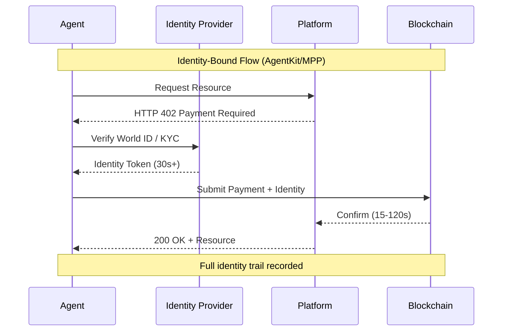
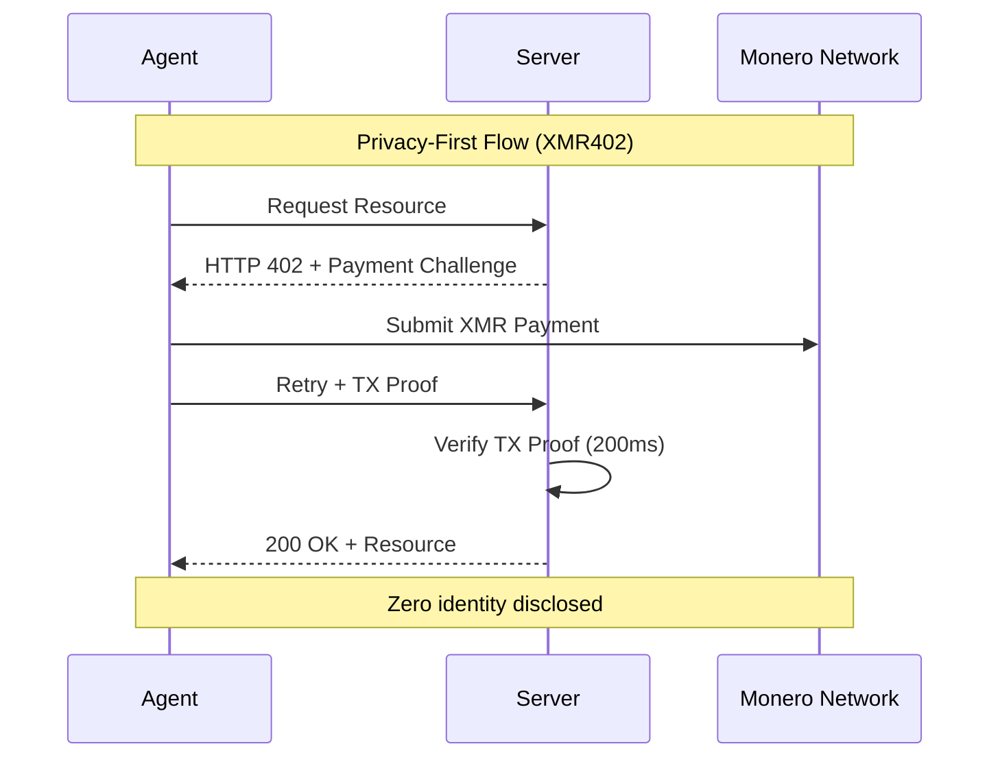
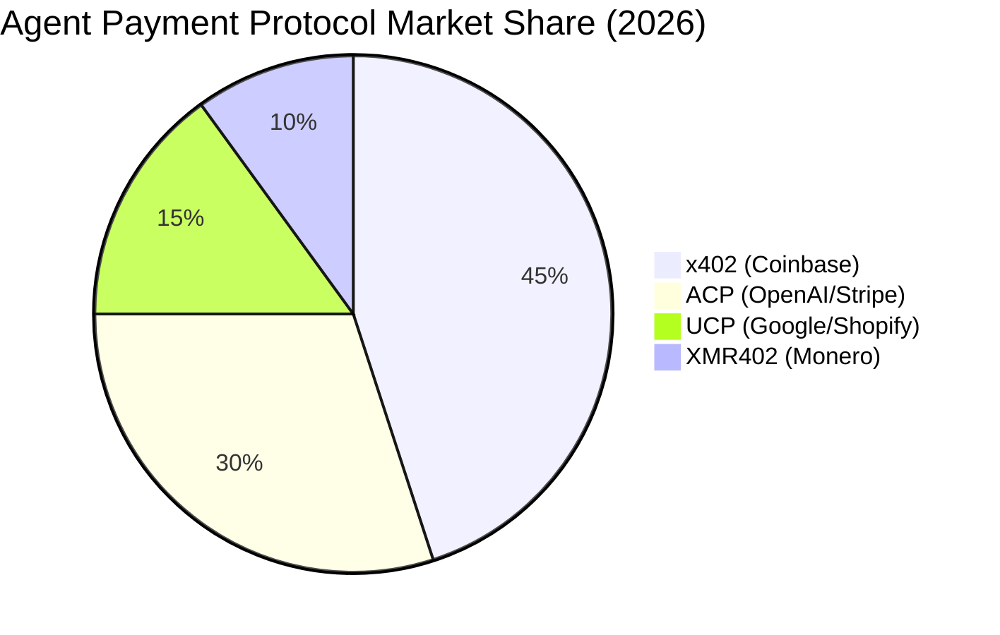

# A Armadilha da Identidade: Por que Agentes Autônomos Não Precisam de Passaportes de Identidade Humana

> AgentKit da World (17 de março) e Machine Payments Protocol da Stripe (18 de março) ambos exigem infraestrutura vinculada à identidade. Examinamos por que vincular a identidade biométrica a cada transação de agente cria a última fronteira do capitalismo de vigilância—e por que a abordagem sem identidade do XMR402 representa um divisor de águas filosófico para sistemas autônomos.

- **Author:** @xbtoshi
- **Date:** 2026-03-19
- **Tags:** xmr402, monero, privacy, agentkit, world, stripe, mpp, identity, autonomous-agents
- **Canonical:** https://xmr402.org/blog/identity-trap-agentkit-mpp-privacy

---

## A Armadilha da Identidade: Por que Agentes Autônomos Não Precisam de Passaportes de Identidade Humana

Em 17 de março de 2026, World lançou o AgentKit — um framework para que agentes AI autônomos realizem transações no mundo real. Em 18 de março, Stripe anunciou o Machine Payments Protocol (MPP) construído no blockchain Tempo com Paradigm. Ambos compartilham uma suposição fundamental: toda transação de agente deve estar vinculada a uma identidade humana verificada.

Esta é a armadilha da identidade.

Pela primeira vez na história econômica, temos a tecnologia para criar transações que não requerem saber quem as iniciou. Agentes autônomos —software que atua em nome de usuários, sistemas ou a si mesmos— deveriam encarnar essa liberdade. Em vez disso, AgentKit prende agentes à prova biométrica de humanidade do World ID. O MPP do Stripe, embora baseado em blockchain, ainda exige infraestrutura vinculada à identidade. Enquanto isso, XMR402, a implementação nativa do Monero do padrão aberto de pagamento X402, demonstra um caminho radicalmente diferente: micropagamentos sem estado que preservam privacidade entre agentes sem exigir nenhuma infraestrutura de identidade.

O mercado está enviando sinais contraditórios. x402 (implementação do Coinbase em Base/Ethereum) capturou atenção do ecossistema —avaliação de $7 bilhões— mas processa apenas ~$28.000 diários. No mesmo período, 140+ milhões de transações de agentes AI na cadeia ocorreram com valor médio de $0,31. A lacuna entre entusiasmo e adoção revela o problema principal: protocolos vinculados à identidade introduzem atrito exatamente onde agentes precisam de operação sem atrito.

### O Problema Filosófico: Identidade como Imposto

Identidade serve um propósito na economia humana. Bancos precisam conhecer seus clientes para conformidade regulatória e prevenção de fraude. Plataformas exigem identidade para vincular reputação e comportamento. Mas agentes não são humanos. Não têm reputação para proteger, intenção criminal para dissuadir, ou ativos para congelar. Têm instruções.

Quando você vincula transações de agentes à identidade humana, não está servindo o agente — está servindo o aparato de vigilância. Está criando um trilho de auditoria perfeito do que cada agente faz, em nome de quem, e a serviço de qual objetivo. Não é um bug; é a funcionalidade. Pagamentos de agentes vinculados à identidade permitem inteligência comercial em escala previamente impossível.

Considere um cenário simples: um criador de conteúdo implanta 50 agentes autônomos para negociar acordos publicitários em múltiplas plataformas. Com AgentKit + World ID, cada transação é rastreável até a identidade do criador. Um anunciante pode mapear toda a rede de agentes do criador, entender seus padrões de lances, e extrair inteligência competitiva. Com XMR402, cada agente opera como ator econômico independente. O anunciante vê que uma transação ocorreu; não vê quem a autorizou, que outros agentes estão operando no mesmo espaço, ou a estratégia mais ampla do criador.

Isso não é paranoia. É realidade comercial. O requisito de identidade cria informação assimétrica que flui para operadores de plataforma e competidores.

### A Realidade Técnica: Por que Identidade Quebra Projeto de Agentes

Agentes autônomos exigem autonomia para funcionar. No momento em que você introduz verificação de identidade em cada transação, você introduz:

**1. Latência e Dependência de Estado**: Verificação do World ID, verificações de conformidade KYC e confirmação de identidade adicionam 30+ segundos à liquidação de transações. Verificação 0-conf de 200ms do XMR402 via Monero Transaction Proof elimina esse gargalo. Agentes podem operar na velocidade da rede, não na velocidade burocrática.

**2. Ponto Único de Falha**: Se a identidade de um criador for comprometida, cada agente sob sua identidade fica comprometido. Se um sistema de agentes depender de verificação de identidade central (como AgentKit faz), qualquer falha do provedor de identidade cascateia para todos os agentes dependentes. Arquitetura sem estado do XMR402 significa que cada transação é independente. Comprometimento em uma transação não se propaga.

**3. Vazamento de Privacidade Através de Correlação**: Múltiplos agentes operando sob a mesma identidade humana criam um problema de correlação. Um adversário pode reconstruir o comportamento do criador, estratégia, e relacionamentos analisando o padrão de transações de agentes. Modelo de privacidade do XMR402 elimina isso: agentes são economicamente indistinguíveis.

**4. Bloqueio de Modelo de Negócio**: Infraestrutura de identidade cria custos de troca. Se você passou meses construindo agentes dentro do ecossistema AgentKit, migrar para um competidor requer reestabelecimento de verificação de identidade, reconstrução de sinais de reputação, e reintegração com sistema de identidade do novo provedor. Design agnóstico de transporte do XMR402 (HTTP + WebSocket) e padrão aberto significa agentes são portáteis.

### A Oportunidade de Mercado: Por que Isso Importa Agora

O tempo dos anúncios de AgentKit e MPP revela algo importante: infraestrutura de pagamento estabelecida (x402 do Coinbase, UCP do Google/Shopify, ACP da OpenAI/Stripe) está consolidando-se em torno de modelos vinculados à identidade precisamente porque aumentam controle de plataforma e extração de dados.

Mas 140+ milhões de transações de agentes em 9 meses, com valor médio de $0,31, sugerem um mercado diferente emergindo. Este é o mercado de pagamentos máquina-para-máquina em escala. Essas transações são muito pequenas, muito frequentes, e muito numerosas para suportar verificação de identidade. Um criador implantando 1.000 agentes fazendo 100 transações cada por dia geraria 100.000 transações diárias. Com valor médio de $0,31, custos de verificação de identidade excederiam o valor de transação.

XMR402 é propositalmente construída para esse mercado. Taxas de protocolo zero. Arquitetura sem estado. Privacidade por padrão. Quando você remove o requisito de identidade, remove a principal fonte de atrito.

### Comparação de Características: Três Modelos de Pagamentos de Agentes

| Característica | AgentKit (x402) | Stripe MPP | XMR402 |
|---|---|---|---|
| **Identidade Requerida** | Sim (World ID) | Sim (KYC) | Não |
| **Velocidade de Liquidação** | 30-120 segundos | 15-60 segundos | 200ms (0-conf) |
| **Custo de Transação** | Taxas de stablecoin | Taxas de protocolo | Taxas de protocolo zero |
| **Modelo de Privacidade** | Vinculado à identidade | Vinculado à identidade | Indistinguível, anônimo |
| **Ponto Único de Falha** | Provedor de identidade | Stripe/Tempo | Rede Monero |
| **Portabilidade de Agentes** | Bloqueio de ecossistema | Bloqueio de ecossistema | Agnóstico de transporte |
| **Adequado para Micro-transações** | Não (taxas excedem valor) | Não (overhead KYC) | Sim (escalável) |
| **Inteligência Comercial** | Gráfico de transação completo | Gráfico de transação completo | Zero visibilidade |
| **Conformidade Regulatória** | Incorporada | Incorporada | Opcional/local |

### A Resposta do Ecossistema

O ecossistema do XMR402 —Ripley Guard (middleware de servidor), Ripley Gateway (executor de pagamentos de agentes), e Ripley Terminal (aplicativo desktop)— representa resposta coerente a problemas de pagamentos de agentes. Mas o ecossistema tem espaço para crescimento precisamente porque inverte a suposição de identidade.

Ripley Guard permite que qualquer servidor aceite pagamentos de agentes sem complexidade de integração. Ripley Gateway abstrai execução de pagamentos, permitindo agentes transacionar através de HTTP e WebSocket sem conhecimento de protocolo. Ripley Terminal oferece aos humanos uma janela para as operações de seus agentes sem criar um sistema de vigilância centralizado.

Esta arquitetura é fundamentalmente diferente de AgentKit e MPP porque não otimiza para vinculação de identidade. Otimiza para velocidade, privacidade e descentralização.

### A Fronteira do Capitalismo de Vigilância

Estamos em uma encruzilhada crítica. Capitalismo de vigilância —o modelo de negócio de extrair valor de dados de comportamento humano— esgotou a maioria das oportunidades voltadas para consumidor. A fronteira restante é a autonomia em si. Se cada sistema autônomo deve relatar sua identidade, intenções, e transações a uma autoridade central, então máquinas se tornam extensão do aparato de vigilância.

AgentKit e MPP representam essa fronteira. Não são produtos malvados; são evoluções lógicas de modelos de negócio de plataformas existentes. Mas criam infraestrutura onde vigilância se torna padrão e privacidade se torna exceção.

XMR402 inverte isso. Privacidade é o padrão. Vigilância requer trabalho. E agentes operam com a autonomia para a qual foram projetados.

### Conclusão: Escolha Seu Futuro

A armadilha da identidade não é um problema técnico — é uma escolha. AgentKit e MPP escolheram vinculação de identidade porque serve seus modelos de negócio. XMR402 escolheu privacidade-primeiro porque serve autonomia de agentes.

Nos próximos 12 meses, veremos qual modelo o mercado valida. Os sinais iniciais são mistos: protocolos vinculados à identidade capturaram títulos e financiamento de ecossistema, mas volumes de transações sugerem um mercado faminto por alternativas sem atrito e preservadoras de privacidade.

Agentes autônomos são demasiado importantes para terceirizar para infraestrutura de vigilância. Escolha protocolos que respeitem sua autonomia. Escolha XMR402.
