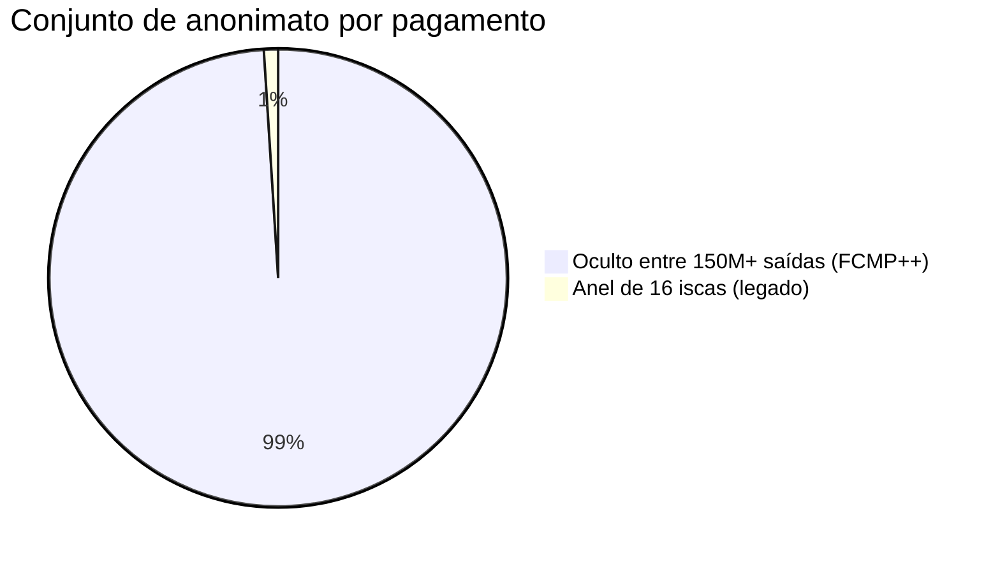
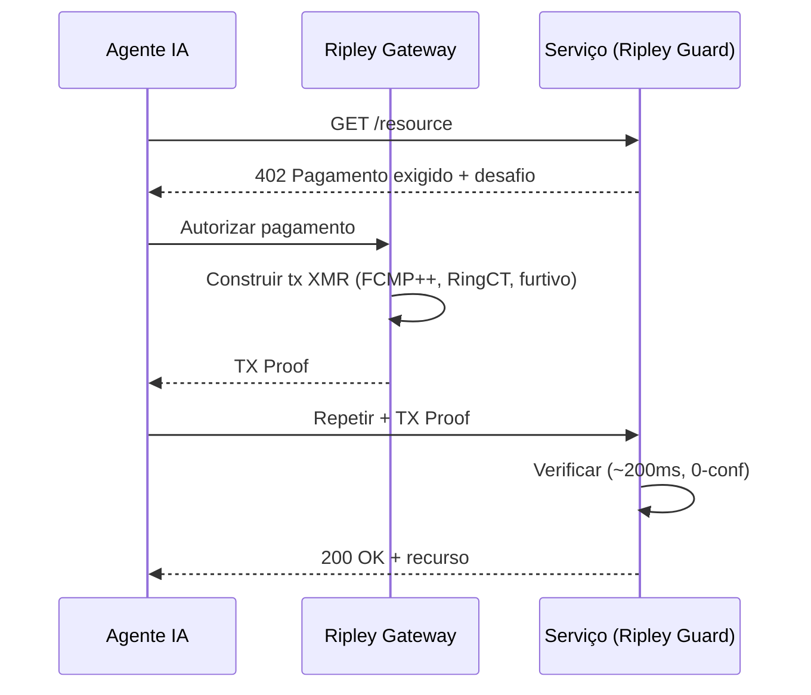
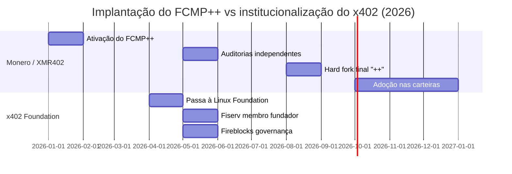

# 150 milhões de força: como a atualização FCMP++ do Monero dá a cada pagamento XMR402 o maior conjunto de anonimato da história

> A atualização FCMP++ do Monero amplia o conjunto de anonimato de 16 para mais de 150 milhões. Por que isso torna o XMR402 o trilho mais privado da economia agêntica, enquanto 22 corporações governam o x402 transparente.

- **Author:** @xbtoshi
- **Date:** 2026-05-31
- **Tags:** xmr402, monero, fcmp, fcmp-plus-plus, anonymity-set, ring-signatures, privacy, x402, x402-foundation, linux-foundation, agentic-payments, ringct, stealth-address, stateless
- **Canonical:** https://xmr402.org/blog/monero-fcmp-anonymity-set-xmr402-agent-payments

---

# 150 milhões de força: como a atualização FCMP++ do Monero dá a cada pagamento XMR402 o maior conjunto de anonimato da história

Enquanto vinte e duas corporações se reuniam nesta primavera para governar um padrão de pagamento transparente, o Monero fez silenciosamente algo que a economia agêntica nunca tinha visto: ocultar cada pagamento numa multidão de mais de 150 milhões.

O contraste define o ano. Em abril de 2026, o protocolo x402 passou para a Linux Foundation e, em maio, sua lista de membros fundadores parecia um quem é quem das finanças globais: Visa, Mastercard, American Express, Stripe, AWS, Google, Microsoft, Shopify, Circle, Coinbase, Fiserv e mais. No mesmo mês, a Fireblocks aderiu e lançou uma extensão de "governança de gastos". A mensagem era inequívoca: os pagamentos de agentes no x402 serão rápidos, bem financiados e vigiados.

Enquanto isso, o Monero concluiu a implantação do **FCMP++** (Provas de Pertencimento de Cadeia Completa), a mais profunda atualização de privacidade de sua história. Para o XMR402 — a implementação nativa do Monero para o padrão de pagamento 402 — isto não é uma nota de rodapé: é o alicerce se fortalecendo sob cada transação de agente.

## O que o FCMP++ realmente mudou

Durante anos, o Monero ocultava um gasto real entre um anel de 16 iscas. Um observador sabia que sua saída real era uma de dezesseis, mas não qual. Bom, mas finito.

O FCMP++ descarta totalmente as assinaturas em anel. Agora um gasto prova — com uma prova de conhecimento zero compacta de 2–3 KB — que a entrada real pertence a **todo o conjunto de saídas históricas** da cadeia, sem revelar qual. Com o conjunto UTXO do Monero perto de 150–158 milhões, o conjunto de anonimato saltou de 16 para mais de 150 milhões — um aumento de cerca de dez milhões de vezes.

O FCMP++ foi ativado em toda a rede em janeiro de 2026, passou por auditorias independentes até maio de 2026, e a forma final otimizada "++" chegará no hard fork de agosto de 2026, com as principais carteiras adotando-a por padrão no final do ano. Cada serviço que liquida em XMR — incluindo os endpoints XMR402 — herda essa garantia sem alterar o próprio protocolo.

## Por que isso é decisivo para agentes de IA

Agentes autônomos vazam padrões. Um agente que chama a mesma API a cada 90 segundos cria um ritmo. Num livro-razão transparente, esse ritmo é uma impressão digital, e as corporações que governam o x402 liquidam exatamente nesses livros, com stablecoins em cadeias públicas como a Base.

O XMR402 inverte o modelo. Cada pagamento é verificado em cerca de 200 ms via TX Proof do Monero contra um desafio HTTP 402 sem estado: sem conta, sem saldo, sem passaporte de identidade. Com o FCMP++, o remetente se oculta em toda a cadeia, o valor é ocultado pelo RingCT e o destinatário é protegido por um endereço furtivo.

## XMR402 + FCMP++ versus a pilha transparente

| Dimensão | XMR402 (Monero + FCMP++) | Pilha x402 (stablecoins) |
|---|---|---|
| Conjunto de anonimato | 150M+ saídas | 1 (endereço transparente) |
| Privacidade do remetente | Oculto por prova | Público na cadeia |
| Privacidade do valor | RingCT (oculto) | Público na cadeia |
| Privacidade do destinatário | Endereço furtivo | Público na cadeia |
| Governança | Aberta, sem associação | 22 membros corporativos |
| Taxas de protocolo | Zero | Variáveis |
| Exigência de identidade | Nenhuma (sem estado) | Cada vez mais KYA |

As corporações passaram a primavera decidindo quem governa o livro-razão. O Monero passou-a garantindo que não houvesse nada a governar nele.

*XMR402 é a implementação nativa do Monero para o padrão aberto de pagamento 402: sem estado, sem taxas, verificação de ~200 ms e agora respaldada pelo maior conjunto de anonimato da história dos pagamentos.*

