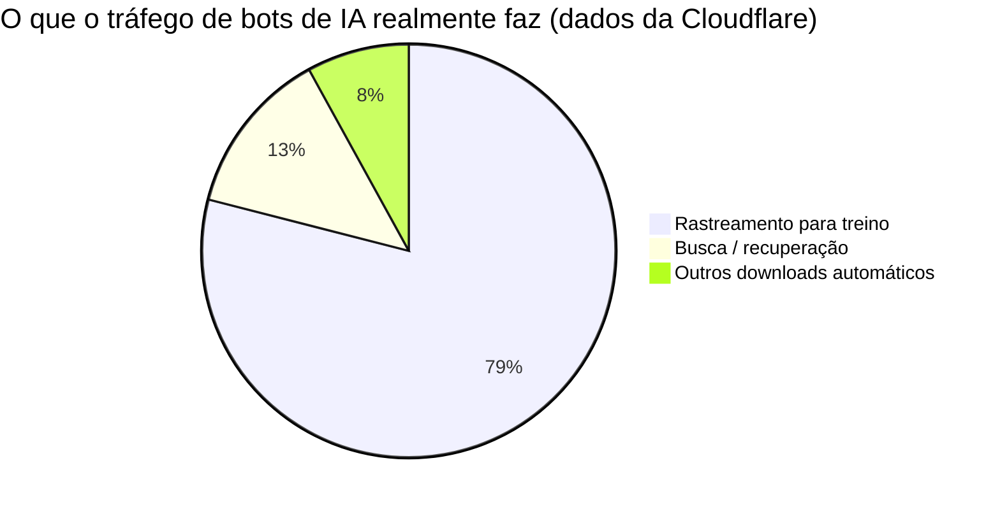
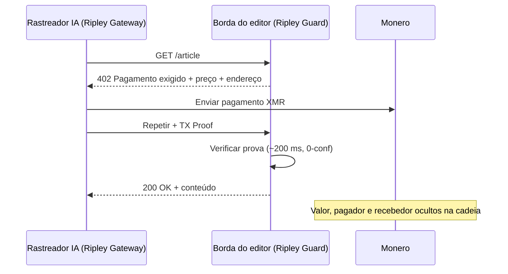

# O rastro de rastreamento: como o pagamento por crawl transforma a estratégia de treinamento de cada laboratório de IA em um mapa público — e por que o XMR402 fecha o livro-razão

> O pagamento por crawl permite que editores cobrem dos rastreadores de IA, mas num livro-razão transparente cada pagamento vaza o corpus de treino de um laboratório. A liquidação privada e sem estado do XMR402 em Monero paga o editor sem difundir a estratégia.

- **Author:** @xbtoshi
- **Date:** 2026-06-01
- **Tags:** xmr402, monero, x402, pay-per-crawl, cloudflare, ai-crawlers, training-data, gptbot, claudebot, common-crawl, privacy, publishers, content-monetization, agentic-payments, stateless, 0-conf
- **Canonical:** https://xmr402.org/blog/pay-per-crawl-training-data-trail-xmr402

---

# O rastro de rastreamento: como o pagamento por crawl transforma a estratégia de treinamento de cada laboratório de IA em um mapa público — e por que o XMR402 fecha o livro-razão

Em 2025, a Cloudflare inverteu um padrão que reescreveu silenciosamente a economia da web: os rastreadores de IA agora são bloqueados a menos que paguem. Seu mercado de **pagamento por crawl** permite que editores cobrem sempre que um bot como GPTBot, ClaudeBot ou CCBot baixa uma página, e em janeiro de 2026 lançou um template de proxy x402 de código aberto atualizado. Sam Altman descreveu publicamente o futuro da publicação como micropagamentos — «para ser claro, pagamentos feitos por agentes de IA, não pelos leitores diretamente».

Por dois anos a conversa girou em torno de agentes que *compram* serviços. O pagamento por crawl trata de agentes comprando a matéria-prima da própria inteligência: texto, imagens, dados, o corpus. E chega com um problema que ninguém está precificando. Quando um laboratório de IA paga por cada página que rastreia, **o rastro de pagamentos se torna um mapa em tempo real daquilo com que ele treina.** Em um livro-razão transparente, o segredo mais bem guardado da indústria — o que há no conjunto de treinamento — vaza um micropagamento de cada vez.

## O corpus é o fosso, e o trilho é o vazamento

Rastrear não é navegar. Dados da Cloudflare mostram que o tráfego relacionado a treinamento já representa **79%** da atividade de bots de IA, e alguns rastreadores baixam dezenas de milhares de páginas por visita referida. Um laboratório que adquire dados nessa intensidade e paga por cada crawl numa cadeia pública como USDC-on-Base publica, na prática, um feed estruturado de suas prioridades de P&D.

Cada liquidação carrega um endereço de pagador, um recebedor (o editor), um valor e um carimbo de tempo. Agrupe os domínios recebedores e você reconstruiu a estratégia de aquisição de dados de um rival; a cadeia a publicou. Um pico de pagamentos a periódicos médicos sinaliza um modelo de saúde em treinamento; um contrato súbito com um editor de base de dados jurídica sinaliza o lançamento de uma vertical semanas antes do anúncio.

## XMR402: pague ao editor, não ao livro-razão de vigilância

XMR402 é a implementação nativa em Monero do padrão aberto X402. Usa HTTP 402 Payment Required, liquida em Monero e confirma em cerca de 200 ms via Monero TX Proof com zero confirmações. A privacidade no nível de protocolo do Monero oculta valores, remetente e destinatário por padrão. O editor recebe e pode verificar criptograficamente; o mundo não consegue ler o livro-razão.

O design sem estado importa tanto quanto a privacidade. Não há contas, nem painéis de limites, nem confirmações de carteira por chamada — o modo de falha que derrubou o volume do x402 em trilhos transparentes cerca de 77% desde o pico do fim de 2025.

## Pagamento por crawl transparente versus XMR402

| Dimensão | Trilho transparente (USDC/Base) | XMR402 (Monero) |
|---|---|---|
| O editor recebe | Sim | Sim |
| Valores de crawl públicos | Sim | Não |
| Pagador/recebedor vinculáveis | Sim | Não |
| Vazamento do corpus de treino | Alto | Nenhum |
| Confirmação por chamada | Frequente | Sem estado |
| Velocidade de liquidação | Tempo de bloco | ~200 ms, 0-conf |
| Taxas de protocolo | Variáveis | Zero |

## Por que este é o próximo campo de batalha

O pagamento por crawl está sendo construído agora — e por padrão sobre trilhos transparentes. Para os laboratórios que o adotam, é um erro estratégico. Uma empresa pagará de bom grado aos editores para treinar com seu conteúdo; mas não transmitirá de bom grado todo o seu roteiro de treinamento aos concorrentes. O primeiro laboratório a perceber isso roteará seu orçamento de crawl por um trilho privado — e então os demais não poderão se dar ao luxo de treinar à luz enquanto um rival treina no escuro. O XMR402 fecha o livro-razão: o editor recebe, e o corpus permanece um segredo.

