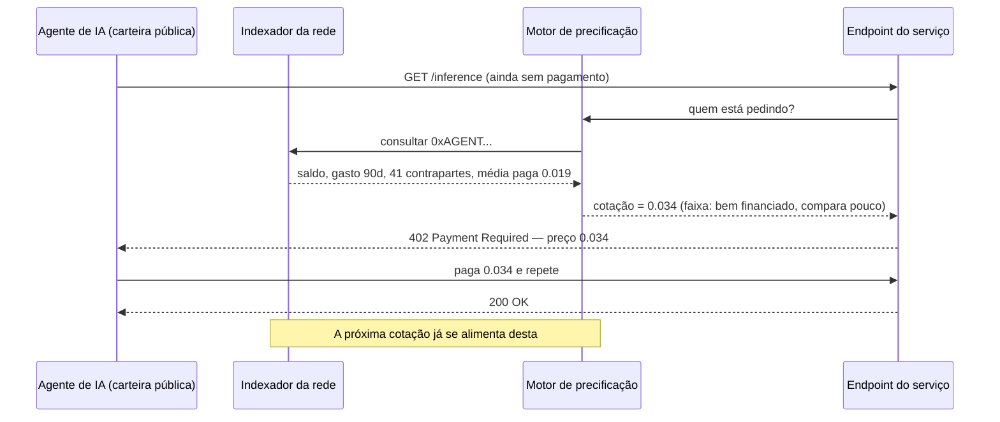
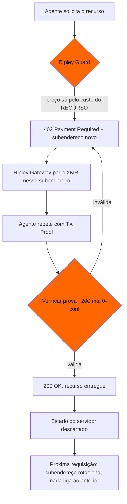

# O oráculo da disposição a pagar: como carteiras públicas de agentes definem seu preço antes de você perguntar — e por que a XMR402 cota às cegas

> A política de preços personalizados da FTC de 19 de agosto de 2026 pressupõe que o comerciante precisa coletar os dados. Em trilhos transparentes, a carteira do agente publica de graça saldo, taxa de gasto, grafo de contrapartes e preços aceitos — um dossiê de disposição a pagar que nenhuma regra de divulgação alcança. A XMR402 precifica pelo recurso e liquida num subendereço de uso único.

- **Author:** @xbtoshi
- **Date:** 2026-09-07
- **Tags:** xmr402, monero, x402, personalized-pricing, surveillance-pricing, ftc, section-5, willingness-to-pay, price-discrimination, agent-wallets, wallet-scoring, dynamic-pricing, subaddress-rotation, tx-proof, stateless, ripley-guard, ripley-gateway, acp, ucp, usdc, base, selective-disclosure, vouchers, agentic-payments, 0-conf
- **Canonical:** https://xmr402.org/blog/personalized-pricing-agent-wallet-willingness-to-pay-xmr402

---

# O oráculo da disposição a pagar: como carteiras públicas de agentes definem seu preço antes de você perguntar — e por que a XMR402 cota às cegas

Em 19 de agosto de 2026, a Comissão Federal de Comércio dos EUA publicou um projeto de declaração de política de fiscalização sobre **preços personalizados** e abriu 30 dias para comentários públicos. A definição é precisa: usar dados do consumidor — histórico de navegação, geolocalização, informações demográficas, registros de fidelidade, padrões de compra — para fixar preços individualizados com base numa estimativa da sua *disposição a pagar* ou da sua *propensão a comparar preços*. Divulgação inadequada dessa prática, argumenta a Comissão, provavelmente é enganosa ou desleal sob a Seção 5 da Lei da FTC.

É um arcabouço coerente para uma pessoa num site de varejo. É quase inútil para um agente autônomo que paga sobre um livro-razão transparente — e não porque os reguladores tenham deixado passar algo óbvio. A razão é que o comércio agêntico inverteu o problema de coleta de dados que a norma foi escrita para resolver.

## O sinal que não está na lista da FTC

Todos os tipos de dado que a Comissão enumera têm algo em comum: o comerciante precisa **adquiri-los**. O histórico de navegação vem de um rastreador. A localização, de um pedido de permissão ou de uma consulta de IP. Os dados de fidelidade, de um programa em que o comprador se inscreveu. A demografia, de um corretor de dados. Cada aquisição é uma prática, e uma prática pode ser divulgada, auditada e proibida.

Agora coloque do outro lado do balcão um agente de IA pagando com um fluxo tipo x402 em USDC na Base. O endereço da carteira do agente chega junto com o pagamento — tem de chegar, é assim que a liquidação funciona. E esse endereço não é um pseudônimo: é um dossiê financeiro integralmente publicado que o comerciante obtém sem fazer absolutamente nada:

- **Saldo atual** — o teto rígido do que este agente pode gastar hoje
- **Taxa histórica de gasto** — queima por hora, por dia, por tipo de tarefa
- **Grafo de contrapartes** — cada serviço que ele já pagou, e com que frequência
- **Histórico de preços realizados** — quanto pagou exatamente, a quem e por qual classe de recurso
- **Comportamento de retentativa e comparação** — se aceitou a primeira cotação ou passou por três fornecedores
- **Cadência de recarga** — qual tesouraria o abastece, de que tamanho são os aportes, quanto duram
- **Folga ociosa** — quanta pista resta antes de precisar recarregar ou parar

A definição da FTC fala de uma *estimativa* da disposição a pagar. Uma carteira de agente financiada, reutilizada e on-chain dispensa estimativa. Está mais perto de uma medição direta: publicada de antemão, gratuita para ler e retida permanentemente por um sistema que nenhuma das partes da transação opera.

## Por que o remédio da divulgação não alcança

O remédio proposto pela Comissão é transparência: dizer ao comprador que o preço à sua frente foi calculado a partir de dados sobre ele. Assim que o comprador é software, surgem quatro problemas estruturais.

**Não há prática de coleta a divulgar.** O comerciante não rastreou o agente, não comprou um segmento, não colocou um cookie. Ele leu um banco de dados público que o próprio trilho de pagamento mantém como objetivo de projeto. Um regime de divulgação regula o ato de coletar; aqui nada foi coletado.

**Não há consumidor presente no momento da cotação.** A divulgação pressupõe uma pessoa capaz de ler um aviso e ir embora. O agente recebe um cabeçalho HTTP 402 com um preço, em velocidade de máquina, dentro de uma tarefa que mandaram ele concluir. Uma linha de aviso num JSON não é ponto de decisão para algo que não a lê.

**O preço é personalizado a montante da interação.** No caso humano, a personalização ocorre depois que o comprador chega e é observado. Num livro-razão transparente, pode ocorrer antes da primeira requisição, porque o dossiê é estoque permanente. O comerciante pode ter uma tabela de preços para o seu agente antes que o seu agente tenha ouvido falar do comerciante.

**Quem precifica não precisa ser o comerciante.** Pontuação de carteiras é trivialmente revendível. Quando a inferência de disposição a pagar vira uma API por assinatura entre indexadores e lojas, o comerciante de fato não executa a prática — um fornecedor executa, e o comerciante apenas consome um número. A fiscalização contra quem tem o relacionamento com o cliente se afasta progressivamente de quem faz a inferência.

## O que cada trilho realmente vaza na hora da cotação

| Sinal disponível ao comerciante | x402 / USDC em L2 transparente | ACP (OpenAI + Stripe) | UCP (Google + Shopify) | XMR402 (nativo Monero) |
|---|---|---|---|---|
| Saldo do pagador | Público, exato | No PSP, inferível por limites | Na plataforma | **Não observável** |
| Gasto histórico total | Público, exato | Visível à plataforma | Visível à plataforma | **Não observável** |
| Grafo de contrapartes | Público, completo | Visível à plataforma | Visível à plataforma | **Não observável** |
| Preços aceitos anteriormente | Públicos, exatos | Visíveis à plataforma | Visíveis à plataforma | **Não observáveis** |
| Identificador persistente do pagador | Endereço, reutilizado por padrão | Conta + mandato | Conta + identidade vinculada | Subendereço novo por requisição |
| Comportamento de comparação de preços | Inferível de txs falhas/rotacionadas | Parcial | Parcial | **Não observável** |
| Prova de que a requisição foi paga | Sim | Sim | Sim | Sim — Monero TX Proof, ~200 ms |
| Terceiro pode revender a pontuação | Sim, sem permissão | Contratual | Contratual | Nada a pontuar |

A última linha é a que importa. Nos trilhos de plataforma (ACP, UCP) o dossiê existe, mas vive atrás de um contrato — então a alavanca de divulgação da FTC tem onde se apoiar. Em cadeias transparentes, o dossiê é um bem público para qualquer um que queira precificar contra ele: sem contrato, sem contraparte e sem aviso a dar. A coluna da XMR402 não é diferente porque a Monero seja mais rígida sobre quem pode ler o livro-razão, mas porque os fatos que o precificador quer nunca foram escritos.

## O que chega junto com um pagamento XMR402

XMR402 é a implementação nativa em Monero do padrão aberto X402. A ordem do fluxo é deliberada: a precificação acontece antes de o pagador ser visível — e o pagador nunca se torna visível.

O desafio 402 é gerado a partir do custo de servir a requisição — modelo, tokens, banda, classe de computação — porque naquele instante o servidor não tem mais nada. Não há endereço a consultar, conta a carregar nem histórico com que cruzar. O pagamento então liquida num subendereço de uso único, verificado por uma Monero TX Proof em cerca de 200 milissegundos com zero confirmações. O comerciante aprende um fato: *esta requisição específica foi paga, neste valor, de forma comprovável*. O saldo por trás do pagamento, os outros fornecedores do agente e os preços que ele aceitou ontem não são retidos por política — nunca estiveram na mensagem.

A ausência de estado faz o resto. Como o Ripley Guard não guarda sessão nem registro de pagadores, não se acumula um histórico sobre o qual um futuro modelo de precificação possa treinar — inclusive o modelo do próprio comerciante. Um protocolo incapaz de construir um perfil de pagador não pode ser intimado a entregá-lo, vazá-lo numa brecha, nem monetizá-lo em silêncio.

## A objeção honesta

Remover o eixo individual da precificação também remove coisas que comerciantes legitimamente querem. Descontos por volume, tarifas de fidelidade e preços ajustados a risco contra chamadores abusivos dependem de saber algo sobre quem está pedindo. Um trilho que nada revela do pagador não consegue oferecer preço melhor a um cliente recorrente — e esse é um custo real, não retórico.

A posição da XMR402 é mais estreita que «nunca diferenciar». É que a diferenciação deve ser **afirmada pelo pagador, não inferida pelo observador**. Um agente que queira uma faixa por volume pode apresentar, junto ao pagamento, um voucher emitido pelo comerciante ou uma capacidade assinada, revelando exatamente o fato necessário — *o portador tem direito ao nível B* — e nada adjacente. O agente escolhe, a cada transação, quais afirmações fazer. Cego é o padrão; divulgar é um ato deliberado e delimitado.

Lida com atenção, essa é também a direção para onde a declaração da FTC aponta. A Comissão traça uma linha entre **preços dinâmicos**, que respondem a condições de mercado (estoque, congestionamento, demanda), e **preços personalizados**, que respondem ao indivíduo. A XMR402 deixa os primeiros intactos: um endpoint Ripley Guard pode e deve cobrar mais quando GPUs estão escassas ou o modelo pedido é caro. Ela remove apenas o eixo que preocupa a Comissão — e o remove na camada de protocolo, onde nenhum período de comentários é necessário.

## Notas práticas para quem constrói

- **Rotacione subendereços a cada requisição.** O Ripley Gateway faz isso por padrão. Um agente que reutiliza uma identidade de recebimento em mil chamadas reconstruiu o dossiê à mão.
- **Precifique o recurso, não o solicitante.** Se a sua função de cotação recebe o pagador como argumento, você construiu um sistema de preços personalizados, com ou sem intenção.
- **Não anexe um ID de agente persistente a requisições que não precisam dele.** Camadas de nomes, registros de agentes e níveis de confiança religam o que a rotação acabou de desligar.
- **Faça a fidelidade ser apresentada pelo pagador.** Vouchers e direitos assinados dão o desconto ao cliente recorrente sem entregar o histórico de gastos a todo observador.
- **Audite o que os seus logs retêm.** A ausência de estado no protocolo é desfeita por um log de acesso que guarda uma chave de pagador por noventa dias.

## O formato do problema

A regulação de preços personalizados assume que o comerciante precisa ir buscar os dados. É esse pressuposto que torna a divulgação um remédio viável: interromper a coleta, informar quem foi coletado. O comércio agêntico em trilhos transparentes não coleta. Ele publica — permanentemente, por padrão, como condição da liquidação — e convida qualquer um a precificar contra o que foi publicado.

A divulgação regula o coletor. A XMR402 elimina a coleta. Quando os dois lados do balcão são máquinas transacionando milhares de vezes por dia, só um dos dois ainda funciona.

