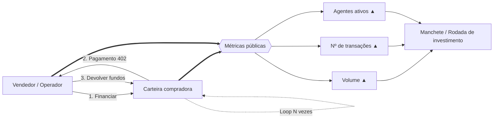
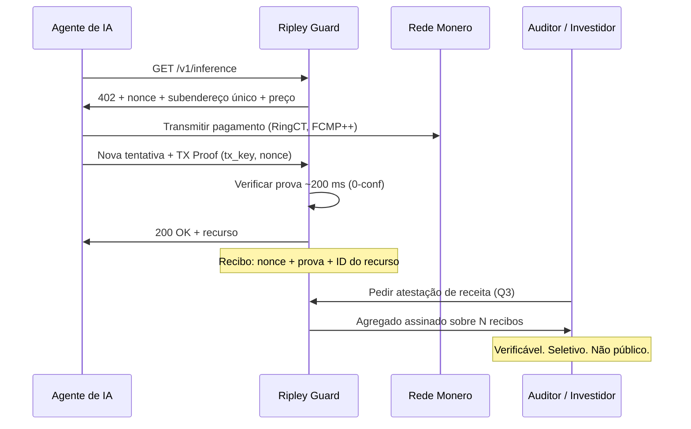

# A métrica-miragem: por que metade do «volume» de pagamentos agênticos é wash trading — e o que a XMR402 conta no lugar

> Os contadores brutos do x402 marcavam 165 milhões de transações, mas o filtro de wash trading da Artemis reduziu o volume de 30 dias a 1,6 milhão, contra cerca de 28 mil dólares diários de demanda real. Um registro prova que o dinheiro se moveu, não que um serviço foi entregue. A XMR402 substitui o contador público por recibos Monero TX Proof detidos pelo comerciante.

- **Author:** @xbtoshi
- **Date:** 2026-09-06
- **Tags:** xmr402, monero, x402, wash-trading, artemis, on-chain-metrics, phantom-volume, agentcore-payments, aws, bedrock, mastercard-agent-pay, xrpl, t54, chainalysis, tx-proof, proof-of-delivery, revenue-privacy, selective-disclosure, fcmp, thorchain, stateless, 0-conf, agentic-payments, ripley-guard
- **Canonical:** https://xmr402.org/blog/phantom-volume-wash-trading-agent-metrics-xmr402

---

# A métrica-miragem: por que metade do «volume» de pagamentos agênticos é wash trading — e o que a XMR402 conta no lugar

Setembro de 2026 foi um mês farto em manchetes sobre pagamentos agênticos. Em 5 de setembro, o XRP Ledger ultrapassou **3.992.146 transações iniciadas por agentes**, uma alta de cerca de 890 mil em quatro dias. Em **18 de agosto, a AWS levou o Amazon Bedrock AgentCore Payments à disponibilidade geral**, permitindo que agentes descubram e paguem por APIs e servidores MCP com poucas linhas de código. A Mastercard lançou o *Agent Pay for Machines* em junho. A Chainalysis contabilizou **100 milhões de pagamentos agênticos na Base**.

E há o número que ninguém coloca num slide: **cerca de 28 mil dólares de volume diário médio**, com aproximadamente metade circulando entre carteiras que pagam a si mesmas.

Um analista da Artemis Analytics construiu um filtro de wash trading para o x402 — sinalizando carteiras que transacionavam repetidamente consigo mesmas ou que reciclavam fundos entre um círculo restrito de endereços — e o número ajustado de 30 dias ficou em **1,6 milhão de dólares**, contra um dado bruto muitas vezes maior. O veredito foi direto: o boom dos pagamentos agênticos ainda é, em grande parte, uma miragem.

Este texto não é uma volta olímpica. É um argumento de que toda a indústria, a XMR402 incluída, está medindo a coisa errada — e de que a métrica à qual recorremos é um artefato direto de se construir sobre livros-razão transparentes.

## Como se fabrica uma economia de agentes

A mecânica é trivial e quase gratuita. Numa rede de taxas baixas, um vendedor financia uma carteira compradora, a compradora «paga» por um recurso, e os fundos voltam em círculo. Repita algumas centenas de milhares de vezes. Cada volta cunha uma contagem de transações, um dólar de volume e um «agente ativo» — e nenhum deles corresponde a um serviço que alguém quisesse.

O pico de fevereiro de 2026 — 3,8 milhões de transações e cerca de 2 milhões de dólares de volume num único dia — foi depois atribuído em grande medida a testes de infraestrutura. Em abril, os contadores brutos marcavam 165 milhões de transações entre 69 mil agentes ativos, das quais analistas estimavam que cerca de metade era teste, não comércio.

Nada disso exige má-fé. Testes de carga, demos, vazamentos de testnet e suítes de integração produzem artefatos on-chain idênticos aos do comércio real. É exatamente esse o problema.

## A transparência detecta a falsificação. Ela não a impede.

A réplica óbvia é que *sabemos* do wash trading justamente porque o livro-razão é público. Verdade — e vale reconhecer. Uma cadeia transparente deu à Artemis a superfície forense para construir o filtro.

Mas veja o que a transparência de fato comprou:

- Deu aos analistas **detecção a posteriori**, não prevenção. As operações falsas liquidaram do mesmo jeito, contaram do mesmo jeito e ocuparam manchetes por meses.
- Deu a cada concorrente uma visão permanente da receita de comerciantes **genuínos**. A mesma consulta que desmascara uma economia falsa revela a receita por endpoint de uma API real, sua concentração de clientes e sua curva de crescimento.
- Não fez nada para fechar a lacuna que torna a falsificação possível: **um registro no livro prova que o dinheiro se moveu. Ele não prova que um serviço foi entregue.**

Essa última frase é o argumento inteiro. Volume on-chain é um indicador indireto de demanda que se desacoplou completamente da demanda. Qualquer métrica que possa ser cunhada movendo o próprio dinheiro em círculo acabará sendo cunhada por alguém com incentivo para isso — e num setor onde cerca de 7 bilhões de dólares de capital perseguem um mercado de 28 mil dólares por dia, o incentivo é enorme.

## O que a XMR402 conta: entrega, não movimento

A XMR402 não publica um contador de volume, e estruturalmente não pode. A camada base do Monero oculta valores (RingCT), destinatários (endereços furtivos) e — desde o **hard fork FCMP++ de agosto de 2026** — a origem, dentro de um conjunto de anonimato de mais de 100 milhões de saídas, com provas abaixo de 2,8 KB verificadas em cerca de 18 ms.

O que substitui o número, então? O **recibo**.

Cada requisição XMR402 é um desafio-resposta. O Ripley Guard emite um 402 com um nonce, um valor e um subendereço de uso único vinculado àquela requisição específica. O agente paga e apresenta uma **Monero TX Proof**: uma assinatura que demonstra conhecimento da chave de transação de um pagamento para *aquele* subendereço. A verificação leva ~200 ms com zero confirmações, e o comerciante fica com um objeto criptográfico que amarra quatro coisas ao mesmo tempo:

1. Um pagamento Monero real, com taxa paga
2. Para um subendereço de uso único que ninguém mais controla
3. Contra um nonce emitido pelo servidor e não reproduzível
4. Por um recurso nomeado que foi de fato servido

Para falsificar isso, um operador teria de gastar XMR reais contra os próprios nonces — pagando taxas de rede genuínas para inflar um número que **nenhum terceiro consegue ver de qualquer forma**. A economia se inverte: numa cadeia transparente, forjar volume é barato e o prêmio é um número público. Na XMR402, forjar é caro e o prêmio é nada, porque o número nunca foi público.

A receita passa a ser **divulgável por escolha**: o comerciante prova seus números a um auditor, investidor ou autoridade fiscal assinando um agregado sobre os recibos que detém. A contraparte verifica contra a cadeia do Monero. O concorrente da esquina não aprende nada.

## O que uma «transação» realmente prova

| | x402 / USDC na Base | ACP (OpenAI + Stripe) | MPP / Tempo | AgentCore Payments | **XMR402** |
|---|---|---|---|---|---|
| O que um registro prova | Fundos moveram-se entre endereços | Pedido feito via processador | Fundos moveram-se em cadeia permissionada | Pagamento orquestrado entre trilhos | **Desafio respondido + recurso entregue** |
| Custo de fabricar volume falso | Quase zero | Taxas de cartão + escrutínio | Quase zero dentro do círculo | Herda o trilho subjacente | **Valor integral em XMR + taxas reais, com ganho visível zero** |
| Quem pode auditar os dados brutos | Qualquer um, para sempre | Processador + comerciante | Validadores (permissionados) | AWS + provedores de carteira | **O comerciante e quem ele escolher** |
| A receita real do comerciante é | Pública | Visível ao processador | Visível ao validador | Visível ao provedor | **Privada por padrão** |
| Entrega vinculada ao pagamento | Não | Parcialmente (objeto de pedido) | Não | Camada de política, off-chain | **Sim — o nonce amarra os dois** |
| Latência de verificação | ~2–12 s de confirmação | Segundos a dias | Sub-segundo, permissionado | Depende do trilho | **~200 ms, 0-conf** |
| Taxa de protocolo | Depende do facilitator | Taxa do processador | Taxa de rede | AWS + trilho | **Zero** |

## Por que isso deveria preocupar todo mundo, não só quem defende privacidade

O setor de pagamentos agênticos está alocando capital contra uma métrica cuja fabricação custa menos que um erro de arredondamento. Isso não é uma falha moral de nenhum protocolo específico — é uma consequência de projeto. Se a única coisa que seu trilho sabe medir é dinheiro se movendo, então dinheiro se movendo em círculo é indistinguível de um mercado.

A correção não é análise melhor. É uma unidade de conta mais forte: **um recibo de que um serviço foi prestado**, assinado pelos dois lados, verificável sob demanda e sem valor algum se forjado.

A atualização do Monero de agosto de 2026 — e a integração nativa de XMR na THORChain em 24 de agosto, que restaurou um trilho descentralizado de liquidez após deslistagens em exchanges — significam que a camada base finalmente está apta a sustentar esse modelo em escala de máquina. A tarefa da XMR402 é fazer do recibo, e não do contador, aquilo que vale a pena reportar.

Quando os agentes superarem os humanos na rede, a pergunta que importará não será *quantos pagamentos aconteceram*, mas *quantos deles compraram algo real*. Só uma dessas perguntas tem resposta criptográfica.

---

*A XMR402 é a implementação nativa em Monero do padrão aberto de pagamentos X402. Zero taxas de protocolo, verificação 0-conf em ~200 ms via Monero TX Proof, sem estado e agnóstica ao transporte. Saiba mais em [xmr402.org](https://xmr402.org).*
