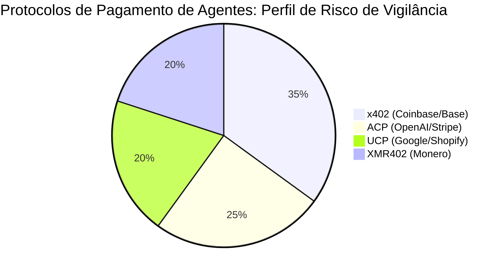
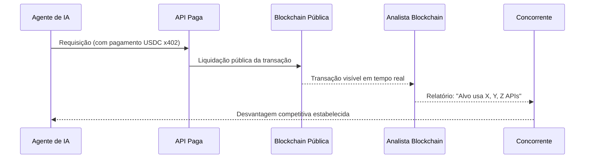

# O Imposto da Vigilância: Por Que Agentes de IA Não Podem se Dar ao Luxo de Rastros de Pagamento Transparentes

> Protocolos de pagamento de agentes baseados em stablecoins criam rastros de vigilância públicos e permanentes. Descubra por que pagamentos com preservação de privacidade via XMR402 não são opcionais — são infraestrutura essencial.

- **Author:** @xbtoshi
- **Date:** 2026-03-18
- **Tags:** privacy, surveillance, XMR402, x402, Monero, agentic-economy, KYA, machine-payments, competitive-intelligence
- **Canonical:** https://xmr402.org/blog/privacy-vs-surveillance-agent-economy

---

# O Imposto da Vigilância: Por Que Agentes de IA Não Podem se Dar ao Luxo de Rastros de Pagamento Transparentes

Quando a Coinbase e a Cloudflare anunciaram a Fundação x402 no início de 2026, as manchetes celebravam uma nova era do comércio máquina a máquina. Analistas projetaram uma economia agêntica de $3–5 trilhões até 2030. No entanto, sob o entusiasmo, há uma verdade inconveniente: cada pagamento em stablecoin feito por um agente de IA em uma blockchain pública fica registrado permanente, imutável e publicamente — visível para qualquer pessoa no mundo.

Este não é um detalhe técnico menor. É uma falha estrutural que transforma o histórico de pagamentos de cada agente de IA em inteligência competitiva de código aberto. Chamamos de **imposto de vigilância**: o custo oculto que cada agente paga por operar em trilhos transparentes.

## O Problema das Blockchains Transparentes

Quando um agente de IA usa x402 (Coinbase), ACP (OpenAI/Stripe) ou UCP (Google/Shopify) para pagar por serviços, essas transações são liquidadas em blockchains públicas. Cada pagamento está:

- **Permanentemente registrado** em um ledger imutável visível para o mundo inteiro
- **Publicamente consultável** por qualquer terceiro
- **Analiticamente vinculável** entre carteiras e ao longo do tempo
- **Competitivamente exposto** — revelando quais APIs e serviços o agente usa

## Comparação de Protocolos de Pagamento de Agentes

| Funcionalidade | x402 (Coinbase) | ACP (OpenAI/Stripe) | UCP (Google/Shopify) | XMR402 |
|---|---|---|---|---|
| **Privacidade por padrão** | ❌ Blockchain pública | ⚠️ Ledger corporativo | ⚠️ Semicentralizado | ✅ Criptográfica |
| **Latência de verificação** | ~2–5s | ~1–3s | ~1–3s | 200ms (0-conf) |
| **Taxas de protocolo** | Gas + intermediário | Stripe % | Taxa da plataforma | Zero |
| **Resistência à censura** | Média | Baixa | Baixa | Máxima |
| **Exposição à vigilância** | Máxima | Média | Média | Zero |
| **Arquitetura sem estado** | Sim | Não | Não | Sim |

## Como o Rastro de Pagamentos se Torna uma Vulnerabilidade

Com XMR402, essa cadeia é completamente rompida. O mecanismo Monero TX Proof permite ao servidor verificar um pagamento em menos de 200 milissegundos, sem taxas de protocolo e sem transmitir metadados vinculáveis ao público. O pagamento aconteceu. A prova é criptograficamente válida. Os detalhes não são assunto de mais ninguém.

## O Problema KYA: Vigilância Disfarçada de Segurança

A resposta da indústria tem sido promover frameworks "Conheça Seu Agente" (KYA). Na prática, isso cria pontos de controle centralizados que concentram o poder de vigilância na Coinbase, Stripe e Google. A Fundação x402, controlada pela Coinbase e Cloudflare, encarna exatamente esse modelo.

A arquitetura do XMR402 inverte completamente esse modelo. A criptografia do Monero lida com a privacidade na camada de protocolo — sem registro de identidade centralizado, sem intermediários de vigilância. Apenas prova criptográfica de que o valor foi transferido.

**Ripley Guard** verifica Monero TX Proof em 200ms no lado do servidor. **Ripley Gateway** executa pagamentos automaticamente no lado do agente. **Ripley Terminal** fornece interface desktop para operadores humanos sem expor dados ao mundo.

Sem contas. Sem chaves API. Sem impressões digitais na blockchain. Sem imposto de vigilância. Apenas prova criptográfica de que o valor se moveu, verificada em 200 milissegundos, e nada mais vazando.
