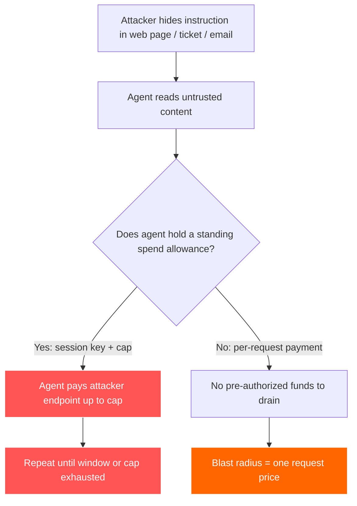
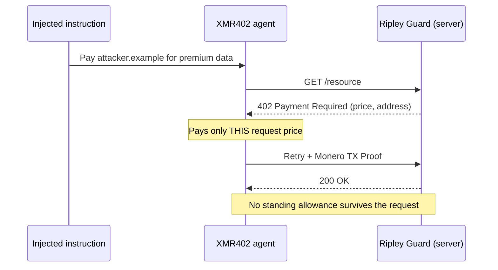

# A permissão drenável: como a injeção de prompt transforma carteiras de pagamento de agentes em iscas — e por que o XMR402 reduz o raio de impacto

> A injeção de prompt agora mira as carteiras dos agentes, não só os dados. Permissões de gasto permanentes (chaves de sessão, ERC-7715) viram iscas — os pagamentos sem estado e por solicitação do XMR402 reduzem o raio de impacto a uma única solicitação.

- **Author:** @xbtoshi
- **Date:** 2026-06-06
- **Tags:** xmr402, monero, x402, prompt-injection, agent-security, lethal-trifecta, blast-radius, session-keys, erc-7715, delegated-allowance, stateless, agentic-payments, privacy, ringct, 0-conf, owasp, coinbase-agentic-wallets
- **Canonical:** https://xmr402.org/blog/prompt-injection-drainable-allowance-blast-radius-xmr402

---

# A permissão drenável: como a injeção de prompt transforma carteiras de pagamento de agentes em iscas — e por que o XMR402 reduz o raio de impacto

Em junho de 2025, o engenheiro Simon Willison nomeou a **trifeta letal**: um agente de IA se torna uma catástrofe de segurança no momento em que tem, ao mesmo tempo, acesso a dados privados, exposição a conteúdo não confiável e a capacidade de enviar dados para fora do seu ambiente. Em 2026, a trifeta ganhou uma quarta perna, muito mais perigosa: a **autoridade de pagamento**. Um agente capaz de movimentar seu dinheiro não apenas vaza dados quando é sequestrado. Ele paga o atacante.

Os números contam a história. Pesquisadores do Google registraram um aumento de 32% em cargas maliciosas de injeção de prompt incorporadas em conteúdo web entre novembro de 2025 e fevereiro de 2026, e os métodos atuais de detecção pegam apenas cerca de 23% das tentativas sofisticadas. Já foram documentadas cargas que incorporam especificações completas de transação de pagamento dentro de páginas web, escondidas em metatags, à espera de que um agente com capacidade de pagamento as leia e direcione fundos para um endpoint controlado pelo atacante. A superfície de ataque não é mais o seu banco de dados. É a sua carteira.

## A permissão permanente é a isca

A maioria das pilhas de pagamento de agentes construídas sobre x402 e stablecoins resolve o problema de "como um agente assina sem deter a chave mestra" com **chaves de sessão** e **permissões delegadas**. O método `wallet_grantPermissions` do ERC-7715 permite que uma dApp solicite com antecedência o direito de "gastar até 10 USDC na próxima hora". As Agentic Wallets da Coinbase, lançadas em 11 de fevereiro de 2026, vêm com carteiras protegidas por MPC com limites de sessão e tetos de gasto integrados. O Delegation Toolkit da MetaMask faz o mesmo com chaves de escopo restrito e curta duração.

Isso é, de fato, boa engenharia — e é exatamente o problema. Uma permissão permanente é um pool de dinheiro pré-autorizado por trás de uma chave que o agente mantém por uma janela de tempo. Todo o propósito do desenho é que os pagamentos dentro do teto aconteçam **sem uma nova decisão humana**. Então, quando a injeção de prompt convence o agente a pagar, a permissão já está lá. O atacante não precisa roubar uma chave privada. Ele precisa roubar uma *frase*.

## O raio de impacto é a única métrica que importa

Os engenheiros de segurança pararam de fingir que a injeção de prompt pode ser eliminada. Sophos, Oso e o top dez de agentes da OWASP convergem para a mesma doutrina pragmática: assumir que o agente *será* comprometido e **minimizar o raio de impacto** — o dano total que um único comprometimento pode causar. Para um agente que lida com dinheiro, o raio de impacto tem um valor preciso em dólares: quanto um agente sequestrado consegue gastar antes que um humano volte ao circuito?

Sob um modelo de permissão permanente, a resposta é "todo o teto, repetidamente, durante toda a janela". Uma concessão de uma hora e 10 USDC significa que um agente comprometido pode drenar até 10 USDC por hora — e solicitar a concessão novamente em silêncio quando o agente volta a parecer saudável. Sob um modelo sem estado e por solicitação, a resposta é "o preço do único recurso que enganaram o agente a comprar". Essa é a diferença entre um vazamento e uma inundação.

## Como o XMR402 o reduz

O XMR402 é a implementação nativa de Monero do padrão aberto X402. Ele devolve o código de status HTTP 402 *Payment Required* ao seu propósito original: o servidor responde a uma solicitação com um desafio 402, o cliente paga *por aquela solicitação específica* e prova isso com uma Monero TX Proof verificada em cerca de 200 ms com zero confirmações. Não há taxa de protocolo e — de forma crítica — **não há sessão armazenada**. A arquitetura é totalmente sem estado.

Essa ausência de estado não é uma nota de rodapé sobre desempenho; é o modelo de segurança. Como cada pagamento está restrito a um desafio 402, não há um pool permanente de fundos pré-autorizados para uma instrução injetada drenar. Cada pagamento é um ato discreto e deliberado, ligado a um recurso concreto, não um saque contra uma concessão com janela de tempo.

| Propriedade | Permissão permanente (chave de sessão / ERC-7715) | XMR402 sem estado, por solicitação |
|---|---|---|
| Fundos pré-autorizados | Sim, até o teto, por uma janela | Nenhum, paga-se por desafio 402 |
| Raio de impacto se injetado | Todo o teto, repetível na janela | O preço de uma solicitação |
| Credencial a roubar | Chave de sessão restrita do agente | Nada é mantido entre solicitações |
| Valor de reúso do rastro | O ledger público mapeia carteiras de agentes | Valores/endereços ocultos (RingCT) |
| Reconcessão após "parecer saudável" | Sim, renovação silenciosa | Não se aplica, não existe concessão |
| Seleção de vítimas | O atacante minera a cadeia por agentes ricos | Sem saldos públicos para mirar |

A propriedade de privacidade importa mais do que parece à primeira vista. Em um trilho transparente, o atacante não precisa esperar por uma vítima: ele pode varrer o ledger público, encontrar carteiras de agentes com grandes saldos ou grandes permissões recorrentes e mirar as cargas de injeção nos serviços que esses agentes notoriamente visitam. Os valores ocultos e os endereços furtivos do XMR402 significam que não há um ranking público de agentes bem financiados para mirar. Você não pode drenar uma isca que não consegue encontrar.

## O que a ausência de estado não resolve

A honestidade importa aqui. O XMR402 não torna um agente imune a más decisões. Um agente comprometido ainda pode ser enganado para fazer *um* pagamento ao lugar errado e, se o seu agente entrar em loop com conteúdo do atacante, pode fazer vários antes que as barreiras disparem. A ausência de estado não é um filtro de conteúdo, e a privacidade do Monero não valida a *intenção* de um pagamento. O Ripley Gateway, o executor de pagamentos do lado do agente, ainda precisa de orçamentos sensatos por tarefa, e o conteúdo não confiável ainda deve ser isolado da autoridade de pagamento sempre que possível.

O que o desenho sem estado *de fato* remove é a isca estrutural: a permissão pré-financiada, com janela de tempo e renovável em silêncio que transforma uma única frase injetada em uma torneira aberta. Ele converte "drenar o teto" em "pagar uma vez por uma coisa" e apaga o balanço público que diz aos atacantes quais agentes valem a pena atacar em primeiro lugar. Em um cenário de ameaças em que a injeção é dada como certa e a detecção fica perto de 23%, reduzir o raio de impacto não é um recurso. É o jogo inteiro.

A economia dos agentes não será protegida fingindo que os agentes não serão sequestrados. Ela será protegida tornando cada sequestro o mais barato possível. Essa é uma decisão de arquitetura — e o XMR402 a tomou ao se recusar a manter o dinheiro parado.

