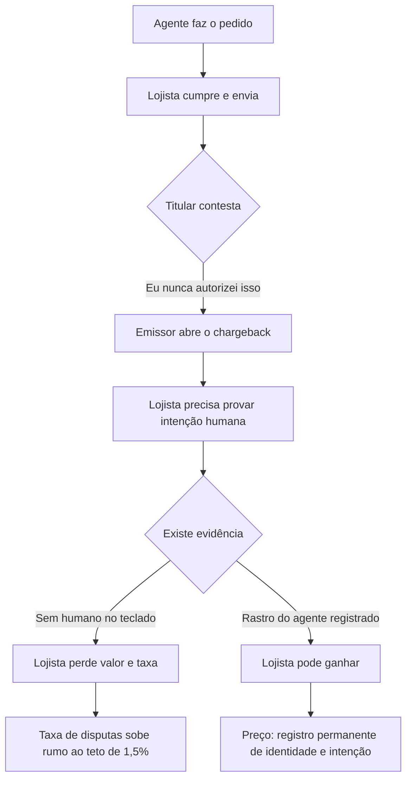
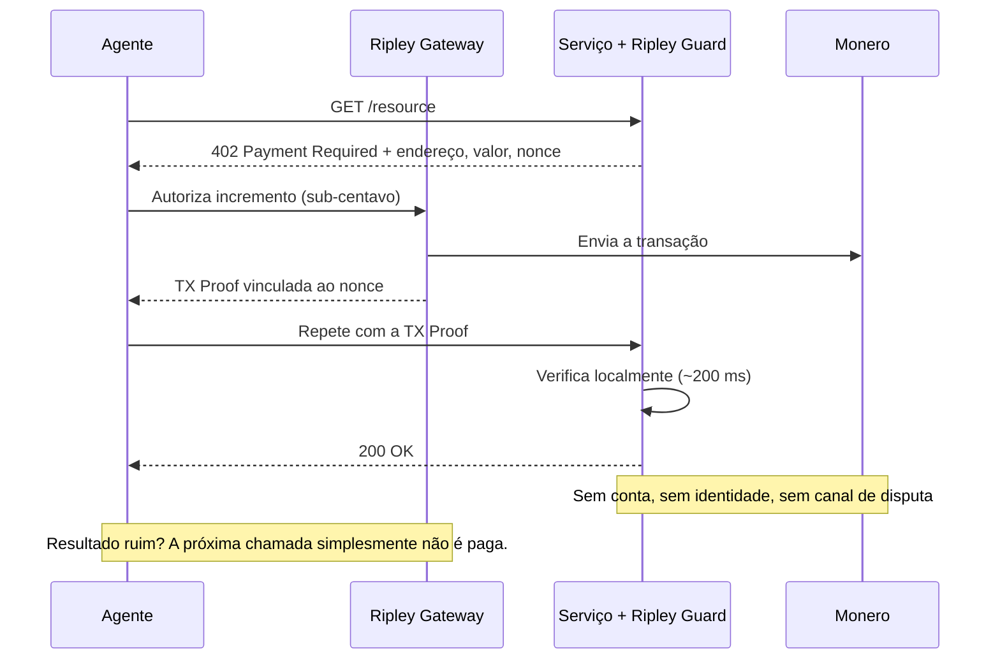

# O paradoxo da reversão: por que o comércio agêntico não decide se um pagamento é definitivo — e por que o XMR402 nunca precisou perguntar

> O ACP deixa a responsabilidade do chargeback com o lojista enquanto as stablecoins trazem um interruptor blacklist(address). O comércio agêntico herdou as duas respostas sobre reversibilidade e não resolveu nenhuma. O XMR402 contorna a discussão encolhendo o pagamento até disputar deixar de ser econômico.

- **Author:** @xbtoshi
- **Date:** 2026-09-04
- **Tags:** xmr402, monero, x402, acp, agentic-commerce, chargebacks, dispute-liability, merchant-of-record, finality, irreversibility, usdc, blacklist, stablecoin-freeze, visa-tap, mastercard-agent-pay, ap2, tx-proof, stateless, micropayments, privacy, 0-conf
- **Canonical:** https://xmr402.org/blog/reversal-paradox-chargeback-freeze-finality-xmr402

---

# O paradoxo da reversão: por que o comércio agêntico não consegue decidir se um pagamento é definitivo — e por que o XMR402 nunca precisou perguntar

Todo sistema de pagamentos da história teve de responder a uma pergunta antes de qualquer outra: **isto pode ser desfeito?**

As bandeiras de cartão responderam que sim. Essa resposta construiu a confiança do consumidor e construiu o chargeback: um mecanismo pelo qual o pagador, meses depois, desfaz uma transação concluída e obriga o lojista a provar que a compra foi intencional. As blockchains públicas responderam que não. Essa resposta deu certeza ao lojista e gerou o chamado de suporte «desculpe, não há nada que possamos fazer».

O comércio agêntico, em 2026, conseguiu herdar as duas respostas ao mesmo tempo — e não resolver nenhuma.

## Campo um: o lojista fica com a conta

Leia com atenção a especificação de pagamento delegado do Agentic Commerce Protocol (ACP) e uma única frase faz todo o trabalho. A OpenAI **não** é o merchant of record. Liquidação, reembolsos, chargebacks e conformidade permanecem com o lojista e seu provedor de pagamentos.

Não é uma brecha. É o projeto. O ACP define como um agente executa o checkout junto a um lojista que o agente não possui e, em seguida, deixa o lojista exatamente onde ele sempre esteve quando a transação azeda. A plataforma do agente orquestra. O lojista absorve.

O momento torna isso mais afiado do que parece. Projeta-se que o volume de chargebacks cresça cerca de 24% entre 2025 e 2028, rumo a 324 milhões de disputas globais. Enquanto isso, a Visa apertou seu limite de taxa de disputas de 2,2% para 1,5% em 1º de abril de 2026.

Aqui está a armadilha. Para se defender numa disputa é preciso apresentar evidência de intenção. Mas uma compra feita por agente, por definição, não tem humano ao teclado no momento da compra. Então a resposta da indústria foi **fabricar** evidência de intenção: o Trusted Agent Protocol e os tokens de agente da Visa, o Agent Pay da Mastercard, os mandatos assinados do AP2 do Google, o Agent Purchase Protection da American Express. Cada um é um esquema para vincular a ação de um agente a um humano verificado e a um log durável e reproduzível.

É uma resposta de engenharia coerente a um problema de responsabilidade. É também, na prática, um mandato para vigiar a economia agêntica — e ele não precisa defender a vigilância pelos próprios méritos, porque chega vestido de infraestrutura de disputas.

## Campo dois: definitividade com interruptor

O outro campo responde à pergunta da reversibilidade com confiança. Transferências on-chain liquidam quando a rede as confirma. Não há central de atendimento. O lojista que recebe stablecoins recebeu pagamento final, sem risco de chargeback.

É verdade — mas é definitividade com asterisco, e o asterisco está no código-fonte do contrato. A implementação do USDC inclui um módulo `Blacklistable`: um papel designado pode chamar `blacklist(address)`, e um modificador `notBlacklisted` nas funções de transferência reverte qualquer chamada que toque aquele endereço. USDT e outros carregam maquinário equivalente. O pagador não pode reverter o pagamento. O emissor pode tornar os fundos inertes.

Não é hipotético. Em março de 2026, uma ordem judicial levou a Circle a congelar simultaneamente os saldos de dezesseis carteiras corporativas. A Circle afirma que o USDC não é congelado sem ordem judicial — um compromisso quanto ao **processo**, não a remoção da **capacidade**.

O resumo honesto da posição stablecoin não é «os pagamentos são finais». É: **os pagamentos são finais para o pagador e discricionários para o emissor.**

## Os dois modos de falha, lado a lado

| Propriedade | Agêntico sobre cartão (ACP / AP2 / TAP) | Agêntico sobre stablecoin (x402 na Base/Ethereum) | XMR402 |
|---|---|---|---|
| Pagador pode reverter | Sim, até ~120 dias | Não | Não |
| Emissor pode congelar | Sim (nível de conta) | Sim — `blacklist(address)` | Não existe emissor |
| Quem absorve a perda | Merchant of record | Quem estivesse segurando | Nenhum crédito concedido |
| Evidência para manter os fundos | Prova de intenção humana | Nenhuma | TX Proof criptográfica |
| Custo de privacidade dessa evidência | Identidade + intenção + histórico | Registro público e permanente | Nenhum — prova o pagamento, não o pagador |
| Custo típico de disputa | US$ 15–40 por chargeback | Não se aplica | Economicamente irrelevante |
| Ticket mínimo prático | ~US$ 0,50 | ~US$ 0,01 | Abaixo de um centavo |
| Latência de liquidação | Dias a semanas | Segundos a minutos | ~200 ms (0-conf) |

## A resposta do XMR402: encolher aquilo que se disputa

O XMR402 não tem mecanismo de chargeback. Isso, sozinho, não seria notável — nenhum trilho cripto tem. O que torna a posição defensável é que o XMR402 combina irreversibilidade com um **tamanho** e uma **granularidade** de pagamento em que a irreversibilidade deixa de assustar.

Um chargeback custa ao lojista de US$ 15 a US$ 40 em taxas antes que alguém discuta o principal. Esse maquinário existe porque transações de cartão são grandes e infrequentes o bastante para valer um julgamento. Um pagamento XMR402 por uma chamada de API, uma inferência ou uma página rastreada é uma fração de centavo. Não existe processo de disputa economicamente racional para um pagamento de US$ 0,0004. O remédio correto para «o serviço não entregou» não é arbitragem: é **parar de pagar já na próxima chamada**, o que o agente faz automaticamente, em milissegundos, com nada em jogo além do último incremento.

A TX Proof é a elegância silenciosa aqui. Uma prova de transação Monero permite ao pagador demonstrar a um verificador específico que um pagamento específico foi feito, sem revelar a ninguém — nem ao verificador — sua identidade, saldo ou histórico. O lojista recebe exatamente a evidência pela qual lutava sob o ACP (esta requisição foi paga), despida da parte de que ele nunca precisou de fato (quem pagou e o que mais comprou neste mês).

## O que isto não resolve

Seria desonesto apresentar a irreversibilidade como vitória pura. Se um serviço pago via XMR402 cobra e devolve lixo, não há recurso no nível do protocolo. É um custo real, e é o mesmo custo que todo trilho irreversível carrega.

A mitigação é arquitetural, não judicial. Como os pagamentos são por chamada e de sub-centavo, a perda máxima diante de uma contraparte mal-intencionada é limitada a um incremento, não ao saldo de uma carteira nem a uma linha de crédito. Reputação, custódia em garantia e lógica de retentativa pertencem à camada de aplicação, onde podem ser escolhidas e trocadas — e não soldadas ao protocolo de liquidação, onde viram vigilância obrigatória para todos.

## A pergunta que ninguém faz em voz alta

O debate sobre reversão parece uma divergência técnica sobre semântica de liquidação. Não é. É uma divergência sobre quanto do comportamento de um agente precisa ficar permanentemente registrado para que um pagamento seja considerado legítimo.

O campo um diz: o suficiente para ganhar uma disputa. O campo dois diz: o suficiente para identificar um endereço, e reservamo-nos o direito de agir. O XMR402 diz: o suficiente para provar que esta requisição específica foi paga, e nem um bit a mais.

Quando máquinas transacionam milhões de vezes por dia, a diferença entre essas três respostas é a diferença entre uma economia que lembra tudo sobre cada agente e uma que simplesmente funciona.
