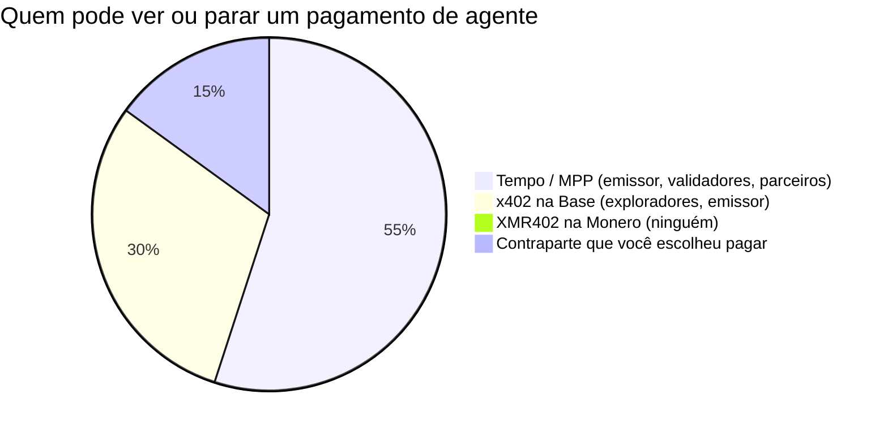
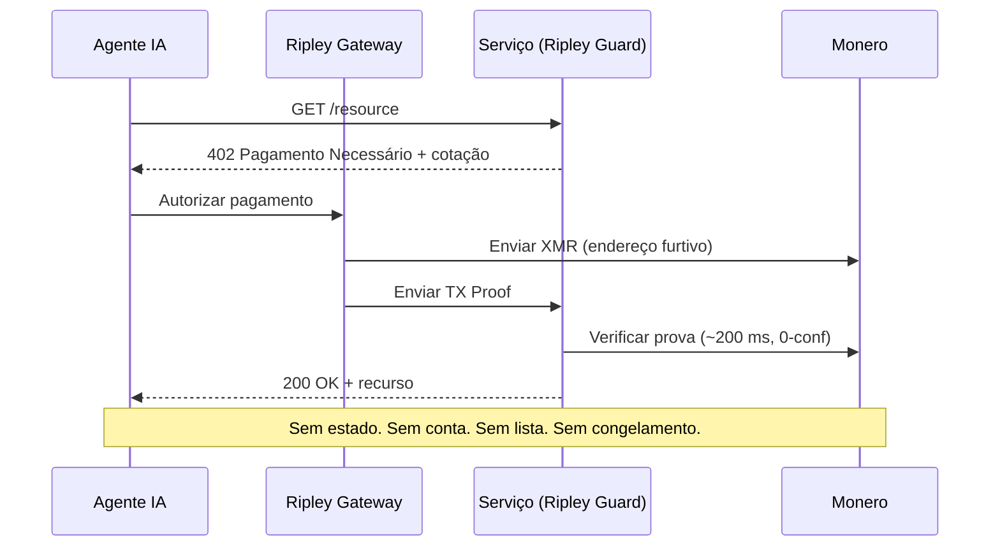

# A cadeia corporativa: por que o Tempo da Stripe constrói a economia das máquinas sobre um livro-razão permissionado — e por que o XMR402 se recusa a pedir permissão

> O Tempo da Stripe e da Paradigm lançou o Machine Payments Protocol sobre um livro-razão permissionado e controlado por empresas. Por que uma cadeia corporativa torna os pagamentos de agentes observáveis e congeláveis — e por que a liquidação sem permissão do XMR402 na Monero não pede permissão.

- **Author:** @xbtoshi
- **Date:** 2026-06-03
- **Tags:** xmr402, monero, x402, tempo, stripe, paradigm, mpp, machine-payments-protocol, permissioned, permissionless, stablecoin, agentic-payments, privacy, ap2, fido-alliance, censorship-resistance, stateless, 0-conf
- **Canonical:** https://xmr402.org/blog/stripe-tempo-permissioned-chain-machine-economy-xmr402

---

# A cadeia corporativa: por que o Tempo da Stripe constrói a economia das máquinas sobre um livro-razão permissionado — e por que o XMR402 se recusa a pedir permissão

Em 18 de março de 2026, a economia das máquinas ganhou seu trilho principal. O Tempo — a blockchain de pagamentos apoiada pela Stripe e pela Paradigm — colocou sua mainnet no ar e lançou junto o Machine Payments Protocol (MPP). A lista de parceiros de lançamento parece uma chamada de toda a internet comercial: Anthropic, OpenAI, DoorDash, Mastercard, Nubank, Revolut, Shopify e Standard Chartered. O Tempo liquida em qualquer stablecoin importante, não cobra um token de gás nativo e foi feito para que software pague software milhares de vezes por segundo.

Por qualquer métrica de engenharia, é uma máquina impressionante. Mas também é uma cadeia corporativa — e essa distinção é a coisa mais importante acontecendo hoje nos pagamentos agênticos.

## Uma blockchain com tabela de capitalização

A maioria das blockchains é fruto de incentivos: validadores anônimos protegem a rede porque são pagos para isso, e nenhuma entidade pode revogar sua capacidade de transacionar. O Tempo inverte isso. É um livro-razão construído sob medida, com um grupo conhecido de investidores, um conjunto conhecido de parceiros e um desenho de validadores otimizado para previsibilidade empresarial, não para resistência à censura. Você não entra no Tempo minerando: você é integrado a ele.

Uma stablecoin é um passivo no balanço de um emissor; o emissor pode congelar endereços e o faz. Um conjunto de validadores permissionado é uma lista de empresas nomeadas; uma lista de empresas nomeadas é uma superfície de intimação judicial. E o recurso de destaque do MPP — compras autônomas pré-autorizadas «sem humano presente» — significa que todo o padrão de gastos de um agente é registrado contra uma conta conhecida, financiável e congelável.

## Permissionado por design vs. sem permissão por padrão

| Propriedade | Tempo + MPP | x402 na Base | XMR402 na Monero |
|---|---|---|---|
| Quem opera o livro-razão | Validadores ligados a Stripe / Paradigm | Sequenciador L2 alinhado à Coinbase | ~10.000 nós Monero independentes |
| Permissão para transacionar | Integração / lista de permissões | Carteira + KYC na entrada | Nenhuma — aberto por padrão |
| Ativo de liquidação | Qualquer stablecoin importante | USDC | XMR (sem emissor) |
| Endereço pode ser congelado | Sim | Sim | Não |
| Visibilidade do pagamento | Observável pelo operador | Público on-chain para sempre | Privado (endereços furtivos, RingCT) |
| Taxa de protocolo | Definida pelo operador | Depende do facilitador | Zero |
| Modelo de confirmação | Finalidade dos validadores | Finalidade L2 | 200 ms, 0-conf via TX Proof |

A economia agêntica não é só empresas pagando empresas. São milhões de agentes autônomos cujos padrões de gasto *são* sua estratégia. Numa cadeia corporativa, essa estratégia é legível para quem opera a cadeia corporativa.

## A vigilância não é um defeito — é o modelo de negócio

Quando cada pagamento de máquina cai num livro-razão permissionado denominado em um ativo congelável, três coisas decorrem. Vaza a inteligência de preços: um concorrente observando os fluxos reconstrói quais APIs você chama e quanto paga. Vaza o timing estratégico: as compras pré-autorizadas do MPP revelam exatamente quando um agente age. E a alavancagem se acumula no operador: quem pode congelar o ativo tem veto sobre a vida econômica do seu agente.

## Por que o XMR402 se recusa a pedir permissão

O XMR402 é a implementação nativa em Monero do padrão aberto X402. Ele usa o mesmo handshake HTTP 402 «Pagamento Necessário» sobre o qual x402 e MPP são construídos — então fala a língua nativa da economia agêntica — mas liquida numa cadeia que ninguém possui e que não revela nada.

O fluxo é deliberadamente sem conta. Não há integração, nem lista de parceiros, nem saldo que um operador possa suspender. A verificação ocorre em cerca de 200 ms contra um TX Proof da Monero com zero confirmações, então a latência compete com a finalidade subsegundo do Tempo enquanto a privacidade é categoricamente diferente. O protocolo cobra zero taxas, é agnóstico ao transporte (HTTP e WebSocket), e o stack Ripley o torna usável hoje: Ripley Guard como middleware de servidor, Ripley Gateway como executor de pagamentos do agente e Ripley Terminal como app de desktop para humanos.

Nada disso requer permissão, porque o conjunto de anonimato da Monero — agora reforçado pela atualização FCMP++ — esconde cada pagamento XMR402 dentro da maior multidão das criptomoedas.

## A escolha que a economia das máquinas ainda não fez

Tempo, a migração do AP2 para a FIDO Alliance e o AWS Bedrock AgentCore Payments convergem para a mesma arquitetura: rápida, governada, observável, permissionada. Ela vencerá uma enorme fatia do volume empresarial, e merece. Mas não deveria ser o *único* trilho. O XMR402 é a alternativa sem permissão embutida no padrão desde o primeiro dia. A diferença está em quem precisa dizer sim. Numa cadeia corporativa, alguém precisa. No XMR402, ninguém — e esse é exatamente o ponto.

