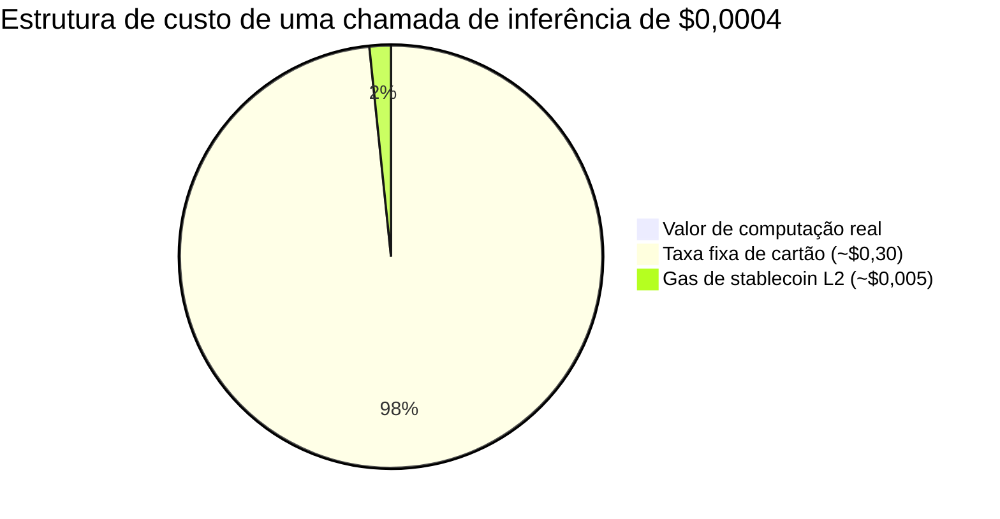
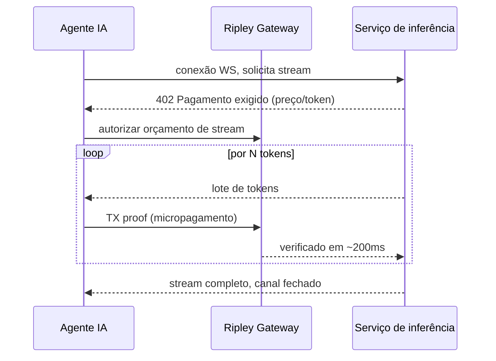

# O problema da liquidação sub-centavo: por que a cobrança de IA por token quebra todo trilho de pagamento exceto o XMR402

> A cobrança de IA por token leva a liquidação para abaixo de um centavo, onde taxas de cartão e até o gas L2 superam o próprio pagamento. Por que as zero taxas do XMR402, o 0-conf de 200ms e o streaming WebSocket nativo são o único trilho que fecha a conta.

- **Author:** @xbtoshi
- **Date:** 2026-05-31
- **Tags:** xmr402, monero, x402, per-token-billing, micropayments, llm-inference, metering, sub-cent, websocket, streaming-payments, agentic-payments, gas-fees, stablecoins, privacy, 0-conf
- **Canonical:** https://xmr402.org/blog/sub-cent-settlement-per-token-ai-billing-xmr402

---

# O problema da liquidação sub-centavo: por que a cobrança de IA por token quebra todo trilho de pagamento exceto o XMR402

Em maio de 2026, a economia de agentes cruzou em silêncio um limiar que ninguém planejou. A AWS lançou o Bedrock AgentCore Payments, a Fireblocks apresentou seu Agentic Payments Suite e entrou na x402 Foundation, e a Cryptorefills conectou o checkout x402. O encanamento está chegando. Mas sob todos os anúncios há um problema de economia unitária: **a cobrança de IA está descendo ao nível do token individual, e um token custa uma fração de centavo.**

Um agente moderno não faz uma única compra. Ele toma centenas de microdecisões por conversa: uma busca, uma recuperação, uma chamada ao modelo, uma invocação de ferramenta, um reordenamento. À medida que o custo marginal de um token se aproxima de zero, o **custo de liquidação** de pagar por esse token se torna a despesa dominante. E é aí que cada trilho existente se desfaz.

## O piso de 30 centavos e o imposto do gas

As redes de cartão nunca foram projetadas para isso. Uma transação típica de cartão carrega um componente fixo perto de $0,30 mais um percentual. Tentar cobrar $0,0004 por uma única inferência significa que a taxa é **750 vezes** o valor do que é vendido. Não dá para tarifar um token no cartão.

Os trilhos cripto deveriam resolver isso. Uma transferência de USDC na Base em 2026 muitas vezes liquida por menos de um centavo. Mas «menos de um centavo» não é «grátis». Quando a carga vale $0,0004 e a taxa de rede é $0,005, a taxa ainda é **mais de dez vezes** o pagamento; sob congestão, pior.

A taxa do protocolo é o produto. Essa é a razão estrutural pela qual o volume em dólares do x402 caiu cerca de 77% desde o pico de novembro de 2025: os trilhos funcionam tecnicamente, mas a economia quebra quando os pagamentos encolhem para a verdadeira escala de máquina.

## Por que o XMR402 foi construído para o regime sub-centavo

O XMR402 é a implementação nativa de Monero do padrão aberto X402. Usa o código HTTP 402 para negociar o pagamento em linha e difere do x402 com stablecoin em três pontos-chave:

Primeiro, **zero taxas de protocolo**. O XMR402 não adiciona percentual nem cobrança fixa sobre o pagamento; o único custo é a taxa da rede Monero, milésimos de centavo para um micropagamento típico.

Segundo, **verificação 0-conf em 200ms via Monero TX Proof**. Um medidor por token não pode esperar a confirmação do bloco; precisa liberar o próximo token já.

Terceiro, **independência de transporte**. O mesmo protocolo roda sobre HTTP e WebSocket; eventos de pagamento se intercalam com os de tokens no mesmo socket.

## Comparação da cobrança por token

| Dimensão | Cartões | x402 + USDC (L2) | XMR402 (Monero) |
|---|---|---|---|
| Taxa fixa por chamada | ~$0,30 | ~$0,005 gas | ~$0,00001 líquido |
| Viável a $0,0004/token | Não | Marginal | Sim |
| Latência de liquidação | segundos–dias | tempo de bloco | ~200ms 0-conf |
| Streaming por WebSocket | Não | Complemento | Nativo |
| Rastro de pagamento por token exposto | Emissor | Cadeia pública | Privado |
| Taxa do protocolo | % + fixo | 0% protocolo, piso de gas | 0% protocolo |

A linha de privacidade merece ênfase. A cobrança por token não cria apenas um pagamento; cria um **fluxo de telemetria comportamental**. Cada chamada tarifada em uma cadeia pública revela qual modelo um agente consultou, com que frequência e a que custo — uma reconstrução quase perfeita de sua carga de trabalho para qualquer concorrente com um explorador de blocos. Os endereços ocultos e os valores confidenciais do Monero permitem que o medidor funcione sem publicar a impressão cognitiva do agente.

## A inversão silenciosa

A lição de maio de 2026 é que o problema difícil dos pagamentos de agentes nunca foi a autorização nem a UX da carteira, mas a **aritmética**. Quando o preço da inteligência cai mais rápido que o de mover dinheiro, o trilho de pagamento vira o gargalo. Zero taxas de protocolo, liquidação relativamente sub-milissegundo, streaming nativo e privacidade estrutural: esse é o regime para o qual o XMR402 foi projetado, não o swap de $50, mas o pensamento de $0,0004.
