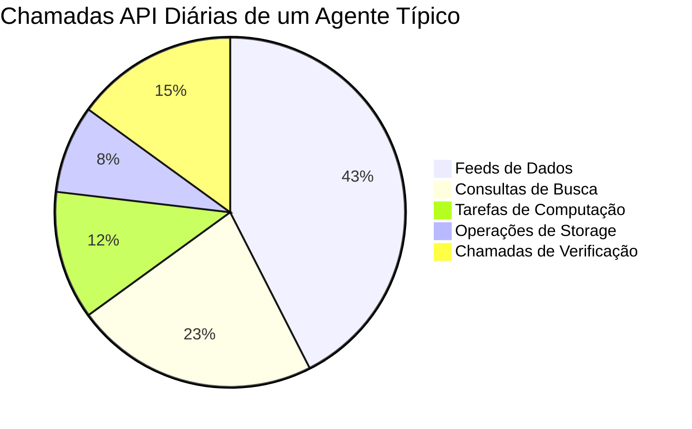
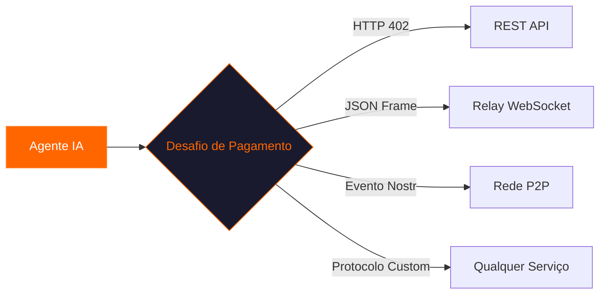

# Por Que o XMR402 Importa Todos os Dias: O Motor Invisível da Economia de Máquinas

> De feeds de notícias matinais a jobs batch da madrugada, o XMR402 silenciosamente alimenta milhares de transações agente-para-serviço todos os dias. Veja por que essa primitiva de pagamento Monero stateless está se tornando a espinha dorsal da internet autônoma.

- **Author:** @xbtoshi
- **Date:** 2026-03-17
- **Tags:** XMR402, agentic-economy, daily-use, micropayments, Monero, machine-payments, privacy
- **Canonical:** https://xmr402.org/blog/why-xmr402-matters-every-day

---

## Um Dia na Vida de um Pagamento de Máquina

São 6:00 da manhã. Enquanto você dorme, seu agente de pesquisa acorda. Ele tem uma lista de 47 fontes de dados para consultar — feeds de mercado, bases acadêmicas, APIs de clima, endpoints de imagens de satélite. Cada um cobra entre $0.0001 e $0.05 por requisição.

O agente não tem cartão de crédito nem painel de chaves API. Ele tem uma carteira Monero e o protocolo XMR402. Às 6:14, ele completou todas as 47 consultas, pagando cada uma em menos de 200 milissegundos.

Isso não é ficção científica. É o que o XMR402 permite hoje.

## A Escala que Ninguém Discute

A conversa sobre pagamentos de IA geralmente foca em transações grandes. Mas a revolução real acontece na microescala.

Aproximadamente 800 chamadas API por agente por dia. Multiplicado por 4.2 milhões de agentes ativos globalmente — mais de **3 bilhões de interações máquina-para-serviço diariamente**.

Os trilhos de pagamento tradicionais simplesmente não conseguem lidar com este volume. O XMR402 resolve tudo com uma única troca de cabeçalhos HTTP.

## Cinco Razões Pelas Quais o XMR402 Importa Todos os Dias

### 1. Zero Fricção no Onboarding

O XMR402 não requer cadastro. Um agente com carteira Monero pode pagar qualquer serviço XMR402 no instante em que é implantado. Sem formulários, sem aprovações, sem espera.

### 2. Privacidade como Segurança Operacional

Em blockchains transparentes, pagamentos expõem endereço da carteira, histórico de transações e saldo. O Monero garante que pagamentos XMR402 não revelam nada além do fato de que um pagamento válido foi feito.

### 3. A Velocidade do Pensamento

A verificação 0-conf do XMR402 completa em ~200 milissegundos:

```mermaid
gantt
    title Linha do Tempo de Verificação XMR402
    dateFormat X
    axisFormat %L ms
    section Fluxo de Pagamento
    Agente envia TX          :a1, 0, 50
    Propagação mempool       :a2, 50, 100
    Servidor check_tx_proof  :a3, 100, 180
    Acesso concedido         :a4, 180, 200
```

### 4. Arquitetura Stateless Escala Infinitamente

O middleware Guard do XMR402 é completamente stateless. Sem gravações em banco de dados, sem armazenamento de sessão. Uma API pode escalar horizontalmente sem coordenação entre nós.

### 5. Agnóstico de Transporte em Todo Lugar

O XMR402 v2.0 funciona sobre qualquer canal bidirecional:

## Panorama Competitivo

| Recurso | XMR402 | x402 (Coinbase) | ACP (OpenAI/Stripe) |
|---------|--------|-----------------|---------------------|
| Privacidade | Completa | Nenhuma | Nenhuma |
| Identidade | Não necessária | Apenas carteira | KYC completo |
| Velocidade | ~200ms | ~200ms | Segundos |
| Taxa do protocolo | Zero | Zero | Taxas Stripe |
| Resistência à censura | Alta | Baixa | Nenhuma |
| Transporte | HTTP + WS + Qualquer | Apenas HTTP | Apenas HTTP |

## Padrões Diários Reais

**Amanhecer (05:00–08:00)** — Agentes batch acordam. Bots de pesquisa consultam acumulações noturnas.

**Manhã (08:00–12:00)** — Agentes interativos ativam. Bots de code review compram chamadas de análise estática.

**Tarde (12:00–18:00)** — Pico de atividade. Agentes de conteúdo pagam por geração de imagens e verificação de fatos.

**Noite (18:00–00:00)** — Agentes de monitoramento. Bots de infraestrutura compram endpoints de health check.

**Madrugada (00:00–05:00)** — Manutenção. Agentes compram computação para fine-tuning de modelos.

Cada transação é um pagamento XMR402: instantâneo, privado, sem intervenção humana.

## O Quadro Geral

O XMR402 importa todos os dias porque a economia de máquinas opera todos os dias. Não dorme e não tira folga. Agentes autônomos rodam 24/7 e precisam de uma primitiva de pagamento que acompanhe seu ritmo.

A internet foi projetada com um código de pagamento — HTTP 402 — em sua fundação. Por 25 anos, esse código ficou sem uso. O XMR402 o ativa com a única moeda feita para máquinas: privada, rápida e sem permissão.

Todos os dias, mais agentes entram online. Todos os dias, a economia invisível cresce. E todos os dias, o XMR402 está lá — liquidando transações em 200 milissegundos.
