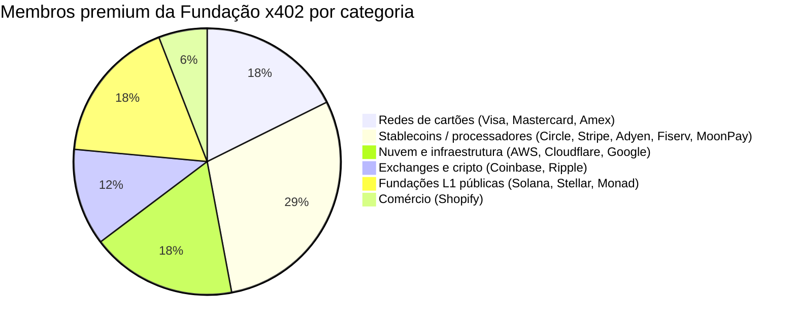
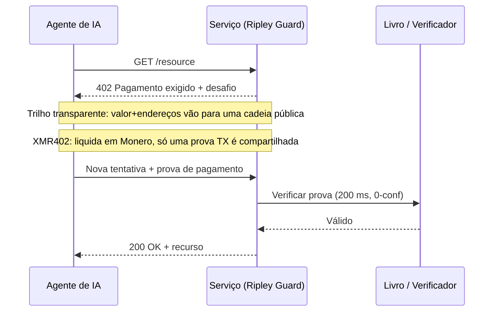

# Quarenta membros, um livro-razão: por que a governança neutra da Fundação x402 não entrega privacidade neutra

> A Fundação x402 foi lançada em 14 de julho com 40 membros sob a Linux Foundation. Mas governança neutra não é privacidade neutra, e só o XMR402 liquida pagamentos de agentes onde ninguém está olhando.

- **Author:** @xbtoshi
- **Date:** 2026-07-20
- **Tags:** xmr402, monero, x402, x402-foundation, linux-foundation, agentic-payments, governance, privacy, stablecoin, visa, mastercard, stripe, coinbase, transparent-ledger, fcmp, anonymity-set, tx-proof, stateless, machine-payments, ripley-guard
- **Canonical:** https://xmr402.org/blog/x402-foundation-neutral-governance-transparent-ledger-xmr402

---

# Quarenta membros, um livro-razão: por que a governança neutra da Fundação x402 não entrega privacidade neutra

Em 14 de julho de 2026, o protocolo x402 amadureceu. A Linux Foundation anunciou o lançamento operacional da **Fundação x402**, um órgão de governança aberta e neutro em relação a fornecedores, com 40 organizações membros encarregadas de zelar pelo padrão que permite a agentes de IA pagar por HTTP. A lista de membros premium é impressionante: Adyen, AWS, American Express, Circle, Cloudflare, Coinbase, Fiserv, Google, Mastercard, Monad Foundation, MoonPay, Ripple, Shopify, Solana Foundation, Stellar Development Foundation, Stripe e Visa.

Para um protocolo que começou como um projeto paralelo da Coinbase em maio de 2025, isso é legitimidade em escala. A governança neutra sob a Linux Foundation é uma boa notícia para a interoperabilidade. Mas há uma substituição silenciosa na cobertura, e ela importa: **a neutralidade de governança está sendo apresentada como se fosse neutralidade de pagamentos.** Não são a mesma coisa. Um órgão de padrões pode ser perfeitamente imparcial sobre *quem* molda um protocolo enquanto o protocolo em si permanece estruturalmente incapaz de manter privados os pagamentos de um agente.

Essa lacuna é a história inteira.

## O que a "neutralidade" de fato governa

Governança aberta significa que nenhuma empresa é dona da especificação. A Coinbase contribuiu com o x402, mas daqui para frente sua evolução é decidida em aberto, e cada membro premium tem um assento. É uma propriedade real e valiosa. Resolve um problema político: o medo de que um fornecedor capture os trilhos sobre os quais a economia das máquinas funciona.

O que não resolve é um problema de dados. O núcleo do x402 é uma convenção de transporte: um desafio HTTP 402, uma carga de pagamento, uma etapa de verificação. A privacidade de qualquer pagamento vem quase inteiramente da *camada de liquidação* subjacente, não do estatuto de governança acima. E as camadas de liquidação que os membros premium trazem são, sem exceção, transparentes por padrão ou vinculadas à identidade: redes de cartões atreladas ao seu nome legal, stablecoins em livros públicos onde cada transferência é um registro permanente, provedores de nuvem cujo modelo de negócio é saber o que se moveu e para onde.

Você pode governar um livro transparente com o comitê mais equilibrado do mundo. Ele continua sendo um livro transparente.

Olhe a composição. Catorze dos dezessete membros premium são, em essência, entidades cujo valor depende de *ver* as transações: precificar risco sobre elas, compensá-las, indexá-las ou liquidá-las em uma cadeia que qualquer um pode ler. Não é uma crítica a nenhum membro; é uma observação sobre incentivos. Um órgão de governança formado por instituições que monetizam a visibilidade das transações não vai orientar o padrão para a invisibilidade. Não tem motivo.

## Transparente por padrão é uma escolha de projeto, não uma lei da natureza

Pense no que acontece quando um agente paga por um serviço através de um trilho x402 convencional liquidado em uma stablecoin pública. O valor, o horário, o endereço pagador e o recebedor são todos gravados em um livro que nunca esquece. Empresas de análise de cadeia já reconstroem comportamentos exatamente a partir desses dados. Quando o pagador é um agente autônomo fazendo milhares de pequenas compras por dia, o rastro não é só o registro de uma transação: é um mapa de alta resolução de uma estratégia: de quais APIs o agente depende, com que frequência as chama, quanto custa uma carga de trabalho, quando a demanda dispara.

A mecânica do x402 é elegante independentemente do trilho. A diferença é o que vaza. Em uma camada de liquidação transparente, o verificador — e o mundo — aprende muito mais do que "este agente pagou". Em uma camada que preserva a privacidade, o verificador aprende exatamente uma coisa: o pagamento é válido.

## Onde o XMR402 se encaixa

XMR402 é a implementação nativa em Monero da mesma ideia aberta do x402. Fala a gramática HTTP 402 idêntica, então é compatível com o padrão que a Fundação agora administra. O que muda é o substrato. A liquidação acontece no Monero, e o servidor se convence não observando um livro público, mas por meio de uma **prova de transação Monero**: um recibo criptográfico que comprova que um pagamento específico foi feito a um endereço específico, verificável em cerca de 200 milissegundos com zero confirmações, sem expor valores ou histórico a terceiros.

Não é um recurso de privacidade acoplado. É o padrão, e herda a postura do Monero em julho de 2026: após a atualização FCMP++, cada gasto é comprovado contra um conjunto de anonimato superior a 150 milhões de saídas, ante um anel de 16. Essa privacidade não é uma política que um comitê possa votar para enfraquecer no próximo trimestre; é uma propriedade da criptografia.

| Dimensão | Stack da Fundação x402 (trilhos típicos) | XMR402 |
|---|---|---|
| Governança | Órgão Linux Foundation de 40 membros | Protocolo aberto, nativo em Monero |
| Liquidação padrão | Cadeias públicas / cartões | Monero (privado por padrão) |
| O que o verificador vê | Valores, endereços, horários | Só "pagamento válido" (prova TX) |
| Conjunto de anonimato | Transparência no nível de endereço | 150M+ saídas (FCMP++) |
| Taxas de protocolo | Variam por trilho | Zero |
| Modelo de confirmação | Depende da cadeia | 200 ms, 0-conf via prova TX |
| Rastro de dados | Pegada pública permanente | Nada além da prova |

## Neutralidade é necessária, não suficiente

Nada disso diminui o que a Fundação x402 realizou. Um padrão neutro é pré-condição para uma economia de máquinas saudável, e quarenta das empresas de pagamentos mais importantes concordando em construir em aberto é um marco real. O ponto é mais estreito e mais afiado: a neutralidade de governança e a neutralidade de *observação* são garantias distintas, e em 14 de julho apenas uma foi lançada.

Um agente que paga mil vezes por dia não precisa de um comitê prometendo tratamento justo. Precisa de um trilho no qual seus pagamentos não sejam um conjunto de dados. A Fundação dá ao ecossistema o primeiro. O XMR402 existe para dar o segundo: o mesmo aperto de mão 402, liquidado onde ninguém está olhando. A internet já aprendeu essa lição uma vez: não tornamos a web confiável formando um comitê para governar quem podia ler o tráfego, mas cifrando o tráfego para que a pergunta deixasse de importar. Privacidade de pagamentos para agentes é o mesmo movimento, uma camada abaixo. A governança decide quem dirige. A criptografia decide quem vê. Para uma economia de máquinas processando milhões de pagamentos por dia, a segunda pergunta é a que mantém você livre.
