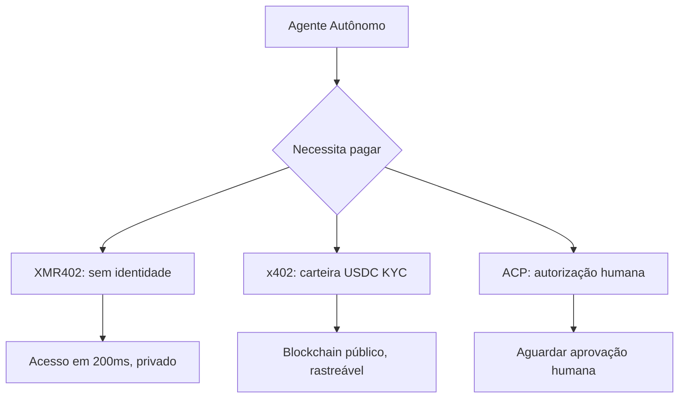
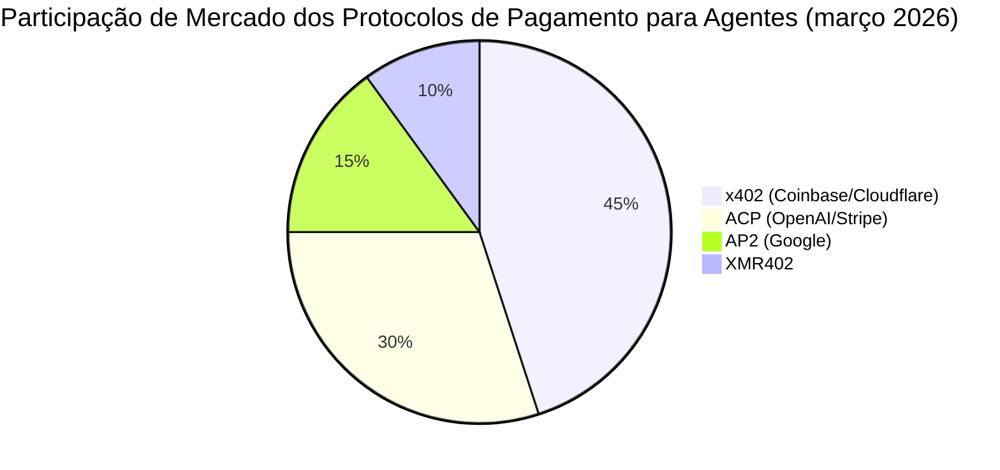

# XMR402 vs. o Stack de Pagamentos para Agentes: Uma Análise Protocolo a Protocolo

> A corrida pela dominância em pagamentos de agentes começou. x402 (Coinbase), ACP (OpenAI/Stripe) e AP2 (Google) competem pelos pagamentos nativos de IA. Veja como o XMR402 se compara — e por que privacidade e statelessness mudam tudo.

- **Author:** @xbtoshi
- **Date:** 2026-03-18
- **Tags:** protocol-comparison, x402, ACP, agentic-payments, Monero, XMR402, privacy, stablecoins
- **Canonical:** https://xmr402.org/blog/xmr402-vs-agentic-payment-protocols

---

## A Guerra dos Protocolos Começou

No início de 2026, três das empresas tecnológicas mais poderosas anunciaram quase simultaneamente padrões concorrentes para pagamentos de agentes. Coinbase e Cloudflare lançaram a Fundação x402; OpenAI e Stripe lançaram conjuntamente o Agentic Commerce Protocol (ACP) para o checkout instantâneo do ChatGPT; e o Google introduziu o AP2, seu próprio protocolo de pagamentos para agentes.

A mensagem é clara: os pagamentos de agentes IA são a próxima fronteira da infraestrutura da internet.

## Os Quatro Protocolos em Destaque

### x402 (Coinbase + Cloudflare)

Usa HTTP 402 com liquidação em USDC em cadeias compatíveis com Ethereum. Enormes vantagens de distribuição através do ecossistema Coinbase e CDN global da Cloudflare.

**O que resolve:** Micropagamentos entre agentes e serviços usando stablecoins.

**O que não resolve:** USDC incorpora KYC; o registro público torna todas as transações permanentemente visíveis; não é verdadeiramente stateless.

### ACP — Agentic Commerce Protocol (OpenAI + Stripe)

Projetado para comércio *iniciado por humanos* através de agentes IA. Usa o Shared Payment Token (SPT) após um humano autorizar o pagamento.

**O que resolve:** Checkout de consumidor dentro de interfaces IA.

**O que não resolve:** Completamente dependente de autorização humana; inútil para transações máquina-a-máquina autônomas.

### AP2 (Google)

Camada de orquestração que integra x402 como sua camada de pagamentos em stablecoins. Herda as limitações do x402.

### XMR402 (Nativo do Monero)

O mesmo mecanismo HTTP 402, mas com liquidação em Monero — a única criptomoeda principal com privacidade obrigatória ao nível do protocolo. Verificação 0-conf de ~200ms via TX Proof, completamente stateless, sem identidade necessária.

## Tabela de Comparação de Protocolos

| Funcionalidade | XMR402 | x402 (Coinbase) | ACP (OpenAI/Stripe) | AP2 (Google) |
|---|---|---|---|---|
| **Privacidade** | Completa (RingCT) | Nenhuma (cadeia pública) | Nenhuma (KYC Stripe) | Nenhuma (cadeia pública) |
| **Requer KYC** | Não | KYC de carteira USDC | Cartão de crédito | KYC de carteira |
| **Requer humano** | Não | Não | Sim | Parcialmente |
| **Velocidade de verificação** | ~200ms | Confirmação de bloco | Latência API | Latência API |
| **Taxas de protocolo** | 0 | Gas fees | % da Stripe | Gas fees |
| **Resistente à censura** | Sim | Não | Não | Não |

## A Questão Fundamental de Design

XMR402 é o único protocolo no qual um agente pode operar **completamente sem uma identidade KYC no ciclo**. Cada outro protocolo tem pelo menos uma dependência de uma entidade KYC — uma carteira USDC, uma conta Stripe ou um cartão de crédito.

## Por Que o Argumento da Privacidade Não Vai Embora

Cada grande plataforma de internet que acumulou dados de transações financeiras acabou usando-os para vantagem competitiva ou alavancagem regulatória. Os registros de blockchain público são ainda mais expostos: são permanentes, imutáveis e consultáveis por qualquer pessoa.

XMR402 é o único protocolo que torna esses dados invisíveis por padrão. Não por política, não por termos de serviço, mas por matemática.

## O Futuro: Interoperabilidade, Não um Único Vencedor

O panorama de pagamentos para agentes provavelmente se parecerá com o panorama de mensagens: múltiplos protocolos coexistindo com pontes entre eles. x402 e XMR402 compartilham o mesmo mecanismo HTTP 402, tornando a criação de pontes entre eles arquiteturalmente natural.
