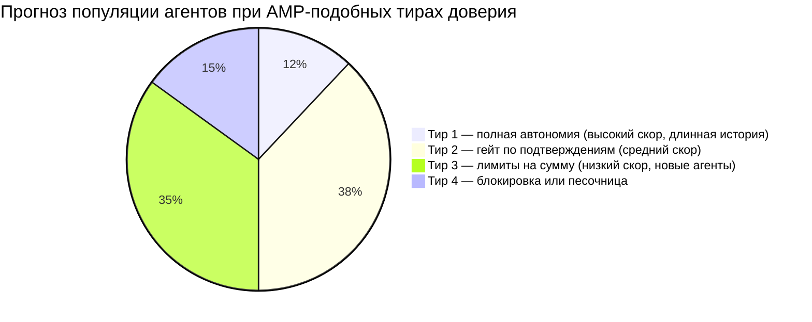
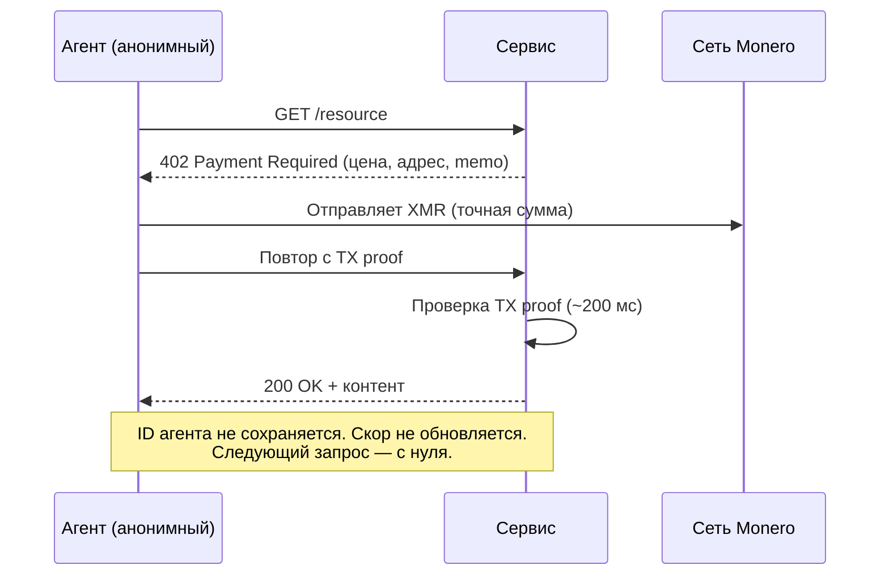

# Кредитный рейтинг для агента: как AMP от Ant ранжирует каждого ИИ-агента — и почему XMR402 отказывается это делать

> Новый протокол Ant International — Agentic Mobile Protocol (AMP) — поставляется с Agent Trust Rating: динамической оценкой, определяющей, какую автономию получит каждый ИИ-агент. Разбираемся, почему это кредитный рейтинг для машин, и почему stateless-архитектура XMR402 в принципе не способна его выдать.

- **Author:** @xbtoshi
- **Date:** 2026-05-29
- **Tags:** xmr402, monero, amp, ant-international, agent-trust-rating, kya, credit-score, stateless, agentic-payments, reputation, x402, alipay
- **Canonical:** https://xmr402.org/blog/agent-trust-rating-credit-score-xmr402

---

## Кредитный рейтинг для агента: как AMP от Ant ранжирует каждого ИИ-агента — и почему XMR402 отказывается это делать

27 апреля 2026 года на форуме MoMents 2026 в Куала-Лумпуре Ant International анонсировала Agentic Mobile Protocol (AMP) — позиционируемый как первый в мире платежный фреймворк для агентов, спроектированный под мобильные кошельки, супер-приложения и носимые устройства. Цифры впечатляют: AMP встраивается в сеть Alipay+, которая уже охватывает **1,8 миллиарда пользовательских аккаунтов и 150 миллионов мерчантов** через 40+ партнёрских кошельков. Подача — open-source, mobile-first и глобально связанная.

Подача — это одновременно крупнейшая из когда-либо предложенных систем привязки репутации к автономному ПО.

AMP состоит из двух взаимоувязанных компонентов. Первый — **Know Your Agent (KYA)**: слой цифровой идентичности, который сертифицирует разрешённые возможности каждого агента. Второй и заслуживающий отдельного внимания — проприетарный **Agent Trust Rating**: динамическая оценка управления риском, решающая, является ли агент «надёжным», и, что ключево, *сколько автономии он получит*. Два дня новостных циклов описывали это как функцию безопасности. Мы считаем, что это кредитный рейтинг для машин, унаследовавший все патологии скоринга, наложенного на людей: непрозрачность, монополизм, дрейф и гейткипинг под маской риск-менеджмента.

XMR402 — Monero-нативная реализация открытого стандарта X402 — был спроектирован до появления любых таких систем, и его stateless-архитектура структурно не способна породить такой рейтинг в принципе. Это фича, а не ограничение.

### Что на самом деле делает динамический Trust Rating

Trust Rating — это не разовая проверка. Это плавающий показатель, пересчитываемый на каждой транзакции, каждой привязке устройства, каждом взаимодействии с контрагентом, каждом споре. Чтобы получить устойчивую оценку, система должна:

1. **Постоянно идентифицировать агента** между сессиями, устройствами и мерчантами.
2. **Логировать каждую транзакцию** с атрибутируемыми входами (ID агента, принципал, мерчант, сумма, время, исход).
3. **Переоценивать рейтинг** по модели, недоступной ни агенту, ни его принципалу.
4. **Гейтить следующую транзакцию** по тиру — высокодоверенные агенты действуют автономно, низкодоверенным нужен человек или они блокируются.

По отдельности каждое требование разумно. Сложив их, получаем перманентную, непрозрачную, централизованно администрируемую инстанцию, ежедневно решающую, какие из ваших агентов сегодня вообще могут действовать в экономике. Пресс-материалы AMP отмечают сокращение шагов привязки на 50% и гарантию возврата при захвате аккаунта — оба требуют именно этого устойчивого реестра агентских идентичностей.

### Аналогия с кредитным скорингом — не риторика

Структура идентична. В таблице ниже патологии потребительского скоринга сопоставлены с Agent Trust Rating.

| Потребительский кредитный скоринг | Agent Trust Rating | Эффект на экономику агентов |
|---|---|---|
| FICO и аналоги — одна частная модель | Модель AMP проприетарна | Агенты не могут понять, почему их троттлят |
| Балл переносится между институтами | KYA закрепляет ID агента между кошельками, мерчантами, устройствами | Один плохой инцидент тянется за агентом везде |
| Балл растёт от поведения, удобного бюро | Балл растёт от поведения, удобного модели | Агенты сходятся к тому, что вознаграждает модель |
| У новичков «тонкое досье» и более высокая стоимость | Новые агенты стартуют с низким доверием, требуют человека | Высокая капитальная стоимость запуска автономного агента |
| Бюро монетизирует датасет | Эмитент рейтинга монетизирует датасет | Поведенческие данные агентов — новый товар |
| Споры медленные и непрозрачные | Споры по рейтингу будут медленными и непрозрачными | Репутационный ущерб копится быстрее, чем обжалуется |

Ничего из этого не спекулятивно. Это задокументированные внешние эффекты любой системы репутации, которую построило человечество, теперь применяемые к ПО, принимающему миллионы микрорешений в день.

### Проблема распределения

Как только появляется автономный гейт, сама автономия становится стратифицированным ресурсом. Точные пороги не публикуются, но форма предсказуема: малая доля давно установленных агентов будет иметь полную автономию, большая срединная полоса столкнётся с подтверждениями на нетривиальных действиях, а хвост новых и маргинальных агентов будет функционально заблокирован для чего-либо значимого.

Доли иллюстративны, принцип — нет. Любая динамическая риск-система, корректирующая автономию по баллу, по построению производит такую стратификацию. Платформы, эмитирующие балл, садятся на верх стека; их предпочтительные агенты — построенные на их SDK, платящие их комиссии, наблюдаемые их телеметрией — растут по тирам быстрее. Независимые агенты и open-source-фреймворки стартуют снизу и платят ренту за подъём.

### Что в этом контексте действительно значит «stateless»

В XMR402 нет и структурно не может быть Agent Trust Rating. Каждый запрос идёт одним маршрутом: сервер возвращает HTTP 402, агент платит точную сумму в Monero, сервер за ~200 мс проверяет TX proof, запрос исполняется. Нет устойчивой идентичности агента, нет межсессионного связывания, нет лога поведения от мерчантов и нет скоринговой модели для обновления.

Нет тира, который можно потерять; нет репутации, которую нужно восстанавливать; нет эмитента рейтинга, копящего поведенческий датасет. Приватность не приклеена сверху — это просто отсутствие слоя хранения, на который опираются другие протоколы.

Отсюда следствие второго порядка, которое редко проговаривают: **stateless-расчёт — единственный дизайн, дающий новому агенту тот же экономический статус, что и устоявшемуся**. В AMP свежий open-source-агент обязан накопить историю, прежде чем сможет автономно транзачить в значимых лимитах. В XMR402 он платит ту же сумму, что и годовалый агент, в том же окне, с той же вероятностью успеха. Протокол не знает, сколько ему лет, и ему это не нужно.

### Что AMP делает правильно — и где это становится ловушкой

Будем точны. AMP решает реальные проблемы, на которых публично спотыкался x402. Сокращение шагов привязки на 50% значимо. Гарантия возврата при захвате аккаунта — легитимная фича для кошельков, чьим принципалом является человек. Mobile-first форм-факторы — смарт-часы, AR-очки, бортовые системы — это и есть те места, где будет рождаться много активности агентов.

Ловушка в том, что все три фичи достигнуты добавлением состояния, состояние пришлось привязать к стабильной идентичности агента, а раз идентичность существует — её кто-то скорит. Agent Trust Rating — не отдельное решение, которое Ant приняла бы случайно; это то, что остальной дизайн принудительно вызывает к жизни.

Попав в этот цикл, каждая транзакция становится также входом для скора, гейтящего следующую транзакцию. Единственный выход из цикла — туда не заходить.

### Практический вывод

Если в 2026 вы строите автономных агентов, выбранный протокол — это и принятая модель управления. AMP даёт мобильный охват и инструменты возмещения ценой репутационного скора, который вы не контролируете. x402 даёт стейблкоин-рельсы и поддержку экосистемы ценой публичной он-чейн-идентичности. XMR402 даёт stateless, приватные микроплатежи ценой того, что механизмы возмещения не помещаются в сам протокол — они живут в прикладном слое, который вы проектируете сами.

Честная версия этого спора — не «какой протокол лучше», а «в какой экономике агентов вы хотите стоять через пять лет». В той, где горстка эмитентов рейтинга решает, каким агентам позволено действовать, — или в той, где любой агент, способный заплатить, может транзачить на равных условиях, не оставляя постоянной записи. XMR402 построен под вторую.

