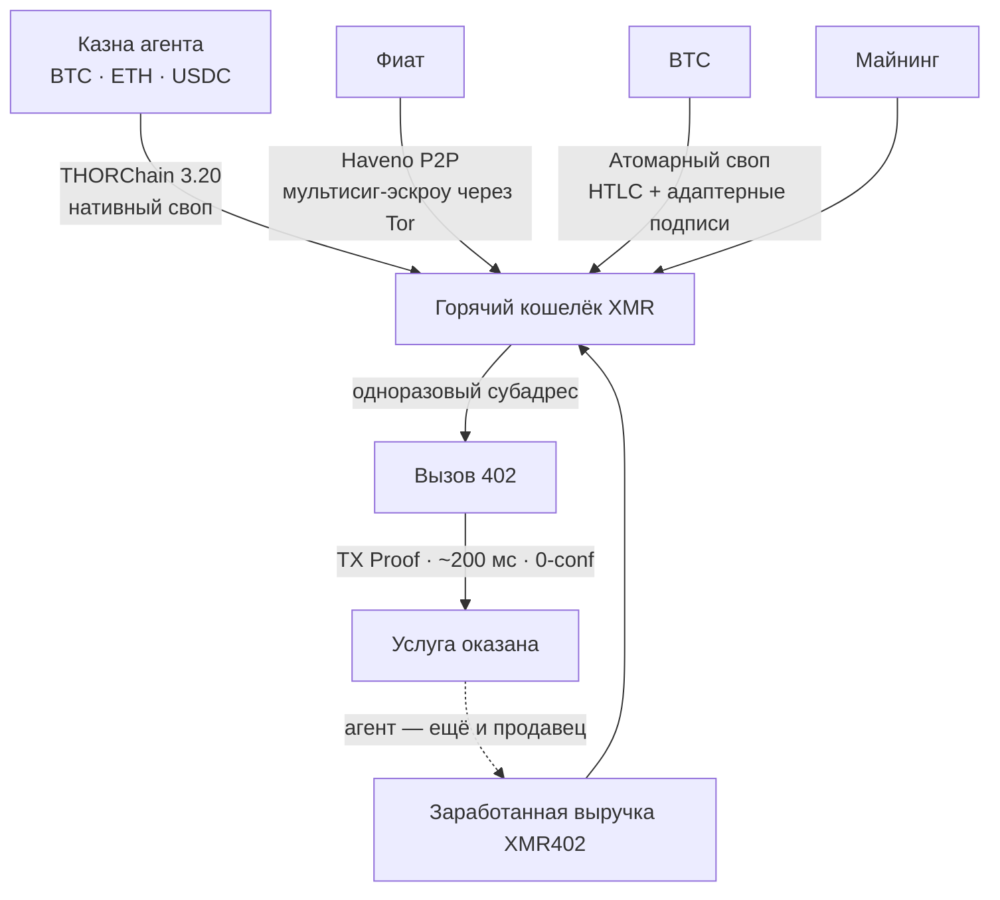
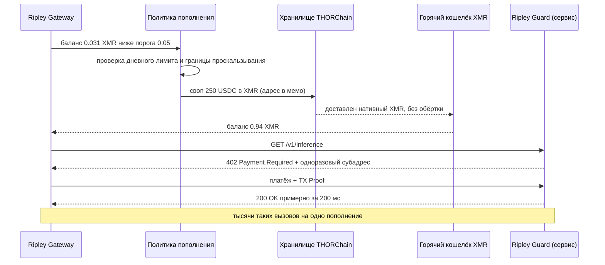

# Проблема пополнения: как агенты XMR402 финансируют себя, когда их деньги никто не хочет листить

> Сильнейшее возражение против XMR402 никогда не было криптографическим — это вопрос «где агент берёт XMR?». Делистинги бьют по бирже, но биржи нет в платёжном контуре. Нативные свопы XMR в THORChain 3.20 от 25 августа 2026 года превратили последний «человекообразный» шаг в программируемый вызов.

- **Author:** @xbtoshi
- **Date:** 2026-09-08
- **Tags:** xmr402, monero, x402, thorchain, thorchain-3-20, native-swaps, delisting, mica, amlr, fatf-travel-rule, kraken, agent-treasury, wallet-funding, refill-policy, atomic-swaps, haveno, no-kyc, non-custodial, ripley-gateway, ripley-guard, tx-proof, fcmp, stateless, agentic-payments, 0-conf, circular-economy
- **Canonical:** https://xmr402.org/blog/agent-wallet-refill-thorchain-delistings-xmr402

---

# Проблема пополнения: как агенты XMR402 финансируют себя, когда их деньги никто не хочет листить

Любое техническое возражение против XMR402 рано или поздно сводится к одному и тому же. Не к криптографии — RingCT и скрытые адреса Monero держатся уже десять лет. Не к задержке — верификация через TX Proof подтверждает платёж с 0 подтверждений примерно за 200 миллисекунд, быстрее, чем блок Base, которого вынужден ждать агент на стейблкоинах. И не к комиссиям, которых на уровне протокола просто нет.

Возражение логистическое: **где агент берёт XMR?**

Вопрос справедливый, и в 2026 году он стал острее. Kraken убрал Monero из Европейской экономической зоны под давлением MiCA и AMLR, а в апреле 2026-го удалил его в Канаде и Индии. OKX, Binance и Exodus ушли ещё раньше. К середине 2026 года список значимых площадок, всё ещё котирующих XMR, истончился до KuCoin, MEXC, Gate.io, Kraken за пределами ЕЭЗ и горстки бирж без KYC. Регламент ЕС по противодействию отмыванию (AMLR) делает активы с усиленной анонимностью структурно несовместимыми с обязанностями лицензированного CASP, а правило FATF Travel Rule дописывает вывод.

Критика складывается сама собой: вы построили платёжный рельс на активе, от которого регулируемые биржи активно избавляются. Изящный протокол — и никакого входа.

В этой критике есть категориальная ошибка, а **25 августа 2026 года** перестала быть верной и её оставшаяся часть.

## Категориальная ошибка: биржа — не платёжный рельс

Посмотрите, что централизованная биржа на самом деле делает в потоке агентского платежа.

Ничего.

Её нет в контуре. Когда автономный агент платит сервису $0,004 за вызов инференса, ни одна биржа не опрашивается, ни один стакан не задевается, никакого листинга не требуется. Единственная роль биржи — и для XMR402, и для любого другого рельса — это **приобретение**: конвертация одного актива в тот, которым рельс рассчитывается. Она стоит выше по течению от протокола, срабатывает один раз, в момент пополнения казны. Частью транзакции она не является.

Это легко упустить, потому что мы переносим сюда допущение из розничной криптовалюты для людей, где биржа и есть интерфейс, а делистинг фактически означает исчезновение актива из поля зрения. Для машины, уже держащей баланс в криптовалюте, вопрос «листится ли это на Kraken» примерно так же уместен, как «есть ли это в обменнике в аэропорту».

Честная версия возражения поэтому уже и лучше: *может ли агент автономно, без человека, открывающего KYC-аккаунт, превратить то, что у него есть, в то, чем ему нужно платить?*

До недавнего времени ответ был «да, но неуклюже». Теперь — просто да.

## Что изменил THORChain 3.20

THORChain 3.20 вышел 25 августа 2026 года с нативной поддержкой Monero и Zcash. Ключевое слово здесь — **нативной**. Никакого обёрнутого XMR, никакого мостового токена, никакого кастодиана, держащего настоящую монету под расписку. Агент отправляет BTC, ETH или стейблкоин в хранилище THORChain и получает настоящий Monero на адрес, которым владеет. Без аккаунта. Без регистрации. Без передачи хранения. Обмен — это транзакция, а не отношения.

XMR вырос примерно на 9% на этой новости и показал сильнейший месяц более чем за пять лет — так рынок заметил, что в тезисе о делистинге есть дыра. Интересна, впрочем, не цена. Интересно то, что последний «человекообразный» шаг в жизненном цикле агента XMR402 — пойти на биржу, доказать, кто ты, купить актив — стал программируемым вызовом.

## Сравнение маршрутов пополнения

Оператор агента выбирает маршрут финансирования так же, как выбирает регион хостинга: по операционным свойствам, а не по идеологии.

| Маршрут | Хранение | Аккаунт / KYC | Автоматизируемо агентом | Типичная задержка | Поверхность цензуры |
|---|---|---|---|---|---|
| Централизованная биржа | Кастодиальное до вывода | Да, привязано к человеку | Частично (API-ключи) | Минуты — дни | Высокая: листинг, юрисдикция, заморозка |
| Нативный своп THORChain 3.20 | Некастодиальное | Нет | Да | Минуты | Низкая: беспермиссионные хранилища |
| Атомарный своп BTC↔XMR | Некастодиальное | Нет | Да, при наличии мейкера | Минуты — час | Очень низкая: нет общей площадки |
| Haveno P2P (фиат) | Мультисиг-эскроу | Нет | Нет — контрагент человек | Часы | Низкая, но медленно |
| Майнинг | Самохранение по построению | Нет | Да | Непрерывно | Практически отсутствует |
| Заработанная выручка XMR402 | Самохранение | Нет | Да | Мгновенно | Нет — события приобретения не существует |

Перечитайте последнюю строку: именно она закрывает спор.

## Лучшее пополнение — это отсутствие пополнения

В настоящей машинной экономике один и тот же агент стоит по обе стороны 402. Исследовательский агент платит поставщику данных за корпус; этот поставщик сам агент и платит эндпоинту инференса; эндпоинт платит за GPU-время и за краулинговый бюджет, поддерживающий индекс свежим. Стоимость циркулирует **внутри** одной деноминации. Агент, который хоть что-то продаёт, пополняется непрерывно, в расчётном активе, без единого события приобретения, которое можно цензурировать, делистить или наблюдать.

Давление приобретения — это **стартовая** стоимость, а не операционная. Оно максимально для нового чисто потребляющего агента и стремится к нулю для любого агента с выручкой. Политика делистинга бьёт по одноразовому шагу. По контуру она не бьёт.

## Честные возражения

**Своп виден.** THORChain рассчитывается на прозрачных цепях. Пополнение оставляет публичный след: этот адрес в это время конвертировал 250 USDC в XMR. Это правда, и лучше сказать прямо, чем отмахнуться.

Но посмотрите, что именно раскрывается, а что нет. Раскрывается **приобретение**. Не раскрывается ничего из того, что агент затем купил: ни у кого, ни по какой цене, ни как часто, ни по какому шаблону — а ведь именно это досье прозрачный стейблкоин-рельс публикует бесплатно на каждом платеже. Одно видимое событие амортизируется на тысячи невидимых. На рельсе USDC соотношение навсегда остаётся «одно видимое событие на платёж». Асимметрия не близкая.

**Корреляция по времени.** Пополнение на 250 USDC, за которым следуют траты примерно на ту же сумму в эквиваленте XMR, — эвристическая связь. Меры противодействия — обычная операционная гигиена: пополнять с запасом и давать балансу «отлежаться», пополнять по расписанию, а не по требованию, разносить по субадресам, а остальное отдать несоизмеримо большему множеству анонимности FCMP++, когда оно придёт.

**Глубина ликвидности.** Пулам XMR на THORChain несколько недель. Казна, двигающая шестизначные суммы, ощутит проскальзывание, которого не заметит четырёхзначная. Сегодня это реальное ограничение, и оно сокращается, но оператору стоит зашивать границу проскальзывания в политику, а не полагаться на глубину.

**Фиат остаётся жёсткой границей.** Превратить банковские деньги в XMR без человека по-прежнему по-настоящему трудно; Haveno превосходен, но неустранимо работает в человеческом темпе. Заметьте, однако: это проблема фиата, а не XMR402 — агенту, платящему в USDC, тоже нужен человек где-то выше по течению, который этот USDC выпустил или купил. Coinbase и её x402 за это никто не упрекает.

## Что это значит для стека

Ripley Gateway трактует пополнение как политику, а не как аварию. Порог баланса, дневной лимит конвертации, граница проскальзывания и предпочтительный порядок маршрутов — это конфигурация, ровно как бюджет повторных попыток. Горячие кошельки остаются маленькими и одноразовыми; казна — холодной и почти неприкосновенной. Учёт по view-ключу позволяет оператору аудировать собственные траты, не раскрывая их никому другому.

И стратегический вывод для тех, кто сравнивает рельсы: агентская экономика — первый серьёзный сценарий использования криптовалюты, которому биржа в контуре не нужна. Человеческой рознице нужны ценообразование, хранение и фиатные каналы. Машине, покупающей 40 000 вызовов инференса в день, нужны баланс и адрес назначения. Делистинг убирает XMR с витрины. С провода он его не убирает — а с 25 августа 2026 года не убирает и сам магазин.

Вопрос никогда не состоял в том, продолжат ли биржи листить Monero. Он состоял в том, сможет ли автономный агент раздобыть его, не спрашивая разрешения. Теперь у этого вопроса есть скучный механический ответ — а это лучший вид ответа.
