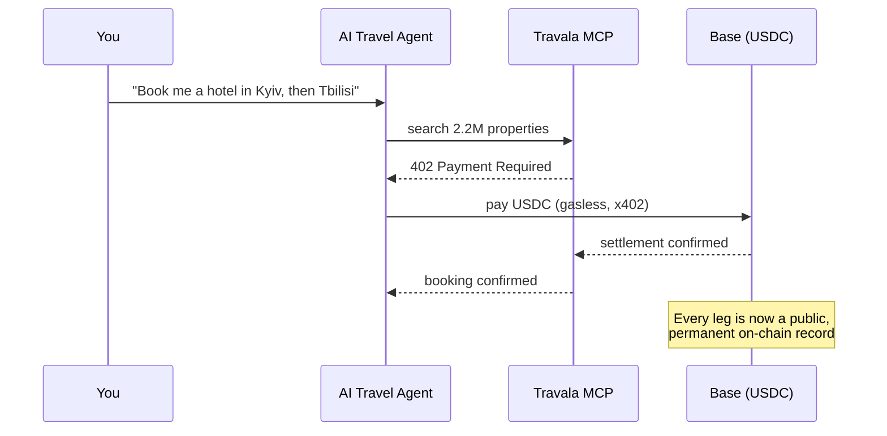
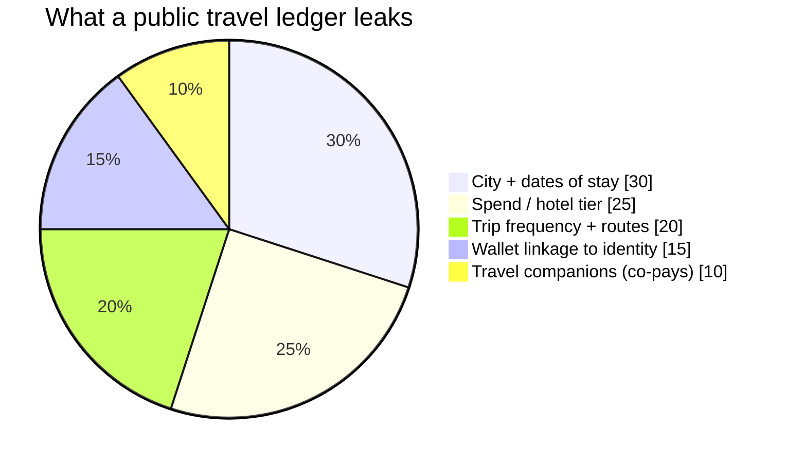
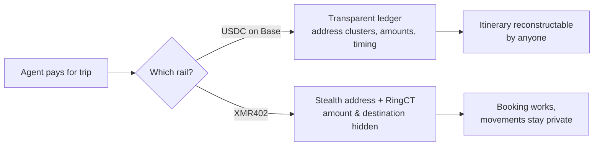

# Маршрут в реестре: почему след вашего ИИ-турагента отмечает каждое место ночлега — и как XMR402 бронирует приватно

> Новый агентский тревел-протокол Travala позволяет ИИ бронировать 2,2 млн отелей и платить в USDC на Base. Но агент в публичной сети записывает ваши перемещения в вечный реестр. Как XMR402 бронирует ту же поездку без следа.

- **Author:** @xbtoshi
- **Date:** 2026-06-05
- **Tags:** xmr402, monero, x402, travala, agentic-travel, travel-mcp, location-privacy, usdc, base, erc-7715, session-keys, stealth-address, ringct, agentic-payments, privacy, 0-conf
- **Canonical:** https://xmr402.org/blog/agentic-travel-booking-location-trail-xmr402

---

# Маршрут в реестре: почему стейблкоин-след вашего ИИ-турагента отмечает каждое место вашего ночлега — и как XMR402 бронирует приватно

4 июня 2026 года Travala представила **Travala Travel MCP** — сквозной агентский протокол, позволяющий ИИ-консьержу искать, бронировать и оплачивать более 2,2 млн отелей в одном чат-треде. Он работает на Base, рассчитывается в USDC без газа по стандарту **x402** и использует сессионные ключи ERC-7715: агент предлагает платёж, а финальная подпись остаётся в вашем кошельке. Прекрасная инженерия — и катастрофа приватности, которую вот-вот проиндексируют.

То, чего не было на слайде анонса: когда агент бронирует отель в USDC на Base, он записывает ваши самые личные данные — *где физически окажется ваше тело и когда* — в постоянный публичный реестр, доступный любому навсегда.

## Поездка, которая бронирует себя сама — и сообщает об этом всем

Вы говорите: «спланируй двухнедельную поездку по Кавказу», и агент берёт на себя поиск, брони, платежи и отмены. Трение путешествия сжимается до одной фразы. Но каждый расчёт — это транзакция в прозрачной сети.

Карточные рельсы приватны по умолчанию — Visa не публикует историю ваших отелей. Агент на публичной сети делает наоборот. Соедините несколько платежей — и это уже не платежи, а **маршрут**.

## Реестр — это история перемещений

Аналитические фирмы давно кластеризуют адреса, метят мерчантов и деанонимизируют кошельки. Расчёты Travala по дизайну идентифицируют мерчанта — иначе отель не получит денег. Запись говорит не «кто-то потратил $240», а: *этот кошелёк жил в отеле такого класса, в этом городе, в эти ночи и теперь платит отелю в следующем городе за 600 км.*

Для журналиста, встречающего источник, для диссидента на границе это прямая угроза физической безопасности. Публичный реестр нельзя отозвать или удалить. След вечен.

## Почему «сессионные ключи» не лечат утечку

Ключи ERC-7715 решают *авторизацию*, а не *конфиденциальность*. Они контролируют, кто может тратить, но не кто может *наблюдать*. Подписанный платёж всё равно попадает в прозрачный реестр с открытой суммой и контрагентом. Для путешествий местоположение *и есть* полезная нагрузка.

## Та же поездка — приватно

XMR402 — это Monero-нативная реализация стандарта x402. Тот же HTTP 402, та же 200-мс проверка 0-conf через Monero TX Proof, нулевые комиссии протокола — но расчёт в сети, где приватность является базовым слоем. Скрытые адреса делают пункт назначения несвязываемым; RingCT прячет сумму.

| Свойство | USDC на Base (Travala MCP) | XMR402 (Monero) |
| --- | --- | --- |
| Агентское бронирование | Да | Да |
| Сумма видна в сети | Да | Нет (RingCT) |
| Связь с мерчантом | Да | Нет (скрытый адрес) |
| Маршрут восстановим | Тривиально | Нет |
| Запись постоянна и публична | Да | Шифрование по умолчанию |
| Комиссии протокола | Без газа, но есть сборы Base | Ноль |
| Задержка расчёта | Почти мгновенно | ~200 мс 0-conf |

Опыт агента идентичен. Разница — в том, что остаётся после.

## Приватность — не премиум-тариф путешествия

Гонка агентских путешествий началась. Удобство реально и придёт независимо от ответа на вопрос приватности. Именно поэтому вопрос важен сейчас. XMR402 существует, чтобы публикация ваших перемещений не стала умолчанием. Агент должен бронировать всю поездку одной фразой. Никто другой не должен читать, куда вы ездили.

*XMR402 — слой приватности для агентской экономики. Тот же 402, тот же UX, без следа.*

