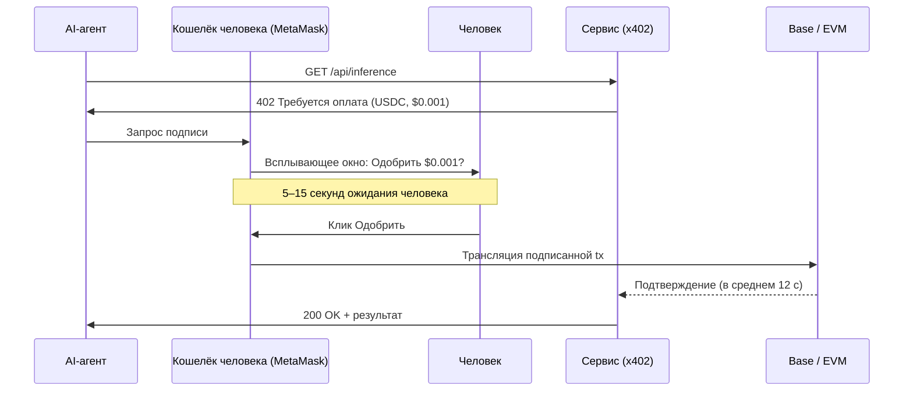
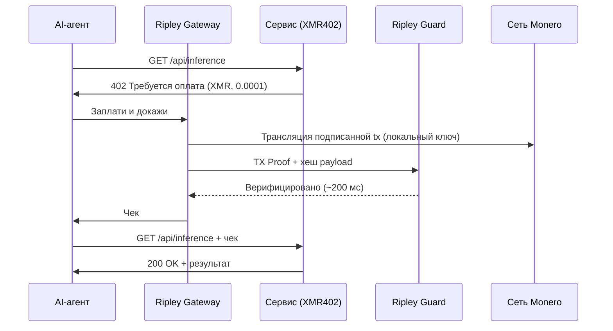
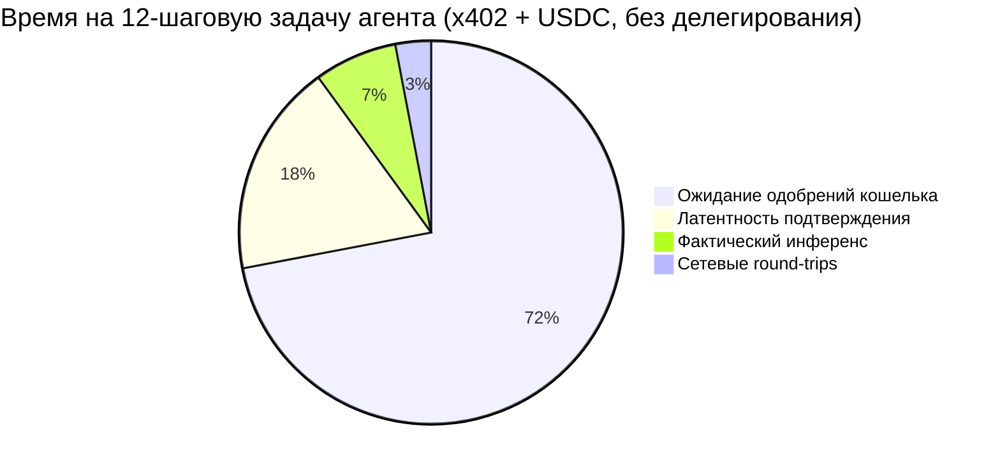
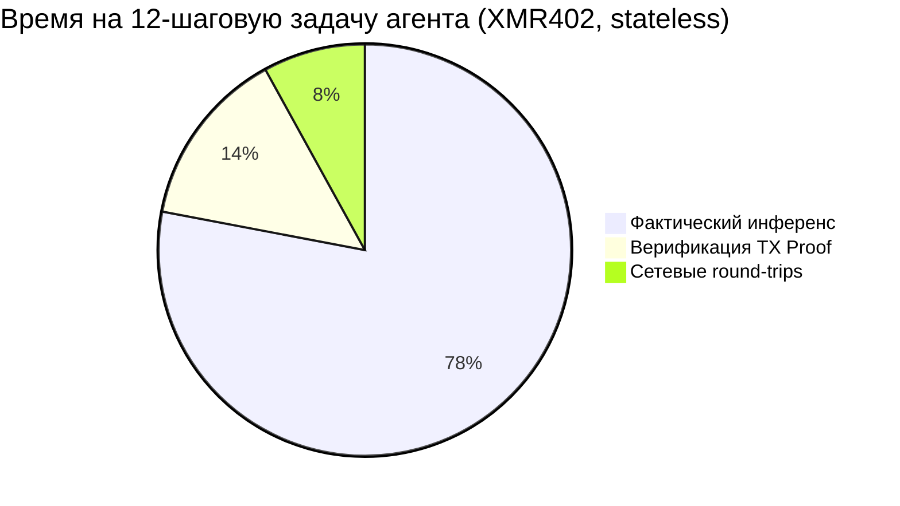

# Стена фрикции одобрений: почему объём x402 рухнул на 77% — и почему stateless-архитектура XMR402 её обходит

> Данные Artemis показывают, что скорректированный объём x402 упал на 77% с пика ноября 2025 года. Виновата не спрос — а всплывающие окна кошелька. Каждая субцентовая оплата агента теперь несёт $0,03–$0,10 затрат человеческого времени на одобрение. Мы разбираем проблему фрикции одобрений и объясняем, почему stateless-верификация XMR402 через TX-Proof полностью устраняет это узкое место.

- **Author:** @xbtoshi
- **Date:** 2026-05-28
- **Tags:** xmr402, x402, monero, approval-friction, wallet-confirmation, micropayments, stateless, agentic-payments, delegation, ap2, agentcore, fireblocks
- **Canonical:** https://xmr402.org/blog/approval-friction-wall-stateless-xmr402

---

# Стена фрикции одобрений: почему объём x402 рухнул на 77% — и почему stateless-архитектура XMR402 её обходит

Май 2026 года принёс индустрии агентских платежей первую по-настоящему отрезвляющую точку данных. Согласно ончейн-аналитике Artemis, скорректированный объём x402 упал примерно на **77% с ноябрьского пика 2025 года в $5,15 млн до всего $1,19 млн**, при этом ежемесячное количество транзакций восстановилось до 2,89 млн со средним размером $0,52. Долларовый объём сокращается не потому, что агенты перестали платить. Он сокращается потому, что каждый платёж теперь требует, чтобы человек нажал *одобрить*.

У индустрии теперь есть название для этого: **фрикция одобрений**. И она вскрывает дефект, который не починить никаким полированием UX кошелька.

## Цифры, которые никто не хочет печатать

Консервативный темп подтверждений 5–15 секунд на одно всплывающее окно — на миллионах ежемесячных вызовов x402 — генерирует от **4 000 до 12 000 человеко-часов работы по одобрению в месяц**. При смешанной стоимости человеко-времени $25/час каждое всплывающее окно фактически стоит $0,03–$0,10 налогом внимания. Для субцентового вызова инференса или $0,001 API-запроса с тарификацией налог человеко-времени **в 10–100 раз больше стоимости самого платежа**.

Это не баг. Это *прямое следствие* привинчивания стейблкоин-протокола к модели кошелька, разработанной для торгов, инициируемых человеком, а не для микроплатежей, инициируемых машиной.

## Почему x402-USDC не может избежать всплывающего окна

Каждый сегодняшний поток x402 со стейблкоинами наследует одно и то же допущение об авторизации: кошелёк (MetaMask, Trust Wallet, Coinbase Wallet, Phantom) держит ключ, и этот ключ подписывает EVM-транзакцию. Живёт ли кошелёк в браузерном расширении, аппаратном устройстве или кастодиальном сервисе вроде Fireblocks, событие подписи — это **явное действие, атрибутируемое пользователю**. Регуляторам это нравится. Командам compliance это нравится. Вендоры кошельков построили весь свой UX вокруг этого допущения.

Для торговли это нормально. Для автономного агента, которому нужно сделать 40 субцентовых API-вызовов за один исследовательский workflow, — это *катастрофа*.

Предложенное индустрией решение — **фреймворки делегирования**: Google AP2 mandates, переданные в FIDO Alliance, AWS Bedrock AgentCore Payments с policy-based контролем расходов (запуск 7 мая 2026), новый Agentic Payments Suite от Fireblocks (20 мая 2026) и предзаряженные сессионные ваучеры Solana Pay.sh (5 мая 2026). Каждый пытается *предварительно одобрить* бюджет, чтобы кошелёк перестал спрашивать. Ни один из них не устраняет кошелёк — они лишь прячут его за подписанный mandate, policy-движок или кастодиана.

## Что фреймворки делегирования не решают

Всплывающее окно исчезает. Слежка — нет. Кастодиан — нет. Привязка идентичности — нет. И критически, **режимы отказов тоже не исчезают**: mandate можно отозвать, политику — настроить неверно, кастодиан может заморозить средства, и каждый платёж по-прежнему появляется как отслеживаемое ончейн-событие, привязанное к разрешённому кошельку.

Это архитектурная ирония гонки агентских платежей 2026 года. Поддержанные бигтехом протоколы теперь строят сложные леса, чтобы *имитировать* то, что stateless-протоколы дают изначально.

## Почему у XMR402 нет фрикции одобрений, которую нужно решать

XMR402 был спроектирован до того, как у фрикции одобрений появилось имя. Monero-нативная реализация X402 относится к платёжной подсистеме агента — **Ripley Gateway** — как к самостоятельному автономному актору. Gateway держит собственный Monero-кошелёк, подписывает локально и выдаёт **TX Proof** (криптографическое утверждение, доказывающее, что конкретный платёж был сделан на конкретный субадрес, не раскрывая баланс или историю кошелька).

Принимающий сервис запускает **Ripley Guard**, который верифицирует TX Proof примерно за **200 мс** — без подтверждённого блока, без обращения к кастодиану, без консультации с внешним policy-движком. Верификация stateless: нет сессии, нет аккаунта, нет регистрации, нет коллбэка в UI кошелька.

Нет всплывающего окна, потому что нет человека в петле. Нет mandate, потому что полномочия агента ограничены балансом кошелька, а не внешним документом авторизации. Нет следа слежки, потому что кольцевые подписи Monero, stealth-адреса и RingCT скрывают и множество отправителей, и сумму.

## Сравнение: аудит фрикции одобрений

| Протокол | Модель одобрения | Человеко-время на платёж | 0-conf верификация | Приватность плательщика | Кастодиальная зависимость |
|---|---|---|---|---|---|
| x402 (USDC на Base) | Подпись кошелька на tx | 5–15 с ($0,03–$0,10) | Нет (~12 с) | Публично на Base | Опц. (Fireblocks, Coinbase) |
| AWS AgentCore Payments | Предподписанные policy mandates | ~0 в рамках бюджета | Зависит от сети | Публично + аудит-лог AWS | Да (AWS) |
| Solana Pay.sh | Предзаряженная сессия | ~0 в рамках сессии | Да (Solana 400 мс) | Публично на Solana | Опц. |
| Google AP2 mandates | FIDO-привязанный mandate | ~0 в рамках mandate | Зависит от сети | Публично + аттестация Google | Да (Google identity) |
| **XMR402** | **Нет — агент-нативно** | **0** | **Да (~200 мс TX Proof)** | **Приватно (RingCT)** | **Нет** |

Таблица выглядит как спецификация, но импликация — структурная. Каждый фреймворк делегирования выше принимает всплывающее окно кошелька как фиксированную стоимость и пытается её амортизировать. XMR402 удаляет эту стоимость.

## Где налог человеко-времени реально оседает

Для 12-шагового workflow агента с 12 платными API-вызовами разбивка времени жёсткая на стейблкоин-рельсах и тривиальная на XMR402.

Именно поэтому долларовый объём x402 рушится, а число транзакций растёт: агенты батчат, ретраят и сдаются на субцентовых вызовах, потому что математика человеко-времени больше не сходится. Протокол, который *должен был бы* использоваться для миллиона крошечных вызовов в день, душится протоколом, который *требует* человека на каждом из них.

## Архитектурный выбор, которого индустрия избегает

Стена фрикции одобрений — это не UX-проблема. Это **выбор дизайна протокола**, впечённый в момент, когда стандарт платежа предположил, что подписант — человек. Каждый фреймворк делегирования, строящийся в 2026 году — AP2 mandates, AgentCore policies, оркестрация Fireblocks, ваучеры Pay.sh — это слой, разработанный, чтобы имитировать автономность поверх фундаментально неавтономного примитива.

XMR402 пошёл другой ветвью. Он предположил, что подписант — это агент, верификатор — это сервис, а сеть приватна по умолчанию. Именно это решение делает возможной верификацию за 200 мс, делает возможными нулевые комиссии протокола и делает так, что стены вокруг субцентовых платежей просто не существует.

Данные мая 2026 — это прогноз. Протоколы, которые переживут агентское десятилетие, будут теми, что никогда не просили человека нажать *одобрить*.
