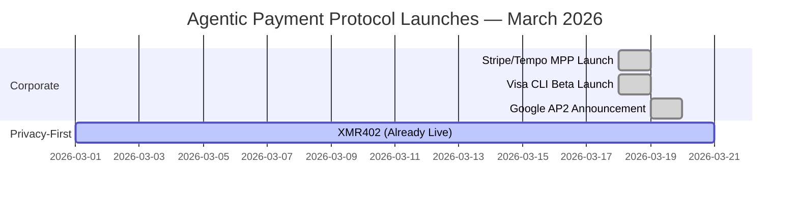
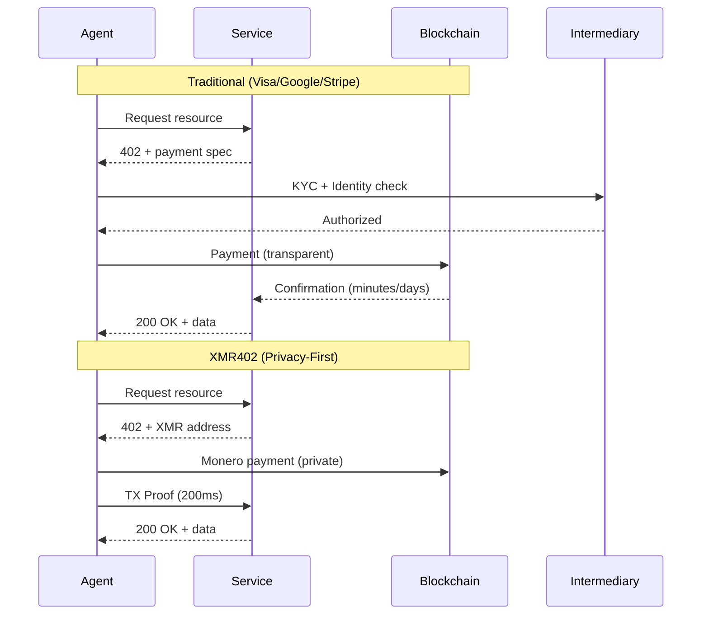

# Неделя, когда большие технологические компании поставили на агентские платежи — и почему все они ошиблись на счет конфиденциальности

> В марте 2026 года Visa, Google и Stripe запустили конкурирующие решения для агентских платежей в течение нескольких дней. Однако все три жертвуют конфиденциальностью ради удобства. Только XMR402 предлагает действительно конфиденциальную, не требующую состояния и бесплатную альтернативу.

- **Author:** @xbtoshi
- **Date:** 2026-03-20
- **Tags:** agentic-payments, privacy, xmr402, monero, payment-protocols, fintech, cryptocurrency, agent-economy, x402, visa, google, stripe
- **Canonical:** https://xmr402.org/blog/big-tech-agentic-payment-land-grab

---

# Неделя, когда большие технологические компании поставили на агентские платежи — и почему все они ошиблись на счет конфиденциальности

18-19 марта 2026 года будут помниться как момент, когда экономика агентов стала мейнстримом. В ошеломляющей конвергенции корпоративного импульса три из крупнейших в мире компаний платежей и технологий объявили конкурирующие решения для платежей машина-машина (M2M) в течение 24 часов:

- **Visa CLI** (18 марта) — экспериментальный инструмент CLI для программных платежей по картам из Visa Crypto Labs Cuy Sheffield
- **Google AP2** (март 2026) — объявлено с 60+ партнерами, включая Adyen, American Express, Mastercard и PayPal, с расширением криптографии x402
- **Stripe/Tempo Machine Payments Protocol** (18 марта) — открытый стандарт, соавтором которого являются Stripe и поддерживаемая Paradigm компания Tempo

Эта беспрецедентная корпоративная согласованность подтверждает тезис, который казался маргинальным всего 18 месяцев назад: рынок агентской торговли McKinsey в размере 3-5 триллионов долларов к 2030 году — это не шумиха, это неизбежность. Но в их стремлении захватить этот возникающий рынок каждое из этих решений совершило одну и ту же фундаментальную ошибку.

## Они все выбрали удобство над конфиденциальностью

Каждый протокол требует некоторой формы проверки личности, создает следы надзора или зависит от централизованных посредников, которые становятся медовыми горшочками для данных об операциях.

**Visa CLI** требует традиционной проверки личности и соответствия KYC. В его основе лежит система платежей по карте, что означает, что Visa видит каждую операцию, каждого продавца, каждое взаимодействие агента. Ярлык "экспериментальный" едва скрывает то, что это на самом деле: попытка захватить платежи от агента к услуге, прежде чем кто-то создаст альтернативу, приоритизирующую конфиденциальность.

**Google AP2** работает с 60+ партнерами, но остается в основном централизованным. Google знает, кто платит кому и за что. Расширение криптографии x402, поддерживаемое Coinbase и MetaMask, добавляет завесу конфиденциальности, но только для блокчейна — и даже тогда только для прозрачных цепей, таких как Base и Ethereum. История платежей вашего агента легко читается для любого, кто проявит терпение.

**MPP Stripe/Tempo** следует той же тактике: открытый стандарт, но с Stripe в качестве уровня расчетов по умолчанию. Stripe получает данные. Сам протокол не зависит от транспорта, что является хорошей архитектурой, но структура стимулов указывает платежи через централизованного посредника, который извлекает прибыль из объема операций.

Все три решают реальную проблему — как мы можем включить быстрые, надежные платежи между агентами ИИ и услугами? — но ни один из них не отвечает на более сложный вопрос: *ценой чего для конфиденциальности?*

## Различие XMR402: конфиденциальность по протоколу, а не по политике

XMR402 — это реализация стандарта открытого платежа X402, собственная для Monero. Он обеспечивает безгосударственные, не требующие разрешения, защищающие конфиденциальность микроплатежи между агентами ИИ и услугами, используя HTTP 402 «Требуется платеж».

Вот что делает его принципиально иным:

**Никакого требования идентификации.** Агент может инициировать платеж без KYC, без создания учетной записи, без регистрации в какой-либо системе. Сам протокол является уровнем разрешений.

**Нулевые сборы на уровне протокола.** Visa, Google и Stripe все извлекают значение. XMR402 имеет нулевые сборы протокола — только сборы сети Monero (~0.0001 XMR), на несколько порядков меньше, чем сборы традиционной платежной сети.

**Проверка 0-conf за 200 миллисекунд.** Используя технологию TX Proof Monero, поставщики услуг могут криптографически проверить получение платежа за 200 миллисекунд — достаточно быстро для взаимодействия агента в реальном времени без ожидания подтверждения блокчейна.

**Полностью без состояния.** Протокол не требует базы данных, состояния API или учетных записей пользователей. Каждая операция является самодостаточной и криптографически проверяемой. Масштабируйте без долга инфраструктуры.

**Независимость транспорта.** Работает через HTTP, WebSocket или любой протокол на основе TCP. Стандарт не предписывает уровень сети.

## Таблица сравнения: как они складываются

| Функция | Visa CLI | Google AP2 | Stripe MPP | x402 | XMR402 |
|---------|----------|-----------|-----------|------|--------|
| **Конфиденциальность** | Низкая (требуется KYC) | Низкая (централизованная книга) | Низкая (посредник Stripe) | Средняя (прозрачные цепи) | Высокая (конфиденциальность Monero) |
| **Требуется идентификация** | Да | Да (криптовалюта опциональна) | Да | Опционально | Нет |
| **Сборы протокола** | 2-3% | 0.5-1.5% | 0.5% + расчет | Переменная | 0 |
| **Скорость расчета** | 1-3 дня | 1-2 дня | Минуты | 10-15 минут | 200мс (0-conf) |
| **Не требует разрешения** | Нет | Нет | Нет (требуется регистрация) | Да (для x402) | Да |
| **Архитектура без состояния** | Нет | Нет | Частично | Нет | Да |
| **Криптоисточник** | Нет | Частично (расширение x402) | Нет | Да | Да |
| **Централизация** | Высокая | Высокая (60+ партнеров, центр Google) | Высокая (по умолчанию Stripe) | Средняя | Отсутствует |

## Контекст рынка: кто выигрывает и почему

x402, стандарт, возглавляемый Coinbase, уже обработал более 100 миллионов платежей, но торгует узкими маржами — только ~28 тысяч долларов в день по данным CoinDesk, несмотря на оценку экосистемы в 7 миллиардов долларов. Это технически элегантно и не требует разрешения, но работает на прозрачных блокчейнах (Base, Ethereum), которые поражают конфиденциальность.

Префектуры Visa и Google сигнализируют о чем-то важном: существующие игроки видят этот рынок и движутся, чтобы владеть им, прежде чем альтернативные рельсы созреют. Они запускают эти продукты не потому, что верят в децентрализацию или конфиденциальность — они запускают, потому что боятся быть вытеснены.

Партнерство Stripe с Tempo более интересно. Tempo поддерживается Paradigm, что указывает на серьезную капитализацию за инфраструктурой платежей M2M. Но выравнивание стимулов по-прежнему указывает на централизованный расчет.

## Парадокс конфиденциальности

Вот неудобная правда: каждый протокол, который мы видели, запущенный на этой неделе, столкнется с одним и тем же нормативным давлением для сбора данных, выявления подозрительных моделей и включения замораживания счетов. Идентификация создает юридическую ответственность. Надзор становится театром соответствия.

XMR402, построенный на гарантиях конфиденциальности Monero, не решает неопределенность нормативных требований — но структурно предотвращает театр соответствия. Если вы не видите операцию, вам не может быть предъявлено исковое требование за ее включение. Сам протокол становится уровнем разрешений: если криптография проверяется, платеж был действительным. Без человеческого суждения. Нет апелляции к власти.

## Что дальше

Три возможных будущих:

1. **Консолидация.** Один из трех крупных (вероятно, Google или Visa) покупает или интегрируется с другими, создавая де-факто монополию на агентские платежи.

2. **Фрагментация.** Все четыре сосуществуют с специализацией по вариантам использования. Visa для платежей корпоративных агентов, Google для потребительских агентов, Stripe для стартапов, x402 для рабочих потоков, собственных криптовалютам.

3. **Доминирование с приоритетом конфиденциальности.** XMR402 и аналогичные протоколы, собственные конфиденциальности, захватывают варианты использования, когда агенты обрабатывают конфиденциальные данные — агенты здравоохранения, агенты финансового анализа, агенты разведки. Стоимость надзора становится слишком высокой.

Третье будущее неизбежно, но становится все более ясно, почему это важно. Когда агентов на порядки больше, чем людей, и каждый платеж создает точку данных в чьей-то базе данных, конфиденциальность перестает быть предпочтением. Она становится инфраструктурой.

## Суть

Экономика агентов реальна. Март 2026 года это доказал. Но протоколы, запущенные на этой неделе — Visa CLI, Google AP2, Stripe MPP — оптимизированы для неправильного. Они оптимизированы для способности существующего игрока извлекать данные, а не для способности экономики агентов масштабироваться без доверия.

XMR402 предлагает альтернативу: быстрые, не требующие разрешения, защищающие конфиденциальность платежи с нулевыми сборами протокола. Это не идеально — конфиденциальность Monero сопровождается некоторыми компромиссами UX, а нормативная неопределенность реальна. Но это единственный протокол в этой группе, который не ставит против будущего конфиденциальности.

По мере того как экономика агентов масштабируется с миллионов ежедневных операций на миллиарды, вопрос не будет в том, *имеет ли* значение конфиденциальность. Это будет в том, будет ли уровень инфраструктуры разработан для его сохранения.
