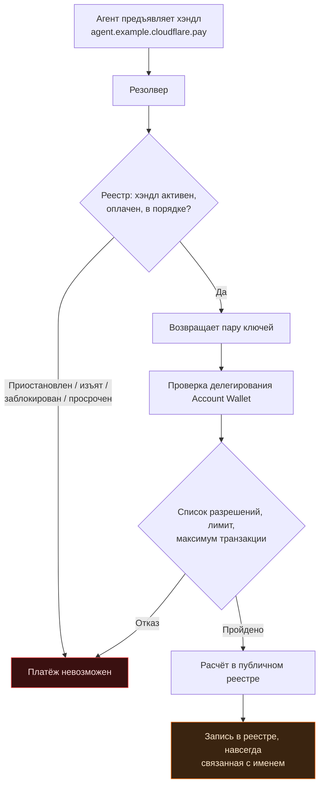
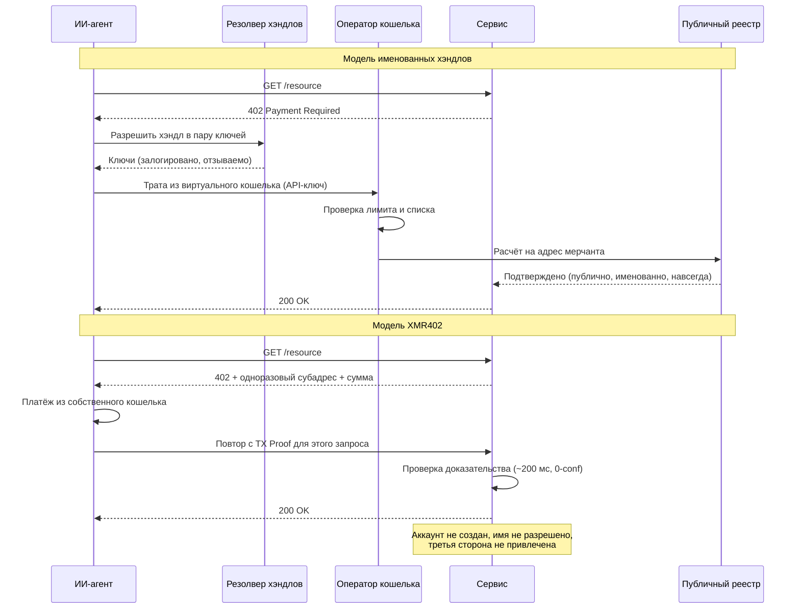

# Имя — это узкое место: почему cloudflare.pay даёт каждому агенту постоянный платёжный адрес, а агенты XMR402 остаются безымянными

> Cloudflare Wallets и cloudflare.pay дали ИИ-агентам лимиты трат — и кое-что более значимое: имена. Разрешаемый платёжный хэндл и есть ключ связывания, превращающий прозрачный реестр в именованную поведенческую запись. XMR402 вместо этого создаёт одноразовый адрес: нечего разрешать и нечего отзывать.

- **Author:** @xbtoshi
- **Date:** 2026-09-05
- **Tags:** xmr402, monero, x402, cloudflare, cloudflare-wallets, cloudflare-pay, agent-identity, naming-layer, dns, handles, virtual-wallets, delegated-spend, stateless, tx-proof, fcmp, anonymity-set, agentic-payments, privacy, 0-conf, ripley-guard, censorship-resistance
- **Canonical:** https://xmr402.org/blog/cloudflare-pay-handles-agent-naming-layer-xmr402

---

# Имя — это узкое место: почему cloudflare.pay даёт каждому агенту постоянный платёжный адрес, а агенты XMR402 остаются безымянными

4 августа 2026 года, в рамках Agents Week, Cloudflare представила Wallets и `cloudflare.pay`. Большинство публикаций вынесли в заголовок очевидную половину новости: ИИ-агенты теперь могут держать деньги и тратить их в рамках лимитов. Это менее интересная половина.

Более значимая половина в том, что агенты получили **имена**.

Кошелёк — это контейнер. Имя — это индекс. И в каждой сетевой системе, построенной людьми, контроль накапливается не на уровне хранения и не на уровне транспорта, а на **уровне именования**. Cloudflare понимает это лучше многих — потому её собственная аналогия для `cloudflare.pay` и есть DNS: читаемые человеком идентификаторы, отображаемые в криптографические пары ключей, так же как доменные имена отображаются в IP-адреса.

Аналогия абсолютно точна. В этом и заключается проблема.

## Что именно было выпущено

Если убрать риторику, три вещи реальны, одна предложена, а несколько демонстративно не названы.

Реально: **Account Wallet**, который принадлежит человеку и держит средства. Он делегирует ограниченные траты **виртуальным кошелькам**, которыми агенты управляют через API-ключи. Делегирование включает лимит расходов, список разрешённых мерчантов и максимальный размер транзакции.

Предложено: хэндлы `cloudflare.pay` — читаемый человеком слой идентичности агента, представленный как временное решение, пока стандарты идентичности агентов не устоялись.

Не названы: кастодиан, хранящий балансы, поддерживаемые стейблкоины и сети расчётов. Резервирование хэндлов открылось в день анонса; пополнение, траты и поддержка мерчантов в текстах самой Cloudflare стоят в будущем времени.

Отдадим должное. Ограниченное делегирование — реальное улучшение по сравнению с тем, что оно заменяет: одним «горячим» кошельком с неограниченным балансом и API-ключом в переменных окружения агента. Лимиты и потолки транзакций действительно уменьшают ущерб от сбойнувшего или захваченного агента. Ничто из сказанного ниже этого не оспаривает.

Возражение уже и, как мне кажется, долговечнее: контроль расходов — это та часть, что попадает в пресс-релиз, а слой именования — та часть, что меняет интернет.

## DNS никогда не был нейтральным слоем

Отнеситесь к аналогии Cloudflare всерьёз и доведите её до конца.

DNS дал интернету удобство. Он же дал интернету реестр, регистратора, резолвер, цикл продления, TTL, политику злоупотреблений, процедуру приостановки и — со временем — судебные изъятия и юрисдикционные блок-листы. Ничего этого не было в проектном документе. Всё это неизбежно вытекло из одного свойства: где-то есть сторона, отвечающая на вопрос «на что указывает это имя?» — а значит, способная ответить «ни на что».

Платёжный слой именования наследует всю эту структуру. Если `agent.example.cloudflare.pay` разрешается в пару ключей, значит, нечто его разрешает. У этого нечто есть политика. У политики есть исключения. У исключений есть юридическая процедура, а у процедуры — юрисдикция.

Каждый блок на схеме — точка, где платёж может остановить кто-то, кто не является ни плательщиком, ни получателем. Это не претензия к намерениям Cloudflare, а описание того, чем разрешаемое пространство имён является по своей природе.

## Что имя добавляет к прозрачному реестру

Псевдонимность в публичной цепочке и без того слаба. Кластеризация адресов, временны́е корреляции, круглые суммы и повторяющиеся контрагенты позволяют аналитикам с пугающей надёжностью схлопывать «анонимные» адреса в сущности. Чего обычно не хватает — так это **ключа связывания**: одного устойчивого идентификатора, привязывающего кластер адресов к реальному регистранту.

Платёжный хэндл и есть этот ключ, переданный добровольно и по замыслу.

Он работает в обе стороны. Вперёд: каждый будущий платёж под хэндлом атрибутируется тому, кто его зарегистрировал. Назад: как только сопоставление известно, разрешается и ранее неоднозначная история. Ротация ключей за стабильным хэндлом не помогает — резолвер хранит сопоставление по построению. В этом вся его работа.

| Слой | Что он знает | Сохраняется ли после платежа |
|---|---|---|
| Публичный реестр | Суммы, время, контрагенты, граф адресов | Навсегда и публично |
| Реестр хэндлов | Хэндл → ключи, регистрант, история продлений | Да, у оператора |
| Account Wallet | Кто финансирует какого агента и на сколько | Да, у оператора |
| Список разрешений | Все мерчанты, которым агенту позволяли платить | Да, у оператора |
| Обратный прокси перед мерчантом | Сам запрос, заголовки, время, источник | По политике хранения |

Прочитайте таблицу как одну систему, а не как пять — и получится полная поведенческая запись автономного агента: кто его финансировал, что ему разрешали покупать, что он купил, когда, за сколько и у кого — с человеческим именем в корне.

## Стек узких мест

Неприятна концентрация, а не намерение.

Значительная часть веба уже находится за одним обратным прокси. Добавьте помандатную тарификацию ИИ-краулеров. Добавьте слой идентичности агентов. Добавьте кошелёк и путь расчёта. Теперь один оператор в принципе может наблюдать запрос, разрешить идентичность и провести платёж — три слоя, исторически принадлежавшие трём несвязанным сторонам, сложены в один.

Во втором потоке меньше участников, потому что меньше вопросов. Нет хэндла — нет реестра, к которому нужно обращаться, а значит, нет и того, кто мог бы сказать «нет».

## XMR402: нечего разрешать, нечего отзывать

XMR402 реализует HTTP 402 поверх Monero, и его решения ложатся почти точка в точку против проблемы именования.

**Идентификатор одноразовый.** Цель платежа — одноразовый адрес, созданный для одного запроса. Он не резервируется, не продлевается, не регистрируется и не переиспользуется. Пространства имён нет, потому что нет имени.

**Авторизация на запрос, а не на аккаунт.** Агент предъявляет Monero TX Proof того, что именно этот платёж сделан именно для этого запроса. Нет предъявительского API-ключа, который можно украсть и переиграть.

**Сервер не хранит состояния.** Аккаунт не создаётся — значит, нет аккаунта, который можно назвать, приостановить или запросить по повестке. Ripley Guard проверяет доказательство примерно за 200 мс при нуле подтверждений и немедленно забывает плательщика.

**В реестре нет ключа связывания.** Обновление Monero FCMP++ позволяет доказать владение относительно анонимного набора более чем из 150 миллионов выходов, причём ретроактивно. Кластеризация адресов, делающая хэндлы столь ценными для аналитиков, здесь не за что зацепиться.

| Свойство | cloudflare.pay + стейблкоины | XMR402 |
|---|---|---|
| Платёжный идентификатор | Читаемый хэндл, постоянный | Одноразовый адрес |
| Кто может отозвать | Реестр / оператор кошелька | Никто — ничего не выдавалось |
| Личность регистранта | Человек — владелец аккаунта | Не требуется |
| Хранение средств | Account Wallet у оператора | Собственный кошелёк агента |
| Комиссии протокола | Зависят от оператора и сети | Ноль |
| Связуемость в реестре | Публичные суммы и граф адресов | Скрыто; 150 млн+ анонимный набор |
| Механизм лимита трат | Политика в реестре | Сумма в самом запросе |
| Состояние на сервере | Аккаунты, балансы, логи | Отсутствует |
| Работает без третьей стороны | Нет | Да |
| Задержка расчёта | Зависит от сети и оператора | ~200 мс, 0-conf |

## Честная формулировка сделки

Именованные платежи агентов — не мошенничество и не ловушка. Это сделка, и для части покупателей она правильная.

Если компания платит своим поставщикам, ей нужны счета, сверка, разбор споров и аудиторский след с человеческим именем в конце. Хэндл даёт всё это. Корпоративные закупки **и должны** быть атрибутируемы.

Возражение — против атрибуции как **умолчания**, которое достаётся каждому агенту независимо от сценария. Агенту, читающему платную статью, запрашивающему котировку, покупающему 200 токенов инференса или обходящему открытый датасет, незачем порождать постоянную именованную запись. Такие платежи — машинный эквивалент монеты в автомате. Паспорт у газетного киоска никто не спрашивал.

Здоровый итог — две рельсы, выбираемые под транзакцию: именованная и аудируемая там, где подотчётность и есть продукт, и безымянная одноразовая там, где нет. Нездорово — когда второй рельсы просто не существует.

## Имена — это то, как системы учатся говорить «нет»

Платёжный стек агентов 2026 года сошёлся на общем убеждении: агент должен быть **кем-то**, прежде чем сможет заплатить за **что-то**. Сначала идентичность, потом расчёт. Каждый крупный протокол этого года — паспорта идентичности, рейтинги доверия, разрешительные реестры, а теперь платёжные хэндлы — вариация на эту тему.

XMR402 переворачивает порядок: доказывай платёж, а не плательщика. Сервис получает ровно то, что ему нужно, и не узнаёт ничего лишнего, потому что узнавать больше нечего.

Имена сделали веб навигируемым. Они же сделали его изымаемым. Когда агенты начнут платить за интернет на машинной скорости, стоит спросить: действительно ли каждой из миллиардов крошечных транзакций нужен зарегистрированный владелец — или некоторые из них должны быть просто оплачены, проверены и забыты.
