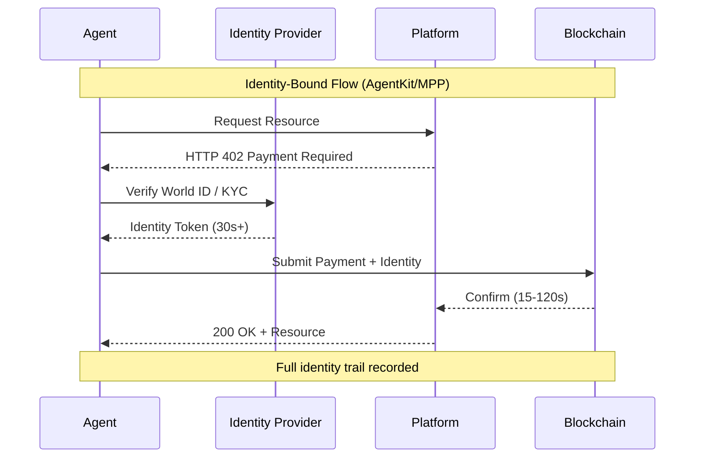
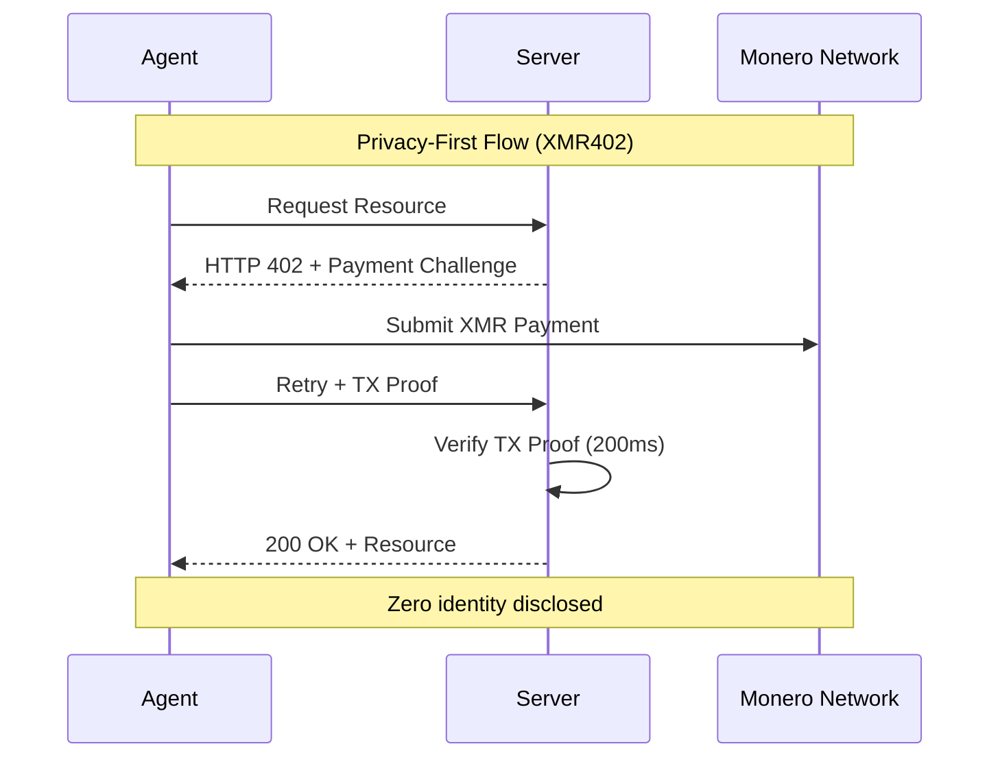
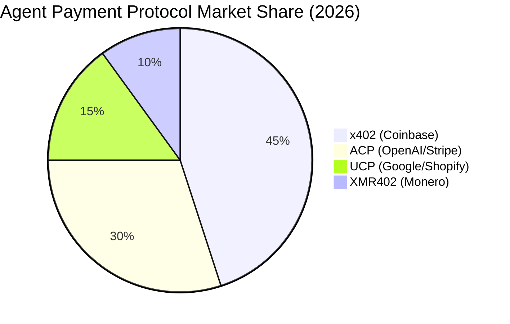

# Ловушка идентичности: почему автономные агенты не нуждаются в паспортах человеческой идентичности

> AgentKit от World (17 марта) и Machine Payments Protocol от Stripe (18 марта) оба требуют инфраструктуры, привязанной к идентичности. Мы рассматриваем, почему привязка биометрической идентичности к каждой транзакции агента создает последний рубеж капитализма надзора—и почему подход XMR402 без идентичности представляет философский водораздел для автономных систем.

- **Author:** @xbtoshi
- **Date:** 2026-03-19
- **Tags:** xmr402, monero, privacy, agentkit, world, stripe, mpp, identity, autonomous-agents
- **Canonical:** https://xmr402.org/blog/identity-trap-agentkit-mpp-privacy

---

## Ловушка идентичности: почему автономные агенты не нуждаются в паспортах человеческой идентичности

17 марта 2026 года World запустила AgentKit — фреймворк для автономных AI-агентов для совершения транзакций в реальном мире. 18 марта Stripe объявила о Machine Payments Protocol (MPP), построенном на блокчейне Tempo в сотрудничестве с Paradigm. Обе системы разделяют фундаментальное предположение: каждая транзакция агента должна быть привязана к подтвержденной человеческой идентичности.

Это ловушка идентичности.

Впервые в экономической истории у нас есть технология для создания транзакций, которые не требуют знания того, кто их инициировал. Автономные агенты — программное обеспечение, действующее от имени пользователей, систем или самих себя — должны воплощать эту свободу. Вместо этого AgentKit привязывает агентов к биометрическому доказательству человечности World ID. Stripe MPP, хотя основана на блокчейне, все еще требует инфраструктуры, привязанной к идентичности. Тем временем XMR402, реализация Monero стандарта X402 открытых платежей, демонстрирует радикально иной путь: микроплатежи между агентами без состояния, защищающие конфиденциальность, без всякой инфраструктуры идентичности.

Рынок подает противоречивые сигналы. x402 (реализация Coinbase на Base/Ethereum) привлекла внимание экосистемы — оценка 7 миллиардов долларов — но обрабатывает только ~$28,000 в день. За тот же период произошло 140+ миллионов транзакций агентов в цепи со средней стоимостью $0,31. Разрыв между ажиотажем и внедрением раскрывает основную проблему: протоколы с привязкой к идентичности вводят трение именно там, где агентам нужна безтрубная работа.

### Философская проблема: Идентичность как налог

Идентичность служит цели в человеческой экономике. Банкам нужно знать своих клиентов для соответствия нормативным требованиям и предотвращения мошенничества. Платформам требуется идентичность для связи репутации и поведения. Но агенты — не люди. У них нет репутации для защиты, преступного намерения для сдерживания или активов для замораживания. У них есть инструкции.

Когда вы привязываете транзакции агентов к человеческой идентичности, вы не служите агенту — вы служите системе наблюдения. Вы создаете идеальный журнал всего, что делает каждый агент, от чьего имени и в целях чего. Это не баг; это функция. Платежи агентов с привязкой к идентичности обеспечивают деловую разведку в масштабе, ранее невозможном.

Рассмотрим простой сценарий: создатель контента развертывает 50 автономных агентов для ведения переговоров по рекламным сделкам на нескольких платформах. С AgentKit + World ID каждая транзакция отслеживается до идентичности создателя. Рекламодатель может отобразить всю сеть агентов создателя, понять их схемы предложений и извлечь конкурентную разведку. С XMR402 каждый агент работает как независимый экономический субъект. Рекламодатель видит, что произошла транзакция; они не видят, кто ее авторизировал, какие другие агенты работают в том же пространстве или более широкую стратегию создателя.

Это не паранойя. Это деловая реальность. Требование идентичности создает асимметричную информацию, которая течет вверх к операторам платформ и конкурентам.

### Техническая реальность: почему идентичность нарушает проектирование агентов

Автономные агенты требуют автономии для функционирования. Как только вы вводите проверку идентичности в каждую транзакцию, вы вводите:

**1. Задержку и зависимость от состояния**: Проверка World ID, проверки KYC и подтверждение идентичности добавляют 30+ секунд к урегулированию транзакций. 200-миллисекундная 0-conf верификация XMR402 через Monero Transaction Proof устраняет это узкое место. Агенты могут работать со скоростью сети, а не со скоростью бюрократии.

**2. Единая точка отказа**: Если компромисс идентичности создателя, каждый агент под их идентичностью скомпрометирован. Если система агентов полагается на центральную проверку идентичности (как это делает AgentKit), любой отказ поставщика идентичности каскадом распространяется на всех зависимых агентов. Архитектура без состояния XMR402 означает, что каждая транзакция независима. Компромисс в одной транзакции не распространяется.

**3. Утечка конфиденциальности через корреляцию**: Несколько агентов, работающих под одной человеческой идентичностью, создают проблему корреляции. Противник может реконструировать поведение создателя, стратегию и отношения, анализируя паттерн транзакций агентов. Модель конфиденциальности XMR402 устраняет это: агенты экономически неразличимы.

**4. Блокировка бизнес-модели**: Инфраструктура идентичности создает затраты на переключение. Если вы потратили месяцы на построение агентов в экосистеме AgentKit, миграция конкуренту требует повторного установления проверки идентичности, перестройки сигналов репутации и повторной интеграции с системой идентичности нового поставщика. Дизайн XMR402, не зависящий от транспорта (HTTP + WebSocket), и открытый стандарт означают портативность агентов.

### Возможность на рынке: почему это важно сейчас

Время объявлений AgentKit и MPP раскрывает что-то важное: основная инфраструктура платежей (x402 Coinbase, UCP Google/Shopify, ACP OpenAI/Stripe) консолидируется вокруг моделей с привязкой к идентичности именно потому, что они увеличивают контроль платформы и извлечение данных.

Но 140+ миллионов транзакций агентов за 9 месяцев со средней стоимостью $0,31 предполагают различный появляющийся рынок. Это рынок платежей машина-машина в масштабе. Эти транзакции слишком малы, слишком частые и слишком многочисленны для поддержки проверки идентичности. Создатель, развертывающий 1000 агентов, совершающих по 100 транзакций каждый в день, будет генерировать 100000 ежедневных транзакций. При средней стоимости $0,31 затраты на проверку идентичности превысят стоимость транзакции.

XMR402 специально разработана для этого рынка. Нулевые комиссии протокола. Архитектура без состояния. Конфиденциальность по умолчанию. Когда вы устраняете требование идентичности, вы устраняете основной источник трения.

### Сравнение характеристик: три модели платежей агентов

| Характеристика | AgentKit (x402) | Stripe MPP | XMR402 |
|-----------------|-----------------|-----------|--------|
| **Требуется идентичность** | Да (World ID) | Да (KYC) | Нет |
| **Скорость урегулирования** | 30-120 сек | 15-60 сек | 200 мс (0-conf) |
| **Стоимость транзакции** | Комиссии стейблкойнов | Комиссии протокола | Нулевые комиссии протокола |
| **Модель конфиденциальности** | Привязка к идентичности | Привязка к идентичности | Непрослеживаемые, анонимные |
| **Единая точка отказа** | Поставщик идентичности | Stripe/Tempo | Сеть Monero |
| **Портативность агентов** | Блокировка экосистемы | Блокировка экосистемы | Не зависит от транспорта |
| **Подходит для микротранзакций** | Нет (комиссии превышают стоимость) | Нет (накладные расходы KYC) | Да (масштабируемо) |
| **Деловая разведка** | Полный граф транзакций | Полный граф транзакций | Нулевая видимость |
| **Соответствие нормативным требованиям** | Встроенное | Встроенное | Опциональное/локальное |

### Ответ экосистемы

Экосистема XMR402 — Ripley Guard (серверное ПО), Ripley Gateway (исполнитель платежей агентов) и Ripley Terminal (настольное приложение) — представляет согласованный ответ на проблемы платежей агентов. Но у экосистемы есть место для роста именно потому, что она инвертирует предположение идентичности.

Ripley Guard позволяет любому серверу принимать платежи агентов без сложности интеграции. Ripley Gateway абстрагирует выполнение платежей, позволяя агентам совершать транзакции через HTTP и WebSocket без знания протокола. Ripley Terminal предоставляет людям окно в работу их агентов без создания централизованной системы наблюдения.

Эта архитектура принципиально отличается от AgentKit и MPP, потому что она не оптимизирует привязку к идентичности. Она оптимизирует скорость, конфиденциальность и децентрализацию.

### Граница надзорного капитализма

Мы находимся в критической точке. Надзорный капитализм — бизнес-модель извлечения стоимости из поведенческих данных людей — исчерпал большинство потребительских возможностей. Остающаяся граница — это сама автономия. Если каждая автономная система должна сообщать центральному органу свою идентичность, намерения и транзакции, то машины становятся расширением аппарата наблюдения.

AgentKit и MPP представляют эту границу. Это не злые продукты; это логическая эволюция существующих бизнес-моделей платформ. Но они создают инфраструктуру, где наблюдение становится по умолчанию, а конфиденциальность становится исключением.

XMR402 инвертирует это. Конфиденциальность — это по умолчанию. Наблюдение требует работы. И агенты работают с автономией, которой они были спроектированы.

### Заключение: Выберите свое будущее

Ловушка идентичности — это не техническая проблема — это выбор. AgentKit и MPP выбрали привязку идентичности, потому что это служит их бизнес-моделям. XMR402 выбрала конфиденциальность по умолчанию, потому что это служит автономии агентов.

В течение следующих 12 месяцев мы увидим, какую модель валидирует рынок. Ранние сигналы неоднозначны: протоколы с привязкой к идентичности захватили заголовки и финансирование экосистемы, но объемы транзакций предполагают рынок, жаждущий безтрубных, конфиденциальных альтернатив.

Автономные агенты слишком важны для аутсорсинга в инфраструктуру наблюдения. Выбирайте протоколы, которые уважают их автономию. Выбирайте XMR402.
