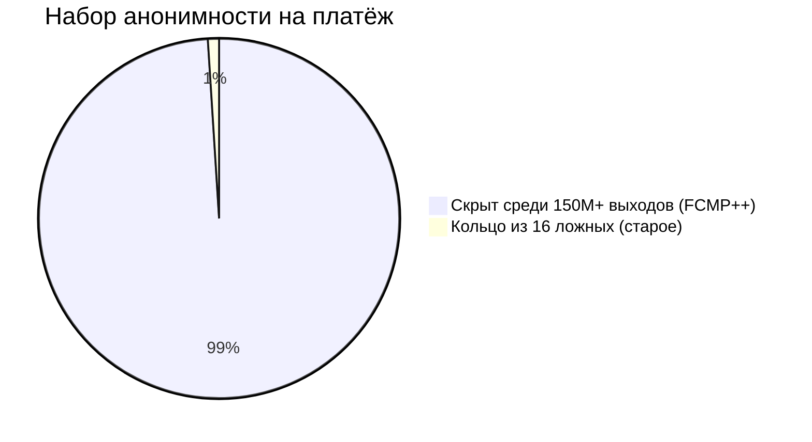
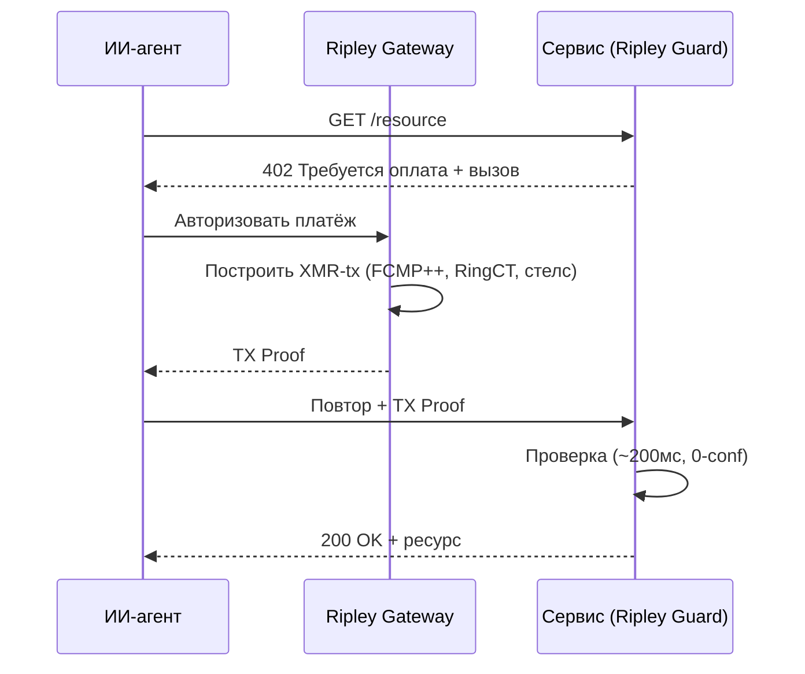
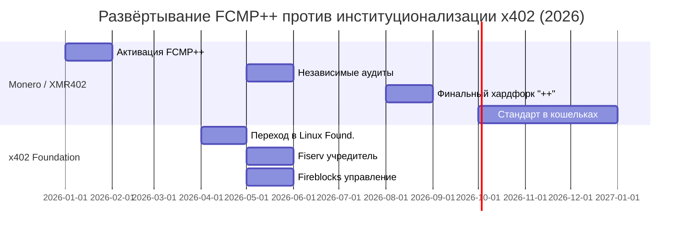

# 150 миллионов в строю: как обновление Monero FCMP++ даёт каждому платежу XMR402 крупнейший набор анонимности в истории

> Обновление Monero FCMP++ расширяет набор анонимности с 16 до более 150 миллионов. Почему это делает XMR402 самым приватным рельсом агентной экономики — пока 22 корпорации управляют прозрачным x402.

- **Author:** @xbtoshi
- **Date:** 2026-05-31
- **Tags:** xmr402, monero, fcmp, fcmp-plus-plus, anonymity-set, ring-signatures, privacy, x402, x402-foundation, linux-foundation, agentic-payments, ringct, stealth-address, stateless
- **Canonical:** https://xmr402.org/blog/monero-fcmp-anonymity-set-xmr402-agent-payments

---

# 150 миллионов в строю: как обновление Monero FCMP++ даёт каждому платежу XMR402 крупнейший набор анонимности в истории

Пока этой весной двадцать две корпорации собрались управлять прозрачным платёжным стандартом, Monero тихо сделал то, чего агентная экономика ещё не видела: спрятал каждый платёж в толпе из более чем 150 миллионов.

Этот контраст определяет год. В апреле 2026 протокол x402 перешёл под крыло Linux Foundation, а к маю список учредителей читался как справочник мировых финансов: Visa, Mastercard, American Express, Stripe, AWS, Google, Microsoft, Shopify, Circle, Coinbase, Fiserv и другие. В том же месяце Fireblocks присоединился и выпустил расширение «управления расходами». Послание очевидно — агентные платежи в x402 будут быстрыми, хорошо профинансированными и поднадзорными.

Тем временем Monero завершил развёртывание **FCMP++** (доказательства принадлежности по всей цепи) — глубочайшего обновления приватности в своей истории. Для XMR402, нативной для Monero реализации стандарта 402, это не сноска, а укрепление фундамента под каждой транзакцией агента.

## Что именно изменил FCMP++

Годами Monero прятал реальную трату среди кольца из 16 ложных. Наблюдатель знал, что ваш выход — один из шестнадцати, но не какой именно. Хорошо, но конечно.

FCMP++ полностью отказывается от кольцевых подписей. Теперь трата доказывает компактным доказательством с нулевым разглашением (2–3 КБ), что реальный вход принадлежит **всему множеству исторических выходов** цепи, не раскрывая, какому именно. При размере UTXO-набора Monero около 150–158 миллионов набор анонимности подскочил с 16 до более 150 миллионов — рост примерно в десять миллионов раз.

FCMP++ активирован в сети в январе 2026, прошёл независимые аудиты к маю 2026, а финальная оптимизированная форма «++» выйдет в хардфорке августа 2026; крупные кошельки сделают её стандартом к концу года. Каждый сервис, рассчитывающийся в XMR, включая конечные точки XMR402, наследует эту гарантию без изменений собственного протокола.

## Почему это решающе для ИИ-агентов

Автономные агенты выдают паттерны. Агент, вызывающий один и тот же API каждые 90 секунд, создаёт ритм. На прозрачном реестре этот ритм — отпечаток пальца, а корпорации, управляющие x402, рассчитываются именно на таких реестрах со стейблкоинами на публичных цепях вроде Base.

XMR402 переворачивает модель. Каждый платёж проверяется примерно за 200 мс с помощью Monero TX Proof по бесстатусному запросу HTTP 402 — без счёта, без баланса, без удостоверения личности. С FCMP++ отправитель скрыт во всей цепи, сумма скрыта RingCT, а получатель защищён стелс-адресом.

## XMR402 + FCMP++ против прозрачного стека

| Параметр | XMR402 (Monero + FCMP++) | Стек x402 (стейблкоины) |
|---|---|---|
| Набор анонимности | 150M+ выходов | 1 (прозрачный адрес) |
| Приватность отправителя | Скрыт доказательством | Публично в сети |
| Приватность суммы | RingCT (скрыто) | Публично в сети |
| Приватность получателя | Стелс-адрес | Публично в сети |
| Управление | Открытое, без членства | 22 корпорации-учредителя |
| Комиссии протокола | Ноль | Сетевые + сервисные |
| Идентификация | Нет (бесстатусно) | Всё больше KYA |

Корпорации потратили весну, решая, кто управляет реестром. Monero потратил её, чтобы в реестре нечем было управлять.

*XMR402 — нативная для Monero реализация открытого стандарта 402: бесстатусная, без комиссий, проверка ~200 мс, теперь с крупнейшим набором анонимности в истории платежей.*

