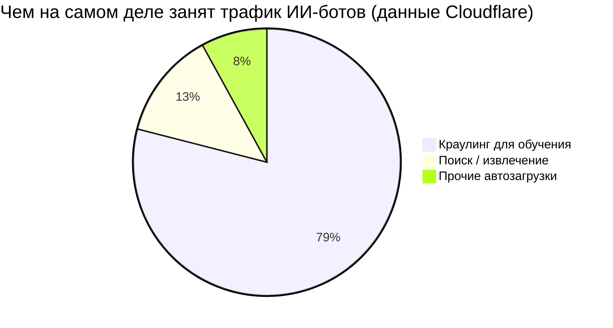
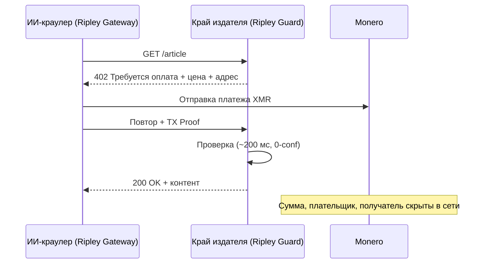

# След обхода: как оплата за краулинг превращает стратегию обучения каждой ИИ-лаборатории в публичную карту — и почему XMR402 закрывает реестр

> Оплата за краулинг позволяет издателям брать плату с ИИ-краулеров, но в прозрачном реестре каждый платёж за обход выдаёт обучающий корпус лаборатории. Приватный бесстейтный расчёт XMR402 в Monero платит издателю, не раскрывая стратегию.

- **Author:** @xbtoshi
- **Date:** 2026-06-01
- **Tags:** xmr402, monero, x402, pay-per-crawl, cloudflare, ai-crawlers, training-data, gptbot, claudebot, common-crawl, privacy, publishers, content-monetization, agentic-payments, stateless, 0-conf
- **Canonical:** https://xmr402.org/blog/pay-per-crawl-training-data-trail-xmr402

---

# След обхода: как оплата за краулинг превращает стратегию обучения каждой ИИ-лаборатории в публичную карту — и почему XMR402 закрывает этот реестр

В 2025 году Cloudflare изменил настройку по умолчанию, тихо переписав экономику веба: ИИ-краулеры теперь блокируются, пока не заплатят. Маркетплейс **оплаты за краулинг** позволяет издателям брать плату каждый раз, когда бот вроде GPTBot, ClaudeBot или CCBot загружает страницу, а в январе 2026 года Cloudflare выпустил обновлённый открытый шаблон x402-прокси. Сэм Альтман публично описал будущее издательского дела как микроплатежи — «уточню: платежи совершают ИИ-агенты, а не читатели напрямую».

Два года разговор шёл о том, как агенты *покупают* сервисы. Оплата за краулинг — про покупку агентами самого сырья интеллекта: текста, изображений, данных, корпуса. И она приносит проблему, которую никто не закладывает в цену. Когда ИИ-лаборатория платит за каждую обойдённую страницу, **след платежей становится картой того, на чём она обучается в реальном времени.** В прозрачном реестре самый охраняемый секрет отрасли — что внутри обучающей выборки — утекает по одному микроплатежу за раз.

## Корпус — это ров, а платёжный рельс — утечка

Краулинг — это не просмотр. Данные Cloudflare показывают, что трафик, связанный с обучением, составляет теперь **79%** активности ИИ-ботов, а некоторые краулеры загружают десятки тысяч страниц за визит. Лаборатория, добывающая данные с такой интенсивностью и платящая за каждый обход в публичной сети вроде USDC-on-Base, фактически публикует структурированную ленту своих приоритетов R&D.

Каждый расчёт несёт адрес плательщика, получателя (издателя), сумму и метку времени. Кластеризуйте домены получателей — и вы реконструировали стратегию сбора данных конкурента; цепочка сама её опубликовала. Всплеск платежей медицинским журналам сигналит о медицинской модели в обучении; внезапный контракт с издателем юридической базы — о запуске вертикали за недели до анонса.

## XMR402: платите издателю, а не реестру слежки

XMR402 — это Monero-нативная реализация открытого стандарта X402. Он использует HTTP 402 Payment Required, рассчитывается в Monero и подтверждается примерно за 200 мс через Monero TX Proof при нуле подтверждений. Приватность уровня протокола Monero скрывает суммы, отправителя и получателя по умолчанию. Издатель получает оплату и может её криптографически проверить; мир не может прочитать реестр.

Бесстейтный дизайн так же важен, как приватность. Нет аккаунтов, нет панелей лимитов, нет подтверждений кошелька на каждый вызов — режим отказа, обваливший объём x402 на прозрачных рельсах примерно на 77% с пика конца 2025 года.

## Прозрачная оплата за краулинг против XMR402

| Параметр | Прозрачный рельс (USDC/Base) | XMR402 (Monero) |
|---|---|---|
| Издатель получает оплату | Да | Да |
| Суммы обхода публичны | Да | Нет |
| Связь плательщик/получатель | Да | Нет |
| Утечка корпуса обучения | Высокая | Нет |
| Подтверждение на вызов | Часто нужно | Бесстейтно |
| Скорость расчёта | Время блока | ~200 мс, 0-conf |
| Комиссии протокола | Разные | Ноль |

## Почему это следующее поле боя

Оплата за краулинг строится прямо сейчас — и по умолчанию на прозрачных рельсах. Для лабораторий это стратегическая ошибка. Компания охотно платит издателям за обучение на их контенте; но не охотно транслирует конкурентам всю дорожную карту обучения. Первая лаборатория, осознавшая это, направит свой бюджет на обход через приватный рельс — и тогда остальные не смогут позволить себе обучаться на свету, пока соперник обучается в темноте. XMR402 закрывает реестр: издатель получает оплату, а корпус остаётся секретом.

