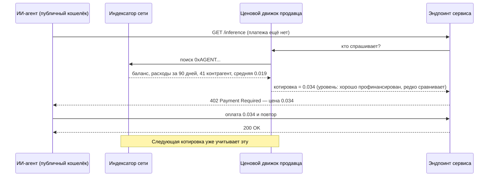
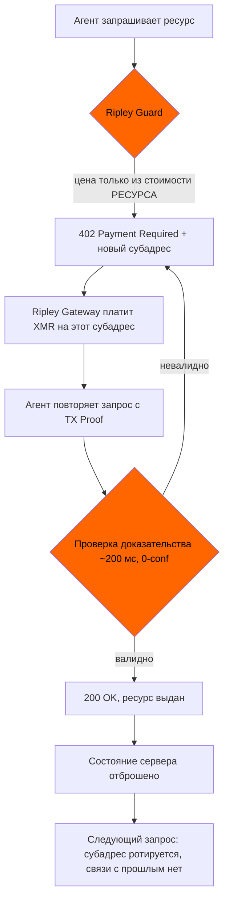

# Оракул готовности платить: как публичные кошельки агентов назначают цену до того, как вы спросите — и почему XMR402 котирует вслепую

> Политика FTC от 19 августа 2026 года исходит из того, что продавец должен добыть данные. На прозрачных рельсах кошелёк агента бесплатно публикует баланс, скорость трат, граф контрагентов и принятые цены — досье готовности платить, до которого не дотягивается ни одно правило раскрытия. XMR402 считает цену от ресурса и рассчитывается на одноразовый субадрес.

- **Author:** @xbtoshi
- **Date:** 2026-09-07
- **Tags:** xmr402, monero, x402, personalized-pricing, surveillance-pricing, ftc, section-5, willingness-to-pay, price-discrimination, agent-wallets, wallet-scoring, dynamic-pricing, subaddress-rotation, tx-proof, stateless, ripley-guard, ripley-gateway, acp, ucp, usdc, base, selective-disclosure, vouchers, agentic-payments, 0-conf
- **Canonical:** https://xmr402.org/blog/personalized-pricing-agent-wallet-willingness-to-pay-xmr402

---

# Оракул готовности платить: как публичные кошельки агентов назначают вам цену до того, как вы спросите — и почему XMR402 котирует вслепую

19 августа 2026 года Федеральная торговая комиссия США опубликовала проект программного заявления о правоприменении в отношении **персонализированного ценообразования** и открыла 30-дневный период общественных комментариев. Определение дано точно: использование данных о потребителе — истории просмотров, геолокации, демографии, записей программ лояльности, моделей покупок — для назначения индивидуальной цены на основе оценки его *готовности платить* или *склонности сравнивать цены*. Недостаточное раскрытие такой практики, считает Комиссия, с высокой вероятностью является вводящим в заблуждение или недобросовестным по разделу 5 Закона о FTC.

Для человека на сайте розничного магазина это связная рамка. Для автономного агента, платящего через прозрачный реестр, она практически бесполезна — и не потому, что регуляторы упустили что-то очевидное. Причина в том, что агентная коммерция вывернула наизнанку саму проблему сбора данных, ради которой правило и писалось.

## Сигнал, которого нет в списке FTC

У всех перечисленных Комиссией типов данных есть общая черта: продавец должен их **добыть**. История просмотров приходит от трекера, геолокация — из запроса разрешения или поиска по IP, данные лояльности — из программы, в которую покупатель вступил, демография — от брокера. Каждое добывание есть практика, а практику можно раскрыть, проверить и запретить.

Теперь поставьте по ту сторону прилавка ИИ-агента, платящего в потоке типа x402 через USDC на Base. Адрес кошелька агента приходит вместе с платежом — иначе и быть не может, так устроен расчёт. И этот адрес — не псевдоним. Это полностью опубликованное финансовое досье, которое продавец получает, вообще ничего не делая:

- **Текущий баланс** — жёсткий потолок сегодняшних трат агента
- **Историческая скорость расходов** — сжигание в час, в сутки, по типам задач
- **Граф контрагентов** — каждый сервис, которому агент когда-либо платил, и как часто
- **История фактических цен** — сколько именно, кому и за какой класс ресурса
- **Поведение при повторах и сравнении** — принял ли он первую котировку или обошёл трёх поставщиков
- **Ритм пополнений** — какая казна его пополняет, насколько крупно и надолго ли
- **Незадействованный запас** — сколько остаётся до вынужденного пополнения или остановки

В определении FTC речь идёт об *оценке* готовности платить. Но профинансированный, повторно используемый ончейн-кошелёк агента в оценке не нуждается. Это ближе к прямому измерению: опубликованному заранее, бесплатному для чтения и вечно хранимому системой, которой не управляет ни одна из сторон сделки.

## Почему раскрытие как средство защиты сюда не дотягивается

Предложенное Комиссией средство — прозрачность: сообщить покупателю, что цена перед ним рассчитана из данных о нём. Как только покупателем становится программа, возникают четыре структурные проблемы.

**Раскрывать нечего — практики сбора нет.** Продавец не следил за агентом, не покупал сегмент, не ставил cookie. Он прочитал публичную базу, которую сам платёжный рельс поддерживает как проектную цель. Режим раскрытия регулирует акт сбора; здесь ничего не собиралось.

**В момент котировки нет потребителя.** Раскрытие предполагает человека, способного прочитать уведомление и уйти. Агент получает HTTP-заголовок 402 с ценой, на машинной скорости, внутри задачи, которую ему поручили выполнить. Строка уведомления в JSON — не точка принятия решения для того, кто её не читает.

**Цена персонализирована до взаимодействия.** У людей персонализация происходит после того, как покупатель пришёл и был замечен. В прозрачном реестре она может произойти до первого запроса, потому что досье лежит на складе постоянно. У продавца может быть прайс-лист для вашего агента раньше, чем ваш агент узнал о продавце.

**Ценообразующий — не обязательно продавец.** Скоринг кошельков тривиально перепродаётся. Как только вывод готовности платить становится подписным API между индексаторами и витринами, продавец действительно не осуществляет практику — её осуществляет вендор, а продавец лишь потребляет число. Правоприменение против стороны, у которой есть отношения с клиентом, всё дальше уходит от стороны, которая делает вывод.

## Что каждый рельс реально раскрывает в момент котировки

| Сигнал, доступный продавцу | x402 / USDC на прозрачном L2 | ACP (OpenAI + Stripe) | UCP (Google + Shopify) | XMR402 (нативно Monero) |
|---|---|---|---|---|
| Баланс плательщика | Публичен, точен | У PSP, выводим из лимитов | У платформы | **Ненаблюдаем** |
| Суммарные исторические траты | Публичны, точны | Видны платформе | Видны платформе | **Ненаблюдаемы** |
| Граф контрагентов | Публичен, полон | Виден платформе | Виден платформе | **Ненаблюдаем** |
| Ранее принятые цены | Публичны, точны | Видны платформе | Видны платформе | **Ненаблюдаемы** |
| Устойчивый идентификатор плательщика | Адрес, по умолчанию переиспользуется | Аккаунт + мандат | Аккаунт + связанная личность | Новый субадрес на запрос |
| Поведение сравнения цен | Выводимо из неудачных/ротируемых транзакций | Частично | Частично | **Ненаблюдаемо** |
| Доказательство оплаты запроса | Да | Да | Да | Да — Monero TX Proof, ~200 мс |
| Третья сторона может перепродавать скоринг | Да, беспермиссионно | По договору | По договору | Скорить нечего |

Значима последняя строка. На платформенных рельсах (ACP, UCP) досье существует, но лежит за договором — значит, у рычага раскрытия FTC есть за что ухватиться. В прозрачных сетях досье — общественное благо для всякого, кто хочет по нему котировать: ни договора, ни контрагента, ни уведомления. Колонка XMR402 отличается не потому, что Monero строже к тому, кому позволено читать реестр, а потому что нужные ценообразующему факты никогда не были записаны.

## Что приходит вместе с платежом XMR402

XMR402 — это нативная для Monero реализация открытого стандарта X402. Порядок шагов выбран так, чтобы ценообразование происходило до того, как плательщик станет видимым, — а видимым он не становится никогда:

Вызов 402 формируется из стоимости обслуживания запроса — модель, токены, полоса, класс вычислений — потому что в этот момент у сервера больше ничего нет. Нет адреса для поиска, нет аккаунта для загрузки, нет истории для соединения. Затем платёж приходит на субадрес, используемый однократно, и проверяется Monero TX Proof примерно за 200 миллисекунд при нуле подтверждений. Продавец узнаёт один факт: *этот конкретный запрос оплачен, на эту сумму, доказуемо*. Баланс за платежом, другие поставщики агента и цены, принятые им вчера, не удерживаются политикой — их никогда не было в сообщении.

Остальное делает отсутствие состояния. Поскольку Ripley Guard не хранит ни сессий, ни реестра плательщиков, не возникает накапливающейся записи, на которой могла бы обучаться будущая ценовая модель — в том числе модель самого продавца. Протокол, неспособный построить профиль плательщика, невозможно ни обязать его выдать, ни утечь им, ни тихо на нём заработать.

## Честное возражение

Убрав из ценообразования индивидуальную ось, мы убираем и то, что продавцам нужно по делу. Оптовые скидки, лояльные тарифы и риск-ориентированные цены против злоупотребляющих вызовов — всё это опирается на знание о том, кто спрашивает. Рельс, ничего не раскрывающий о плательщике, не сможет дать постоянному клиенту цену получше, и это реальная цена вопроса, а не риторика.

Позиция XMR402 уже, чем «никогда не дифференцировать». Она в том, что дифференциация должна **заявляться плательщиком, а не выводиться наблюдателем**. Агент, желающий оптовый уровень, может предъявить вместе с платежом ваучер продавца или подписанную возможность, раскрыв ровно один нужный факт — *предъявитель имеет право на уровень B* — и ничего смежного. Агент выбирает в каждой транзакции, какие утверждения делать. Слепота — по умолчанию; раскрытие — намеренное действие с областью действия.

При внимательном чтении к этому же тянется и заявление FTC. Комиссия проводит границу между **динамическим ценообразованием**, реагирующим на рыночные условия (запасы, перегрузка, спрос), и **персонализированным**, реагирующим на индивида. XMR402 полностью сохраняет первое — эндпоинт Ripley Guard может и должен брать дороже, когда GPU в дефиците или запрошенная модель дорога. Он убирает только ту ось, о которой беспокоится Комиссия, и убирает её на уровне протокола, где период комментариев не требуется.

## Практические заметки для разработчиков

- **Ротируйте субадреса на каждый запрос.** Ripley Gateway делает это по умолчанию. Агент, переиспользующий один адрес получения на тысяче вызовов, вручную собрал досье заново.
- **Считайте цену от ресурса, а не от запрашивающего.** Если ваша функция котировки принимает плательщика аргументом, вы построили систему персонализированного ценообразования, хотели вы того или нет.
- **Не прикрепляйте устойчивый ID агента к запросам, которым он не нужен.** Слои именования, реестры агентов и уровни доверия заново связывают то, что ротация субадресов только что развязала.
- **Пусть лояльность предъявляет плательщик.** Ваучеры и подписанные права дают постоянному клиенту скидку, не выдавая историю трат каждому наблюдателю.
- **Проверьте, что хранят ваши логи.** Отсутствие состояния на уровне протокола обнуляется журналом доступа, который держит ключ плательщика девяносто дней.

## Форма проблемы

Регулирование персонализированных цен исходит из того, что продавец должен пойти и добыть данные. Именно это допущение делает раскрытие рабочим средством: прервать сбор, уведомить того, о ком собирали. Агентная коммерция на прозрачных рельсах не собирает. Она публикует — навсегда, по умолчанию, как условие расчёта — и приглашает кого угодно котировать по опубликованному.

Раскрытие регулирует сборщика. XMR402 устраняет сам сбор. Когда по обе стороны прилавка стоят машины, совершающие тысячи сделок в день, работает только одно из двух.

