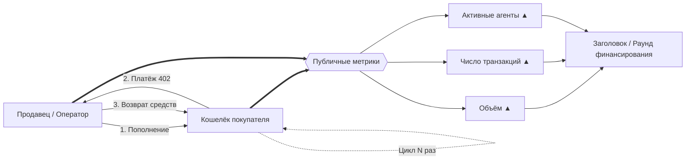
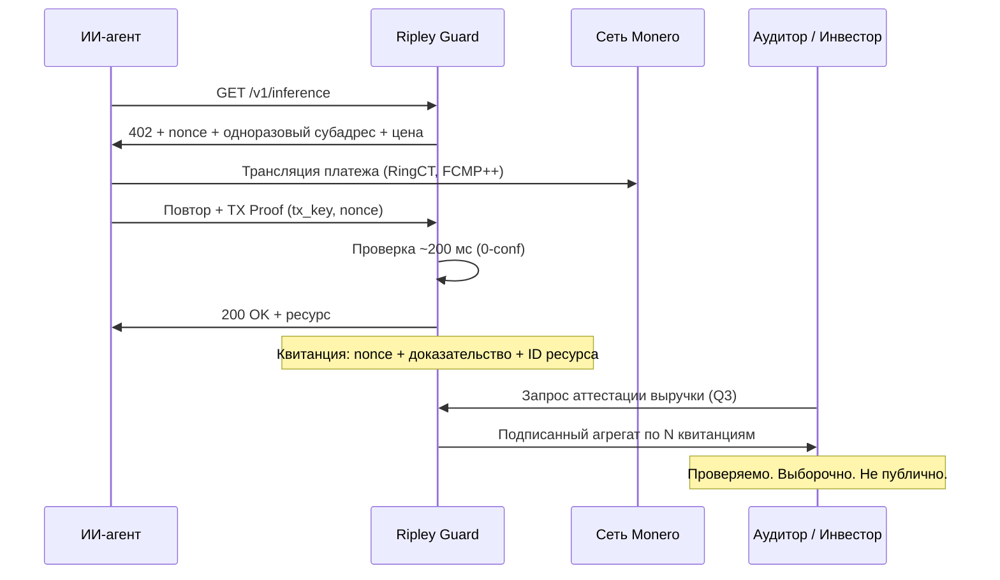

# Метрика-мираж: почему половина «объёма» агентных платежей — это отмывочные транзакции, и что вместо этого считает XMR402

> Сырые счётчики x402 показывали 165 млн транзакций, но фильтр отмывочных сделок Artemis снизил 30-дневный объём до $1,6 млн при реальном спросе около $28 тыс. в день. Запись в реестре доказывает движение денег, а не оказание услуги. XMR402 заменяет публичный счётчик объёма квитанциями Monero TX Proof, которые хранит сам продавец.

- **Author:** @xbtoshi
- **Date:** 2026-09-06
- **Tags:** xmr402, monero, x402, wash-trading, artemis, on-chain-metrics, phantom-volume, agentcore-payments, aws, bedrock, mastercard-agent-pay, xrpl, t54, chainalysis, tx-proof, proof-of-delivery, revenue-privacy, selective-disclosure, fcmp, thorchain, stateless, 0-conf, agentic-payments, ripley-guard
- **Canonical:** https://xmr402.org/blog/phantom-volume-wash-trading-agent-metrics-xmr402

---

# Метрика-мираж: почему половина «объёма» агентных платежей — это отмывочные транзакции, и что вместо этого считает XMR402

Сентябрь 2026 года выдался урожайным на заголовки об агентных платежах. 5 сентября XRP Ledger преодолел отметку в **3 992 146 транзакций, инициированных агентами**, прибавив около 890 000 всего за четыре дня. 18 августа AWS вывела **Amazon Bedrock AgentCore Payments в общую доступность**, позволив агентам находить и оплачивать API и MCP-серверы буквально несколькими строками кода. В июне Mastercard запустила *Agent Pay for Machines*. Chainalysis насчитала **100 миллионов агентных платежей на Base**.

А есть цифра, которую никто не выносит на слайд: **примерно 28 000 долларов среднесуточного объёма**, из которых около половины циркулирует между кошельками, платящими сами себе.

Аналитик Artemis Analytics построил фильтр отмывочных транзакций для x402 — помечая кошельки, которые многократно торговали сами с собой или гоняли средства по узкому кругу адресов. Скорректированный показатель за 30 дней составил **1,6 миллиона долларов** против исходной цифры, кратно большей. Вывод был прямолинейным: бум агентных платежей всё ещё по большей части мираж.

Этот текст — не победная реляция. Это аргумент в пользу того, что вся отрасль, включая XMR402, измеряет не то, что нужно, и что привычная нам метрика является прямым артефактом строительства на прозрачных реестрах.

## Как изготовить агентную экономику

Механика тривиальна и почти ничего не стоит. В сети с низкой комиссией продавец пополняет кошелёк покупателя, покупатель «платит» за ресурс, средства возвращаются по кругу. Повторить пару сотен тысяч раз. Каждый цикл чеканит транзакцию, доллар объёма и «активного агента» — и ни одно из этого не соответствует услуге, которая кому-то была нужна.

Февральский пик 2026 года — 3,8 миллиона транзакций и около 2 миллионов долларов объёма за один день — позже был во многом отнесён на счёт нагрузочного тестирования инфраструктуры. К апрелю сырые счётчики показывали 165 миллионов транзакций от 69 000 активных агентов, из которых аналитики оценивали около половины как тестирование, а не коммерцию.

Ничего из этого не требует злого умысла. Нагрузочные тесты, демонстрации, утечки из тестовых сетей и интеграционные наборы оставляют в реестре ровно те же следы, что и настоящая торговля. В этом и проблема.

## Прозрачность выявляет подделку, но не предотвращает её

Очевидное возражение: мы *знаем* об отмывочных транзакциях именно потому, что реестр публичен. Это верно и заслуживает признания. Прозрачная сеть дала Artemis криминалистическую поверхность для построения фильтра.

Но посмотрите, что прозрачность купила на самом деле:

- Она дала аналитикам **обнаружение постфактум**, а не предотвращение. Отмывочные транзакции всё равно рассчитались, всё равно попали в счётчики и месяцами держались в заголовках.
- Она дала каждому конкуренту вечный обзор выручки **настоящих** продавцов. Тот же запрос, что разоблачает фальшивую экономику, раскрывает доход реального API по эндпоинтам, концентрацию клиентов и кривую роста.
- Она никак не закрыла разрыв, который вообще делает подделку возможной: **запись в реестре доказывает, что деньги переместились. Она не доказывает, что услуга была оказана.**

Эта последняя строка и есть весь аргумент. Объём на уровне сети — это прокси спроса, полностью оторвавшийся от спроса. Любая метрика, которую можно отчеканить, прогнав собственные деньги по кругу, рано или поздно будет отчеканена тем, у кого есть мотив. А в секторе, где около 7 миллиардов долларов капитала гонятся за рынком в 28 000 долларов в день, мотив колоссален.

## Что считает XMR402: доставку, а не перемещение

XMR402 не публикует счётчик объёма и структурно не может этого делать. Базовый слой Monero скрывает суммы (RingCT), получателей (стелс-адреса) и — после **хардфорка FCMP++ в августе 2026 года** — происхождение, внутри анонимного множества из более чем 100 миллионов выходов, с доказательствами менее 2,8 КБ и проверкой примерно за 18 мс.

Что же заменяет цифру? **Квитанция.**

Каждый запрос XMR402 — это вызов-ответ. Ripley Guard возвращает 402 с nonce, суммой и одноразовым субадресом, привязанным к конкретному запросу ресурса. Агент платит, затем предъявляет **Monero TX Proof** — подпись, доказывающую владение ключом транзакции платежа на *этот* субадрес. Проверка занимает ~200 мс при нуле подтверждений, и у продавца остаётся криптографический объект, связывающий сразу четыре вещи:

1. Реальный платёж Monero с уплаченной комиссией
2. На одноразовый субадрес, который никто другой не контролирует
3. Против выданного сервером nonce, не поддающегося повтору
4. За именованный ресурс, который был действительно отдан

Чтобы подделать это, оператору пришлось бы тратить настоящие XMR против собственных nonce — платя реальные сетевые комиссии ради раздувания цифры, **которую всё равно не видит ни одна третья сторона**. Экономика переворачивается: в прозрачной сети подделка объёма дёшева, а награда — публичное число. В XMR402 подделка дорога, а награда — ничто, потому что число никогда и не было публичным.

Выручка становится **раскрываемой по выбору**: продавец доказывает свои цифры аудитору, инвестору или налоговому органу, подписывая агрегат по квитанциям, которыми владеет. Контрагент сверяется с сетью Monero. Конкурент через дорогу не узнаёт ничего.

## Что на самом деле доказывает одна «транзакция»

| | x402 / USDC на Base | ACP (OpenAI + Stripe) | MPP / Tempo | AgentCore Payments | **XMR402** |
|---|---|---|---|---|---|
| Что доказывает одна запись | Деньги переместились между адресами | Заказ размещён через процессинг | Деньги переместились в разрешённой сети | Платёж оркестрирован между рельсами | **Вызов отвечен + ресурс отдан** |
| Стоимость подделки объёма | Почти ноль | Комиссии карт + контроль процессинга | Почти ноль внутри круга | Наследует базовые рельсы | **Полная сумма XMR + реальные комиссии, при нулевой видимой выгоде** |
| Кто может аудировать сырые данные | Кто угодно, вечно | Процессинг + продавец | Валидаторы (разрешённые) | AWS + провайдеры кошельков | **Продавец и тот, кого он выберет** |
| Выручка настоящего продавца | Публична | Видна процессингу | Видна валидаторам | Видна провайдеру | **Приватна по умолчанию** |
| Доставка привязана к платежу | Нет | Частично (объект заказа) | Нет | Слой политик, вне сети | **Да — nonce связывает оба** |
| Задержка проверки | ~2–12 с подтверждения | Секунды–дни | Субсекунда, разрешённая | Зависит от рельсов | **~200 мс, 0-conf** |
| Комиссия протокола | Зависит от facilitator | Комиссия процессинга | Комиссия сети | AWS + рельсы | **Ноль** |

## Почему это должно тревожить всех, а не только сторонников приватности

Сектор агентных платежей сейчас распределяет капитал под метрику, подделка которой стоит меньше погрешности округления. Это не моральный изъян какого-то одного протокола — это следствие архитектуры. Если единственное, что умеют измерять ваши рельсы, — это движение денег, то движение денег по кругу неотличимо от рынка.

Решение — не более совершенная аналитика. Это более прочная единица учёта: **квитанция о том, что услуга была оказана**, подписанная обеими сторонами, проверяемая по требованию и бессмысленная для подделки.

Августовское обновление Monero 2026 года — и нативная интеграция XMR в THORChain 24 августа, восстановившая децентрализованные рельсы ликвидности после делистингов на биржах — означают, что базовый слой наконец готов нести эту модель в машинном масштабе. Задача XMR402 — сделать предметом отчётности квитанцию, а не счётчик.

Когда агентов в сети станет больше, чем людей, важным будет не вопрос *сколько платежей произошло*, а вопрос *сколько из них купили что-то настоящее*. Криптографический ответ есть только у одного из этих вопросов.

---

*XMR402 — Monero-нативная реализация открытого платёжного стандарта X402. Нулевые комиссии протокола, проверка ~200 мс при 0 подтверждений через Monero TX Proof, отсутствие состояния и независимость от транспорта. Подробнее: [xmr402.org](https://xmr402.org).*
