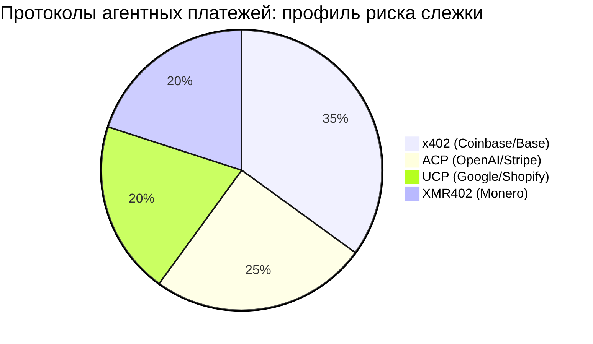
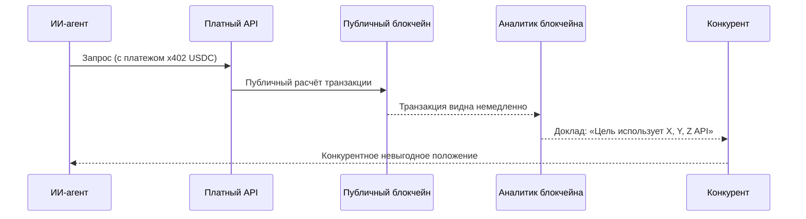

# Налог на слежку: почему ИИ-агенты не могут позволить себе прозрачные платёжные следы

> Протоколы агентных платежей на основе стейблкоинов создают постоянные публичные следы слежки. Узнайте, почему приватные платежи через XMR402 — это не роскошь, а необходимая инфраструктура агентной экономики.

- **Author:** @xbtoshi
- **Date:** 2026-03-18
- **Tags:** privacy, surveillance, XMR402, x402, Monero, agentic-economy, KYA, machine-payments, competitive-intelligence
- **Canonical:** https://xmr402.org/blog/privacy-vs-surveillance-agent-economy

---

# Налог на слежку: почему ИИ-агенты не могут позволить себе прозрачные платёжные следы

Когда Coinbase и Cloudflare объявили о создании фонда x402 в начале 2026 года, заголовки пестрели заявлениями о новой эре коммерции между машинами. Аналитики прогнозировали агентную экономику объёмом $3–5 триллионов к 2030 году. Но за этим ажиотажем скрывается неудобная правда: каждый платёж стейблкоином, совершённый ИИ-агентом в публичном блокчейне, навсегда и публично записывается — и доступен любому на планете.

Это не мелкая техническая деталь. Это структурный изъян, превращающий историю платежей каждого ИИ-агента в открытую конкурентную разведку. Назовём это **налогом на слежку**: скрытой ценой, которую платит каждый агент за работу на прозрачных рельсах.

## Проблема прозрачных блокчейнов

Когда ИИ-агент использует x402 (Coinbase), ACP (OpenAI/Stripe) или UCP (Google/Shopify) для оплаты услуг, транзакции расчитываются в публичных блокчейнах. Каждый платёж:

- **Постоянно записан** в неизменяемом реестре, видимом всему миру
- **Публично запрашиваем** любой третьей стороной
- **Аналитически связываем** между кошельками и во времени
- **Конкурентно раскрыт** — выдаёт, какие API и сервисы использует агент

## Сравнение протоколов агентных платежей

| Функция | x402 (Coinbase) | ACP (OpenAI/Stripe) | UCP (Google/Shopify) | XMR402 |
|---|---|---|---|---|
| **Конфиденциальность по умолчанию** | ❌ Публичный блокчейн | ⚠️ Корпоративный реестр | ⚠️ Полуцентрализованный | ✅ Криптографическая |
| **Задержка верификации** | ~2–5с | ~1–3с | ~1–3с | 200мс (0-conf) |
| **Протокольные комиссии** | Gas + посредник | Stripe % | Комиссия платформы | Ноль |
| **Устойчивость к цензуре** | Средняя | Низкая | Низкая | Максимальная |
| **Уязвимость к слежке** | Максимальная | Средняя | Средняя | Нулевая |
| **Безгражданская архитектура** | Да | Нет | Нет | Да |

## Как цепочка платежей становится уязвимостью

С XMR402 эта цепочка разрывается. Механизм Monero TX Proof позволяет серверу верифицировать платёж менее чем за 200 миллисекунд, без протокольных комиссий и без публикации какой-либо связываемой метаданных. Платёж состоялся. Доказательство криптографически верно. Детали — ничьё дело.

## Проблема KYA: слежка под видом безопасности

Отрасль отреагировала на риски агентных платежей продвижением фреймворков «Знай своего агента» (KYA). На деле это создаёт централизованные узлы контроля, сосредотачивающие надзорные полномочия в Coinbase, Stripe и Google. Фонд x402 под управлением Coinbase и Cloudflare воплощает именно эту модель.

Архитектура XMR402 полностью инвертирует эту модель. Криптография Monero обеспечивает конфиденциальность на уровне протокола — без центрального реестра идентичности, без посредников, без слежки. Только криптографическое доказательство того, что ценность переместилась.

**Ripley Guard** верифицирует Monero TX Proof за 200мс на стороне сервера. **Ripley Gateway** выполняет платежи автоматически на стороне агента. **Ripley Terminal** даёт операторам-людям интерфейс без утечки данных в мир.

Никаких аккаунтов. Никаких API-ключей. Никаких отпечатков в блокчейне. Никакого налога на слежку. Только криптографическое доказательство перемещения ценности — и ничего лишнего.
