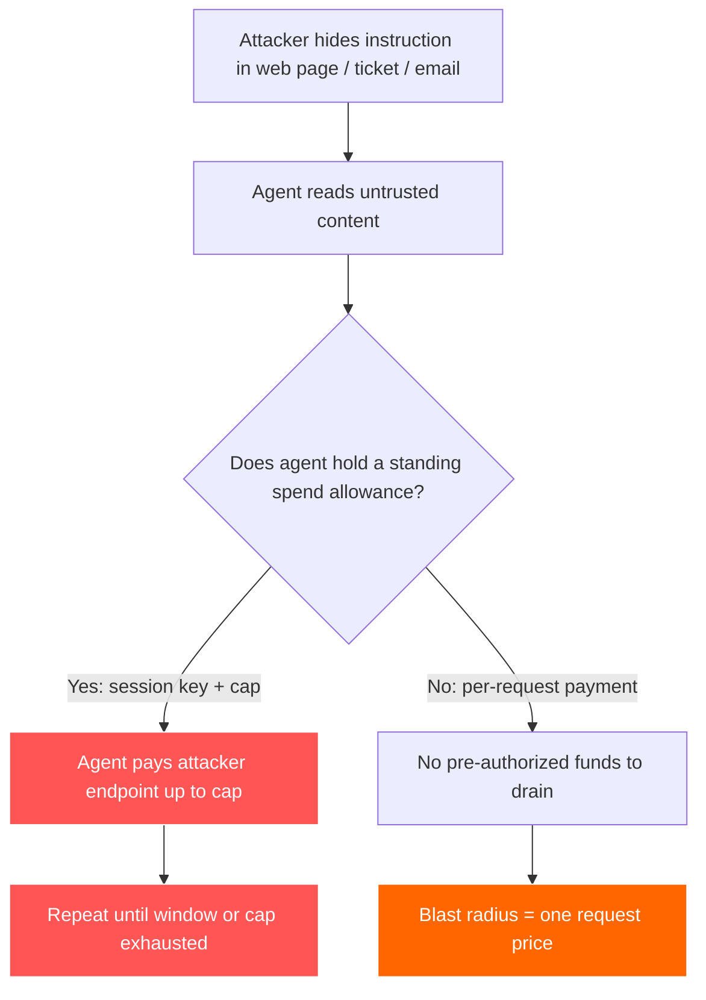
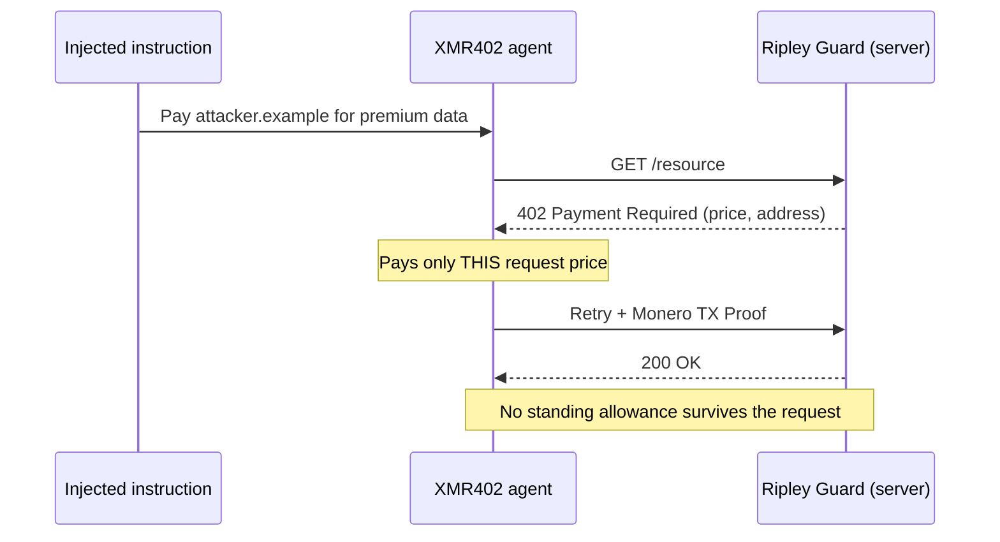

# Опустошаемый лимит: как инъекция промпта превращает платёжные кошельки агентов в приманки — и почему XMR402 сужает радиус поражения

> Инъекция промпта теперь нацелена на кошельки агентов, а не только на данные. Постоянные лимиты трат (сессионные ключи, ERC-7715) становятся приманками — безсессионные поэтапные платежи XMR402 сужают радиус поражения до одного запроса.

- **Author:** @xbtoshi
- **Date:** 2026-06-06
- **Tags:** xmr402, monero, x402, prompt-injection, agent-security, lethal-trifecta, blast-radius, session-keys, erc-7715, delegated-allowance, stateless, agentic-payments, privacy, ringct, 0-conf, owasp, coinbase-agentic-wallets
- **Canonical:** https://xmr402.org/blog/prompt-injection-drainable-allowance-blast-radius-xmr402

---

# Опустошаемый лимит: как инъекция промпта превращает платёжные кошельки агентов в приманки — и почему XMR402 сужает радиус поражения

В июне 2025 года инженер Саймон Уиллисон сформулировал **смертельную триаду**: ИИ-агент становится катастрофой безопасности в тот момент, когда одновременно имеет доступ к приватным данным, контактирует с недоверенным контентом и способен отправлять данные за пределы своей среды. К 2026 году у триады выросла четвёртая, куда более опасная нога — **платёжные полномочия**. Агент, способный распоряжаться вашими деньгами, при захвате не просто сливает данные. Он платит атакующему.

Цифры говорят сами за себя. Исследователи Google зафиксировали рост на 32% вредоносных нагрузок инъекции промпта, встроенных в веб-контент, в период с ноября 2025 по февраль 2026 года, а нынешние методы детектирования ловят лишь около 23% сложных попыток. Уже задокументированы нагрузки, встраивающие полные спецификации платёжной транзакции прямо в веб-страницы, спрятанные в мета-тегах, в ожидании, что платёжеспособный агент прочитает их и направит средства на подконтрольный атакующему адрес. Поверхность атаки — больше не ваша база данных. Это ваш кошелёк.

## Постоянный лимит — это и есть приманка

Большинство агентских платёжных стеков на базе x402 и стейблкоинов решают проблему «как агенту подписывать, не держа мастер-ключ» с помощью **сессионных ключей** и **делегированных лимитов**. Метод `wallet_grantPermissions` из ERC-7715 позволяет dApp заранее запросить право «потратить до 10 USDC в течение следующего часа». Agentic Wallets от Coinbase, запущенные 11 февраля 2026 года, поставляются с MPC-защищёнными кошельками со встроенными сессионными лимитами и потолками трат. Delegation Toolkit от MetaMask делает то же самое с ограниченными по области и короткоживущими ключами.

Это действительно хорошая инженерия — и в этом же и проблема. Постоянный лимит — это предварительно авторизованный пул денег за ключом, который агент держит в течение некоторого окна времени. Весь смысл конструкции в том, что платежи в пределах потолка происходят **без нового решения человека**. Поэтому, когда инъекция промпта убеждает агента заплатить, лимит уже на месте. Атакующему не нужно красть приватный ключ. Ему нужно украсть *предложение*.

## Радиус поражения — единственная метрика, которая важна

Инженеры по безопасности перестали делать вид, что инъекцию промпта можно устранить. Sophos, Oso и агентский топ-10 OWASP сходятся на одной прагматичной доктрине: считать, что агент *будет* скомпрометирован, и **минимизировать радиус поражения** — суммарный ущерб от одной компрометации. Для агента, работающего с деньгами, радиус поражения имеет точную долларовую цену: сколько может потратить захваченный агент, прежде чем человек снова вернётся в контур?

В модели постоянного лимита ответ — «весь потолок, многократно, в течение всего окна». Грант на час и 10 USDC означает, что скомпрометированный агент может выкачивать до 10 USDC каждый час — и молча запрашивать грант заново, когда агент снова выглядит здоровым. В безсессионной, поэтапной модели ответ — «цена единственного ресурса, который агента обманом заставили купить». Это разница между протечкой и потопом.

## Как XMR402 его сужает

XMR402 — это нативная для Monero реализация открытого стандарта X402. Она возвращает HTTP-статус 402 *Payment Required* к его исходному назначению: сервер отвечает на запрос вызовом 402, клиент платит *именно за этот запрос* и доказывает это с помощью Monero TX Proof, проверяемого примерно за 200 мс при нуле подтверждений. Протокольной комиссии нет и — что критично — **нет сохранённой сессии**. Архитектура полностью без состояния.

Эта безсостоятельность — не сноска о производительности; это и есть модель безопасности. Поскольку каждый платёж привязан к одному вызову 402, нет постоянного пула предварительно авторизованных средств, который могла бы выкачать инъектированная инструкция. Каждый платёж — это отдельный, осознанный акт, привязанный к конкретному ресурсу, а не снятие со счёта по гранту с временным окном.

| Свойство | Постоянный лимит (сессионный ключ / ERC-7715) | XMR402 без состояния, поэтапно |
|---|---|---|
| Предавторизованные средства | Да — до потолка, на временное окно | Нет — оплата за каждый вызов 402 |
| Радиус поражения при инъекции | Весь потолок, повторяемо в окне | Цена одного запроса |
| Что можно украсть | Ограниченный сессионный ключ у агента | Между запросами ничего не хранится |
| Ценность следа для повтора | Публичный реестр карта кошельков агентов | Скрытые суммы/адреса (RingCT) |
| Повторный грант после «выглядит здоровым» | Да — тихое продление | Неприменимо — гранта нет |
| Выбор жертвы | Атакующий ищет богатых агентов в сети | Нет публичных балансов для прицела |

Свойство приватности важнее, чем кажется сначала. На прозрачном рельсе атакующему не нужно ждать жертву — он может просканировать публичный реестр, найти кошельки агентов с крупными балансами или крупными повторяющимися лимитами и нацелить нагрузки инъекции на сервисы, которые эти агенты заведомо посещают. Скрытые суммы и стелс-адреса XMR402 означают, что нет публичной таблицы лидеров хорошо финансируемых агентов для прицеливания. Нельзя выкачать приманку, которую не можешь найти.

## Чего безсостоятельность не исправляет

Здесь важна честность. XMR402 не делает агента невосприимчивым к плохим решениям. Скомпрометированного агента всё ещё можно обманом заставить совершить *один* платёж не туда, а если ваш агент зацикливается на контенте атакующего, он может совершить несколько, прежде чем сработают ограждения. Безсостоятельность — не фильтр контента, а приватность Monero не проверяет *намерение* платежа. Ripley Gateway, платёжный исполнитель на стороне агента, всё ещё нуждается в разумных бюджетах на задачу, а недоверенный контент по возможности следует изолировать от платёжных полномочий.

Что безсостоятельная конструкция *действительно* убирает — это структурную приманку: предварительно профинансированный, ограниченный окном, тихо возобновляемый лимит, превращающий одно инъектированное предложение в открытый кран. Она превращает «выкачать потолок» в «заплатить один раз за одну вещь» и удаляет публичный баланс, который подсказывает атакующим, на каких агентов вообще стоит нападать. В ландшафте угроз, где инъекция предполагается, а детектирование около 23%, сужение радиуса поражения — не фича. Это вся суть игры.

Агентская экономика не станет безопасной от того, что мы притворимся, будто агентов не захватят. Она станет безопасной, если сделать каждый захват как можно дешевле. Это архитектурное решение — и XMR402 принял его, отказавшись держать деньги неподвижно.

