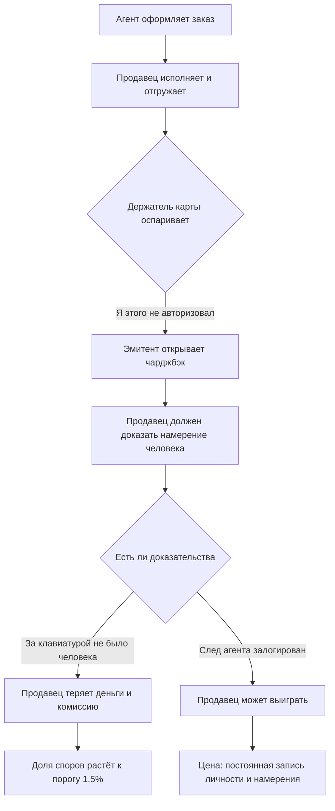
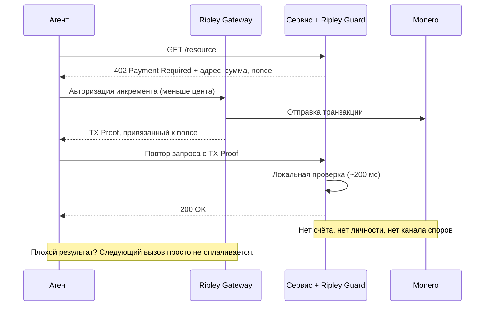

# Парадокс отмены: почему агентная коммерция не может решить, окончателен ли платёж — и почему XMR402 не пришлось спрашивать

> ACP оставляет ответственность за чарджбэки продавцу, а стейблкоины несут рубильник blacklist(address). Агентная коммерция унаследовала оба ответа об отмене и не разрешила ни одного. XMR402 обходит спор, уменьшая платёж до размера, при котором споры теряют экономический смысл.

- **Author:** @xbtoshi
- **Date:** 2026-09-04
- **Tags:** xmr402, monero, x402, acp, agentic-commerce, chargebacks, dispute-liability, merchant-of-record, finality, irreversibility, usdc, blacklist, stablecoin-freeze, visa-tap, mastercard-agent-pay, ap2, tx-proof, stateless, micropayments, privacy, 0-conf
- **Canonical:** https://xmr402.org/blog/reversal-paradox-chargeback-freeze-finality-xmr402

---

# Парадокс отмены: почему агентная коммерция не может решить, окончателен ли платёж — и почему XMR402 никогда не приходилось об этом спрашивать

Любая платёжная система в истории должна была ответить на один вопрос раньше всех остальных: **можно ли забрать эти деньги обратно?**

Карточные сети ответили «да». Этот ответ построил доверие потребителей — и построил чарджбэк: механизм, позволяющий плательщику спустя месяцы отменить завершённую транзакцию и заставить продавца доказывать, что покупка была намеренной. Публичные блокчейны ответили «нет». Этот ответ дал продавцам определённость — и породил тикет поддержки «извините, мы ничего не можем сделать».

Агентная коммерция в 2026 году умудрилась унаследовать оба ответа сразу — и не разрешить ни одного.

## Лагерь первый: продавец остаётся крайним

Внимательно прочитайте спецификацию делегированного платежа в Agentic Commerce Protocol (ACP) — всю работу делает одно предложение. OpenAI **не** является merchant of record. Расчёты, возвраты, чарджбэки и комплаенс остаются на продавце и его платёжном провайдере.

Это не лазейка. Это конструкция. ACP описывает, как агент проводит оформление заказа у продавца, которым агент не владеет, а затем оставляет продавца ровно там, где тот всегда стоял, когда сделка портится. Агентная платформа оркестрирует. Продавец поглощает убыток.

Момент делает это острее, чем звучит. Объём чарджбэков вырастет примерно на 24% с 2025 по 2028 год и достигнет 324 миллионов споров в мире. При этом Visa ужесточила порог доли споров для продавцов с 2,2% до 1,5% с 1 апреля 2026 года.

Вот и ловушка. Чтобы защититься в споре, нужно предъявить доказательство намерения. Но у агентной покупки по определению нет человека за клавиатурой в момент покупки. Поэтому ответом индустрии стало **производство** доказательств намерения: Trusted Agent Protocol и агентные токены Visa, Agent Pay от Mastercard, подписанные мандаты Google AP2, Agent Purchase Protection от American Express. Каждая из этих схем привязывает действие агента к верифицированному человеку и к долговечному воспроизводимому журналу.

Это связный инженерный ответ на проблему ответственности. Это также, по сути, мандат на слежку за агентной экономикой — и ему не нужно защищать слежку по существу, потому что он приходит под видом инфраструктуры для споров.

## Лагерь второй: окончательность с рубильником

Второй лагерь отвечает на вопрос об отмене уверенно. Ончейн-переводы завершаются, как только сеть их подтвердила. Горячей линии нет. Продавец, получивший стейблкоины, получил окончательный платёж без риска чарджбэка.

Это правда — но окончательность идёт со звёздочкой, и звёздочка находится в исходном коде контракта. Реализация USDC содержит модуль `Blacklistable`: назначенная роль blacklister может вызвать `blacklist(address)`, а модификатор `notBlacklisted` на функциях перевода откатывает любой вызов, затрагивающий этот адрес. У USDT и других есть эквивалентные механизмы. Плательщик не может отменить платёж. Эмитент может сделать средства недвижимыми.

Это не гипотеза. В марте 2026 года по решению суда Circle заморозила балансы шестнадцати корпоративных кошельков одновременно. Circle заявляет, что USDC не замораживается без судебного решения — это обязательство относительно **процесса**, а не устранение **возможности**.

Честная формулировка позиции стейблкоинов звучит не как «платежи окончательны», а как: **платежи окончательны для плательщика и дискреционны для эмитента.**

## Два режима отказа рядом

| Свойство | Карточная агентная (ACP / AP2 / TAP) | Стейблкоин-агентная (x402 на Base/Ethereum) | XMR402 |
|---|---|---|---|
| Плательщик может отменить | Да, до ~120 дней | Нет | Нет |
| Эмитент может заморозить | Да (уровень счёта) | Да — `blacklist(address)` | Эмитента не существует |
| Кто несёт убыток | Merchant of record | Тот, кто держал | Кредит не выдавался |
| Доказательства для удержания средств | Намерение человека | Нет | Криптографический TX Proof |
| Цена этих доказательств в приватности | Личность + намерение + история заказов | Публичная вечная запись в реестре | Никакой — доказывается платёж, не плательщик |
| Типичная стоимость спора | 15–40 долларов за чарджбэк | Неприменимо | Экономически бессмысленно |
| Практический минимальный чек | ~0,50 доллара | ~0,01 доллара | Меньше цента |
| Задержка расчёта | Дни–недели | Секунды–минуты | ~200 мс (0-conf) |

## Ответ XMR402: уменьшить сам предмет спора

У XMR402 нет механизма чарджбэка. Само по себе это ничем не примечательно — его нет ни у одного криптографического рельса. Защитимой позицию делает то, что XMR402 сочетает необратимость с таким **размером** и **гранулярностью** платежа, при которых необратимость перестаёт пугать.

Чарджбэк обходится продавцу в 15–40 долларов комиссий ещё до спора о самой сумме. Этот аппарат существует потому, что карточные транзакции достаточно крупные и достаточно редкие, чтобы их стоило разбирать. Платёж XMR402 за один вызов API, один инференс, одну просканированную страницу — это доля цента. Для платежа в 0,0004 доллара не существует экономически рационального процесса спора. Правильное средство защиты при «сервис не отработал» — не арбитраж, а **просто не платить на следующем вызове**, что агент делает автоматически, за миллисекунды, рискуя лишь последним инкрементом.

TX Proof — тихая элегантность этой схемы. Доказательство транзакции Monero позволяет плательщику продемонстрировать конкретному проверяющему, что конкретный платёж состоялся, не раскрывая никому — включая самого проверяющего — свою личность, баланс или историю. Продавец получает ровно то доказательство, за которое он бился в рамках ACP («этот запрос оплачен»), лишённое той части, которая ему на самом деле никогда не была нужна («кто заплатил и что ещё он купил в этом месяце»).

## Чего это не решает

Было бы нечестно подавать необратимость как чистый выигрыш. Если сервис, оплаченный через XMR402, взял деньги и вернул мусор, на уровне протокола средств защиты нет. Это реальная цена, и её несёт каждый необратимый рельс.

Смягчение носит архитектурный, а не судебный характер. Поскольку платежи идут повызовно и составляют доли цента, максимальный убыток от недобросовестного контрагента ограничен одним инкрементом, а не балансом кошелька или кредитной линией. Репутация, эскроу и логика повторов принадлежат прикладному уровню, где их можно выбирать и заменять, а не быть вваренными в протокол расчётов, где они превращаются в обязательную слежку для всех.

## Вопрос, который никто не задаёт вслух

Спор об отмене выглядит как техническое разногласие о семантике расчётов. Это не так. Это разногласие о том, сколько поведения агента должно быть навсегда записано, чтобы платёж считался легитимным.

Первый лагерь говорит: столько, чтобы выиграть спор. Второй: столько, чтобы идентифицировать адрес, и мы оставляем за собой право действовать. XMR402 говорит: столько, чтобы доказать оплату конкретного запроса, и ни битом больше.

Когда машины совершают миллионы транзакций в день, разница между этими тремя ответами — это разница между экономикой, которая помнит об агенте всё, и экономикой, которая просто работает.
