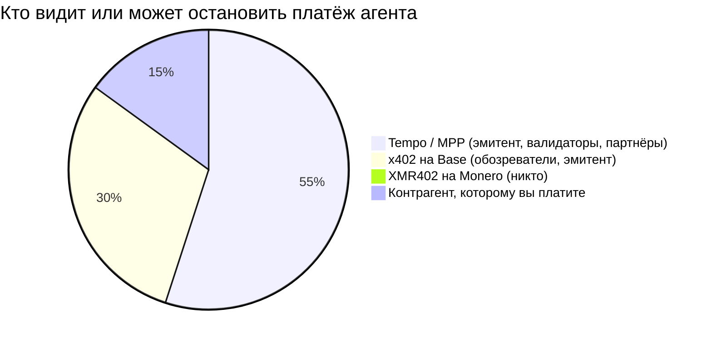
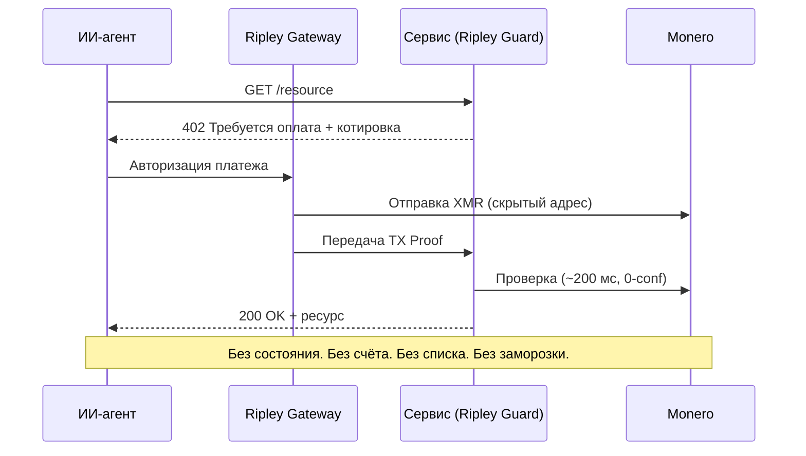

# Корпоративная цепь: почему Tempo от Stripe строит машинную экономику на разрешительном реестре — а XMR402 отказывается просить разрешения

> Tempo от Stripe и Paradigm запустил Machine Payments Protocol на разрешительном корпоративном реестре. Почему корпоративная цепь делает платежи агентов наблюдаемыми и замораживаемыми — и почему безразрешительный расчёт XMR402 на Monero не просит разрешения.

- **Author:** @xbtoshi
- **Date:** 2026-06-03
- **Tags:** xmr402, monero, x402, tempo, stripe, paradigm, mpp, machine-payments-protocol, permissioned, permissionless, stablecoin, agentic-payments, privacy, ap2, fido-alliance, censorship-resistance, stateless, 0-conf
- **Canonical:** https://xmr402.org/blog/stripe-tempo-permissioned-chain-machine-economy-xmr402

---

# Корпоративная цепь: почему Tempo от Stripe строит машинную экономику на разрешительном реестре — и почему XMR402 отказывается просить разрешения

18 марта 2026 года машинная экономика получила свой флагманский расчётный канал. Tempo — платёжный блокчейн при поддержке Stripe и Paradigm — запустил мейннет и вместе с ним выпустил Machine Payments Protocol (MPP). Список партнёров запуска читается как перекличка всего коммерческого интернета: Anthropic, OpenAI, DoorDash, Mastercard, Nubank, Revolut, Shopify и Standard Chartered. Tempo рассчитывается в любом крупном стейблкоине, не берёт собственный токен газа и создан специально для того, чтобы ПО платило ПО тысячи раз в секунду.

По любым инженерным меркам это впечатляющая машина. Но это ещё и корпоративная цепь — и именно это различие сейчас важнее всего в агентских платежах.

## Блокчейн с таблицей капитализации

Большинство блокчейнов — продукт стимулов: анонимные валидаторы защищают сеть, потому что им за это платят, и ни одна структура не может отозвать вашу способность совершать транзакции. Tempo переворачивает это. Это специально построенный реестр с известным кругом инвесторов, известным набором партнёров и дизайном валидаторов, оптимизированным под корпоративную предсказуемость, а не под устойчивость к цензуре. В Tempo не входят майнингом — в него подключают.

Стейблкоин — обязательство на балансе эмитента; эмитент может замораживать адреса и делает это. Разрешительный набор валидаторов — это список названных компаний; список названных компаний — это поверхность для повестки в суд. А флагманская функция MPP «человек отсутствует» — предавторизованные автономные покупки — означает, что весь паттерн трат агента записывается на известный, пополняемый, замораживаемый счёт.

## Разрешительность по замыслу против безразрешительности по умолчанию

| Свойство | Tempo + MPP | x402 на Base | XMR402 на Monero |
|---|---|---|---|
| Кто ведёт реестр | Валидаторы при Stripe / Paradigm | L2-секвенсер вокруг Coinbase | ~10 000 независимых узлов Monero |
| Разрешение на транзакцию | Подключение / белый список | Кошелёк + KYC на входе | Нет — открыто по умолчанию |
| Расчётный актив | Любой крупный стейблкоин | USDC | XMR (без эмитента) |
| Можно ли заморозить адрес | Да | Да | Нет |
| Видимость платежа | Видна оператору | Публично и навсегда | Приватно (скрытые адреса, RingCT) |
| Комиссия протокола | Задаётся оператором | Зависит от фасилитатора | Ноль |
| Модель подтверждения | Финальность валидаторов | Финальность L2 | 200 мс, 0-conf через TX Proof |

Агентская экономика — это не только компании, платящие компаниям. Это миллионы автономных агентов, чьи паттерны трат *и есть* их стратегия. На корпоративной цепи эта стратегия читаема тем, кто этой цепью управляет.

## Слежка — не баг, а бизнес-модель

Когда каждый машинный платёж попадает в разрешительный реестр в замораживаемом активе, три вещи следуют сами собой. Утекает ценовая разведка: конкурент, наблюдающий за расчётами, восстанавливает, какие API вы вызываете и сколько платите. Утекает стратегический тайминг: предавторизованные покупки MPP раскрывают, когда именно агент действует. И рычаг копится у оператора: кто может заморозить актив, тот держит право вето над экономической жизнью вашего агента.

## Почему XMR402 отказывается просить разрешения

XMR402 — это нативная для Monero реализация открытого стандарта X402. Он использует то же рукопожатие HTTP 402 «Требуется оплата», на котором строятся x402 и MPP, — поэтому говорит на родном языке агентской экономики, — но рассчитывается в цепи, которой никто не владеет и которая ничего не раскрывает.

Поток намеренно безаккаунтный. Нет подключения, нет списка партнёров и нет баланса, который оператор может приостановить. Проверка занимает около 200 мс против TX Proof Monero при нуле подтверждений, поэтому задержка конкурентна с субсекундной финальностью Tempo, а приватность принципиально иная. Протокол берёт ноль комиссий, не зависит от транспорта (HTTP и WebSocket), а стек Ripley делает его пригодным уже сегодня: Ripley Guard как серверное промежуточное ПО, Ripley Gateway как исполнитель платежей агента и Ripley Terminal как настольное приложение для людей.

Ничего из этого не требует разрешения, потому что набор анонимности Monero — теперь усиленный обновлением FCMP++ — прячет каждый платёж XMR402 в крупнейшей толпе в криптовалюте.

## Выбор, который машинная экономика ещё не сделала

Tempo, миграция AP2 в FIDO Alliance и AWS Bedrock AgentCore Payments сходятся к одной архитектуре: быстрой, управляемой, наблюдаемой, разрешительной. Она выиграет огромную долю корпоративного объёма — и заслуженно. Но она не должна быть *единственным* каналом. XMR402 — это безразрешительная альтернатива, встроенная в стандарт с первого дня. Разница в том, кто должен сказать «да». На корпоративной цепи — кто-то должен. На XMR402 — никто, и в этом весь смысл.

