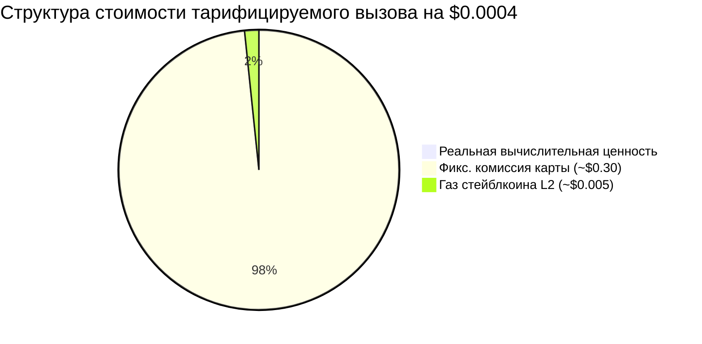
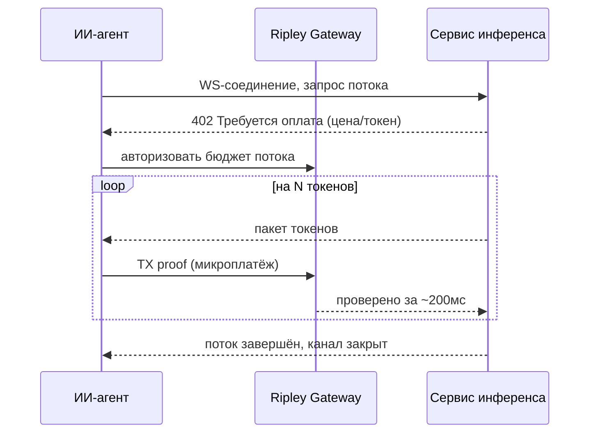

# Проблема субцентовых расчётов: почему оплата ИИ по токенам ломает любой платёжный рельс, кроме XMR402

> Потокенная оплата ИИ опускает расчёт ниже цента, где карточные сборы и даже газ L2 затмевают сам платёж. Почему нулевые комиссии XMR402, 0-conf за 200мс и нативный WebSocket — единственный рельс, сходящийся по арифметике.

- **Author:** @xbtoshi
- **Date:** 2026-05-31
- **Tags:** xmr402, monero, x402, per-token-billing, micropayments, llm-inference, metering, sub-cent, websocket, streaming-payments, agentic-payments, gas-fees, stablecoins, privacy, 0-conf
- **Canonical:** https://xmr402.org/blog/sub-cent-settlement-per-token-ai-billing-xmr402

---

# Проблема субцентовых расчётов: почему оплата ИИ по токенам ломает любой платёжный рельс, кроме XMR402

В мае 2026 года агентная экономика незаметно пересекла порог, которого никто не планировал. AWS выпустила Bedrock AgentCore Payments, Fireblocks представила Agentic Payments Suite и вступила в x402 Foundation, Cryptorefills подключила оплату x402. Инфраструктура прибывает. Но под всеми анонсами лежит проблема юнит-экономики: **тарификация ИИ опускается до уровня отдельного токена, а токен стоит доли цента.**

Современный агент не совершает одну покупку. Он принимает сотни микрорешений за диалог — поиск, извлечение, вызов модели, вызов инструмента, переранжирование. По мере того как предельная стоимость токена приближается к нулю, **стоимость расчёта** за этот токен становится главным расходом. И тут каждый существующий рельс тихо разваливается.

## Порог в 30 центов и налог на газ

Карточные сети для этого не создавались. Типичная карточная транзакция несёт фиксированную часть около $0.30 плюс процент. Попытка списать $0.0004 за один инференс означает, что комиссия в **750 раз** превышает стоимость продаваемого. Токен картой тарифицировать невозможно.

Криптовалютные рельсы должны были это исправить. Перевод USDC на Base в 2026 году часто проходит дешевле цента. Но «дешевле цента» — это не «бесплатно». Когда полезная нагрузка стоит $0.0004, а комиссия сети $0.005, комиссия всё равно **более чем в десять раз** превышает платёж; при перегрузке — хуже.

Комиссия протокола сама становится продуктом. Это структурная причина, по которой долларовый объём x402 упал примерно на 77% от пика ноября 2025 года: технически рельсы работают, но экономика ломается, как только платежи сжимаются до настоящего машинного масштаба.

## Почему XMR402 создан для субцентового режима

XMR402 — это Monero-нативная реализация открытого стандарта X402. Она использует код HTTP 402 для встроенного согласования оплаты и отличается от стейблкоин-x402 в трёх ключевых аспектах:

Во-первых, **нулевые комиссии протокола**. XMR402 не добавляет процент или фиксированную плату поверх платежа; единственная стоимость — комиссия сети Monero, для типичного микроплатежа это тысячные доли цента.

Во-вторых, **верификация 0-conf за 200 мс через Monero TX Proof**. Потоковый счётчик токенов не может ждать подтверждения блока — следующий токен нужен сейчас.

В-третьих, **независимость от транспорта**. Один протокол работает по HTTP и WebSocket; события оплаты чередуются с событиями токенов на том же сокете.

## Сравнение по тарификации токенов

| Параметр | Карты | x402 + USDC (L2) | XMR402 (Monero) |
|---|---|---|---|
| Фикс. сбор за вызов | ~$0.30 | ~$0.005 газ | ~$0.00001 нетто |
| Жизнеспособность при $0.0004/токен | Нет | Маргинально | Да |
| Задержка расчёта | секунды–дни | время блока | ~200мс 0-conf |
| Потоки по WebSocket | Нет | Надстройка | Нативно |
| Утечка следа платежа по токену | Эмитент | Публичная цепь | Приватно |
| Доля протокола | % + фикс | 0% протокол, порог газа | 0% протокол |

Строку о приватности стоит подчеркнуть. Потокенная тарификация создаёт не просто платёж, а **поток поведенческой телеметрии**. Каждый тарифицируемый вызов в публичной цепи раскрывает, какую модель запрашивал агент, как часто и почём — почти идеальная реконструкция его рабочей нагрузки для любого конкурента с блок-эксплорером. Stealth-адреса и конфиденциальные суммы Monero позволяют счётчику работать, не публикуя когнитивный отпечаток агента.

## Тихая инверсия

Урок мая 2026: сложная задача в агентных платежах — не авторизация и не UX кошелька, а **арифметика**. Когда цена интеллекта падает быстрее цены перемещения денег, платёжный рельс становится узким местом. Нулевые комиссии протокола, относительно субмиллисекундный расчёт, нативные потоки и структурная приватность — это режим, для которого создан XMR402: не обмен на $50, а мысль за $0.0004.
