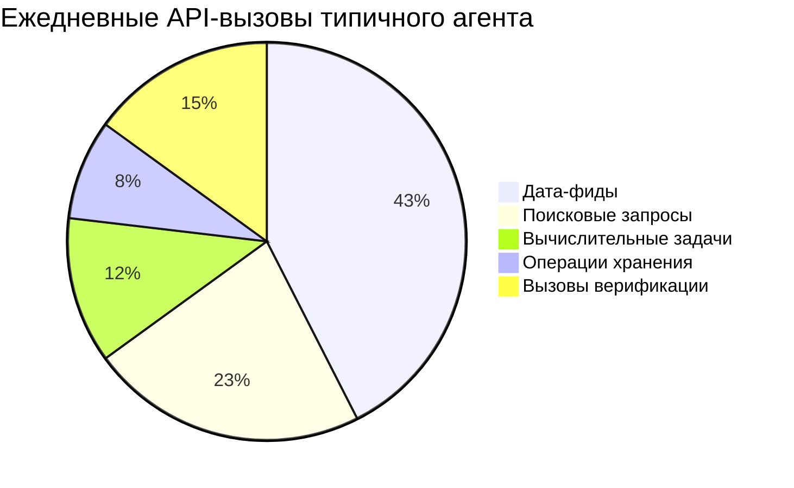
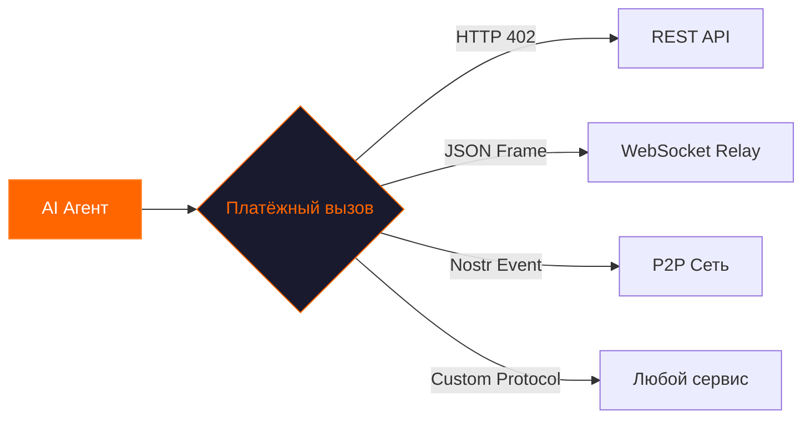

# Почему XMR402 важен каждый день: невидимый двигатель машинной экономики

> От утренних новостных лент до полуночных пакетных задач — XMR402 ежедневно обеспечивает тысячи транзакций между агентами и сервисами. Вот почему этот stateless-примитив платежей на Monero становится основой автономного интернета.

- **Author:** @xbtoshi
- **Date:** 2026-03-17
- **Tags:** XMR402, agentic-economy, daily-use, micropayments, Monero, machine-payments, privacy
- **Canonical:** https://xmr402.org/blog/why-xmr402-matters-every-day

---

## День из жизни машинного платежа

6:00 утра. Пока вы спите, ваш исследовательский агент просыпается. У него список из 47 источников данных для запроса — рыночные фиды, академические базы, API погоды, эндпоинты спутниковых снимков. Каждый берёт от $0.0001 до $0.05 за запрос.

У агента нет кредитной карты. Нет панели API-ключей. У него есть Monero-кошелёк и протокол XMR402. К 6:14 утра он завершил все 47 запросов, оплатив каждый менее чем за 200 миллисекунд, и составил брифинг в вашем почтовом ящике.

Это не фантастика. Это то, что XMR402 позволяет уже сегодня.

## Масштаб, о котором не говорят

Разговор об AI-платежах обычно фокусируется на крупных транзакциях. Но настоящая революция происходит на микроуровне.

Сколько API-вызовов делает один автономный агент в день:

Примерно 800 API-вызовов на агента в день. Умножьте на 4.2 миллиона активных AI-агентов по всему миру — более **3 миллиардов взаимодействий машина-сервис ежедневно**.

Традиционные платёжные рельсы не справляются с таким объёмом и гранулярностью. XMR402 решает всё одним обменом HTTP-заголовками.

## Пять причин, почему XMR402 важен каждый день

### 1. Нулевое трение при подключении

XMR402 не требует регистрации. Агент с Monero-кошельком может оплатить любой XMR402-сервис в момент развёртывания. Нет форм регистрации, нет процесса одобрения, нет периода ожидания.

### 2. Приватность как операционная безопасность

На прозрачных блокчейнах платёж раскрывает адрес кошелька, историю транзакций и баланс. Monero обеспечивает, что XMR402-платежи не раскрывают ничего, кроме факта действительной оплаты.

### 3. Скорость мысли

XMR402 верифицирует платёж за ~200 миллисекунд:

```mermaid
gantt
    title Временная шкала верификации XMR402
    dateFormat X
    axisFormat %L мс
    section Поток платежа
    Агент отправляет TX      :a1, 0, 50
    Распространение в мемпул :a2, 50, 100
    Сервер check_tx_proof    :a3, 100, 180
    Доступ предоставлен      :a4, 180, 200
```

### 4. Stateless-архитектура масштабируется бесконечно

Middleware Guard XMR402 полностью без состояния. Никаких записей в БД, хранения сессий или задач очистки. API может горизонтально масштабироваться без координации между узлами.

### 5. Транспортная независимость повсюду

XMR402 v2.0 работает через любой двунаправленный канал:

## Конкурентный ландшафт

| Функция | XMR402 | x402 (Coinbase) | ACP (OpenAI/Stripe) |
|---------|--------|-----------------|---------------------|
| Приватность | Полная | Нет | Нет |
| Идентификация | Не требуется | Только кошелёк | Полный KYC |
| Скорость | ~200мс | ~200мс | Секунды |
| Комиссия протокола | Ноль | Ноль | Комиссия Stripe |
| Цензуроустойчивость | Высокая | Низкая | Нет |
| Транспорт | HTTP + WS + Любой | Только HTTP | Только HTTP |

## Реальные ежедневные паттерны

**Рассвет (05:00–08:00)** — Пакетные агенты просыпаются. Исследовательские боты запрашивают ночные накопления данных.

**Утро (08:00–12:00)** — Интерактивные агенты активируются. Боты ревью кода покупают вызовы статического анализа.

**День (12:00–18:00)** — Пик активности. Контент-агенты платят за генерацию изображений и проверку фактов.

**Вечер (18:00–00:00)** — Мониторинговые агенты. Инфраструктурные боты покупают эндпоинты проверки здоровья.

**Ночь (00:00–05:00)** — Обслуживание. Агенты покупают вычисления для дообучения моделей.

Каждая транзакция — это XMR402-платёж: мгновенный, приватный, без вмешательства человека.

## Общая картина

XMR402 важен каждый день, потому что машинная экономика работает каждый день. Она не спит и не берёт выходных. Автономные агенты работают 24/7, и им нужен платёжный примитив, соответствующий их темпу.

Интернет был спроектирован с платёжным кодом — HTTP 402 — встроенным в его основу. 25 лет этот код не использовался. XMR402 активирует его единственной валютой, созданной для машин: приватной, быстрой и безразрешительной.

Каждый день больше агентов выходят в сеть. Каждый день больше сервисов закрывают свои API. Каждый день невидимая экономика растёт. И каждый день XMR402 на месте — проводит транзакции за 200 миллисекунд, ничего ни от кого не требуя.
