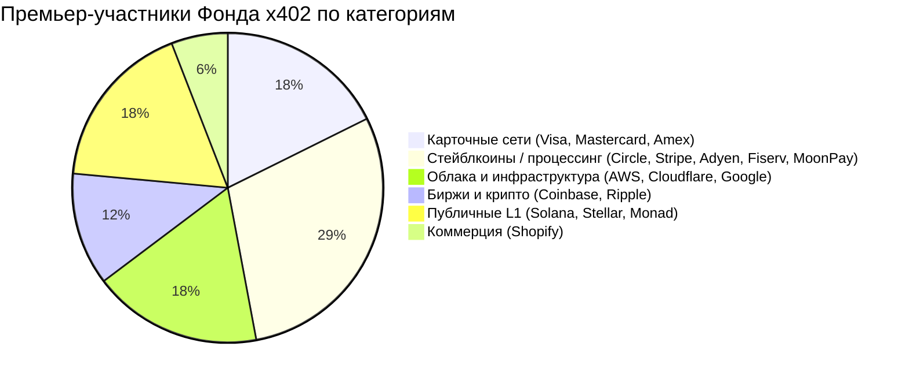
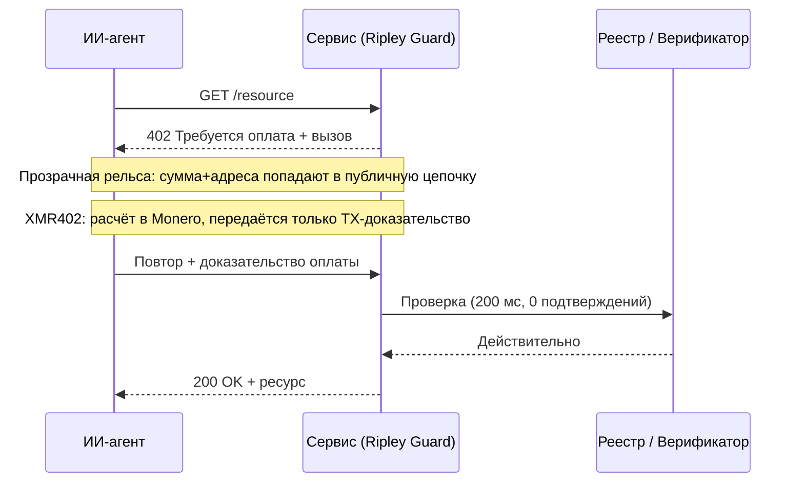

# Сорок участников, один реестр: почему нейтральное управление Фонда x402 не даёт нейтральной приватности

> 14 июля под эгидой Linux Foundation запущен Фонд x402 с 40 участниками. Но нейтральное управление — это не нейтральная приватность, и лишь XMR402 рассчитывает платежи агентов там, где никто не смотрит.

- **Author:** @xbtoshi
- **Date:** 2026-07-20
- **Tags:** xmr402, monero, x402, x402-foundation, linux-foundation, agentic-payments, governance, privacy, stablecoin, visa, mastercard, stripe, coinbase, transparent-ledger, fcmp, anonymity-set, tx-proof, stateless, machine-payments, ripley-guard
- **Canonical:** https://xmr402.org/blog/x402-foundation-neutral-governance-transparent-ledger-xmr402

---

# Сорок участников, один реестр: почему нейтральное управление Фонда x402 не даёт нейтральной приватности

14 июля 2026 года протокол x402 повзрослел. Linux Foundation объявил об операционном запуске **Фонда x402** — вендор-нейтрального органа открытого управления с 40 организациями-участниками, призванного развивать стандарт, позволяющий ИИ-агентам платить по HTTP. Список премьер-участников впечатляет: Adyen, AWS, American Express, Circle, Cloudflare, Coinbase, Fiserv, Google, Mastercard, Monad Foundation, MoonPay, Ripple, Shopify, Solana Foundation, Stellar Development Foundation, Stripe и Visa.

Для протокола, начавшегося в мае 2025 года как побочный проект Coinbase, это легитимность в масштабе. Нейтральное управление под эгидой Linux Foundation — действительно хорошая новость для совместимости. Но в освещении происходит тихая подмена, и она важна: **нейтральность управления преподносится так, будто это нейтральность платежей.** Это не одно и то же. Орган стандартизации может быть совершенно беспристрастен в вопросе о том, *кто* формирует протокол, тогда как сам протокол по своей структуре не способен сохранять платежи агента в тайне.

Именно этот разрыв — вся суть.

## Чем на самом деле управляет «нейтральность»

Открытое управление означает, что ни одна компания не владеет спецификацией. Coinbase внёс x402, но дальше его развитие решается открыто, и каждый премьер-участник получает место. Это реальное и ценное свойство. Оно решает политическую проблему: страх, что один вендор захватит рельсы, на которых работает машинная экономика.

Чего оно не решает — так это проблему данных. Ядро x402 — это транспортное соглашение: HTTP-вызов 402, платёжная нагрузка, шаг верификации. Приватность любого платежа почти полностью определяется *слоем расчётов* внизу, а не уставом управления вверху. А слои расчётов, которые приносят премьер-участники, без исключения прозрачны по умолчанию или привязаны к личности: карточные сети, привязанные к вашему имени; стейблкоины на публичных реестрах, где каждый перевод — вечная запись; облачные провайдеры, чья бизнес-модель — знать, что куда двинулось.

Можно управлять прозрачным реестром через самый сбалансированный комитет в мире. Он всё равно останется прозрачным реестром.

Посмотрите на состав. Четырнадцать из семнадцати премьер-участников по своей сути — организации, чья ценность зависит от *возможности видеть* транзакции: оценивать по ним риск, проводить клиринг, индексировать или рассчитывать в цепочке, которую может прочитать кто угодно. Это не упрёк какому-либо участнику, а наблюдение о стимулах. Орган управления, собранный из институтов, которые монетизируют видимость транзакций, не станет вести умолчание к невидимости транзакций. У него нет причин.

## Прозрачность по умолчанию — это выбор дизайна, а не закон природы

Подумайте, что происходит, когда агент платит за услугу по массовой рельсе x402, рассчитываясь публичным стейблкоином. Сумма, время, адрес отправителя и адрес получателя записываются в реестр, который ничего не забывает. Аналитические фирмы уже реконструируют поведение именно из этих данных. Когда плательщик — автономный агент, совершающий тысячи мелких покупок в день, след — это не просто запись одной транзакции, а карта стратегии высокого разрешения: от каких API зависит агент, как часто их вызывает, сколько стоит нагрузка, когда пики спроса.

Механика x402 изящна независимо от рельсы. Разница в том, что утекает. На прозрачном слое расчётов верификатор — и весь мир — узнаёт намного больше, чем «агент заплатил». На слое с защитой приватности верификатор узнаёт ровно одно: платёж действителен.

## Где здесь XMR402

XMR402 — это Monero-нативная реализация той же открытой идеи x402. Он говорит на идентичной грамматике HTTP 402 и потому совместим со стандартом, который теперь ведёт Фонд. Меняется субстрат. Расчёт происходит в Monero, а сервер убеждается не наблюдением за публичным реестром, а **доказательством транзакции Monero** — криптографической квитанцией, подтверждающей, что конкретный платёж был отправлен на конкретный адрес, проверяемой примерно за 200 миллисекунд при нуле подтверждений, без раскрытия сумм или истории третьим сторонам.

Это не приватность, прикрученная сбоку. Это умолчание, и оно наследует позицию Monero на июль 2026: после апгрейда FCMP++ каждая трата доказывается против анонимного множества более чем в 150 миллионов выходов вместо кольца из 16. Эта приватность — не политика, которую комитет проголосует ослабить в следующем квартале, а свойство криптографии.

| Измерение | Стек Фонда x402 (типичные рельсы) | XMR402 |
|---|---|---|
| Управление | Орган Linux Foundation из 40 участников | Открытый протокол, Monero-нативный |
| Расчёт по умолчанию | Публичные цепочки / карты | Monero (приватно по умолчанию) |
| Что видит верификатор | Суммы, адреса, время | Только «платёж действителен» |
| Анонимное множество | Прозрачность на уровне адресов | 150M+ выходов (FCMP++) |
| Комиссии протокола | Зависят от рельсы | Ноль |
| Модель подтверждения | Зависит от цепочки | 200 мс, 0 подтверждений |
| Утечка данных | Вечный публичный след | Ничего сверх доказательства |

## Нейтральность необходима, но недостаточна

Ничто из этого не умаляет достижения Фонда x402. Нейтральный стандарт — предпосылка здоровой машинной экономики, а согласие сорока важнейших платёжных компаний строить открыто — настоящая веха. Суть уже́ и острее: нейтральность управления и нейтральность *наблюдения* — разные гарантии, и 14 июля запустили только одну.

Агенту, платящему тысячу раз в день, не нужен комитет, обещающий справедливое отношение. Ему нужна рельса, на которой его платежи не становятся набором данных. Фонд даёт экосистеме первое. XMR402 существует, чтобы дать второе — то же рукопожатие 402, но расчёт там, где никто не смотрит. Интернет уже усвоил этот урок однажды: мы сделали сеть надёжной не комитетом, решающим, кому можно читать трафик, а шифрованием трафика, после которого вопрос перестал иметь значение. Приватность платежей для агентов — тот же ход, на слой ниже. Управление решает, кто рулит. Криптография решает, кто видит. Для машинной экономики с миллионами платежей в день именно второй вопрос сохраняет свободу.
