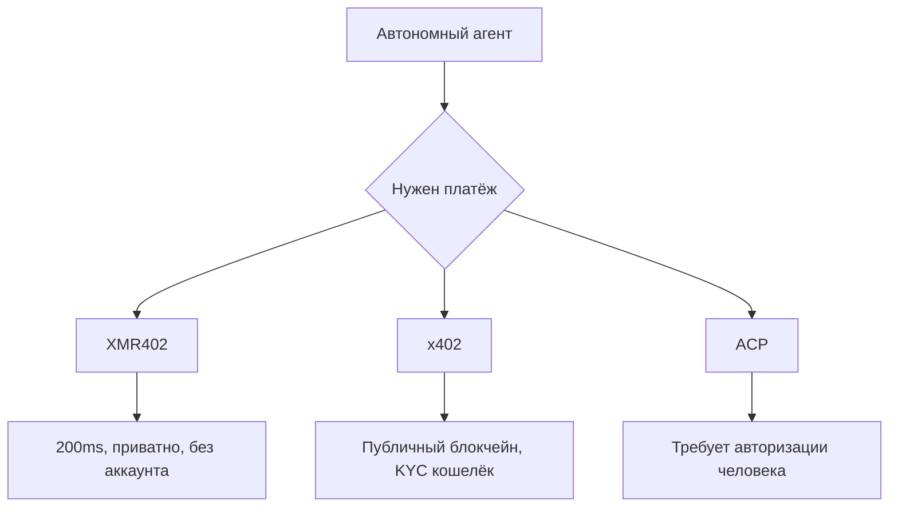
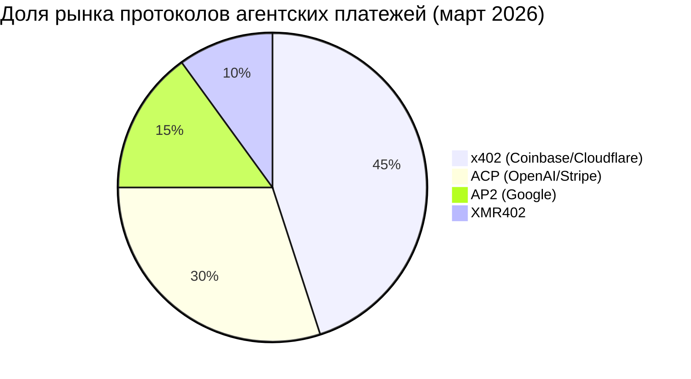

# XMR402 против агентского платёжного стека: разбор по протоколам

> Гонка за доминирование в агентских платежах началась. x402 (Coinbase), ACP (OpenAI/Stripe) и AP2 (Google) борются за AI-нативные платежи. Разбираем, как XMR402 сравнивается с ними — и почему конфиденциальность и stateless-архитектура меняют всё.

- **Author:** @xbtoshi
- **Date:** 2026-03-18
- **Tags:** protocol-comparison, x402, ACP, agentic-payments, Monero, XMR402, privacy, stablecoins
- **Canonical:** https://xmr402.org/blog/xmr402-vs-agentic-payment-protocols

---

## Война протоколов началась

В начале 2026 года три крупнейшие технологические компании практически одновременно объявили о конкурирующих стандартах агентских платежей. Coinbase и Cloudflare запустили Фонд x402; OpenAI и Stripe представили Agentic Commerce Protocol (ACP) для мгновенного оформления заказов в ChatGPT; Google выпустил AP2 — собственный протокол агентских платежей.

Послание однозначно: платежи AI-агентов — следующий рубеж интернет-инфраструктуры.

## Четыре протокола вкратце

### x402 (Coinbase + Cloudflare)

Использует HTTP 402 с расчётом в USDC на Ethereum-совместимых сетях. Имеет огромные преимущества в распространении через экосистему Coinbase и CDN Cloudflare.

**Решает:** Микроплатежи между агентами и сервисами через стейблкоины.

**Не решает:** USDC встраивает KYC; публичный реестр делает все транзакции агентов постоянно видимыми; не по-настоящему stateless.

### ACP — Agentic Commerce Protocol (OpenAI + Stripe)

Спроектирован для *инициированной человеком* торговли через AI-агентов. Использует Shared Payment Token (SPT) после авторизации платежа человеком.

**Решает:** Потребительский чекаут внутри AI-интерфейсов.

**Не решает:** Полностью зависит от человека-авторизатора. Непригоден для автономных машинных транзакций.

### AP2 (Google)

Оркестрационный слой с интеграцией x402 в качестве платёжного уровня. Наследует ограничения x402.

### XMR402 (Monero-нативный)

Тот же HTTP 402, но с расчётом в Monero — единственной крупной криптовалюте с обязательной приватностью на уровне протокола. Верификация через TX Proof за ~200ms, полностью stateless, без идентификации.

## Таблица сравнения протоколов

| Функция | XMR402 | x402 (Coinbase) | ACP (OpenAI/Stripe) | AP2 (Google) |
|---|---|---|---|---|
| **Приватность** | Полная (RingCT) | Нет (публичная цепь) | Нет (KYC Stripe) | Нет (публичная цепь) |
| **Требует KYC** | Нет | KYC кошелька USDC | Нужна карта | KYC кошелька |
| **Нужен человек** | Нет | Нет | Да | Частично |
| **Скорость верификации** | ~200ms | Подтверждение блока | Задержка API | Задержка API |
| **Комиссия протокола** | 0 | Gas + USDC | % Stripe | Gas |
| **Цензурная устойчивость** | Да | Нет | Нет | Нет |

## Фундаментальный вопрос дизайна

XMR402 — единственный протокол, в котором агент может работать **без KYC-идентификации в цикле**. Каждый другой протокол зависит как минимум от одного KYC-субъекта.

## Почему приватность имеет значение

Каждая крупная интернет-платформа, накопившая данные о финансовых транзакциях, в конечном счёте использовала их для конкурентного преимущества или регуляторного давления. Записи в публичном блокчейне ещё более уязвимы: они постоянны, неизменны и доступны для запросов любому.

XMR402 — единственный протокол, делающий эти данные невидимыми по умолчанию. Не политикой, не условиями обслуживания, а математикой.

## Будущее: совместимость, а не победитель

Скорее всего, ни один протокол не победит в одностороннем порядке. Агентский платёжный ландшафт будет напоминать ландшафт мессенджеров: несколько протоколов сосуществуют с мостами между ними. x402 и XMR402 разделяют один и тот же механизм HTTP 402, что делает создание мостов архитектурно естественным.
