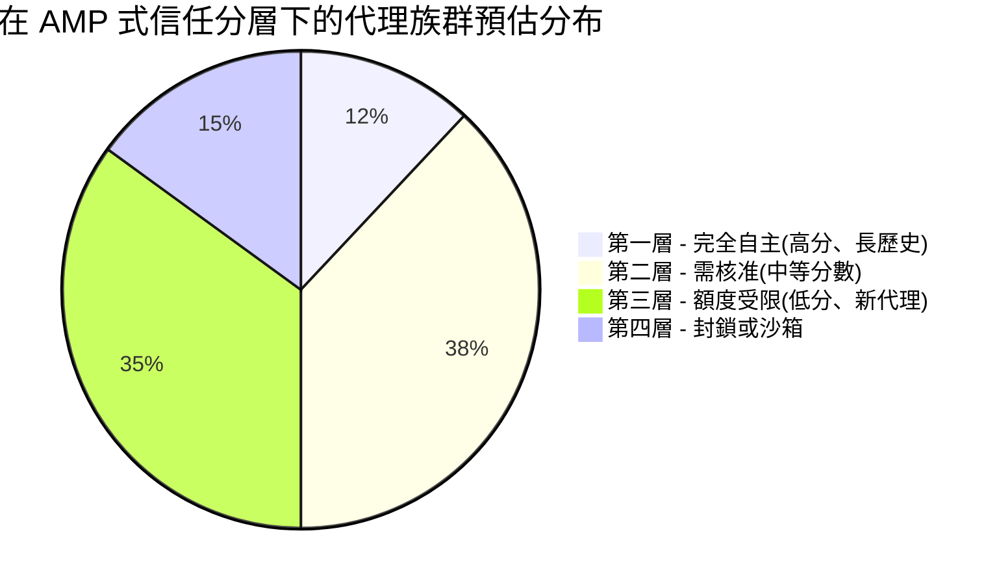
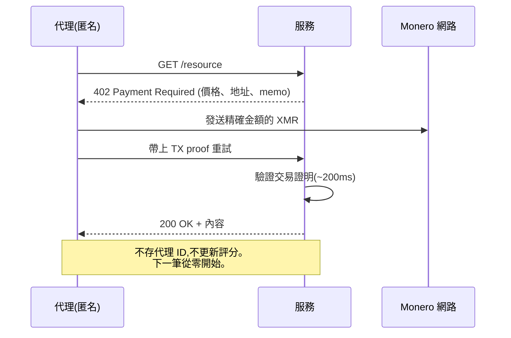
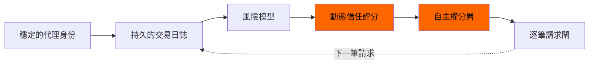

# AI 代理信用分:Ant AMP 如何把每個代理分級——以及 XMR402 為何拒絕排名

> Ant International 全新的 Agentic Mobile Protocol(AMP)內建「代理信任評分」——一個決定每個 AI 代理可獲得多少自主權的動態分數。我們解析為何它本質上就是給機器的信用分,以及 XMR402 的無狀態設計為何根本無法產生這種評分。

- **Author:** @xbtoshi
- **Date:** 2026-05-29
- **Tags:** xmr402, monero, amp, ant-international, agent-trust-rating, kya, credit-score, stateless, agentic-payments, reputation, x402, alipay
- **Canonical:** https://xmr402.org/blog/agent-trust-rating-credit-score-xmr402

---

## AI 代理信用分:Ant AMP 如何把每個代理分級——以及 XMR402 為何拒絕排名

2026 年 4 月 27 日,Ant International 在吉隆坡舉行的 MoMents 2026 論壇上發布 Agentic Mobile Protocol(AMP),號稱是全球第一個專為行動錢包、超級應用與穿戴裝置打造的代理支付框架。數字相當驚人:AMP 將整合進 Alipay+ 網路,該網路已涵蓋 **40 多個錢包夥伴、18 億用戶帳號與 1.5 億商家**。對外的訴求是開源、行動優先、全球連通。

對內,這同時是迄今為止針對自主軟體所提出的、規模最大的「聲譽綁定」系統。

AMP 主要由兩個互鎖元件構成。第一個是 **Know Your Agent(KYA)**:一個替每個代理發放數位身份、認證其授權能力的識別層。第二個——也是值得單獨檢視的——是專有的 **Agent Trust Rating**:一個動態風險評分,決定一個代理是否「值得信任」,以及更關鍵的、**它能被授予多少自主權**。新聞稿把它包裝成安全機制。我們認為它就是給機器用的信用分,而且繼承了信用分制度套在人身上的所有病灶:不透明、壟斷、漂移,以及打著風險管理旗號的守門。

XMR402——開放 X402 標準的 Monero 原生實作——早在這些系統出現之前就已設計完成,其無狀態架構在結構上根本不可能產出信任評分。這是特性,不是限制。

### 動態信任評分到底在做什麼

信任評分不是一次性的檢查,而是隨著每一筆交易、每一次裝置綁定、每一次與對手方的互動、每一次爭議,不斷被重新計算的浮動分數。要產生穩定的分數,系統必須:

1. **跨會話、跨裝置、跨商家持續識別代理**。
2. **記錄每一筆交易**,並可歸屬到具體輸入(代理 ID、委託人、商家、金額、時間、結果)。
3. **依照代理與其委託人都看不到的模型重新評分**。
4. **依分層對下一筆交易設閘**——高分代理可自主行動,低分代理必須人工核准或直接被擋。

每一條單獨看都合理。疊在一起就是一個永久性、不透明、由中心方掌控的權威機構,每天早上決定你的哪些代理可以進入經濟系統。AMP 的新聞稿提到「綁定步驟減少 50%」與「帳號被盜時的退款保證」——這兩個功能都必須仰賴上述持久的代理身份帳本才能成立。

### 把它類比成信用分不是修辭

結構是一致的。下表把消費者信用分制度的病灶對應到 Agent Trust Rating。

| 消費者信用分 | Agent Trust Rating | 對代理經濟的影響 |
|---|---|---|
| FICO 等是單一私有模型 | AMP 的評分模型為專有 | 代理無法稽核為何被限速 |
| 分數跨機構延續 | KYA 把代理身份釘在錢包、商家、裝置之間 | 一次糟糕的商家互動會跟著代理走遍各處 |
| 分數靠評等機構偏好的行為提升 | 分數靠評分模型偏好的行為提升 | 代理會收斂到模型獎勵的行為模式 |
| 新進者檔案薄、付出更多 | 新代理從低信任開始,需要人工核准 | 啟動一個自主代理的資本門檻變高 |
| 評等機構靠資料集賺錢 | 評分發行方靠資料集賺錢 | 代理行為資料成為新的商品 |
| 申訴緩慢且不透明 | 對評分的申訴也將緩慢且不透明 | 聲譽損害會在能上訴前持續累積 |

這些都不是推測,而是人類建立過的每一種聲譽系統都記錄在案的外部性——只是現在套用到每天執行數百萬次微決策的軟體上。

### 分配問題

只要自主權閘門存在,自主權本身就成了被分層的資源。具體閾值未公開,但形狀可以預期:極少數歷史悠久的代理被允許完全自主行動;中間一大段在非小額動作時要過核准提示;尾端的新進或邊緣代理則在任何有意義的動作上被功能性封鎖。

上述比例僅供示意,但原則不變。任何依分數調整自主權的動態風險系統,結構上就會產生這種分層。發行分數的平台坐在最頂端;它們偏好的代理——用它們的 SDK、付它們的費、被它們的遙測觀察——升層更快。獨立代理與開源框架則從底層出發,付租金往上爬。

### 在這個脈絡下,「無狀態」實際代表什麼

XMR402 沒有、結構上也不能有 Agent Trust Rating。每個請求都遵循同一個流程:伺服器回 HTTP 402、代理用 Monero 支付確切金額、伺服器在約 200ms 內驗證交易證明、請求被處理。沒有持久的代理身份、沒有跨會話連結、沒有商家回報的行為日誌、也沒有要更新的評分模型。

沒有層級可丟、沒有聲譽要修補、沒有評分方在累積行為資料集。隱私不是後貼上的,而是其他協定所依賴的儲存層根本不存在。

這帶來一個鮮少被明說的二階後果:**無狀態結算是唯一能讓新代理與老代理在經濟意義上平起平坐的設計**。在 AMP 下,一個全新的開源代理必須先累積歷史,才能以任何有意義的額度自主交易。在 XMR402 下,它付的金額與一年歷史的代理相同、時間窗相同、成功機率相同。協定不知道它幾歲,也不需要知道。

### AMP 做對了什麼、又從哪裡開始變成陷阱

該說清楚的話要說清楚。AMP 確實解決了 x402 公開絆倒過的問題。綁定步驟減少 50% 是有意義的;帳號被盜的退款保證對委託人為人類的錢包來說是合理的產品特性;行動優先的形態因子——智慧手錶、AR 眼鏡、車載系統——確實是很多代理活動真正會發生的地方。

陷阱在於,這三項功能都是靠加入狀態達成的,而狀態必須綁定到穩定的代理身份,只要這個身份存在就會有人為它打分。Agent Trust Rating 並不是 Ant 額外做的選擇;它是其他設計強迫存在的東西。

一旦進入這個迴圈,每筆交易也都是下一筆交易閘門的輸入。要脫離這個迴圈的唯一方法,就是不進去。

### 實務上的結論

如果你在 2026 年正在打造自主代理,你選擇的協定也是你接受的治理模式。AMP 給你行動觸及與救濟管道,代價是一個你無法掌控的聲譽分;x402 給你穩定幣軌道與生態支援,代價是公開的鏈上身份;XMR402 給你無狀態、隱私的微支付,代價是救濟機制不在協定裡——它們必須被放在應用層,由你自己設計。

這場辯論誠實的版本不是「哪個協定最好」,而是「五年後你想站在哪一種代理經濟裡」。是讓少數評分發行方決定哪些代理被允許行動的那一種?還是任何付得起費用的代理都能以平等條件交易、且不留下永久記錄的那一種?XMR402 是為後者而生。

