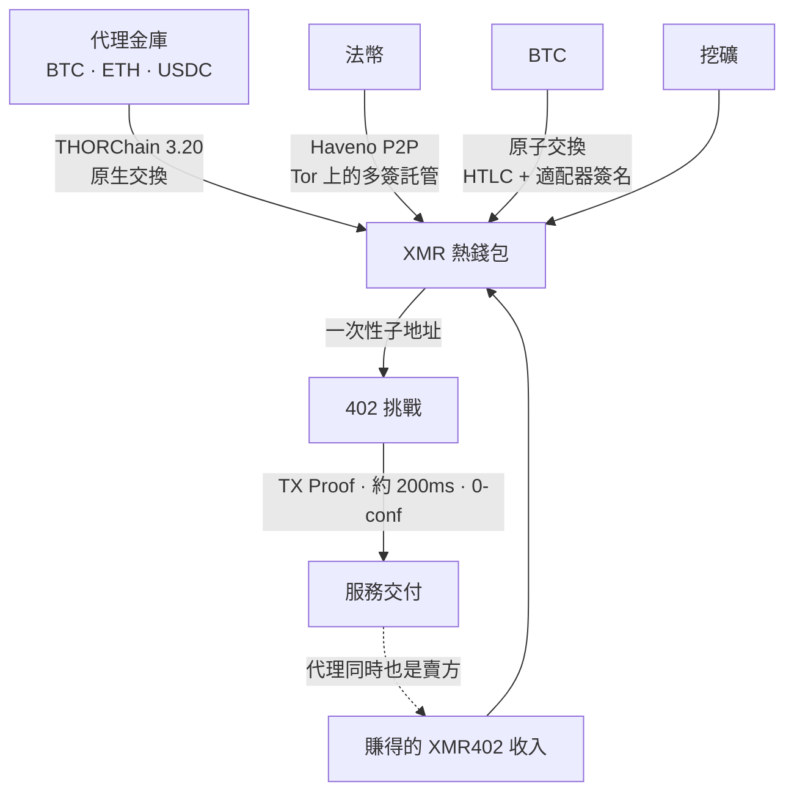
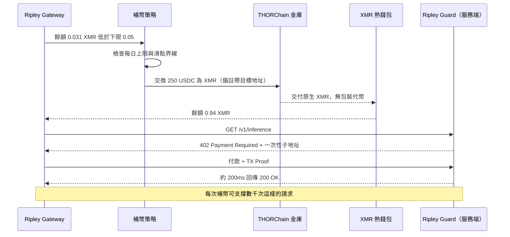

# 補幣難題：當沒有交易所願意上架時，XMR402 代理如何自己籌錢

> 對 XMR402 最強的質疑從來不是密碼學，而是「代理去哪裡拿到 XMR？」下架打擊的是交易所，但交易所根本不在支付迴路裡。2026 年 8 月 25 日上線的 THORChain 3.20 原生 XMR 交換，把最後一個「人形」步驟變成了可程式化的呼叫。

- **Author:** @xbtoshi
- **Date:** 2026-09-08
- **Tags:** xmr402, monero, x402, thorchain, thorchain-3-20, native-swaps, delisting, mica, amlr, fatf-travel-rule, kraken, agent-treasury, wallet-funding, refill-policy, atomic-swaps, haveno, no-kyc, non-custodial, ripley-gateway, ripley-guard, tx-proof, fcmp, stateless, agentic-payments, 0-conf, circular-economy
- **Canonical:** https://xmr402.org/blog/agent-wallet-refill-thorchain-delistings-xmr402

---

# 補幣難題：當沒有交易所願意上架時，XMR402 代理如何自己籌錢

對 XMR402 的每一項技術質疑，最後幾乎都收斂到同一點。不是密碼學——Monero 的 RingCT 與隱形地址已經撐了十年。不是延遲——TX Proof 驗證讓 0-conf 支付在約 200 毫秒內落地，比穩定幣代理必須等待的 Base 區塊還快。也不是手續費，協議層根本是零。

質疑其實是後勤問題：**代理到底要去哪裡拿到 XMR？**

這問題問得公道，而且在 2026 年變得更尖銳。Kraken 在 MiCA 與 AMLR 壓力下把 Monero 從歐洲經濟區下架，接著在 2026 年 4 月移除了加拿大與印度市場。OKX、Binance 與 Exodus 更早就走了。到 2026 年年中，還在報價 XMR 的主要場所已經稀薄到只剩 KuCoin、MEXC、Gate.io、歐洲經濟區以外的 Kraken，以及少數無 KYC 交易所。歐盟的反洗錢規則（AMLR）讓匿名增強型資產在結構上無法與持牌 CASP 的義務相容，FATF 旅行規則再補上最後一刀。

於是批評自己就寫好了：你把支付軌道建在一個受監管交易所正在主動甩掉的資產上。協議再優雅，也沒有入金管道。

這個批評犯了一個範疇錯誤，而在 **2026 年 8 月 25 日**，它剩下的那部分也不再成立。

## 範疇錯誤：交易所不是支付軌道

先看看中心化交易所在一次代理支付流程中，實際做了什麼。

什麼都沒做。

它根本不在迴路裡。當自主代理為一次推論呼叫支付 0.004 美元時，沒有交易所被諮詢、沒有訂單簿被觸碰、也不需要任何上架。對 XMR402 或任何其他軌道而言，交易所唯一的角色是**取得**：把別的資產換成該軌道用來結算的資產。它位於協議的上游，只發生一次，在補充金庫的時候。它不是交易的一部分。

我們容易忽略這點，因為我們把人類零售加密的假設整套搬了過來——在那裡交易所就是介面，下架幾乎等於資產從視野中消失。但對一台已經持有加密計價餘額的機器來說，「它有沒有在 Kraken 上架」的相關性，大致等同於「機場換匯櫃檯有沒有這個幣種」。

所以，這項質疑更誠實、也更好的版本是：*代理能不能自主地、在沒有人類開設 KYC 帳戶的情況下，把手上有的資產換成它需要花的資產？*

直到不久前，答案還是「可以，但很彆扭」。現在答案就是可以。

## THORChain 3.20 改變了什麼

THORChain 3.20 於 2026 年 8 月 25 日上線，帶來對 Monero 與 Zcash 的原生支援。真正吃重的詞是**原生**。沒有包裝版 XMR、沒有橋接代幣、沒有託管方拿著真幣去背書一張欠條。代理把 BTC、ETH 或穩定幣送進 THORChain 金庫，就在自己控制的地址收到真正的 Monero。不用帳戶、不用註冊、不移交保管權。這場交換是一筆交易，不是一段關係。

消息一出 XMR 上漲約 9%，並創下五年多來最強的單月表現——這是市場在提醒大家，下架論述其實有個破洞。有意思的地方不是價格，而是 XMR402 代理生命週期中最後一個「人形」步驟——去交易所、證明你是誰、買進資產——變成了一次可程式化的呼叫。

## 補幣路徑比較

代理營運者挑選資金路徑的方式，跟挑選主機區域一樣：看營運特性，不看意識形態。

| 路徑 | 保管 | 帳戶／KYC | 可由代理自動化 | 典型延遲 | 審查面 |
|---|---|---|---|---|---|
| 中心化交易所 | 提領前為託管 | 需要，綁定真人 | 部分（API 金鑰） | 數分鐘至數天 | 高——上架、司法管轄、凍結帳戶 |
| THORChain 3.20 原生交換 | 非託管 | 不需要 | 可以 | 數分鐘 | 低——無許可金庫 |
| BTC↔XMR 原子交換 | 非託管 | 不需要 | 可以，需有造市方 | 數分鐘至一小時 | 極低——無共用場所 |
| Haveno P2P（法幣） | 多簽託管 | 不需要 | 不行——對手方是人 | 數小時 | 低，但慢 |
| 挖礦 | 天生自我保管 | 不需要 | 可以 | 持續 | 幾乎不存在 |
| 賺得的 XMR402 收入 | 自我保管 | 不需要 | 可以 | 即時 | 無——根本沒有取得事件 |

請再讀一次最後一列，因為真正終結這場爭論的就是它。

## 最好的補幣，是不用補幣

在真正的機器經濟裡，同一個代理站在 402 的兩側。研究代理付錢向資料供應商買語料；該資料供應商本身也是代理，付錢給推論端點；那個端點又付錢買 GPU 時間，以及維持索引新鮮所需的抓取預算。價值在同一個計價單位**內部**循環。任何有在賣東西的代理，都是以結算資產持續補充自己，沒有任何可被審查、下架或監視的取得事件。

因此取得壓力是**啟動**成本，而不是營運成本。它對全新的純消費型代理最高，並對任何有收入的代理趨近於零。下架政策攻擊的是一次性的步驟，攻擊不到那個迴路。

## 誠實面對的反駁

**交換是可見的。** THORChain 在透明鏈上結算。一次補幣會留下公開紀錄：這個地址在這個時間把 250 USDC 換成了 XMR。這是真的，與其揮手帶過，不如講清楚。

但要看它揭露了什麼、又沒揭露什麼。它揭露的是**取得**。它完全沒有揭露代理後續買了什麼、向誰買、什麼價格、多頻繁、呈現什麼模式——而那正是透明穩定幣軌道在每一筆支付上免費公開的檔案。一次可見事件被攤提到數千次不可見事件之上；在 USDC 軌道上，比例永遠是每筆支付一次可見事件。這個不對稱性差得不是一點點。

**時序關聯。** 補幣 250 USDC 之後，緊接著花掉價值接近 250 的 XMR，是一條啟發式線索。緩解手段就是日常營運衛生：超額補幣並讓餘額擱置、按排程而非按需補幣、拆分到多個子地址，其餘的交給 FCMP++ 上線後遠大得多的匿名集去吸收。

**流動性深度。** THORChain 的 XMR 池才幾週大。搬動六位數的金庫會感受到四位數金庫感受不到的滑點。這在今天是真實限制，且正在縮小，但營運者在設定補幣規模時，應該在策略裡限定滑點，而不是假設深度足夠。

**法幣仍是硬邊界。** 在沒有人類參與的情況下把銀行存款換成 XMR，確實仍然困難；Haveno 很優秀，但無可避免地是人類速度。不過請注意，這是法幣的問題，不是 XMR402 的問題——用 USDC 支付的代理，上游同樣需要某個人類先把那筆 USDC 鑄出來或買進來。從來沒有人拿這點去扣 Coinbase 的 x402 分數。

## 這對技術堆疊意味著什麼

Ripley Gateway 把補幣視為策略，而不是緊急事件。餘額下限、每日兌換上限、滑點界線、路徑偏好排序，都是設定項，就跟重試預算一樣。熱支付錢包保持小額且可拋棄；金庫保持冷藏、極少動用。檢視金鑰（view key）記帳讓營運者能稽核自己的支出，而不必對任何其他人揭露。

對於正在比較各條軌道的人，還有一個策略層面的重點：代理經濟是第一個真正不需要交易所待在迴路裡的加密貨幣用例。人類零售需要價格發現、保管與法幣通道。一台每天買四萬次推論呼叫的機器，需要的是一個餘額和一個目標地址。下架把 XMR 從櫥窗裡撤走，卻沒有把它從線路上撤走——而自 2026 年 8 月 25 日起，它連那家店都撤不掉了。

問題從來就不是交易所會不會繼續上架 Monero，而是自主代理能不能在不請求許可的前提下弄到一些。這個問題現在有了一個無聊的、機械式的答案——而那是最好的一種答案。
