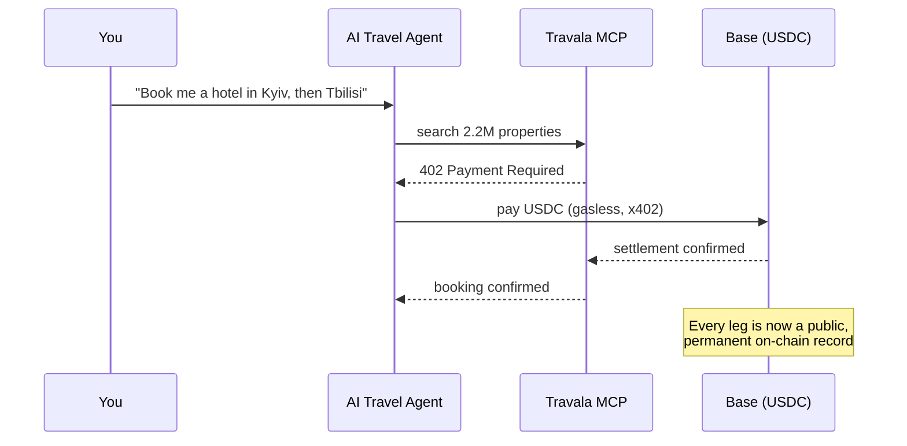
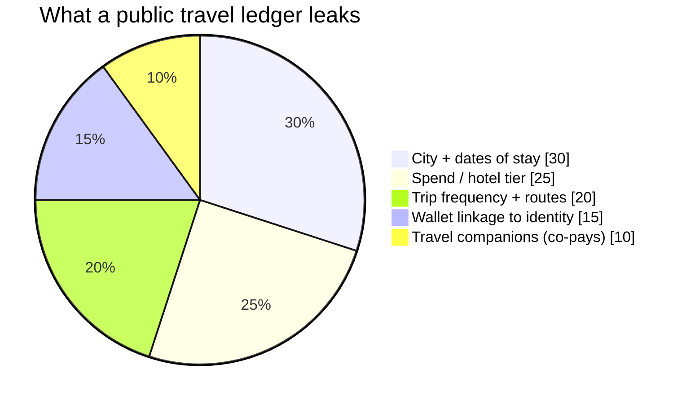
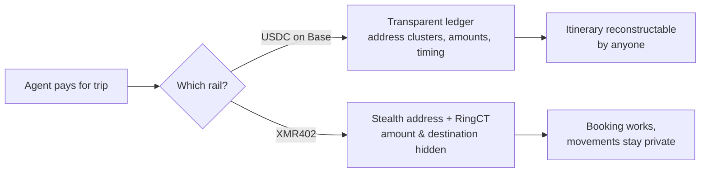

# 帳本上的行程表：為何你的 AI 旅遊代理人會標記出你睡過的每個地方——以及 XMR402 如何私密訂房

> Travala 的新代理旅遊協定讓 AI 在一段對話中預訂 220 萬間飯店，並以 Base 上的 USDC 結算。但公鏈旅遊代理人會把你的行蹤寫進永久帳本。看 XMR402 如何在不留足跡下訂同一趟旅程。

- **Author:** @xbtoshi
- **Date:** 2026-06-05
- **Tags:** xmr402, monero, x402, travala, agentic-travel, travel-mcp, location-privacy, usdc, base, erc-7715, session-keys, stealth-address, ringct, agentic-payments, privacy, 0-conf
- **Canonical:** https://xmr402.org/blog/agentic-travel-booking-location-trail-xmr402

---

# 帳本上的行程表：為何你的 AI 旅遊代理人的穩定幣足跡會標記出你睡過的每個地方——以及 XMR402 如何私密訂房

2026 年 6 月 4 日，Travala 發表了 **Travala Travel MCP**，一個端到端的代理協定，讓 AI 管家能在單一對話串中搜尋、預訂並支付超過 220 萬間飯店。它運行於 Base，透過 **x402** 標準以免 gas 的 USDC 結算，並使用 ERC-7715 會話金鑰——代理人提出付款，最終簽署權仍留在你的錢包。這是出色的工程，卻也是一場等待被索引的隱私災難。

沒人放上發表簡報的真相是：當你的代理人用 Base 上的 USDC 訂房時，它把你最私密的資料——*你的身體何時會出現在何處*——寫進一個任何人都能永久讀取的公開帳本。

## 會自己訂的旅程——也告訴了所有人

你只要說「規劃一趟兩週的高加索之旅」，代理人就會處理搜尋、預訂、付款與取消，你完全不碰結帳流程。旅行的摩擦縮成一句話。但每一筆結算，都是透明鏈上的一筆交易。

信用卡軌道預設是私密的——Visa 不會公布你的住宿紀錄。公鏈旅遊代理人卻反其道而行。串起幾筆，你得到的不是付款，而是一份**行程表**。

## 帳本就是位置紀錄

鏈上分析公司早已能大規模地將地址分群、標記商家並去匿名化錢包。Travala 的結算設計上就能識別商家——飯店才收得到錢。所以鏈上紀錄不只說「某人花了 240 美元 USDC」，而是說：*這個錢包在這座城市、這幾晚、住了這個等級的飯店，現在正付款給 600 公里外下一座城市的飯店。*

對記者見線人、主管探查收購目標、跨境的異議者，這是直接的人身安全威脅。而公開帳本無法召回、修補或刪除。足跡是永久的。

## 為何「會話金鑰」修不好洩漏

ERC-7715 會話金鑰是真正的 UX 進步：代理人無法掏空你的錢包。但會話金鑰解決的是*授權*，不是*機密性*。它控制誰能花錢，卻管不住誰能*觀看*。付款一旦簽署，金額與對手方仍以明文落在透明帳本上。對旅行而言，位置*就是*酬載。

## 同一趟旅程，私密訂房

XMR402 是 x402 標準的 Monero 原生實作。相同的 HTTP 402 握手、相同的透過 Monero TX Proof 的 200 毫秒 0-conf 驗證、零協定費用——但結算於一條以隱私為底層的鏈。隱形地址讓目的地無法連結；RingCT 隱藏金額。沒有可分群的商家地址，也沒有可追蹤的公開圖。

| 屬性 | Base 上的 USDC（Travala MCP） | XMR402（Monero） |
| --- | --- | --- |
| 可代理化訂房 | 是 | 是 |
| 鏈上可見金額 | 是 | 否（RingCT） |
| 可連結目的地/商家 | 是 | 否（隱形地址） |
| 行程可重建 | 輕易可行 | 否 |
| 紀錄永久且公開 | 是 | 預設加密 |
| 協定費用 | 免 gas，但有 Base 費用 | 零 |
| 結算延遲 | 近乎即時 | 約 200 毫秒 0-conf |

代理人的體驗一模一樣。差別在於留下了什麼。

## 隱私不該是旅行的高階方案

代理旅遊競賽已經開打。便利是真的，而且無論隱私問題是否解決都會到來。正因如此，這個問題現在就重要。XMR402 的存在，就是不讓「發布你的行蹤」成為預設。你的代理人該能用一句話訂完整趟旅程；別人卻不該能讀到你去了哪裡。

*XMR402——代理經濟的隱私層。相同的 402 握手，相同的代理體驗，沒有任何足跡。*

