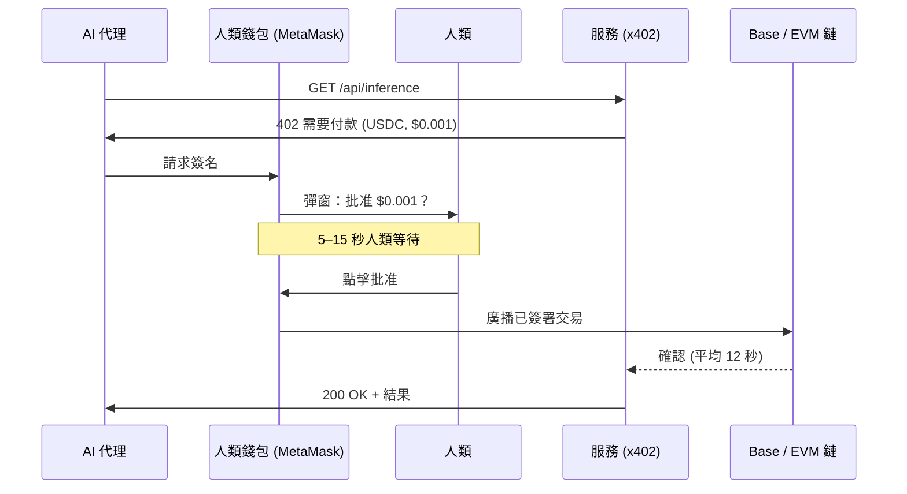
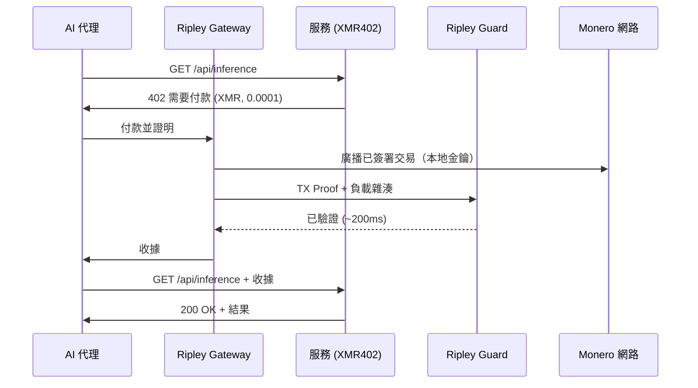
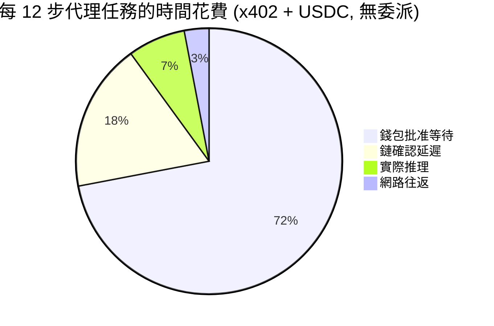
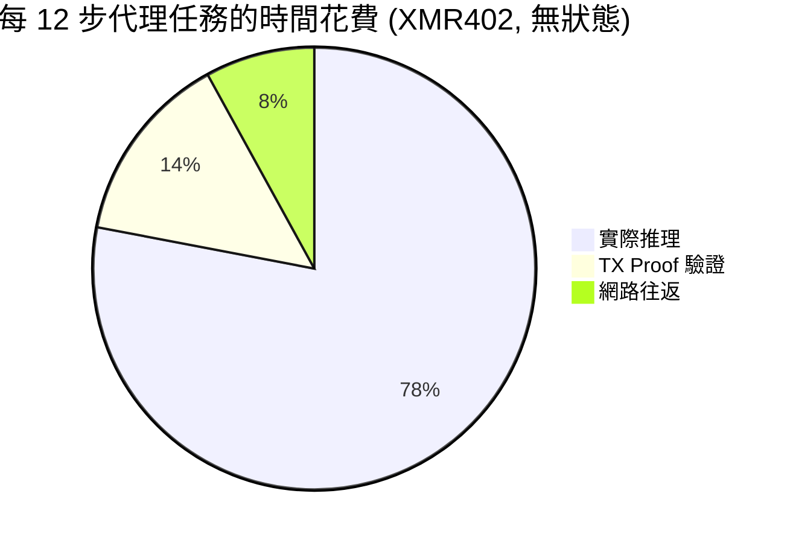

# 授權摩擦之牆：為何 x402 交易量崩跌 77%——以及 XMR402 無狀態設計如何繞過此牆

> Artemis 數據顯示 x402 調整後交易量自 2025 年 11 月高點崩跌 77%。罪魁禍首不是需求——而是錢包彈窗。每筆次美分代理付款現在背負 $0.03–$0.10 的人工時間批准成本。我們剖析授權摩擦問題，並解釋為何 XMR402 的無狀態 TX-Proof 驗證能讓此瓶頸徹底消失。

- **Author:** @xbtoshi
- **Date:** 2026-05-28
- **Tags:** xmr402, x402, monero, approval-friction, wallet-confirmation, micropayments, stateless, agentic-payments, delegation, ap2, agentcore, fireblocks
- **Canonical:** https://xmr402.org/blog/approval-friction-wall-stateless-xmr402

---

# 授權摩擦之牆：為何 x402 交易量崩跌 77%——以及 XMR402 無狀態設計如何繞過此牆

2026 年 5 月為代理付款產業帶來首個真正令人警醒的數據點。根據 Artemis 鏈上分析，x402 的調整後交易量已從 2025 年 11 月的 515 萬美元高點下跌約 **77% 至僅 119 萬美元**，儘管月度交易筆數回升至 289 萬筆，平均規模為 0.52 美元。美元交易量並非因代理停止付款而萎縮，而是因為每筆付款現在都需要人類點擊*批准*。

業界現在為此命名：**授權摩擦**。它揭露了一個任何錢包 UX 拋光都無法修補的缺陷。

## 沒人想印的數字

保守估計每次錢包彈窗 5 至 15 秒的確認節奏——分散在每月發生的數百萬筆 x402 呼叫上——產生每月介於 **4,000 至 12,000 使用者小時的批准工作**。以每小時 25 美元的混合人時價值計算，每次彈窗實際上花費 0.03 至 0.10 美元的注意力稅。對於次美分的推理呼叫或 0.001 美元的計量 API 請求而言，人時稅是**實際付款金額的 10 至 100 倍**。

這不是 bug，而是將穩定幣協議強行嫁接到為人類發起交易而非機器發起微付款設計之錢包模型上的*直接後果*。

## 為何 x402-USDC 無法逃離彈窗

當今每個 x402 穩定幣流程都繼承相同的授權假設：錢包（MetaMask、Trust Wallet、Coinbase Wallet、Phantom）持有金鑰，該金鑰簽署 EVM 交易。無論錢包位於瀏覽器擴充功能、硬體裝置或 Fireblocks 等託管服務，簽署事件都是**明確可歸屬於使用者的動作**。監管機構希望如此，合規團隊希望如此，錢包供應商的整個 UX 都圍繞此假設建構。

這對交易而言尚可接受，但對需要在單次研究工作流程中進行 40 次次美分 API 呼叫的自主代理而言，則是*災難性*的。

業界提議的修補方案是**委派框架**：Google AP2 mandates 捐贈給 FIDO Alliance、AWS Bedrock AgentCore Payments 基於政策的支出控制（2026 年 5 月 7 日推出）、Fireblocks 新的 Agentic Payments Suite（2026 年 5 月 20 日）以及 Solana Pay.sh 的預先充值會話憑證（2026 年 5 月 5 日）。每個都試圖*預先批准*一個預算，讓錢包停止詢問。但沒有一個消除錢包——它們只是將錢包隱藏在已簽署的 mandate、政策引擎或託管者之後。

## 委派框架無法解決的問題

彈窗消失了。監控沒有。託管者沒有。身份綁定沒有。關鍵是，**故障模式也沒有消失**：mandate 可以被撤銷、政策可以被錯誤配置、託管者可以凍結資金，而每筆付款仍以可追蹤的鏈上事件形式出現，綁定到一個有權限的錢包。

這就是 2026 年代理付款競賽的架構諷刺。大型科技支持的協議現在正在建構複雜的鷹架，以*模擬*無狀態協議本身就提供的功能。

## 為何 XMR402 沒有授權摩擦需要解決

XMR402 在「授權摩擦」一詞被命名之前就已設計完成。X402 的 Monero 原生實作將代理的付款子系統——**Ripley Gateway**——視為一等的自主行動者。Gateway 持有自己的 Monero 錢包，在本地簽署，並發出 **TX Proof**（一種加密聲明，證明已向特定子位址進行特定付款，而不洩露錢包餘額或歷史記錄）。

接收服務執行 **Ripley Guard**，在約 **200 毫秒**內驗證 TX Proof——無需確認區塊、無需查詢託管者、無需諮詢外部政策引擎。驗證是無狀態的：無會話、無帳戶、無註冊、無回呼到錢包 UI。

沒有彈窗，因為迴圈中沒有人類。沒有 mandate，因為代理的權限受錢包餘額限制，而非受外部授權文件限制。沒有監控軌跡，因為 Monero 環簽名、隱蔽位址和 RingCT 模糊化了發送者集合和金額。

## 同類比較：授權摩擦稽核

| 協議 | 授權模型 | 每次付款的人類時間 | 0-conf 驗證 | 付款者隱私 | 託管依賴 |
|---|---|---|---|---|---|
| x402 (Base 上的 USDC) | 每筆交易需錢包簽名 | 5–15 秒 ($0.03–$0.10) | 否 (平均 12 秒) | 在 Base 上公開 | 可選 (Fireblocks, Coinbase) |
| AWS AgentCore Payments | 預簽政策 mandates | 預算內 ~0，需手動重新授權 | 取決於鏈 | 公開 + AWS 審計日誌 | 是 (AWS) |
| Solana Pay.sh | 預先充值會話 | 會話內 ~0 | 是 (Solana 400ms) | 在 Solana 上公開 | 可選 |
| Google AP2 mandates | FIDO 綁定 mandate | mandate 範圍內 ~0 | 取決於鏈 | 公開 + Google 證明 | 是 (Google 身份) |
| **XMR402** | **無——代理原生** | **0** | **是 (~200ms TX Proof)** | **私密 (RingCT)** | **無** |

表格看似規格表，但其含義是結構性的。上述每個委派框架都接受錢包彈窗作為固定成本並試圖攤銷它。XMR402 則刪除了該成本。

## 人時稅實際落在哪裡

對於進行 12 次付費 API 呼叫的 12 步代理工作流程，時間花費的分解在穩定幣軌道上是殘酷的，在 XMR402 上則是微不足道的。

這就是為什麼 x402 美元交易量崩跌而交易筆數上升：代理正在批次處理、重試並放棄次美分呼叫，因為人時數學不再成立。*將會*用於每天百萬次微小呼叫的協議，正被*要求*每次都需要人類的協議所節流。

## 業界不斷迴避的架構抉擇

授權摩擦之牆不是 UX 問題。它是付款標準假設簽署者是人類那一刻烤入的**協議設計抉擇**。2026 年正在建構的每個委派框架——AP2 mandates、AgentCore 政策、Fireblocks 編排、Pay.sh 憑證——都是在根本上非自主的原語之上偽裝自主性的層次。

XMR402 選擇了另一條分支。它假設簽署者是代理、驗證者是服務，且網路預設為私密。該決定使 200 毫秒驗證成為可能、使零協議費用成為可能，並使次美分付款周圍的牆根本不存在。

2026 年 5 月的數據是一個預測。在代理時代倖存下來的協議將是那些從未要求人類點擊*批准*的協議。
