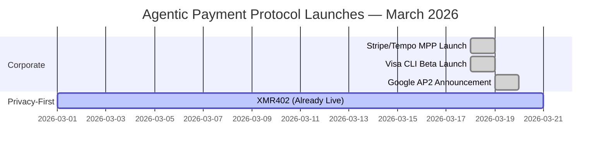
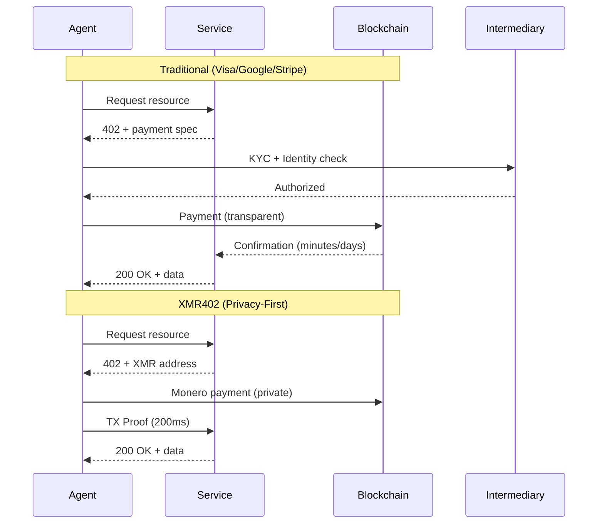

# 大科技公司賭注代理人支付的那一週 — 以及為什麼他們都搞錯了隱私

> 在2026年3月，Visa、Google和Stripe在數天內推出了相互競爭的代理人支付解決方案。然而這三個都犧牲了隱私以換取便利。只有XMR402提供真正隱私保護、無狀態、無需許可的替代方案。

- **Author:** @xbtoshi
- **Date:** 2026-03-20
- **Tags:** agentic-payments, privacy, xmr402, monero, payment-protocols, fintech, cryptocurrency, agent-economy, x402, visa, google, stripe
- **Canonical:** https://xmr402.org/blog/big-tech-agentic-payment-land-grab

---

# 大科技公司賭注代理人支付的那一週 — 以及為什麼他們都搞錯了隱私

2026年3月18-19日將被記為代理人經濟走向主流的時刻。在一個令人驚人的企業動力匯聚中，世界上三個最大的支付和技術公司在24小時內宣布了相互競爭的機器對機器（M2M）支付解決方案：

- **Visa CLI**（3月18日）— 來自Cuy Sheffield的Visa加密實驗室的實驗性CLI工具，用於程序性卡片支付
- **Google AP2**（2026年3月）— 與60多個合作夥伴（包括Adyen、美國運通、萬事達和PayPal）合作宣布，具有x402加密擴展
- **Stripe/Tempo機器支付協議**（3月18日）— 由Stripe和Paradigm支持的Tempo合著的開放標準

這種前所未有的企業結盟驗證了一個18個月前似乎處於邊緣的論點：麥肯錫到2030年的3-5萬億代理人商務市場不是炒作——這是不可避免的。但在他們急於捕捉這個新興市場時，每一個這些解決方案都犯了同樣的基本錯誤。

## 他們都選擇了便利而不是隱私

每個協議都需要某種形式的身份驗證、創建監視軌跡，或依賴於中央化中介機構，這些中介機構成為交易數據的蜜罐。

**Visa CLI**要求傳統身份驗證和KYC合規性。它本質上是一個卡片支付系統，這意味著Visa看到每筆交易、每個商家、每個代理人互動。"實驗性"標籤幾乎無法掩蓋這真正是什麼：在任何人建立隱私優先替代方案之前捕捉代理人對服務支付的一個舉動。

**Google AP2**在60多個合作夥伴間運營，但仍然從根本上是中央化的。Google知道誰支付給誰以及支付什麼。由Coinbase和MetaMask驅動的x402加密擴展增加了隱私面紗，但僅限於區塊鏈部分——即使如此，也只是在Base和以太坊等透明鏈上。您的代理人的支付歷史對任何有耐心的人都是可讀的。

**Stripe/Tempo的MPP**遵循相同的遊戲規則：開放標準，但以Stripe作為默認結算層。Stripe獲得數據。該協議本身是與傳輸無關的，這是很好的架構，但激勵結構指向通過中央化中介機構的支付，該中介機構從交易量中獲利。

所有三個都解決了一個真實的問題——我們如何在AI代理人和服務之間實現快速、可靠的支付？——但都沒有回答更難的問題：*對隱私的成本是什麼？*

## XMR402差異：由協議保護隱私，而不是由政策

XMR402是X402開放支付標準的Monero原生實現。它使用HTTP 402支付必需來實現AI代理人和服務之間的無狀態、無需許可、隱私保護的微支付。

以下是什麼使它從根本上不同：

**不需要身份。** 代理人可以在沒有KYC、沒有帳戶創建、沒有在任何系統中註冊的情況下啟動支付。協議本身是權限層。

**協議級別零費用。** Visa、Google和Stripe都提取價值。XMR402具有零協議費用——僅Monero網絡費用（~0.0001 XMR），遠小於傳統支付網絡削減。

**200毫秒0確認驗證。** 使用Monero的TX證明技術，服務提供商可以在200毫秒內以密碼方式驗證支付收據——足夠快，用於實時代理人互動，無需等待區塊鏈確認。

**完全無狀態。** 該協議不需要數據庫、API狀態或用戶帳戶。每筆交易都是自包含的和密碼可驗證的。無需基礎設施債務的規模。

**與傳輸無關。** 可在HTTP、WebSocket或任何基於TCP的協議上工作。標準不規定網絡層。

## 比較表：它們如何堆疊

| 特徵 | Visa CLI | Google AP2 | Stripe MPP | x402 | XMR402 |
|---------|----------|-----------|-----------|------|--------|
| **隱私** | 低（需要KYC） | 低（中央化賬本） | 低（Stripe中介） | 中等（透明鏈） | 高（Monero隱私） |
| **需要身份** | 是 | 是（加密可選） | 是 | 可選 | 否 |
| **協議費用** | 2-3% | 0.5-1.5% | 0.5% +結算 | 可變 | 0 |
| **結算速度** | 1-3天 | 1-2天 | 幾分鐘 | 10-15分鐘 | 200毫秒（0確認） |
| **無需許可** | 否 | 否 | 否（需要入職） | 是（用於x402） | 是 |
| **無狀態架構** | 否 | 否 | 部分 | 否 | 是 |
| **加密本地** | 否 | 部分（x402擴展） | 否 | 是 | 是 |
| **中央化** | 高 | 高（60多個合作夥伴，Google中樞） | 高（Stripe默認） | 中等 | 無 |

## 市場背景：誰在贏以及為什麼

Coinbase領導的x402已經處理了超過1億次支付，但交易利潤很薄——根據CoinDesk的說法，每日交易量僅約28,000美元，儘管生態系統估值為70億美元。這在技術上是優雅的和無需許可的，但它在透明區塊鏈（Base、以太坊）上運營，這打敗了隱私。

Visa和Google的舉動表明重要的事情：現任者看到這個市場正在移動以在替代軌道成熟之前擁有它。他們不是因為相信去中央化或隱私而推出這些產品——他們推出是因為他們害怕被中介。

Stripe與Tempo的合作更有趣。Tempo由Paradigm支持，這表示M2M支付基礎設施背後有嚴肅的資本化。但激勵對齐仍然指向中央化結算。

## 隱私悖論

這是令人不舒服的真相：本週推出的每個協議都將面臨相同的監管壓力，以收集數據、標記可疑模式和啟用帳戶凍結。身份創造法律責任。監管成為合規劇院。

XMR402建立在Monero的隱私保證上，不能解決監管不確定性——但它在結構上防止合規劇院。如果您看不到交易，就不能被起訴以啟用它。協議本身成為權限層：如果密碼驗證，支付是有效的。沒有人類判斷。沒有對權威的上訴。

## 接下來發生什麼

三種可能的未來：

1. **整合。** 三個大公司之一（可能是Google或Visa）購買或與其他公司集成，創建代理人支付上的事實上壟斷。

2. **碎片化。** 所有四個共存，使用案例專門化。Visa用於傳統企業代理人支付，Google用於消費者代理人，Stripe用於初創企業，x402用於加密本地工作流程。

3. **隱私優先主導。** XMR402和類似的隱私本地協議捕捉代理人處理敏感數據的使用案例——醫療保健代理人、財務分析代理人、智能代理人。監管的成本變得太高了。

第三種未來並非不可避免，但為什麼重要變得越來越清楚。當代理人超過人類數倍且每筆支付在某人的數據庫中創建數據點時，隱私停止成為偏好。它成為基礎設施。

## 底線

代理人經濟是真實的。2026年3月證明了這一點。但本週推出的協議——Visa CLI、Google AP2、Stripe MPP——針對錯誤的事情進行了優化。它們針對現任者提取數據的能力進行了優化，而不是針對代理人經濟無信任地進行擴展的能力。

XMR402提供了一個替代方案：快速、無需許可、隱私保護的支付，零協議費用。它不是完美的——Monero的隱私伴隨著一些用戶體驗權衡，監管不確定性是真實的。但它是這個群體中唯一不與隱私未來打賭的協議。

隨著代理人經濟從每日數百萬筆交易擴展到數十億筆，問題將不是*隱私是否*重要。這是基礎設施層是否將設計為保護它。
